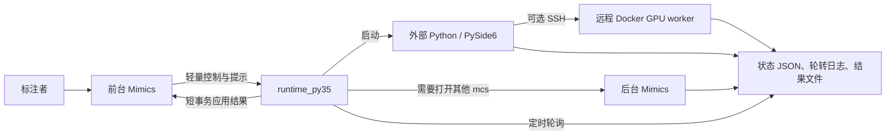

# Mimics-Script 项目架构与功能入口指南

本文面向第一次接触本项目的开发者，目标是回答以下问题：

- Mimics Scripting Library 中每个入口做什么；
- 一次操作会经过哪些 Python 模块、后台进程和状态文件；
- 为什么耗时工作不会直接运行在 Mimics GUI 线程；
- 图像与 Mask 如何在原始数据、Mimics 和 AI 模型之间保持空间一致；
- nnInteractive 与 nnU-Net 模型如何训练、注册、推理和跨机器迁移；
- 可选的远程训练如何在 Linux GPU 服务器上运行、数据如何缓存、模型如何回流本机；
- 出现异常时应查看哪里、如何停止以及如何继续开发。

本文描述的是当前代码架构。实际部署目标为 Windows + Mimics，项目开发与多数离线测试也可在 macOS/Linux 完成。

## 1. 新手先建立的整体认识

### 1.1 这个项目解决什么问题

Mimics-Script 不是一个单独运行的标注软件，而是给 Mimics 增加一组可管理的数据、AI 和精修能力：

1. 把 NIfTI、MHD/MHA、NRRD、DICOM 等数据转换成可标注的 `.mcs`；
2. 把 Mimics 中修改后的一个或多个 Mask 准确导回源图像网格；
3. 使用 nnInteractive 或 nnU-Net 辅助标注、训练任务模型并管理版本；
4. 使用 ScribblePrompt 完成局部的交互式修正；
5. 在不阻塞 Mimics GUI 的前提下管理外部进程、GPU、日志、取消和异常恢复。

### 1.2 第一次使用前要准备什么

Windows 工作站至少需要：

- 已安装并可正常打开项目的 Mimics；
- 完整的 Mimics-Script 项目目录；
- 运行一次 `99_Admin/01_Setup_Repair_Environment.py`，创建项目自己的 `nninteractive_env`；
- 需要相应 AI 功能时，准备其基础权重或 checkpoint；
- 源数据、`.mcs` 和输出目录具有读写权限，网络盘还需要稳定的连接和重命名权限。

`nninteractive_env` 虽然沿用历史名称，但它是整个项目的统一外部 Python 环境，不只供 nnInteractive 使用。PySide6、PyTorch、SimpleITK、nibabel 和训练框架都从这里运行，不应改成系统 Python。

### 1.3 先记住三个进程角色

| 角色 | 用户是否看得到 | 可以做什么 | 不应该做什么 |
|---|---|---|---|
| 前台 Mimics | 是 | 调用 Mimics API、采集提示、短暂读写当前 buffer、应用结果 | 训练、模型加载、大目录扫描、整卷重采样 |
| 外部 Python | 通常只有外部 UI 可见 | 图像 IO、转换、训练、推理、状态和日志 | 直接持有或修改 Mimics 对象 |
| 后台 Mimics | 通常隐藏 | 打开其他 `.mcs`、批量创建项目、批量导出 Mask | 与前台项目共享未登记的临时状态 |

远程训练还会增加第四个角色：Linux 服务器上的 Docker worker。它只能接收已经准备好的文件，不读取本机 Mimics 对象，也不消耗 Mimics 许可证。



### 1.4 一次长任务为什么不会卡住 Mimics

Mimics 菜单入口只完成必要的短操作，然后立即返回事件循环。耗时进程把阶段、百分比、消息和错误写入状态文件；Mimics 侧使用 Win32 timer（必要时使用现有 Qt event loop）定时读取状态。只有最终把结果写回 Mask 时，才短暂进入 Mimics transaction。

“后台运行”不等于完全没有等待：首次读取一个很大的活动 Image 或 Mask buffer 仍需要经过 Mimics API。但代码必须分块读取、主动更新 GUI、记录耗时，并禁止在同一项目上并发执行两个 buffer 写操作。

路径选择也属于阻塞风险。Windows 原生文件选择器会同步枚举磁盘、断开的盘符和网络共享；因此项目把原生选择器放到可终止的辅助进程中，Mimics 和外部设置窗口只异步接收结果。用户也可以直接粘贴完整路径，跳过盘符枚举。选择完成后的目录发现、几何核查和模型清单读取必须在工作线程执行；超时或用户重新选择路径后，旧结果会被丢弃，不能回写或启动任务。

大数据集的病例列表默认不逐项创建控件。只有用户启用“手动选择病例”时才分批渲染，批次之间归还 Qt 事件循环，从而保持窗口可拖动、可关闭、可取消。

### 1.5 新手最常见的完整工作流

```text
选择源数据和输出目录
  -> Import Data
  -> 打开首个 .mcs 并标注
  -> Export Masks（保存到明确选择的标签目录）
  -> 可选：nnInteractive / nnU-Net 训练
  -> 在新病例 Predict / Annotate
  -> Update Selected Mask 或 Create Editable Copy
  -> 人工复核并再次导出
```

任何 AI 输出默认都不是不可逆的最终标签。用户在结果到达时决定更新选中 Mask、创建可编辑副本或放弃；训练模型也通过版本清单管理，不直接覆盖历史模型文件。

## 2. 总体架构

项目将运行环境分为两层。

### 2.1 Mimics 内控制层

目录：`scripting_library/`、`runtime_py35/`

职责：

- 调用 Mimics API；
- 读取当前 Image、Mask、选中对象和项目 metadata；
- 采集点、框、套索等交互提示；
- 启动外部 Python 进程；
- 使用定时器轮询 JSON 状态；
- 将外部结果分步应用回 Mimics；
- 在 Mimics 日志中显示关键状态；
- 提供取消、停止、回退和异常恢复路径。

约束：

- 保持 Mimics 内置 Python 3.5 兼容；
- 不在 GUI 线程中导入 PyTorch、SimpleITK、nibabel、PySide6 等重依赖；
- 不在 GUI 线程中执行大目录扫描、模型加载、训练、推理或大数组变换；
- Mimics API 只在 Mimics 进程中调用，不从外部进程跨进程直接操作 Mimics 对象。

### 2.2 外部工作层

目录：`tools/`、`integrations/`、根目录桥接脚本

职责：

- PySide6 界面；
- 数据发现和医学图像读取；
- DICOM/NIfTI/MHA/MHD/NRRD 转换；
- 几何变换与 Mask 最近邻重采样；
- 模型注册、打包和导入；
- 状态、日志、缓存和资源锁管理。

外部进程优先使用项目的 `nninteractive_env`，而不是系统 Python。环境由 `99_Admin/01_Setup_Repair_Environment.py` 创建或修复。

### 2.3 基本调用模式

```text
Scripting Library 入口
        |
        v
runtime_py35/_mimics_entrypoint.py
        |
        v
Mimics 控制模块
        |
        +--> 快速 Mimics API 操作
        |
        +--> Popen 外部 Python / 后台 Mimics
                    |
                    +--> JSON 状态 + 轮转日志 + 结果文件
                    |
Mimics 定时器 <-----+
        |
        v
分步应用结果、显示完成/失败状态、清理任务
```

`runtime_py35/_mimics_entrypoint.py` 是所有菜单脚本的统一薄入口。它负责定位 `runtime_py35`、按名称加载真正的运行模块，并将入口指定的 action 或 function 分发给该模块。

## 3. 主要目录

| 路径 | 作用 |
|---|---|
| `scripting_library/` | Mimics 菜单中可见的入口，只做轻量分发 |
| `runtime_py35/` | Mimics 内控制器、定时器、状态机、Mimics API 操作 |
| `tools/` | 外部 UI、任务编排、CLI、测试和部署工具 |
| `integrations/nninteractive-finetune/` | nnInteractive 任务模型微调核心 |
| `integrations/nnunet_segmentation_workflow/` | 多类别 nnU-Net 数据规划、训练与推理核心 |
| `integrations/ScribblePrompt/` | 官方 ScribblePrompt-UNet 推理网络；checkpoint 不提交 Git |
| `remote/` | 远程统一 Docker 镜像和服务器初始化脚本 |
| `mimics_bridge.py` | 通用医学图像导入、导出和空间转换桥 |
| `nninteractive_bridge.py` | nnInteractive 服务、图像会话、推理与结果转换桥 |
| `.mimics_runtime/` | 本机运行状态、任务目录和临时文件，不提交 Git |
| `logs/` | 本机轮转日志，不提交 Git |
| `nninteractive_task_models/` | 本机 nnInteractive 任务模型工作区，不提交 Git |

### 3.1 如何判断代码应该放在哪里

- 需要 `mimics.*` API：放在 `runtime_py35/`；
- 需要 PyTorch、SimpleITK、nibabel、PySide6 或大量文件 IO：放在 `tools/` 或相应 `integrations/` 子项目；
- 菜单中可见的文件：放在 `scripting_library/`，且只做入口分发；
- 多个模块共享的进程、状态或几何逻辑：放在已有公共模块，不在入口文件重复实现；
- 运行生成的数据：放入 `.mimics_runtime/`、模型工作区或用户选择的输出目录，不写回源码目录。

## 4. Data 功能入口

### 4.1 `01_Data/01_Import_Data.py`

用途：导入数据——单个图像文件、病例文件夹、DICOM 目录、多选病例或整个数据集，后台转换为 `.mcs`。

调用链：

```text
01_Import_Data.py
  -> runtime_py35/import_drop_mimics.py
  -> tools/import_drop_window.py（常置顶悬浮窗）
  -> 单例/多选：tools/single_case_import_worker.py
  -> 批量：tools/mimics_batch_cli.py prepare-import
  -> 输出目录中的 prepared queue
  -> runtime_py35/create_mcs_batch.py（后台 Mimics）
```

设计要点：

- 路径选择与大目录发现位于外部 PySide6 进程（拖入、粘贴、浏览选择三种入口共用同一识别管线）；
- 支持 Images only、All masks；
- preparation 与 `.mcs` 创建采用流式队列，第一例准备完成后即可开始创建，不等待全部病例；
- 每例有独立工作目录和错误记录，单例失败不会中止后续病例；
- producer lease 防止同一输出队列被多个导入生产者相互覆盖；
- 后台 Mimics 负责必须由 Mimics API 完成的 `.mcs` 创建；
- 运行中的任务可在 `04_Task_Status.py` 中逐行停止。

关键状态：

- `.mimics_runtime/import_runs/`：导入任务记录；
- 输出目录下的 `_import_jobs/` 或运行时队列目录：病例准备和 `.mcs` 创建状态；
- `job_state.json`、队列 active/done/stop 标记：进度、终态和停止请求；
- `mimics_import.log`：导入主日志，按大小轮转。

### 4.2 `01_Data/02_Import_Masks.py`

用途：将 NIfTI、MHA、MHD、NRRD 等分割文件导入当前活动 Image。

调用链：

```text
02_Import_Masks.py
  -> runtime_py35/mask_import.py
  -> 外部文件选择器
  -> mimics_bridge.py prepare_masks_for_grid
  -> Mimics timer 每次应用一个 Mask buffer
```

设计要点：

- 外部进程读取文件和执行空间变换；
- 二值 Mask 生成一个 Mimics Mask；
- 多标签文件按非零 label 拆分为多个 Mimics Mask；
- 通过源 Mask affine 和当前 Mimics voxel-to-RAS 矩阵显式对齐；
- 标签只使用最近邻插值，防止生成不存在的类别；
- Mimics timer 一次应用一个结果并调用 GUI 更新，避免一次性写入多个大 Mask；
- 有并发防护、超时和取消路径，避免重复点击同时修改同一项目。

### 4.3 `01_Data/03_Export_Masks.py`

用途：将当前项目或一批已保存 `.mcs` 中的 Mask 导出为与源图像网格一致的标签文件。

（2026-09-27：原重复入口 `01_Data/03_Export_Masks.py` 按 D1 决策删除；
2026-10-02（C1）：`06_Quick_Export_Masks.py` 更名为本入口，去掉 Quick
前缀。）

调用链：

```text
03_Export_Masks.py
  -> runtime_py35/mimics_export.py
  -> tools/io_path_setup_ui.py
  -> 当前项目：Mimics timer 分步读取 buffer
  -> 批量项目：后台 Mimics 打开 .mcs
  -> mimics_bridge.py do_convert
  -> dataset_manifest.json
```

设计要点：

- 输入 `.mcs` 路径、原始数据路径和标签输出路径由用户明确选择；
- 用户可导出全部 Mask 或指定 Mask 名称；
- 当前打开项目优先在当前 Mimics 内分步导出，避免不必要地启动第二个 Mimics；
- 批量读取其他 `.mcs` 时使用后台 Mimics；
- 导出的 Mask 先从 Mimics buffer 恢复到 Mimics 物理网格，再以最近邻插值映射到源图像网格；
- 输出 shape、affine、方向和源图像一致；
- `dataset_manifest.json` 记录 case、图像、标签、`.mcs` 和几何信息之间的关系；
- 用户选择的独立输出目录不会修改原始标签；只有明确选择原始标签目录并允许覆盖时才覆盖。

停止方式：`04_Task_Status.py` 中该行停止。

当前项目的快速导出（`quick_export_main`）同样复用本节的几何和转换逻辑，不维护独立的"简化坐标转换"。

### 4.4 `01_Data/04_Task_Status.py`

用途：一个窗口查看所有导入/导出任务（导入运行、后台 `.mcs` 队列、
Mask 导出作业、前台导出任务、Mask 追加作业、拖入导入）的状态与进度，
并可对运行中的任务逐行停止。

实现：`runtime_py35/batch_status_mimics.py` → `tools/batch_status_viewer.py`

逐行停止只写入该任务类型对应的 stop marker（队列停止同时移除 active
marker），当前病例完成后任务退出；kill/卡死进程的兜底仍在
`99_Admin/03_Stop_All_Owned_Services.py`。它不会终止当前前台 Mimics，
也不会终止非本项目创建的 Python/Mimics 进程。

## 5. nnInteractive 功能入口

nnInteractive 被明确分成“官方通用模型”和“自定义任务模型”，二者共用可靠的提示采集与异步应用引擎，但模型来源互不覆盖。

### 5.1 `02_AI/nnInteractive/01_Annotate_Official_Model.py`

用途：使用官方通用 nnInteractive 模型进行交互标注。

实现：

- Mimics 控制：`runtime_py35/nninteractive_mimics.py`；
- 外部服务与推理：`nninteractive_bridge.py`；
- 官方模型：`nninteractive_env/models/nnInteractive_v1.0`。

支持提示：

- 前景/背景点；
- scribble；
- box；
- lasso；
- undo；
- reset；
- 从已有 Mask 开始；
- 放弃当前 AI session。

图像 worker、模型服务和预处理在外部 Python 中运行。提示采集前可启动图像会话准备，提示提交后 Mimics 只轮询结果。预测完成后，用户可更新选中 Mask 或创建可编辑副本。

### 5.2 `02_AI/nnInteractive/02_Annotate_Custom_Model.py`

用途：使用某个任务专用微调模型进行交互标注。

实现：

- 任务解析与模型选择：`runtime_py35/nninteractive_finetune_mimics.py`；
- 模型选择 UI：`tools/nninteractive_task_model_chooser.py`；
- 提示与异步推理：复用 `runtime_py35/nninteractive_mimics.py`；
- 模型服务：复用 `nninteractive_bridge.py`，通过 model profile 指定 checkpoint。

任务解析优先级：

1. 当前 Mask 上已记录的 task/model metadata；
2. Mask 名称与 task aliases；
3. 当前项目绑定；
4. 只有一个兼容任务时自动选择；
5. 仍不唯一时打开任务模型选择器。

自定义模型不会替换官方模型。调用的是同一交互引擎的 `run_with_model_profile` 路径，model profile 中包含 task、model、checkpoint checksum 和输入契约。

#### 自定义模型跨机器使用图像

`.mcs` metadata 中的 `source_image_path` 是定位原始数据的线索，不是打开自定义模型的永久硬依赖。默认 `task_model_image_input_mode=auto`：

1. 当前机器存在可读的本地源图像时，使用源图像，并在外部 worker 中映射到当前 Mimics grid；
2. 路径已经失效、项目迁移到另一台机器，或 metadata 指向 UNC/网络共享时，直接使用 `.mcs` 内已经保存的 Image buffer；
3. UNC 路径不会在 Mimics GUI 线程上做同步探测，避免网络超时造成黑屏；
4. Mimics 只做一次短时 buffer 快照，模型加载、上传、canonical RAS 重排和预处理继续在外部 worker 中运行；
5. 需要科研复现实验的严格输入一致性时，可把策略设为 `source`，此时源文件缺失会明确失败；也可设为 `mimics`，始终使用项目内图像。

为什么 buffer 可以作为兼容输入：空间上它就是当前显示和提示所在的 Mimics grid；强度上 CT 可通过 HU/GV 线性关系恢复。新导入的 MRI 会把派生 DICOM 的 `RescaleSlope/RescaleIntercept`、源值范围和 16 位编码范围写入 `.mcs` metadata；fallback 在外部 worker 中先恢复近似源值，并把半个量化步长以内的残余零值重新置零，避免改变 nonzero bounding box。旧 `.mcs` 会尝试读取保留的 DICOM tags。两种映射都不存在时不会阻止标注，而是继续使用 raw GV，并在英文日志中标记 `raw_gv_zscore_best_effort`；此时正线性缩放通常会被 z-score 抵消，但零背景变化可能带来明显分布偏差，因此不声称严格等价。

### 5.3 `02_AI/nnInteractive/03_Train_and_Manage_Custom_Models.py`

用途：训练、监控、选择、导入和导出 nnInteractive 任务模型。

实现：

- Mimics 控制：`runtime_py35/nninteractive_finetune_mimics.py`；
- 模型中心：`tools/nninteractive_task_model_center.py`；
- 数据解析：`tools/nninteractive_task_common.py`；
- 训练编排：`tools/nninteractive_finetune_pipeline.py`；
- 训练核心：`integrations/nninteractive-finetune/`；
- 模型包：`tools/ai_model_bundle.py`。

模型中心包含：

- Task 与 Target Mask；
- 原始数据、`.mcs`、独立标签目录的数据来源；
- 可选病例筛选；
- 训练状态、日志和结果；
- 模型版本、当前推荐模型；
- 导入/导出可迁移模型包。

训练起点只有两种真实语义：空 Mask，或与最终 Target Mask 分开保存的真实 Initial Mask。系统不再从最终标签腐蚀、膨胀或平移生成合成 Initial Mask：

- `Start from an empty Mask`：所有病例从空 Mask 学习；
- `Refine an existing Mask`：只接受具有真实 Initial Mask 的病例，缺失病例在准备阶段跳过；
- `General adaptation`：具有真实 Initial Mask 的病例可学习修正，其他病例从空 Mask 开始。

图像、最终标签和 Initial Mask 都以 NIfTI affine 为准，先通过轴置换/翻转无插值地重排到 canonical RAS；三者 canonical shape 与 affine 必须一致，否则训练直接拒绝。spacing 元数据保留，但不会在微调准备阶段额外做整卷固定 spacing 重采样。强度归一化严格使用官方会话相同的 nonzero bounding-box z-score；推理时由官方 nnInteractive session 按提示中心和模型 plan 做 crop/resize。任务模型在 Mimics 中使用时，bridge 根据当前 Image 的 voxel-to-RAS 映射执行相同的 canonical RAS 重排，并把结果无损翻回 Mimics grid。

任务模型导出时还会把训练使用的 `point_radius` 与 `interaction_decay` 明确写入 `inference_info.json`。不能依赖不同 nnInteractive 版本各自的默认值，否则相同点击序列在训练和部署时会形成不同的提示通道。

训练状态分别显示空 Mask 与真实 Initial Mask 的验证 AUC。每种模式都记录第 0 次交互的基线 Dice、1/3/5 次交互轨迹 AUC以及相对基线增益；最终模型比较坚持 empty-vs-empty、real-initial-vs-real-initial。任一实际存在的起点模式退化、起始 Mask 基线发生变化，或没有成对验证病例时，都不会自动替换当前模型。

工作区默认位置：`nninteractive_task_models/`。

## 6. 交互算法功能入口

### 6.1 `02_AI/Annotate_With_ScribblePrompt.py`

用途：使用官方 ScribblePrompt-UNet 在一个二维切片上交互分割，并把该切片写回三维 Mask。

官方模型原生支持的输入已经接入当前入口：

- 正/负点击；
- 正/负 scribble；
- 一个前景 bounding box；
- 选中 Mask 或上一轮预测 logits 作为 mask input。

所有提示必须位于同一个二维切片。Box 或 scribble 可以直接确定切片；首次只使用点击时，入口会让用户选择 Axial、Coronal 或 Sagittal 视图，再根据活动 Image 的 voxel-to-RAS 矩阵解析对应的 Mimics buffer 轴，不能靠固定轴号猜测。提示被编码为官方五通道输入：

```text
归一化灰度图
  + box 区域
  + foreground(click + scribble)
  + background(click + scribble)
  + previous logits / selected Mask prior
```

当前实现遵循官方 128 × 128 UNet 输入契约；模型输出再双线性恢复到原切片大小，二值结果只替换被提示的切片。若上一轮结果未被人工修改，则复用真实 logits；Mask 已改变时拒绝旧 logits，并从当前 Mask 构造 prior，因此人工修正不会被陈旧 session 静默覆盖。

首次空 Mask 必须包含 foreground click、foreground scribble 或 Box。已有 Mask/预测需要缩小时，可以只添加 background 提示。官方 checkpoint 默认路径为：

`integrations/ScribblePrompt/checkpoints/ScribblePrompt_unet_v1_nf192_res128.pt`

## 6a. FlexiCT few-shot 功能入口

FlexiCT 子系统面向**单器官少样本**任务：8 例起标注即可微调 ViT backbone 产出 2D/3D 分割模型。它与 nnU-Net 多类别流水线相互独立，拥有自己的 workspace（`flexict_models/`，dataset-id 区间 750–799）、注册表（pair 模型共享 `pair_id`）与配置（`flexict_config.json`，13 键）。训练配方锁定为验证值（全肾 2D 0.956 / 3D 0.960 Dice），UI 不暴露超参。

四个入口（`02_AI/FlexiCT/`）：

| 入口 | 用途 |
| --- | --- |
| `01 Train Model` | 选病例与标签训练 2D / 3D / pair（主动学习要求 pair） |
| `02 Predict Current Case` | 用训练好的模型预测当前病例并应用为 Mask（verified grid 契约） |
| `03 Active Learning Review` | 双模型分歧排序未标注池、叠加不确定度带、应用共识 Mask |
| `04 Show Status and Stop` | 打开外部状态/模型窗口，运行中的任务可从中停止 |

主动学习闭环：pair 双端对未标注池预测 → `disagreement` 不确定度排序 → Review UI 逐病例叠加 moderate/high 带（阈值自适应，2 模型分歧上限级别为 5）→ 标注 top case → 重训。外部 Review UI 经 `apply_requests/` 请求文件与 Mimics 内 Py3.5 monitor 握手，所有 `mimics.*` 调用留在前台 Mimics 进程。

核心代码：`tools/flexict_{common,pipeline,training_setup_ui,prediction_setup_ui,active_learning_ui,status_viewer}.py`、`runtime_py35/flexict_mimics.py`、独立仓 `integrations/flexict-finetune/`（零 Mimics 依赖，亦可在 Linux GPU 机上单独使用）。用户指南见 `docs/flexict_mimics.md`。

## 7. nnU-Net 功能入口

nnU-Net 子系统面向多类别任务，不以“一个模型只对应一个器官”为前提。一个任务可以配置多个 label，每个 label 有稳定整数 ID、显示名称、别名和来源合并策略。

### 7.1 组件关系

```text
runtime_py35/nnunet_mimics.py
  |-- tools/nnunet_training_setup_ui.py
  |-- tools/nnunet_prediction_setup_ui.py
  |-- tools/nnunet_status_viewer.py
  |-- tools/nnunet_pipeline.py
          |-- integrations/nnunet_segmentation_workflow/
          |-- 本地/远程统一状态与模型 manifest
```

### 7.2 `02_AI/nnUNet/01_Train_Model.py`

用途：配置一个多类别数据集并启动本地或远程 nnU-Net 训练。

训练界面可以设置数据集 ID、模态、图像/标签来源、多个 label、缺失标签策略、重叠处理、2D/3D 配置、spacing/patch/batch 自动规划、trainer、epoch、fold、验证比例、worker 和 GPU。不是所有字段都直接写入原框架模板：入口先生成完整 request，再由 `tools/nnunet_pipeline.py` 校验和映射到实际 trainer/CLI 参数，不能生效的组合应在启动前拒绝。

标签来源包括现有 NIfTI 标签、已准备数据和 `.mcs` 最新标签导出。多个二值 Mask 会按 label ID 合成为 nnU-Net 的单一多类别标签；重叠是显式错误或按用户选择策略解决，不能无提示覆盖类别。

### 7.3 `02_AI/nnUNet/02_Predict_Current_Case.py`

用途：选择已注册模型预测当前病例。模型 manifest 保存 label 映射、训练配置、数据指纹和 checkpoint 位置。推理前校验图像几何和模型输入契约，预测后把多类别结果拆成多个 Mimics Mask。

结果到达时：

- `Update Matching Masks` 只更新名称/别名唯一匹配且未在推理期间改变的 Mask；
- `Create Editable Copies` 为每个非背景 label 创建 `AI_<label>`；
- 应用进度按 label 持久化，中途异常后不会无条件重复创建已经成功写入的 Mask。

### 7.4 `02_AI/nnUNet/03_Show_Status_Models.py`

用途：查看当前 nnU-Net 任务、训练曲线、日志、模型版本和远程状态，并从状态窗口停止任务（停止当前本地 worker，或请求远程容器停止。停止先写 cancel marker，再等待框架退出；无法确认远端状态时进入 `orphaned_remote`/`attention_required`，用户可从状态窗口选择重连、再次停止或仅在本机放弃监控）。状态窗口是外部 PySide6 进程，不要求先选择数据集路径；没有当前任务时显示模型工作区和空状态说明。

（2026-09-27：原 `02_AI/nnUNet/04_Stop_Running_Task.py` 与本入口的状态窗口重复，按 D1 决策删除，停止功能由本入口承担。）

## 8. Review 功能入口

### 8.1 `03_Review/01_Identify_Mask_At_Cursor.py`

用途：点击图像位置，识别该位置属于哪些 Mask，无论 Mask 当前是否可见。

实现：`runtime_py35/mask_identifier.py`

策略：

- 先用 bounding box 排除不可能命中的 Mask；
- 对可能命中的 Mask 读取或复用缓存的 voxel buffer；
- 显示 Mask 名称、颜色和可见状态；
- 一次点击结束后明确选择 `Click Again` 或 `Finish`，避免长期占用 Mimics 点击状态机。

**已知平台限制（A7，2026-09-27 登记）**：Mimics 21 公开 API 的点采集
（`indicate_coordinate`，同族 `measure.indicate_*` / `analyze.indicate_*`）
均为模态阻塞调用，等待点击期间切换工具（缩放/平移/测量）可能破坏
Mimics 工具状态机导致崩溃、丢失未保存标注。脚本层已做到的最小化：
预检对话框（非模态，允许提前调整视图并明确告知风险后果）+ 点击结果
用非模态对话框展示（其间可自由切工具），仅在用户明确选择
`Click Again` 的短暂点击窗口内重入模态调用。API 无非模态替代采集
方式，无法进一步根治。

### 8.2 `03_Review/02_Window_From_Selected_Mask.py`

用途：根据选中 Mask 的规范化名称自动匹配窗宽窗位预设。

实现：`runtime_py35/window_level_mimics.py("auto")`

预设来源：`window_level_presets.json`。找不到名称匹配时给出明确提示，不静默应用错误预设。

### 8.3 `03_Review/03_Window_Level.py`

用途：手动选择窗宽窗位预设；对话框内还可撤销上次（Undo Last）、
重置全范围（Reset Full Range）、打开预设编辑器（Edit Presets...）。

实现：`window_level_mimics.py("choose")`（Undo/Reset 复用同一模块的
`undo_last()` / `reset_full_range()`；编辑器为外部窗口
`window_level_editor_mimics`）

（2026-10-02（C2）：原 `03_Window_Choose_Preset.py`、
`04_Window_Undo_Last.py`、`05_Window_Edit_Presets.py` 三个入口合并为本
入口——选择、撤销、编辑都作用于同一组预设，拆成三个菜单项只增加找
入口的成本。更早的 `05_Window_Reset_Full_Range.py` 已于 2026-09-27 按
D1 决策删除。）

输入值会根据 Mimics 当前 Image 的合法 GV 范围裁剪，避免 lower/upper contrast point 越界。

## 9. Admin 功能入口

### 9.1 `99_Admin/01_Setup_Repair_Environment.py`

用途：安装或修复项目外部 Python、离线 wheels、PySide6、CUDA 依赖和模型目录。

实现：

- Mimics 控制：`runtime_py35/setup_environment.py`；
- 外部安装器：`tools/setup_env.py`；
- 可移植部署检查：`tools/package_portable.py`。

安装过程在外部进程运行，状态通过 JSON/日志反馈，不在 Mimics 内执行 pip。

### 9.2 `99_Admin/02_Clear_Cache.py`

用途：清理已终止任务的缓存、中间文件和过期状态。

实现：`mimics_stop_background.clear_cache_main`

清理前会检查任务活跃状态，不删除仍在使用的工作目录、模型或用户数据。

### 9.3 `99_Admin/03_Stop_All_Owned_Services.py`

用途：异常情况下停止所有由当前 Mimics-Script 安装创建的后台服务和任务。

实现：`runtime_py35/mimics_stop_background.py`

识别依据包括：

- 运行状态文件记录的 PID；
- ownership token；
- 允许的脚本根目录和命令行；
- nnInteractive server state；
- import/export/few-shot job registry。

该入口不以进程名称直接杀死所有 Python 或 Mimics，因此不会主动终止前台 Mimics和其他软件创建的后台进程。

### 9.4 源几何修复（原 `99_Admin/04_Fix_Source_Affine_Metadata.py`，D4 合并）

用途：修复旧版 `.mcs` 中不正确的源 NIfTI affine metadata（2026-07-13 之前
版本桥接层导入的病例，存储了 LPS 方向矩阵而非真实 RAS affine）。

独立菜单入口已删除（2026-09-28，用户拍板 D4）。修复能力合并进预测失败的
报错路径：nnU-Net / FlexiCT 预测在 `validate_materialized_source_geometry`
失败（错误带 `source geometry mismatch` 标记）时，Mimics 侧弹框提供一键
"Repair Stored Geometry"。

实现：`runtime_py35/fix_source_affine_metadata.py`
（`offer_repair_for_prediction_failure`，由 nnunet_mimics / flexict_mimics
的失败分支调用）。修复流程不变：

- 读取当前活动 Image 的源路径；
- 从磁盘读取真实 NIfTI affine（外部 Python 子进程，非阻塞）；
- 校验 source shape（不一致则建议重新导入）；
- 更新 metadata、round-trip 验证、保存项目；
- 修复后重新运行预测即可通过校验。

新导入项目不会产生此问题；此路径仅为旧病例存量保留。

## 10. 远程训练（可选）

本节是对 `docs/remote_training_design.md` 的精简导读，回答新手最常问的三个问题：怎么用、数据要不要重传、模型怎么回到本机。完整设计与失败处理矩阵见上述原文。

### 10.1 它解决什么问题

本机通常是 Windows + Mimics，往往没有强力 GPU。远程训练把耗时的 nnInteractive 任务微调和 nnU-Net 训练放到一台 Linux GPU 服务器上的 Docker 容器里执行，本机只负责准备数据、传输、监控和接收模型。**远程训练是可选的、附加的**：默认始终是「This workstation」本地训练，本地命令、环境、GPU 锁、数据准备和推理路径完全不变。

关键边界：

- 远程模块在用户显式选择某台已保存服务器前**不导入 Paramiko**；Paramiko 或远程代码缺失时，本地训练照常可用；
- 远程代码不被 Mimics Python 运行时导入，Mimics 只照常启动外部 PySide6 进程；
- 远程服务器**不打开 `.mcs`、不需要 Mimics 许可证**；所有依赖 Mimics 的工作（含标签导出）都在本机完成。

### 10.2 怎么用

nnInteractive 和 nnU-Net 训练界面都使用同一套 **Compute** 配置：

1. 默认「This workstation」；
2. 「Manage Servers...」打开外部服务器配置器（`tools/remote_compute_ui.py`），填写：配置名、主机/IP、SSH 端口、SSH 用户名、密码或私钥路径、远程工作文件夹（如 `mimics-ai`）、运行时镜像（如 `mimics-ai-runtime:1.0`）、GPU 设备（Automatic / 数字索引 / NVIDIA GPU 或 MIG UUID）、是否复用未变更的上传数据；
3. 「Test Connection」依次校验 SSH 主机身份、认证、Docker、NVIDIA GPU 访问、磁盘空间、镜像内两个 AI 框架；
4. 显式选择 `Remote · <profile>` 后启动训练。

密码只存于 Windows 凭据管理器，绝不写入 `servers.json`、job JSON、命令行或日志。首次连接需确认服务器 SSH 指纹，指纹变化则拒绝连接。

### 10.3 数据要不要重传：内容寻址缓存

**不需要重传未变更的数据。** 这是远程训练最值得了解的机制。

数据按 case 切分为独立的 tar 包，每个 case 包有自己的 SHA-256 指纹（内容寻址，与文件名/路径/时间无关）。开启「Reuse unchanged uploaded training data」时，控制器先查远程缓存：

```text
<remote-root>/cache/<ssh-username>/datasets/<sha256>.tar
```

命中条件是「远程文件存在 且 远端实测 SHA-256 == 本地指纹」，命中即跳过该 case 的上传。因此：

- 改了 1 个 case 的标签重训，只重传这 1 个 case，其余全部命中缓存秒过；
- 缓存按 SSH 用户隔离，不同账号互不共享；
- 30 天未命中的缓存条目自动清理；
- 首次上传必然全量 miss，之后重跑同样数据基本不再走网络。

上传本身是可断点续传的 SFTP（`.part` 文件，连接中断后自动续传），且写入已启用 pipelining 以提升吞吐。

### 10.4 模型怎么回到本机

训练成功后，**只下载最终模型产物**（不下载整个实验目录）。下载的模型经过审计和校验后，通过本地训练复用的同一套注册函数登记到本机模型注册表，随后出现在本机模型历史里，可被现有的本地预测入口直接选用。也就是说：**远程训练只负责算，推理始终在本地已验证的路径上完成**（远程交互推理不在首版范围内）。

### 10.5 GPU 调度与多用户

一个普通训练任务使用一个 GPU；只有框架和配置明确支持多卡时，nnU-Net 才会请求多个设备。显式指定 GPU 0 和 GPU 1 的两个单卡任务可并发；两个都指定 GPU 0 的任务串行；Automatic 模式与冲突设备上的显式任务互斥。锁用 Linux 内核 `flock`，容器退出或被杀时自动释放。任务存储在 `<remote-root>/jobs/<ssh-username>/<job-id>/`，天然避免命名冲突并支持多 SSH 账号。

### 10.6 关键实现文件

| 文件 | 作用 |
|---|---|
| `tools/remote_compute.py` | 服务器配置、凭据管理、SSH 主机密钥、SSH/SFTP 传输、连接预检 |
| `tools/remote_compute_ui.py` | 共享的服务器配置与计算选择器 UI |
| `tools/remote_training_controller.py` | 本机准备、传输、远程生命周期、状态镜像、下载、本机注册 |
| `tools/remote_worker.py` | 容器入口，对接 nnInteractive 和 nnU-Net 流水线 |
| `remote/Dockerfile` | 统一 CUDA 运行时镜像 |
| `remote/setup_remote_server.sh` | 服务器一次性初始化 |

### 10.7 何时该看完整设计

如果遇到：状态长时间停留在 `waiting_for_remote_gpu` / `reconnecting_remote` / `stopping`、`.part` 上传中断续传、停止后容器未清理、或要在多 GPU 服务器上排多个任务——请直接读 `docs/remote_training_design.md` 的第 7 节（生命周期与失败行为矩阵）和第 6 节（GPU 调度）。本节只做入口级导读。

## 11. 图像与 Mask 的空间契约

### 11.1 RAS、LPS 与数组

NIfTI 数组本身没有“RAS 数组”或“LPS 数组”的固有属性。空间含义由 `voxel index -> world coordinate` 的 affine 决定。

- DICOM 和 Mimics 的世界坐标语义是 LPS；
- NIfTI 通常通过 affine 表达 voxel 到 RAS；
- 项目内部统一保存显式的 voxel-to-RAS 矩阵用于数学运算；
- 需要与 DICOM/Mimics API 交互时，显式进行 RAS/LPS 世界坐标换算；
- 不通过“看到 LPS 就盲目翻两次轴”的方式处理方向。

### 11.2 导入时保存的 metadata

活动 Image 上的关键 metadata：

| 键 | 含义 |
|---|---|
| `mimics_script.source_image_path` | 原始图像路径 |
| `mimics_script.source_case_dir` | 原始病例目录 |
| `mimics_script.source_image_shape` | 原始 voxel shape |
| `mimics_script.source_voxel_to_ras_matrix` | 原始 voxel 到 RAS |
| `mimics_script.mimics_voxel_to_ras_matrix` | Mimics buffer voxel 到 RAS |
| `mimics_script.mimics_to_source_index_matrix` | Mimics voxel 到源 voxel 的索引变换 |
| `mimics_script.source_image_modality` | CT/MR 等模态信息 |
| `mimics_script.source_intensity_encoding` | 图像进入派生 DICOM 时使用的强度编码版本 |
| `mimics_script.source_intensity_rescale_slope/intercept` | 16 位 MRI GV 近似恢复到源值的线性映射 |
| `mimics_script.source_intensity_value_min/max` | 导入时源图像的有限值范围 |
| `mimics_script.dicom_stored_value_min/max` | 派生 DICOM 实际存储的整数范围 |

### 11.3 最小重采样原则

- 图像能由标准 DICOM 几何表达时，保留原始采样网格；
- 只有包含无法用经典单序列 DICOM 几何表达的剪切等情况时，才生成一次可表达的目标网格；
- Mask 使用完整 affine 映射到该目标网格；
- 标签一律使用最近邻插值；
- 导出时从 Mimics grid 映射回原始图像 grid；
- 训练和推理均以源图像空间为数据契约，Mimics 只作为显示与编辑空间。

因此，训练数据来自原始标签还是 `.mcs` 导出标签，不应产生两套方向定义：后者在导出时已经被恢复到对应源图像网格。

### 11.4 `dataset_manifest.json`

当图像、`.mcs` 和标签不在同一目录时，不依赖文件夹猜测，而使用 manifest 记录关系。

它解决：

- 标签导出到自定义目录；
- 不同病例的标签位于不同目录；
- 数据集移动到另一台机器；
- 训练只选择部分病例；
- 同一病例存在原始标签和新导出标签。

manifest 中优先保存相对路径；数据集整体迁移后，解析器会从 manifest 所在位置重新解析。

## 12. 后台任务生命周期

每个长任务都应遵循以下状态机：

```text
created -> starting -> running/waiting
                       |       |
                       |       +-> stopping -> cancelled/failed
                       +-> completed/failed/cancelled
```

基本规则：

- 状态先落盘，再向 Mimics 日志显示；
- 完成、失败、取消是终态；
- `stopping` 必须包含进程是否仍存活、正在等待什么和下一次升级动作；
- 锁只在 worker 已退出或确认不再访问资源后释放；
- 状态终态写入、结果原子发布、锁释放和 monitor 清理必须保持固定顺序；
- JSON 使用临时文件加 `os.replace`，Windows/网络盘失败时有重试和可读 fallback；
- 日志限制大小并保留有限数量备份；
- 清理只处理终态或可证实的 stale 任务。

### 12.1 资源协调

- GPU：nnInteractive、nnU-Net 和 ScribblePrompt 使用统一资源锁语义，避免同一设备被不兼容任务同时占满；
- 空闲 nnInteractive 服务可以在训练或其他 GPU 推理前按需释放模型和显存；
- 后台 Mimics：任务按实际输出队列和 `.mcs` 访问关系协调，不假设所有机器都只能单实例；
- 同一输出目录的 import producer 使用 lease 防止互相覆盖；
- 同一个活动项目的 Mask 导入、导出和 AI 结果应用有本地 monitor 防重入。

资源锁保护的是确实不能并发的资源，不是为了把所有功能串行化。例如 ScribblePrompt 外部推理开始后已经不再持有 Mimics buffer 令牌，标注者可以继续查看项目；但另一个任务准备修改同一个 Mask 时，必须等前一个结果应用结束或由用户停止它。

### 12.2 一个任务目录中有什么

不同子系统的字段略有差异，但长任务通常包含：

| 文件 | 作用 | 能否手工删除 |
|---|---|---|
| `request.json` / `context.json` | 启动时的不可变输入和参数 | 活跃任务中不能删 |
| `status.json` | 当前 phase、百分比、PID、消息、终态和结果引用 | 不应手工改 |
| `cancel.requested` | 用户停止请求 | 由 Stop 入口创建 |
| `worker.log` | 外部 worker 详细日志 | 可只读查看 |
| `inputs/` | 当前任务快照或链接 | 终态后由清理策略处理 |
| `outputs/` | 尚未应用或待注册的结果 | 确认结果前不能删 |

用户通常不需要打开这些文件。它们的价值是让 Mimics 关闭、UI 崩溃或网络中断后仍能判断任务真实状态，而不是只依赖内存里的 Python 对象。

### 12.3 应该用哪个停止入口

1. 任务自己的窗口有 Stop/Cancel 时，优先使用它；
2. 导入队列在 `01_Data/04_Task_Status` 中该行停止；
3. Mask 导出在 `01_Data/04_Task_Status` 中该行停止；
4. nnU-Net 使用自己的 Stop 入口；
5. nnInteractive/交互算法再次打开同一入口可查看并停止当前任务；
6. 只有状态异常且普通停止无效时，才使用 `99_Admin/03_Stop_All_Owned_Services`。

全局停止只处理带 ownership token、登记 PID 和项目脚本路径的进程。它不是“杀掉机器上的所有 Python/Mimics”，也不应替代正常取消流程。

### 12.4 任务调度与并发模型

本项目刻意保持 **FIFO（先来先服务）+ 单 GPU 锁**，没有引入优先级调度器。本节说明三个并域的实际行为和设计取舍。

**三个并域**（彼此独立排队，互不抢占）：

```text
┌─ Import 队列 ─────────────┐   ┌─ 导出/训练 job ────────┐   ┌─ GPU 锁（互斥域）──────┐
│ import_queues/ 每输出目录  │   │ export_jobs/           │   │ nnU-Net 训练/预测      │
│ 一条 FIFO，lease 防覆盖    │   │ nnunet jobs/           │   │ nnInteractive server   │
│ 后台 Mimics 逐个消费      │   │ finetune jobs/         │   │ ScribblePrompt 推理    │
│                           │   │                        │   │                        │
└───────────────────────────┘   └────────────────────────┘   └────────────────────────┘
```

- **导入队列**：同一输出目录的导入按 FIFO 顺序执行，producer lease 防止两个来源写同一个队列；不同输出目录的队列可并行（受后台 Mimics 实例数限制，见 13.1）。
- **导出/训练 job**：各自目录独立，按提交顺序执行；取消通过 cancel 文件 + 进程注册表，不抢占。
- **GPU 锁**：所有需要显存的训练/推理统一走 resource_locks 的 GPU 互斥锁；拿不到锁的任务等待（默认 30s 超时后给出明确提示），不插队。

**交互快速通道**：nnInteractive 的交互会话是低延迟优先级最高的场景。空闲的 image worker + 预热 server 让首提示在秒级返回；GPU 被训练占用时，GPU 锁等待提示会明确告知“GPU 正被 XX 任务占用，可在 XX 入口停止它”，而不是无限转圈。

**为什么没有优先级调度**：

1. 实际等待场景集中在“训练占 GPU 时想交互”和“批量导入时想插一个单例”，前者用提示 + 一键让位（Stop 入口）解决，后者单例导入走独立输出目录天然不冲突；
2. 引入优先级需要锁协议支持抢占与恢复（被抢占任务的显存释放、状态回滚、恢复语义），复杂度远超收益；
3. FIFO 的可预测性对多标注者协作更友好：谁先提交谁先完成，状态面板看到的顺序即真实执行顺序。

## 13. nnInteractive 模型跨 Windows 迁移（脑模型示例）

当前本机模型：

- Task：`Brain Extraction (MR T1)`；
- Task ID：`brain_extraction`；
- Model ID：`brain_clopa_in_v1`；
- 本机模型目录：`nninteractive_task_models/tasks/brain_extraction/models/brain_clopa_in_v1`。

模型 checkpoint 是 PyTorch 格式，不绑定 macOS 路径或 macOS Python 环境。正确迁移方式是导出模型包，而不是复制整个 `nninteractive_env` 或手工修改 registry。

### 13.1 在源机器导出

Mimics/GUI 方式：

1. 打开 `02_AI/nnInteractive/03_Train_and_Manage_Custom_Models`；
2. 选择 `Brain Extraction (MR T1)`；
3. 打开模型版本区域；
4. 选择 `brain_clopa_in_v1`；
5. 点击 Export Model Package；
6. 得到一个 `.zip` 模型包。

命令行方式：

```bash
python tools/ai_model_bundle.py export-nninteractive \
  --workspace nninteractive_task_models \
  --task-id brain_extraction \
  --model-id brain_clopa_in_v1 \
  --output brain_clopa_in_v1.model.zip
```

模型包包含：

- `checkpoint_final.pth`；
- nnInteractive plans、dataset 和 inference metadata；
- task/model 身份；
- 输入预处理契约；
- checkpoint SHA-256；
- 不含源机器绝对路径。

### 13.2 在 Windows 目标机器准备环境

1. 部署与模型包兼容的最新 Mimics-Script 代码；
2. 在 Mimics 中运行 `99_Admin/01_Setup_Repair_Environment`；
3. 确认 `nninteractive_env`、PyTorch/CUDA 和官方 nnInteractive 运行依赖安装成功；
4. 不要复制 macOS 的 `nninteractive_env`，Windows 必须使用 Windows Python 和 Windows wheels；
5. 将模型 `.zip` 复制到 Windows 任意普通用户可读目录。

### 13.3 在 Windows 导入

Mimics/GUI 方式：

1. 打开 `02_AI/nnInteractive/03_Train_and_Manage_Custom_Models`；
2. 进入模型版本区域；
3. 点击 Import Model Package；
4. 选择模型 `.zip`；
5. 导入器校验结构和 SHA-256；
6. 将其设为该 Task 的当前模型。

命令行方式：

```bat
nninteractive_env\python.exe tools\ai_model_bundle.py import-nninteractive ^
  --workspace nninteractive_task_models ^
  --bundle D:\Models\brain_clopa_in_v1.model.zip ^
  --set-current
```

导入后本机 registry 只记录：

```text
tasks/brain_extraction/models/brain_clopa_in_v1
```

不会记录源 Mac 的 `/Users/...` 路径。

### 13.4 在 Mimics 中使用

1. 打开目标 MR 脑病例 `.mcs`；
2. 选中已有脑 Mask，或创建并规范命名为 Brain 的 Mask；
3. 运行 `02_AI/nnInteractive/02_Annotate_Custom_Model`；
4. 系统根据 Mask alias、项目绑定或选择器解析 Brain Task；
5. 使用点、scribble、box 或 lasso 提示；
6. 结果完成后更新选中 Mask，或创建可编辑副本。

目标病例的采集方向可以与训练集不同。输入会根据各自 affine 转为 canonical RAS，再执行同一输入契约：

```text
源图物理值
  -> canonical RAS
  -> nonzero spatial bounding-box z-score
  -> nnInteractive task model
  -> 预测映射回当前 Mimics grid
```

这里的 nonzero bounding box 来自图像非零区域，不依赖真实 Mask。训练与推理使用同一实现。

当推理使用 `.mcs` buffer fallback 时，仍先根据保存的 Mimics voxel-to-RAS 矩阵转换到 canonical RAS，再进入相同归一化和模型。它不会重新猜测横断、冠状或矢状方向。MRI 优先使用 `.mcs` metadata 或 DICOM tags 中的 slope/intercept 恢复源值，并修复量化造成的近零背景；只有映射完全缺失时才使用 raw GV best-effort，而且该状态只告警、不阻断。原始浮点值经过 16 位量化后无法逐位恢复，因此严格的数值复现实验仍应保留原始图像；日常跨机器标注不再把它作为硬依赖。

### 13.5 实际验证结果

当前真实脑模型已完成以下离线 round-trip：

- 从现有工作区导出 368.1 MB 模型包；
- 导入全新空工作区；
- 重建 Task 和推荐模型；
- checkpoint SHA-256 校验通过；
- model profile 解析通过；
- 导入 registry 不包含源工作区绝对路径。

这验证了模型文件和注册设计的跨机器可迁移性。由于开发机没有 Mimics，仍需在目标 Windows + Mimics 上完成一次真实 GPU 推理验收，重点检查环境版本、显存和结果应用；这不需要重新训练模型。

## 14. 配置文件

| 文件 | 作用 |
|---|---|
| `mimics_io_config.json` | 导入/导出、buffer mapping、后台 Mimics 与路径默认值 |
| `nninteractive_config.json` | 官方 nnInteractive 服务、超时、worker 与结果策略 |
| `nninteractive_finetune_config.json` | 自定义任务模型工作区、训练和模型中心默认值 |
| `interactive_algorithms_config.json` | ScribblePrompt 参数、超时和 checkpoint |
| `window_level_presets.json` | Mask 名称与窗宽窗位预设 |
| `%USERPROFILE%/.mimics_script/nnunet_settings.json` | 当前 Windows 用户的 nnU-Net 工作区和最近设置 |
| `%LOCALAPPDATA%/MimicsScript/remote_compute/servers.json` | 远程服务器非敏感配置；密码不在此文件中 |

配置原则：

- 配置中的路径只作为默认值，用户明确选择优先；
- 可迁移模型 manifest 不保存本机训练数据绝对路径；
- runtime 状态不能写入配置文件；
- 新配置键应有默认值、类型校验和旧键迁移逻辑。

不要把 `status.json`、PID、临时目录或本机密码写进上述项目配置。配置回答“默认如何运行”，任务状态回答“这一次运行到了哪里”，二者混合会造成跨机器迁移和异常恢复错误。

## 15. 日志与排障

先判断问题属于哪一层：

1. 入口没有启动：检查 Mimics logging 和外部 UI stderr；
2. UI 启动失败：检查 `.mimics_runtime/io_setup/*_stderr.log`；
3. 导入/导出失败：检查对应 output/log 目录和 per-case failed record；
4. AI 等待：查看 status 中的 `waiting_for_gpu`、`waiting_for_background_mimics` 或 worker PID；
5. 结果方位错误：核对 source path、source affine、Mimics affine 和 manifest；
6. 模型无法加载：先执行模型 audit/checksum，不要直接重训；
7. 异常残留：优先使用功能自己的 Stop；最后使用 `99_Admin/03_Stop_All_Owned_Services`。

### 15.1 常见现象的第一检查点

| 看到的现象 | 先看哪里 | 不要先做什么 |
|---|---|---|
| 点击入口没有外部窗口 | Mimics log、对应 `*_stderr.log`、`nninteractive_env/python.exe` | 不要连续重复点击 |
| 状态显示 Waiting for GPU | 状态窗口中的锁 owner 和正在运行的 AI 任务 | 不要手工杀所有 Python |
| 状态显示 Waiting for background Mimics | 后台 Mimics PID、许可证/启动日志和该任务 Stop 入口 | 不要关闭前台 Mimics 试运气 |
| 导入某例失败但队列继续 | 该 case 的 failed record 和 bridge log | 不要删除整个 `_import_jobs` |
| 结果 Mask 方向不对 | source/mimics affine、shape、manifest 和导入版本 | 不要通过写死 flips 纠正个例 |
| 模型推理结果异常 | 实际 model ID/checksum、训练与推理预处理契约 | 不要默认认为使用了 latest 模型 |
| 状态长期 stopping | PID 是否仍存活、termination pending、远程是否可达 | 不要提前删除锁文件 |

错误处理要求：

- 用户可见消息说明“失败在哪一阶段、下一步做什么、日志在哪里”；
- Python traceback 写日志，不用一大段内部栈替代用户消息；
- 失败必须落终态，不能永久停留在 running/stopping；
- Mimics message box 只用于必须确认或必须立即知道的结果；
- 正常启动和连续进度优先写 Mimics logging 或外部状态窗口。

## 16. 测试与开发

### 16.1 通用测试

```bash
python tests/test_all.py
```

覆盖：

- import/export 几何；
- 最小重采样；
- Mask 多标签和最近邻；
- 后台状态机与停止；
- nnInteractive worker、提示和结果应用；
- nnU-Net 多类别物化、模型注册、预测应用和远程任务；
- ScribblePrompt 提示通道和结果保护；
- Windows 进程存活与锁处理。

### 16.2 关键专项测试

```bash
python tests/test_geometry_manifest_regressions.py
python tests/test_mimics_nnint_functional.py
python tests/test_mimics_nnint_deep.py
python tests/test_nninteractive_task_integration.py
python tests/test_model_portability.py
python tests/fake_mimics_flow_test.py
python -m unittest tools.test_interactive_algorithms
python -m unittest tools.test_nnunet_integration
python -m unittest tools.test_remote_training
```

### 16.3 没有 Mimics 时

Fake Mimics 测试用于验证：

- Mimics API 调用顺序；
- timer 轮询；
- 对话框分支；
- Mask 创建/更新；
- 任务停止和终态；
- 不在 GUI 主路径执行重计算。

它不能替代以下 Windows 实机验收：

- Mimics 不同版本的实际 API 行为；
- 大体积 `get_voxel_buffer` / `set_voxel_buffer` 时间；
- MimicsResearch 许可证与多实例策略；
- 显存释放；
- OS 窗口层级；
- 真实图像显示方向和交互提示位置。

## 17. 新增功能的实现检查表

新增一个 Mimics 功能时至少检查：

1. Scripting Library 入口是否只有轻量分发；
2. Mimics 内代码是否兼容 Python 3.5；
3. 大目录、图像 IO、模型和数组操作是否在外部进程；
4. 是否使用项目 `nninteractive_env`；
5. 是否有 created/running/terminal 状态；
6. 是否有用户可达的 Stop/Cancel；
7. 外部进程崩溃后是否能在有限时间内进入 failed；
8. 是否只清理本功能拥有的进程和文件；
9. 锁释放是否发生在 worker 停止访问资源之后；
10. 日志是否轮转，错误是否包含诊断路径；
11. 是否会和 import/export/nnInteractive/nnU-Net/交互算法争用同一资源；
12. 是否使用统一 UI theme 和命名；
13. Mask 更新是否允许安全副本；
14. 空数据、损坏文件、网络盘权限和重复点击是否有测试；
15. 几何转换是否使用 affine，而不是写死轴翻转。

## 18. 推荐阅读顺序

新开发者建议按以下顺序阅读代码：

1. `scripting_library/01_Data/01_Import_Data.py`
2. `runtime_py35/_mimics_entrypoint.py`
3. `runtime_py35/mimics_import.py`
4. `mimics_bridge.py`
5. `runtime_py35/dataset_manifest.py`
6. `runtime_py35/nninteractive_mimics.py`
7. `nninteractive_bridge.py`
8. `runtime_py35/nninteractive_finetune_mimics.py`
9. `tools/nninteractive_task_model_center.py`
10. `tools/nninteractive_finetune_pipeline.py`
11. `runtime_py35/mimics_stop_background.py`
12. `tools/resource_locks.py`
13. `runtime_py35/interactive_algorithms_mimics.py`
14. `tools/interactive_algorithms_worker.py`
15. `runtime_py35/nnunet_mimics.py`
16. `tools/nnunet_pipeline.py`
17. `tools/remote_training_controller.py`
18. `tests/test_all.py` 和专项回归测试

阅读时始终区分三个空间：源图像 grid、Mimics grid、模型 canonical grid；也始终区分三个进程角色：前台 Mimics、外部 Python worker、后台 Mimics。多数复杂问题都来自把其中两个混为一谈。

## 19. 术语速查

| 术语 | 新手解释 |
|---|---|
| Image | Mimics 中打开的三维灰度图像对象，不等同于磁盘文件路径 |
| Mask | 绑定到某个 Image grid 的体素标签对象 |
| `.mcs` | Mimics 项目文件，可包含一个 Image、多个 Mask 和 metadata |
| source grid | 原始 NIfTI/DICOM 等磁盘图像的 shape、spacing、origin、direction |
| Mimics grid | `get_voxel_buffer()` / `set_voxel_buffer()` 对应的当前 Image 体素网格 |
| model grid | 模型预处理后的 canonical/resize/patch 空间，只在外部 worker 中使用 |
| affine | 把 voxel index 转成物理世界坐标的 4 × 4 矩阵 |
| manifest | 显式记录 image、label、`.mcs`、几何和模型关系的 JSON 清单 |
| worker | 执行重计算的外部 Python 或远程容器进程 |
| monitor | Mimics 侧定时读取状态并最终应用结果的轻量控制器 |
| terminal state | `completed`、`failed`、`cancelled` 等不会继续运行的终态 |
| ownership token | 证明某进程/任务确实由本项目创建，防止停止功能误杀其他进程的标识 |
