# Mimics Research 21.0 Help

> Converted from Mimics.chm

---

## Introduction

## Introduction

**M** aterialise's **I** nteractive **M** edical **I** mage **C** ontrol **S** ystem (MIMICS) is a software tool for visualizing and segmenting medical images (such as CT and MRI) and rendering 3D objects. The software comes in two editions: Research and Medical. Only the medical edition may be used for treating and diagnosing patients, planning surgeries and interventions, and rehearsing operations. The research edition is intended for research only and is not approved for clinical use.

Mimics may be used to load and process stacks of 2D images from numerous formats including: Dicom 3.0 format, BMP, TIFF, JPG and raw images. Once images are processed, they can be used for numerous applications of Engineering on Anatomy including measuring, designing, modeling and 3D printing.

Mimics Base enables users to control and correct the segmentation of medical images such as CT and MRI-scans. A trained software user can easily and accurately define 3D models for visualization and/or production. The software also provides a way to remove image artifacts that may appear due to a patient�s metal implants.

Additional modules provide more extensive capabilities such as the ability to perform CAD operations (for designing custom prosthesis or optimizing new devices based on image data) or preparing finite element meshes. Materialise also develops separate software for additive manufacturing that is ideal for preparing your medical models or devices for any 3D printing system. Contact us for more information.

---

### End-User Software License Agreement 

# End-User Software License Agreement 

**Note** : For the most recent End-User License Agreement and the DirectX EULA, please visit <http://www.materialise.com/en/resources/medical/license-agreements>

## MIMICS INNOVATION SUITE (RESEARCH, MEDICAL AND STUDENT EDITIONS)

END-USER SOFTWARE LICENSE AGREEMENT MIMICS INNOVATION SUITE (RESEARCH, MEDICAL AND STUDENT EDITIONS) ATTENTION **TO BE READ CAREFULLY BEFORE RENTING OR PURCHASING ANY MATERIALISE SOFTWARE** This license agreement (the �Agreement�) is a legally binding agreement between you (either an individual or a legal entity) and Materialise for the software product identified and defined hereafter, which includes computer software and electronic documentation. Please read the following Agreement carefully before using the Software. By installing or otherwise using the Software you agree to be bound by the terms and conditions of this Agreement. If you do not accept the terms of this Agreement, you are not authorized to install or use the Software.  
---  
  
0\. DEFINITIONS

The following terms shall have the following meanings:

**�Annual License�** means an annual subscription basis only

**�Clinical Use�** � shall mean the use for the diagnosis, the cure, the mitigation, the treatment or the prevention of any disease or other conditions of patients (man or animal) from whom the used medical images originate, as authorized by the proper regulatory authorities in accordance with the laws and regulations of the relevant jurisdiction(s).

**�Commercial Use�** shall mean the selling, renting, leasing or lending the output of the Software for any kind of consideration or the provision of services for any kind of consideration, excluding Educational Use and Research Use.

**�Documentation�** shall mean the technical publications prepared and delivered to Licensee by Licenser relating to the use of the Software, such as reference and tutorial manuals.

**�Educational Use�** shall mean the training or education of people.

**�Licensed Material�** shall mean the media containing the Software, the Software and the Documentation.

**�Licensee** � shall mean the holder of the license as specified in the order document issued by Materialise.

**�Licenser�** shall mean Materialise

**�Password�** shall mean the password transferred from Licenser to Licensee allowing Licensee to use the Software.

**�Perpetual License�** means a subscription with no limit in time

**�Research Use�** shall mean doing research with an academic and non-commercial purpose.

**�Software�** shall mean Computer programs in machine-readable form (object code) marketed under the name Mimics Innovation Suite (Research, Medical or Student editions), Mimics Research, Mimics Medical, Mimics Student Edition, 3-matic Research, 3-matic Medical and/or 3-matic Student Edition.

1\. LICENSE TYPES, SOFTWARE EDITIONS, USE OF THE SOFTWARE

**Research Edition**

The Licenser does not intend for the Licensed Material of the Research Editions to be used as a medical device. In line with standard international practice, the Licensed Material of the Research Editions is hence not intended by Licenser for Clinical Use. Therefore any Clinical Use of the Licensed Material of the Research Editions is expressly prohibited.

**Medical Edition**

In countries where Licenser has received prior regulatory clearance for its Licensed Materials, where software is unregulated, or where Licenser is exempt from regulation, Licenser may offer medical devices marketed under the name Mimics Innovation Suite (Medical editions), Mimics Medical and/or 3-matic Medical for Clinical Use, within the limits of the intended use as specified.

The following types of licenses are available:

\- Research Editions

> o Temporary Evaluation License: Available
> 
> o Academic License: Included
> 
> o Teaching License: Not available 
> 
> o Hospital License: Included
> 
> o Commercial License: Included

\- Medical Editions

> o Temporary Evaluation License: Available
> 
> o Academic License: Not available
> 
> o Teaching License: Not available 
> 
> o Hospital License: Included
> 
> o Commercial License: Included

\- Student Editions

> o Temporary Evaluation License: Available
> 
> o Academic License: Not available
> 
> o Teaching License: Included
> 
> o Hospital License: Not available
> 
> o Commercial License: Not available

A combination of an Academic License and a Teaching License is available as a University Site License.

_1.a. Temporary Evaluation License_

Under a Temporary Evaluation License, the Licenser grants to the Licensee, who accepts a personal, royalty-free, temporary and restricted right to use the Software on a single machine in single-user mode exclusively for evaluation purposes.

Any other use of the Software, even occasional is absolutely prohibited. For sake of clarity, Clinical Use, Commercial Use, Research Use and Educational Use are absolutely prohibited.

A Temporary Evaluation License is granted for a period as agreed between the Parties. Licenser will provide one Password. This Agreement will take effect upon transfer of the Password from Licenser to Licensee, and will remain in force until expiration of the validity of the Password.

_1.b. Academic License for the Research Editions (separate or as part of a University Site License)_

Under an Academic License, Licenser grants the Licensee, who accepts, a personal and restricted right to use the Research Edition of the Software for Research Use. Any other use of the Software is absolutely prohibited. For sake of clarity, Clinical Use, Commercial Use, and Educational Use are absolutely prohibited.

The following restrictions apply to an Academic License:

The Licensee is not allowed to permit, directly or indirectly, either himself or through a third party, the installation of the Software at another physical location than the one designated above (or in the order form for the Academic License).

Licenser will provide a number of passwords equal to the number of copies that may be installed under this Agreement.

If Licensee ordered training, Licenser will provide such training only to a named person, who will be solely using the Software for academic research purposes.

The Licensee acknowledges that the license fee of an Academic License is more advantageous than the license fee of a Hospital or Commercial License. For every additional Academic License, ordered by the Licensee during the Term of this Agreement, and provided the Licensee is in full compliance with all conditions set out herein or agreed to and the Licensee has paid the fee for a maintenance contract, the Licenser may offer a certain additional discount on the standard list price.

In consideration of the conditions under which this Academic License is granted, Licenser may request that:

> \- The Licensee makes available the Institution�s facilities free of charge to Licenser to conduct trainings or workshops.
> 
> \- The Licensee informs students of the interest of Licenser to provide assistance to students willing to publish articles in which reference is made to the use of Licenser�s Software.
> 
> \- The Licensee will publish and/or present the result of the work, achieved by using the Software. In all such publications and presentations, the Licensee shall mention Materialise as the company that granted the right to use and operate the Software, and include in such reference �Mimics Innovation Suite Research Edition�. �Mimics Research� and/or �3-matic Research�, with the appropriate trademark and copyright notices.
> 
> \- The Licensee will provide Licenser with a copy of the publication.

The Licensee entitles the Licenser to refer in public without restriction to the academic research organisation of the Licensee as official Materialise software user.

_1.c. Teaching License (separate or as part of a University Site License):_

Under a Teaching License, the Licenser grants the Licensee, who accepts, personal and restricted right to use the Software, for Educational Use. Any other use of the Software is absolutely prohibited. For sake of clarity, Clinical Use, Commercial Use and Research Use are absolutely prohibited.

The following restrictions apply to a Teaching License:

> \- The Software may be installed on multiple CPU�s, but only at the site of the Licensee, i.e. at a physical location where the educational purposes will be fulfilled. Use of the Software can only be made from that physical location.
> 
> \- The Licensee is not allowed to permit, directly or indirectly, either himself or through a third party, the installation of the Software at another physical location than the one designated in the order form for the Teaching License.

If Licensee ordered training, Licenser will provide such training only to the named individual, who will be solely using the Software for Educational Use.

However, in consideration of the conditions under which the Teaching license is granted, Licenser requests that the Licensee makes available the Institution�s facilities free of charge to Licenser to conduct trainings or workshops.

The Licensee entitles the Licenser to refer in public without restriction to the educational organisation of the Licensee as official Materialise software user.

Licenser may provide Licensee with additional associated material. This material may include:

> \- Medical datasets
> 
> \- Course book

These materials may only be used for academic educational purposes in connection with the Mimics Innovation Suite Student Edition, Mimics Student Edition or 3-matic Student Edition. At expiry of the Teaching License, these materials must be destroyed.

The Licensee understands that any use of the Software and associated educational materials, which is different than described above, is not allowed under this agreement and requires a different type of license.

The Licensee acknowledges that the license fee charged for the Teaching License is advantageous to the standard price list of the Software.

_1.d. Hospital License_

Under a Hospital License, the Licenser grants the Licensee, who accepts, the right to use the Research Edition of the Software for Research Use and the Medical Edition for Clinical Use, explicitly excluding all Commercial Use.

A Hospital License is only available as an Annual License.

_1.e. Commercial License_

Under a Commercial License, the Licenser grants the Licensee, who accepts, the right to use both the Research Edition and the Medical Edition of the Software for Commercial Use.

A Commercial License is only available as an Annual License.

_1.f. Terms, conditions and restrictions applicable to all licenses_

The Licensee understands that any use of the Software, which is different than described the applicable type of license, is not allowed under this Agreement and requires a different type of license. The Licenser, remains the sole and exclusive owner of the Software and reserves the right at all times to modify the Software.

The following restrictions of use of the Software apply to all types of licenses:

> \- All types of licenses are non-exclusive, non-transferable and non-sublicensable.
> 
> \- The Licensee may not reverse assemble, reverse compile or otherwise translate the Software or any part thereof.
> 
> \- The Licensee may not assign, sub license, transfer, pledge, lease, rent or share any rights proceeding from this Agreement,
> 
> \- The Licensee may not sell Licensed Material or any part or copy thereof.

2\. SINGLE COMPUTER OR FLOATING LICENSES

_2.a. Single computer_

Except as foreseen hereafter under paragraph 2.b. �Floating license�, the Software may be used only on a single computer owned, leased or otherwise controlled by Licensee. For the purpose of this Agreement, a single computer is defined as one seat with one central unit, one display and one keyboard. Neither concurrent use on two or more computers nor use in a local area network or other network is permitted without Floating license authorised and paid for, as defined below.

_2.b. Floating license_

A Floating license authorises use of the Software by an agreed upon number of concurrent end-users on one or several computers under following conditions:

> 1\. All computer equipment (including server) is owned, leased or otherwise controlled by Licensee.
> 
> 2\. The floating license is installed on a server.
> 
> 3\. Computer equipment (incl. server) is connected by a Local Area Network (LAN) and is located in one physical location and in one legal entity.

Any modification to the number of concurrent users must be applied for and will necessitate an agreement between the Parties under which such additional seats can be granted.

_2.c. Password_

Access to the Software is granted by the use of a password associated with the computer on which the Software is used. In case of Floating license, the password is associated with a server. Each password has a specified validity period. On his request and provided the Licensee is in full compliance with the license terms set out herein, Licensee will be given a new password at the expiration the specified period. Licensee can then install the Software for a new period, for use on the same or on another single computer or server. Should the computer or server on which the Software is used be out of order or replaced during the password�s validity period, Licensee can obtain a new password for use of the Software on another single computer or server, after having certified in writing to Licenser that the previous computer or server is no longer in use and after having paid an administrative fee.

**3\. LICENSER�S RIGHTS**

Licenser or its representative will have the right to audit the computer(s) or server(s) on which the Software has been installed, in order to verify the compliance with the above obligations.

Licensee acknowledges and agrees that the Software and Documentation are proprietary products of Licenser protected under copyright law. Licensee further acknowledges and agrees that all right, title and interest in and to the Licensed Material, associated intellectual property rights, are and shall remain with the Licenser. This Agreement does not convey to Licensee any interest in or to the Licensed Material, but only a limited right of use, revocable in accordance with the terms of this Agreement.

**4\. LICENSE FEES**

The license fees paid by Licensee are paid in consideration of the licenses granted under this Agreement. A valid password shall only be provided to the Licensee upon full payment of the License fees.

**5\. TERM AND TERMINATION**

This Agreement is effective upon the first use of the Software on a computer.

If the Licensee has ordered an Annual License, this Agreement shall automatically expire upon the first anniversary of the Annual License. Thereafter, the Annual License shall only be renewed for periods of one year.

If the Licensee has ordered a Perpetual License (only available for Academic Licenses), this Agreement shall continue until terminated. If not terminated by either party, the Perpetual License is not limited in time.

Licensee may terminate this Agreement at any time by destroying any Licensed Material in his possession or by returning the Licensed Material and any copies or extracts therefrom to Licenser. No refund of any amount paid will be made, except as granted in accordance with paragraph 6 �Warranty� hereunder.

The license can be terminated by Licenser if Licensee fails to comply with the terms and conditions of this Agreement, or if Licenser has serious reasons to believe that this is the case. In case of termination or cancellation of this Agreement, the license will immediately be withdrawn and stopped.

When the license expires, the Licensee must stop using the Software and the Software will automatically become non-functional. Upon expiration of the validity of the Password, the Licensee must return all media and communication to Licenser and destroy all copies of the Software, unless the renewal of the License is elected by the Licensee.

If the Licensee fails to comply with the terms and conditions and in particular if the Licensee does use the Software for forbidden purposes, Licenser will be entitled to issue an invoice to the Licensee for an amount equal to a rental license fee, according to the customary retail price, increased with a penalty of 10% of the price.

**6\. WARRANTY**

If a commercial or hospital license has been granted to the Licensee, Licenser warrants, for Licensee�s benefit alone, for a period of ninety days from the effective date of the License Agreement with which the Software was installed for the first time (hereinafter referred to as the �Warranty Period�) the Software shall operate substantially in accordance with the functional specifications in the Documentation. There will be no Warranty Period in any following renewal periods if the Licensee elects to renew its Annual License. If during the Warranty Period, it appears that any part of the Software does not function in accordance with its specifications, Licensee may return the Licensed Material to Licenser for replacement or refund of amounts paid under this License Agreement, at Licensee�s choice. Licensee agrees that the foregoing constitutes his sole and exclusive remedy for breach by Licenser of warranties made under this Agreement. Except for the warranties set forth above, the Licensed Material, and the Software contained therein, are licensed �as is�, and Licenser disclaims any and all warranties, whether express or implied, including, without limitation, any implied warranties of merchantability or fitness for a particular purpose.

In case of teaching and academic licenses, the Software is warranted to perform substantially in accordance with its specifications, for a period of 90 days from the date of delivery (hereinafter ��the Warranty Period�). During the Warranty Period, Licenser�s obligations under the foregoing warranty shall be to use its best efforts to correct errors in the Software. TO THE MAXIMUM EXTENT PERMITTED BY APPLICABLE LAW, LICENSER DISCLAIMS ANY WARRANTIES AND CONDITONS, EXPRESS OR IMPLIED, INCLUDING, BUT NOT LIMITED TO, IMPLIED WARRANTIES OF MERCHANTABILITY OR FITNESS FOR A PARTICULAR PURPOSE, TITLE, NON-INFRINGEMENT, OR COMPATIBILITY WITH PARTICULAR THIRD PARTY PRODUCTS.

In case of evaluation licenses, the Software is distributed and provided "AS IS" and with no warranties of any kind, whether express or implied, including, without limitation, any warranty of merchantability or fitness for a particular purpose. Licenser does not warrant, guarantee, nor makes any representations regarding the use of, or the results of the use of the Software. Licenser does not warrant that the operation of the Software will be uninterrupted or error-free.

**7\. LIMITATION OF LIABILITY**

In no event will Licenser, its affiliated companies, or any of its licensors, directors, officers or employees be liable to the Licensee for any consequential, incidental, indirect or special damages whatsoever, including without limitation, any damages for downtime, loss of data or information, arising out of (1) the use or inability to use the Software or (2) the failure to respect its suggestions or recommendations concerning the Software or (3) the computer�s, the internet�s or any other network�s failure to operate. LICENSER�S ENTIRE LIABILITY FOR ANY DIRECT DAMAGES BASED ON ANY CAUSE WHATSOEVER AND REGARDLESS OF THE FORM OF THE ACTION WILL BE LIMITED TO THE TOTAL AMOUNTS WHICH THE LICENSEE HAS PAID FOR THE LICENSED SOFTWARE HEREUNDER.

**8\. CHANGES TO THIS AGREEMENT**

Licenser reserves the right to change the terms of this Agreement at his own discretion. Changes to this Agreement will be communicated via e-mail from Licenser to Licensee, who will have the responsibility to communicate the change to all relevant end-users in case of a floating license. Changes to the Agreement will be applicable as from the first day of the month following the month in which the changes have been communicated. The continued use of the Software by Licensee or by end-users expresses assent with the changed agreement.

**9\. GOVERNING LAW AND JURISDICTION**

This Agreement shall be governed by the laws of the registered office of Materialise. Any dispute shall be submitted to the exclusive jurisdiction of the courts of the registered office of Materialise.

**10\. SEVERABILITY**

Should any court or competent jurisdiction declare any term of this Agreement void or unenforceable, such declaration shall have no effect on the remaining terms hereof.

**11\. NO WAIVER**

The failure of either party to enforce any rights granted hereunder or to take action against the other party in the event of any breach hereunder shall not be deemed a waiver by that party as to subsequent enforcement of rights or subsequent actions in the event of future breaches.

---

### Regulatory Information

#### Instructions for Use

# Instructions for Use

**Description of Mimics software**

Materialise's Interactive Medical Image Control System (MIMICS) is a software tool for visualizing and segmenting medical images (such as CT and MRI) and rendering 3D objects. The software comes in two editions: Research and Medical. Only the Medical edition may be used as a medical device, within the limits described in the intended use statements of this edition. The Research edition is intended for research only.

Mimics may be used to load and process stacks of 2D images from numerous formats including: Dicom 3.0 format, BMP, TIFF, JPG and raw images. Once images are processed, they can be used for numerous applications of Engineering on Anatomy including measuring, designing, modeling and 3D printing.

Mimics Base enables users to control and correct the segmentation of medical images such as CT and MRI-scans. A trained software user can easily and accurately define 3D models for visualization and/or production. The software also provides a way to remove image artifacts that may appear due to a patient�s metal implants.

Additional modules provide more extensive capabilities such as the ability to perform CAD operations (for designing custom prosthesis or optimizing new devices based on image data) or preparing finite element meshes.

Indications for use

Mimics Research (hereafter �Mimics�) is intended only for research purposes. It is intended as a software interface and image segmentation system for the transfer of imaging information from a variety of imaging sources to an output file. It is also used as software for simulating, measuring and modeling in the field of biomedical research. Mimics Research must not be used, and is not intended to be used, for any medical purpose whatsoever. Usage of the software signifies your acceptance of the above.

Best-practice tips and precautions

Be advised that the quality of medical images determines the accuracy of the 3D model in Mimics. Scanning protocols are left to the discretion of the user; however, we recommend that industry standards are referenced and followed.

Please be aware that the Dicom coordinate system is reset for each Dicom series originating from all Hitachi scanners and from Siemens Symphony, Sonata and Harmony scanners with software versions older than Syngo MR B13.

Mimics displays measurements with 4 digits behind the decimal point. Accuracy of measurements is limited by the pixel size of the images.

Python scripts written for previous versions of Mimics Research should be re-validated by the user before being applied with the present version.

Instructions for use

Starting Mimics

After installing the software on your PC, double click the Mimics icon for the **Research** or **Medical** edition on your desktop. You may also click on the **Start Button** ► **All Programs** ►**Materialise** ► **Mimics** to begin. Be sure to select the Medical edition for clinical applications.

Materialise software is protected by a key file. When you start Mimics for the first time or when your key has expired, the Key Request Wizard will automatically start up to assist you with the registration process. Available options are explained in the **Reference Guide**. We recommend that you select �instant activation� in the Key Request Wizard. This will automatically renew your license Key File when it expires as long as you have internet access.

It is recommended to use our software within a hardware and/or network environment in which cyber security controls have been implemented including anti-virus and use of firewall.

**Manufacturer contact details**

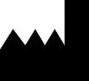 |  **Manufactured in 2018 by:** **Materialise NV** Technologielaan 15 B-3001 Leuven Belgium Phone: +32 16 39 66 11 http://www.materialise.com  
---|---  
  
� 2018 � Materialise NV. All rights reserved.

Materialise, the Materialise logo and the Materialise Mimics product name are trademarks of Materialise NV.

---

#### Labeling information and manufacturer details

# Labeling information and manufacturer details

Software Name |  Mimics Research 21.0  
---|---  
Company Name |  Materialise N.V.  
Manufacturer |   |  Manufactured in June 2018 by: Materialise N.V. Technologielaan 15 3001 Leuven, Belgium  
Labeling information |  L - 10780-02  
Copyright | � 1992-2018 Materialise N.V. All rights reserved.  
|  |   
|    
  
**Note** : For more information please refer to the [Instructions for Use](<Instructions%20for%20Use_Research.md>) and [About](<About_Research.md>) box

---

### Medical vs. Research Edition

# Medical vs. Research Edition

Terminology

The Medical edition of the Mimics Innovation Suite consists of the following medical device software components: Mimics Medical and 3-matic Medical. These products are medical devices and may therefore, within the limits of their intended use, be used by trained professionals to diagnose and plan patient treatments.

The Research edition of the Mimics Innovation Suite consists of the following software components: Mimics Research and 3-matic Research. These products are not medical devices and are not intended to be used for the diagnosis and/or treatment of patients. New modalities like X-Ray and 3D Ultrasound, and the latest cutting edge functionalities are included in the Research Edition only. These products are not commercially available in the Mimics Medical Edition in the US.

**Overview**

Depending on the license you purchased, you may have access to both editions on the same computer. As it is possible to open or modify files created in one edition in the other edition, we have implemented several notifications so that users are aware. If your workflow requires using the Medical edition only, we advise you not to install the Research edition.

The following features and behavior relate to the distinction between the Medical and the Research edition:

1\. Opening a project

2\. Importing and copy-pasting

3\. Preferences

4\. Recovery files

**Technical details**

**1\. Open project**

**General behavior: log messages**

To ensure traceability of Mimics projects across different versions and editions, the log panel will indicate the origin and the history of the project once it has been opened.

More specifically, the following information will be displayed:

Log message | Example | Explanation  
---|---|---  
Project created in <X> | Project created in Mimics Medical 17.0 | Name, edition and version number of the software in which this project was originally created.  
Project last modified in <X> | Project last modified in Mimics Research 17.0 | Name, edition and version number of the software in which this project was last modified.  
Edition: <X> | Edition: Research | The edition can be either Medical or Research. Medical indicates that this project and all objects within it were created in the Medical edition and were never modified outside of the Medical edition (with the exception of objects originating from generic imports, such as Import Part, Import STL, etc.). Research indicates that at least one object in the project was modified in the Research edition.   
  
**Remarks:**

Note that for a project with the �edition� field being Medical, the edition will be changed to Research when objects are directly imported or copy-pasted from Mimics or 3-matic Research.

As the Research and Medical editions were first introduced in version 17.0 for Mimics and version 9.0 for 3-matic, the �edition� field mentioned above will not be displayed for Mimics projects created or modified in or before Mimics 16.0 and 3-matic projects created or modified in or before 3-matic 8.0. The same applies for projects created in Mimics or 3-matic Medical in which an object from such a former version has been imported or copy-pasted.

For 3-matic projects created or modified in 3-matic 8.0 or earlier, the version in which the project was created will not be displayed.

**Special cases: pop-up messages**

The following scenarios will induce pop-up messages:

Scenario | Pop-up message  
---|---  
You open a project of which the Edition is Research, in Mimics Medical.  | �Mimics or 3-matic Research was used to create or modify an object in this project. How would you like to proceed?�   
You open a project of which the Edition is Medical, in Mimics Research. | �We recommend renaming your Mimics Medical project when modifying it in Mimics Research.� *  
  
* When you go to save the project in this scenario, the project name will be left blank. A �Save As� window will pop-up and allow you to define a new project name. This will help you to avoid overwriting a purely Medical project with a project that has now been modified in the Research edition.

**2\. Import and copy-paste**

**General behavior**

Importing a Mimics or 3-matic project or copy-pasting from Mimics or 3-matic, generates the following log message:

The following objects were imported from the Name.mcs project: <Entity1>, <Entity2>

Project created in <X>

Project last modified in <X>

Edition: <X>

The log message will contain the same information as when you open a project (Cf. section �Open Project�). Changes in edition classification related to data exchange follow the behavior described in the �Open Project� section as well.

If traceability is important to you and your process, we advise you not to disable logger messages. The logger messages ensure importing and copy-paste traceability.

**Special cases**

When importing or copy-pasting objects unknown to the application (e.g., X-Ray objects in Mimics Medical 21.0, Point Cloud objects in 3-matic Medical, etc.):

These objects will not be imported or copy-pasted

The log panel will show �Certain imported objects could not be loaded.�

When importing objects that originate from generic imports such as Import Part, Import STL, etc.:

No new warning or log message will be displayed

The edition of the project will not be updated

**3\. Preferences**

Preferences are not shared across editions. This specifically means that preferences for the Medical edition cannot be applied from a Research edition and vice versa.

**4\. Recovery files**

Recovery files are neither shared across editions nor with Mimics 16.0 or earlier versions.

---

### Overview MIS Modules

> *File not found: Mimics Reference Guide/Overview MIS Modules.htm#_Toc319338577*

---

#### Base

> *File not found: Mimics Reference Guide/Mimics.htm#_Toc319338578*

---

#### Analysis

> *File not found: Mimics Reference Guide/Analysis Module.htm#_Toc319338582*

---

#### Simulation

> *File not found: Mimics Reference Guide/Simulation Module.htm#_Toc319338583*

---

#### Design

### Design

Apply powerful design tools to anatomical data to create 3D models, custom implants and patient specific surgical guides using a repeatable design process.

  * Design patient-specific implants
  * Perform CAD operation on 3D models (Booleans, extrude, sweep, hollow)
  * Use sketches and 3D curves to design complex features
  * Finish 3D designs with trimming, smoothing and morphing
  * Label parts for production
  * Import CAD files and combine with patient specific features

Please refer to the 3-matic reference guide for more information.

---

#### Anatomical Reverse Engineering

### Anatomical Reverse Engineering

Prepare geometry data for interoperability with CAD.

  * Convert STL files to IGES files
  * Export your anatomical models for design in traditional CAD

Please refer to the 3-matic reference guide for more information.

---

#### FEA/CFD

> *File not found: Mimics Reference Guide/FEA CFD Module.htm#_Toc319338584*

---

#### C&amp;V Segmentation

### C&V Segmentation

The C&V Segmentation module provides dedicated tools for semi-automated segmentation of heart chambers, coronaries, and 4D CT data.

After the C&V Segmentation module is activated, the Cardiovascular tools are available and can be accessed via the Advanced Segment menu. The Cardiovascular menu and toolbar show the different tools available for segmentation.

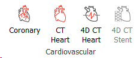

---

#### X-ray

# X-ray

The X-ray module allows you to combine a patient�s X-ray images with their CT or MRI scan data in one Mimics project. The X-ray module makes 3D measurements on X-rays possible by manual or automatic 2D/3D registration. These measurements can indicate the change in relative position of bones and implants in different conditions or points in time. This allows you to compare a post-operative implant position to the 3D surgical plan or to determine the position of bones under various loading conditions.

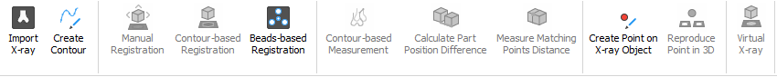

Starting X-ray

All X-ray functions are loaded immediately in Mimics after registration of the X-ray module or package. There is no specific way to start the X-ray module. When the module is registered the extra feature appears in the interface.

On the menu bar:

The X-ray menu lists all the necessary tools to use 2D image data in your Mimics project:

  * Import X-ray deals with importing 2D images into the Mimics project.
  * The Create Contour and Show/hide Projected Contours tools support the registration methods.
  * Manual Registration allows to manually edit the position of an X-ray Object relative to a 3D model and vice versa.
  * Contour-based Registration offers a way to automatically optimize the fit of the contour projection of a 3D model with the created contour by either moving the X-ray object or the selected 3D model.
  * Beads-based Registration provides a method to automatically register 2 X-ray objects based on the indication of the beads location on both X-rays and the 3D image data.
  * Contour-based Measurement gives an indication of the accuracy of the registration by measuring the difference between the created and projected contour.
  * Calculate Part Position Difference and Measure Matching Points Distance allow making basic measurements of the X-ray registration results.
  * Create Point on X-ray Object and Reproduce Point in 3D are tools that allow the creation of a point in the 3D space based on the indication of a point on two registered X-rays.
  * Virtual X-ray tool allows creating virtual X-ray images from the patient's CT scan.

  

In the Project Management:

  * Extra X-ray Object tab is introduced with the X-ray module.
    * The new tab has a tree structure with parent-child relationships. More info about the new tab can be found in the X-ray tab help chapter.

Note: If you don�t see the X-ray menu or the X-ray Objects tab, it is possible that the correct password has not been used. Go to **Help > Modules** and fill in the correct password.

---

#### Pulmonary

# Pulmonary

The Pulmonary module in Advanced Segment menu provides dedicated tools for the segmentation and analysis of the lower respiratory system. It allows for more automated segmentation of the lower airways, lungs and lung lobe separating fissures. Using the airways analysis two airways can be matched at the branching points and endings for accurate comparison of volume or surface area.

**Note** : For optimal performance experience, it is advised to work on a 64-bit workstation.

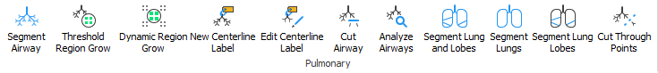

---

#### Script

### Script

The Script Menu contains the following items:

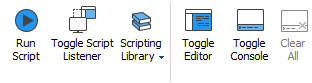

### Scripting Library Menu

The Scripting Library Menu contains the list of the scripts under the path that is defined in **Preferences**

For details, see the **Scripting Guide** under the **Help** menu.

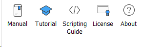

---

#### Muscular

## Muscular

The Muscle Segmentation tool that is part of the Segment -> Muscular menu allows you to semi-automatically segment many muscles in one go, rather than segmenting them all one-by-one. This can yield a large reduction in segmentation time. As input, the Muscle Segmentation tool needs one or more input masks that you need to create for the current scan that you want to segment. The ideal input mask would look like the image on the right. It contains all muscle tissue and has some 'gaps' between muscles which will help the algorithm to automatically segment the muscles.

 |    
---|---  
  
.

---

### Using Help

> *File not found: Mimics Reference Guide/Using Help.htm#_Toc319338595*

---

### System Requirements

# System Requirements

## Minimum system requirements

**Software**  
---  
Windows� 7 SP1 - 64bit  
Internet Explorer� 10  
PDF viewer  
.NET framework 4.5.2 (or higher)  
**Hardware**  
Intel� Core�2 Duo / AMD Athlon� X2 AM2 or equivalent  
4 GB RAM  
DirectX� 11.0 compliant graphics card with 1 GB RAM  
5GB free hard disk space  
Resolution of 1280x1024  
  
**Note** : Mac� users can install MIS using Boot Camp� in combination with a supported Windows OS.

## Preferred system requirements

**Software**  
---  
Windows� 7 SP1 - 64bit  
Internet Explorer� 10  
PDF viewer  
.NET framework 4.5.2 (or higher)  
**Hardware**  
Third generation Intel� Core� i5/i7 or equivalent  
16 GB RAM  
DirectX� 11.0 compliant AMD Radeon� / NVIDIA� GeForce� card with 2 GB RAM  
20 GB free hard disk space  
Resolution of 1680x1050 or higher  
  
i | Other qualifications may apply. When working with datasets larger than 1GB the system should comply with the recommended system requirements. Advanced segmentation tools such as Smart Expand and Coronary segmentation require hardware as specified in the recommended requirements even for smaller datasets.  
---|---  
  
The following operating systems were used to test Mimics Research 21.0:

� Windows 7 Professional 64-bit (with SP1)

� Windows 8.1 Professional 64-bit (with Update 1)

� Windows 10 Pro 64-bit

---

### Third-Party Disclaimers

MIT License

The following 3rd-party libraries are included with Mimics under MIT License:

> � boolinq 2.0, Copyright (C) 2013 by Anton Bukov (k06aaa@gmail.com). Licensed under MIT- expat.
> 
> � rPyC 3.4.4, Copyright (c) 2005-2013, Tomer Filiba (tomerfiliba@gmail.com), Copyrights of patches are held by their respective submitters
> 
> � Plumbum 1.6.6, Copyright (c) 2013 Tomer Filiba (tomerfiliba@gmail.com)

Permission is hereby granted, free of charge, to any person obtaining a copy of this software and associated documentation files (the "Software"), to deal in the Software without restriction, including without limitation the rights to use, copy, modify, merge, publish, distribute, sublicense, and/or sell copies of the Software, and to permit persons to whom the Software is furnished to do so, subject to the following conditions:

The above copyright notice and this permission notice shall be included in all copies or substantial portions of the Software.

THE SOFTWARE IS PROVIDED "AS IS", WITHOUT WARRANTY OF ANY KIND, EXPRESS OR IMPLIED, INCLUDING BUT NOT LIMITED TO THE WARRANTIES OF MERCHANTABILITY, FITNESS FOR A PARTICULAR PURPOSE AND NONINFRINGEMENT. IN NO EVENT SHALL THE AUTHORS OR COPYRIGHT HOLDERS BE LIABLE FOR ANY CLAIM, DAMAGES OR OTHER LIABILITY, WHETHER IN AN ACTION OF CONTRACT, TORT OR OTHERWISE, ARISING FROM, OUT OF OR IN CONNECTION WITH THE SOFTWARE OR THE USE OR OTHER DEALINGS IN THE SOFTWARE.

**Boost license**

The following 3rd-party libraries are included with Mimics under Boost license:

> � Boost 1.59, Copyright (c) 2003 Boost Software License. Licensed under Boost 1.0.

> � Wild Magic 5. Licensed under Boost 1.0.

Boost Software License - Version 1.0 - August 17th, 2003

Permission is hereby granted, free of charge, to any person or organization

obtaining a copy of the software and accompanying documentation covered by

this license (the "Software") to use, reproduce, display, distribute,

execute, and transmit the Software, and to prepare derivative works of the

Software, and to permit third-parties to whom the Software is furnished to

do so, all subject to the following:

The copyright notices in the Software and this entire statement, including

the above license grant, this restriction and the following disclaimer,

must be included in all copies of the Software, in whole or in part, and

all derivative works of the Software, unless such copies or derivative

works are solely in the form of machine-executable object code generated by

a source language processor.

THE SOFTWARE IS PROVIDED "AS IS", WITHOUT WARRANTY OF ANY KIND, EXPRESS OR

IMPLIED, INCLUDING BUT NOT LIMITED TO THE WARRANTIES OF MERCHANTABILITY,

FITNESS FOR A PARTICULAR PURPOSE, TITLE AND NON-INFRINGEMENT. IN NO EVENT

SHALL THE COPYRIGHT HOLDERS OR ANYONE DISTRIBUTING THE SOFTWARE BE LIABLE

FOR ANY DAMAGES OR OTHER LIABILITY, WHETHER IN CONTRACT, TORT OR OTHERWISE,

ARISING FROM, OUT OF OR IN CONNECTION WITH THE SOFTWARE OR THE USE OR OTHER

DEALINGS IN THE SOFTWARE.

**Apache 2.0 license**

The following 3rd-party libraries are included with Mimics under Apache 2.0 license

> � ITK 4.7.1. Copyright Insight Software Consortium.

> � log4cxx 0.10.0.1

Licensed under the Apache License, Version 2.0 (the "License");

You may not use this file except in compliance with the License.

You may obtain a copy of the License at

http://www.apache.org/licenses/LICENSE-2.0

Unless required by applicable law or agreed to in writing, software distributed under the License is distributed on an "AS IS" BASIS, WITHOUT WARRANTIES OR CONDITIONS OF ANY KIND, either express or implied. See the License for the specific language governing permissions and limitations under the License.

**BSD 3-Clause �New� or �Revised� license**

The following 3rd-party libraries are included with Mimics under BSD 3-Clause �New� or �Revised� license:

> � CrashRpt 1.4.0.3. Copyright (c) 2003, The CrashRpt Project Authors. Licensed under BSD-3.

> � googletest 1.7.0, Copyright 2008, Google Inc. Licensed under BSD-3.

> � lipzip 1.01e. Copyright (C) 1999-2014 Dieter Baron and Thomas Klausner. The authors can be contacted at libzip@nih.at. Licensed under BSD-3.

All rights reserved.

Redistribution and use in source and binary forms, with or without modification, are permitted provided that the following conditions are met:

> 1\. Redistributions of source code must retain the above copyright notice, this list of conditions and the following disclaimer.
> 
> 2\. Redistributions in binary form must reproduce the above copyright notice, this list of conditions and the following disclaimer in the documentation and/or other materials provided with the distribution.
> 
> 3\. Neither the name of the copyright holder nor the names of its contributors may be used to endorse or promote products derived from this software without specific prior written permission.

THIS SOFTWARE IS PROVIDED BY THE COPYRIGHT HOLDERS AND CONTRIBUTORS "AS IS" AND ANY EXPRESS OR IMPLIED WARRANTIES, INCLUDING, BUT NOT LIMITED TO, THE IMPLIED WARRANTIES OF MERCHANTABILITY AND FITNESS FOR A PARTICULAR PURPOSE ARE DISCLAIMED. IN NO EVENT SHALL THE COPYRIGHT HOLDER OR CONTRIBUTORS BE LIABLE FOR ANY DIRECT, INDIRECT, INCIDENTAL, SPECIAL, EXEMPLARY, OR CONSEQUENTIAL DAMAGES (INCLUDING, BUT NOT LIMITED TO, PROCUREMENT OF SUBSTITUTE GOODS OR SERVICES; LOSS OF USE, DATA, OR PROFITS; OR BUSINESS INTERRUPTION) HOWEVER CAUSED AND ON ANY THEORY OF LIABILITY, WHETHER IN CONTRACT, STRICT LIABILITY, OR TORT (INCLUDING NEGLIGENCE OR OTHERWISE) ARISING IN ANY WAY OUT OF THE USE OF THIS SOFTWARE, EVEN IF ADVISED OF THE POSSIBILITY OF SUCH DAMAGE.

**QHull license**

The following 3rd-party libraries are included with Mimics under BSD 3-Clause �New� or �Revised� license:

> � QHull 2003.1. Copyright (c) 1993-2015, C.B. Barber, Arlington, MA, and The National Science and Technology Research Center for Computation and Visualization of Geometric Structures (The Geometry Center), University of Minnesota. email: qhull@qhull.org

This software includes Qhull from C.B. Barber and The Geometry Center.

Qhull is copyrighted as noted above. Qhull is free software and may be obtained via http from www.qhull.org. It may be freely copied, modified, and redistributed under the following conditions:

> 1\. All copyright notices must remain intact in all files.

> 2\. A copy of this text file must be distributed along with any copies

> of Qhull that you redistribute; this includes copies that you have
> 
> modified, or copies of programs or other software products that
> 
> include Qhull.
> 
> 3\. If you modify Qhull, you must include a notice giving the
> 
> name of the person performing the modification, the date of
> 
> modification, and the reason for such modification.
> 
> 4\. When distributing modified versions of Qhull, or other software
> 
> products that include Qhull, you must provide notice that the original
> 
> source code may be obtained as noted above.
> 
> 5\. There is no warranty or other guarantee of fitness for Qhull, it is
> 
> provided solely "as is". Bug reports or fixes may be sent to
> 
> qhull_bug@qhull.org; the authors may or may not act on them as
> 
> they desire.

**GNU Lesser General Public License version 3.0**

The following 3rd-party libraries are included with Mimics under the GNU Lesser General Public License (LGPL) license version 3.0:

  * Nurbs++ 1.2. Copyright � To be found at: http://libnurbs.sourceforge.net/
  * Qt 5.9.0, The Qt Toolkit is Copyright (C) 2016 The Qt Company Ltd. and other contributors http://www.qt.io/licensing/

GNU LESSER GENERAL PUBLIC LICENSE

Version 3, 29 June 2007

Copyright � 2007 Free Software Foundation, Inc.

Everyone is permitted to copy and distribute verbatim copies of this license document, but changing it is not allowed.

This version of the GNU Lesser General Public License incorporates the terms and conditions of version 3 of the GNU General Public License, supplemented by the additional permissions listed below.

0\. Additional Definitions.

As used herein, �this License� refers to version 3 of the GNU Lesser General Public License, and the �GNU GPL� refers to version 3 of the GNU General Public License.

�The Library� refers to a covered work governed by this License, other than an Application or a Combined Work as defined below.

An �Application� is any work that makes use of an interface provided by the Library, but which is not otherwise based on the Library. Defining a subclass of a class defined by the Library is deemed a mode of using an interface provided by the Library.

A �Combined Work� is a work produced by combining or linking an Application with the Library. The particular version of the Library with which the Combined Work was made is also called the �Linked Version�.

The �Minimal Corresponding Source� for a Combined Work means the Corresponding Source for the Combined Work, excluding any source code for portions of the Combined Work that, considered in isolation, are based on the Application, and not on the Linked Version.

The �Corresponding Application Code� for a Combined Work means the object code and/or source code for the Application, including any data and utility programs needed for reproducing the Combined Work from the Application, but excluding the System Libraries of the Combined Work.

1\. Exception to Section 3 of the GNU GPL.

You may convey a covered work under sections 3 and 4 of this License without being bound by section 3 of the GNU GPL.

2\. Conveying Modified Versions.

If you modify a copy of the Library, and, in your modifications, a facility refers to a function or data to be supplied by an Application that uses the facility (other than as an argument passed when the facility is invoked), then you may convey a copy of the modified version:

a) under this License, provided that you make a good faith effort to ensure that, in the event an Application does not supply the function or data, the facility still operates, and performs whatever part of its purpose remains meaningful, or

b) under the GNU GPL, with none of the additional permissions of this License applicable to that copy.

3\. Object Code Incorporating Material from Library Header Files.

The object code form of an Application may incorporate material from a header file that is part of the Library. You may convey such object code under terms of your choice, provided that, if the incorporated material is not limited to numerical parameters, data structure layouts and accessors, or small macros, inline functions and templates (ten or fewer lines in length), you do both of the following:

a) Give prominent notice with each copy of the object code that the Library is used in it and that the Library and its use are covered by this License.

b) Accompany the object code with a copy of the GNU GPL and this license document.

4\. Combined Works.

You may convey a Combined Work under terms of your choice that, taken together, effectively do not restrict modification of the portions of the Library contained in the Combined Work and reverse engineering for debugging such modifications, if you also do each of the following:

a) Give prominent notice with each copy of the Combined Work that the Library is used in it and that the Library and its use are covered by this License.

b) Accompany the Combined Work with a copy of the GNU GPL and this license document.

c) For a Combined Work that displays copyright notices during execution, include the copyright notice for the Library among these notices, as well as a reference directing the user to the copies of the GNU GPL and this license document.

d) Do one of the following:

0) Convey the Minimal Corresponding Source under the terms of this License, and the Corresponding Application Code in a form suitable for, and under terms that permit, the user to recombine or relink the Application with a modified version of the Linked Version to produce a modified Combined Work, in the manner specified by section 6 of the GNU GPL for conveying Corresponding Source.

1) Use a suitable shared library mechanism for linking with the Library. A suitable mechanism is one that (a) uses at run time a copy of the Library already present on the user's computer system, and (b) will operate properly with a modified version of the Library that is interface-compatible with the Linked Version.

e) Provide Installation Information, but only if you would otherwise be required to provide such information under section 6 of the GNU GPL, and only to the extent that such information is necessary to install and execute a modified version of the Combined Work produced by recombining or relinking the Application with a modified version of the Linked Version. (If you use option 4d0, the Installation Information must accompany the Minimal Corresponding Source and Corresponding Application Code. If you use option 4d1, you must provide the Installation Information in the manner specified by section 6 of the GNU GPL for conveying Corresponding Source.)

5\. Combined Libraries.

You may place library facilities that are a work based on the Library side by side in a single library together with other library facilities that are not Applications and are not covered by this License, and convey such a combined library under terms of your choice, if you do both of the following:

a) Accompany the combined library with a copy of the same work based on the Library, uncombined with any other library facilities, conveyed under the terms of this License.

b) Give prominent notice with the combined library that part of it is a work based on the Library, and explaining where to find the accompanying uncombined form of the same work.

6\. Revised Versions of the GNU Lesser General Public License.

The Free Software Foundation may publish revised and/or new versions of the GNU Lesser General Public License from time to time. Such new versions will be similar in spirit to the present version, but may differ in detail to address new problems or concerns.

Each version is given a distinguishing version number. If the Library as you received it specifies that a certain numbered version of the GNU Lesser General Public License �or any later version� applies to it, you have the option of following the terms and conditions either of that published version or of any later version published by the Free Software Foundation. If the Library as you received it does not specify a version number of the GNU Lesser General Public License, you may choose any version of the GNU Lesser General Public License ever published by the Free Software Foundation.

If the Library as you received it specifies that a proxy can decide whether future versions of the GNU Lesser General Public License shall apply, that proxy's public statement of acceptance of any version is permanent authorization for you to choose that version for the Library.

**Python Software Foundation License**

The following 3rd-party libraries are included with Mimics under the Python Software Foundation License:

Python 3.5, Copyright (c) 2001, 2002, 2003, 2004, 2005, 2006, 2007, 2008, 2009, 2010,

2011, 2012, 2013, 2014, 2015, 2016 Python Software Foundation; All Rights

Reserved.

PYTHON SOFTWARE FOUNDATION LICENSE VERSION 2

> 1\. This LICENSE AGREEMENT is between the Python Software Foundation
> 
> ("PSF"), and the Individual or Organization ("Licensee") accessing and
> 
> otherwise using this software ("Python") in source or binary form and
> 
> its associated documentation.
> 
> 2\. Subject to the terms and conditions of this License Agreement, PSF hereby
> 
> grants Licensee a nonexclusive, royalty-free, world-wide license to reproduce,
> 
> analyze, test, perform and/or display publicly, prepare derivative works,
> 
> distribute, and otherwise use Python alone or in any derivative version,
> 
> provided, however, that PSF's License Agreement and PSF's notice of copyright,
> 
> i.e., "Copyright (c) 2001, 2002, 2003, 2004, 2005, 2006, 2007, 2008, 2009, 2010,
> 
> 2011, 2012, 2013, 2014, 2015, 2016 Python Software Foundation; All Rights
> 
> Reserved" are retained in Python alone or in any derivative version prepared by
> 
> Licensee.
> 
> 3\. In the event Licensee prepares a derivative work that is based on
> 
> or incorporates Python or any part thereof, and wants to make
> 
> the derivative work available to others as provided herein, then
> 
> Licensee hereby agrees to include in any such work a brief summary of
> 
> the changes made to Python.
> 
> 4\. PSF is making Python available to Licensee on an "AS IS"
> 
> basis. PSF MAKES NO REPRESENTATIONS OR WARRANTIES, EXPRESS OR
> 
> IMPLIED. BY WAY OF EXAMPLE, BUT NOT LIMITATION, PSF MAKES NO AND
> 
> DISCLAIMS ANY REPRESENTATION OR WARRANTY OF MERCHANTABILITY OR FITNESS
> 
> FOR ANY PARTICULAR PURPOSE OR THAT THE USE OF PYTHON WILL NOT
> 
> INFRINGE ANY THIRD PARTY RIGHTS.
> 
> 5\. PSF SHALL NOT BE LIABLE TO LICENSEE OR ANY OTHER USERS OF PYTHON
> 
> FOR ANY INCIDENTAL, SPECIAL, OR CONSEQUENTIAL DAMAGES OR LOSS AS
> 
> A RESULT OF MODIFYING, DISTRIBUTING, OR OTHERWISE USING PYTHON,
> 
> OR ANY DERIVATIVE THEREOF, EVEN IF ADVISED OF THE POSSIBILITY THEREOF.
> 
> 6\. This License Agreement will automatically terminate upon a material
> 
> breach of its terms and conditions.
> 
> 7\. Nothing in this License Agreement shall be deemed to create any
> 
> relationship of agency, partnership, or joint venture between PSF and
> 
> Licensee. This License Agreement does not grant permission to use PSF
> 
> trademarks or trade name in a trademark sense to endorse or promote
> 
> products or services of Licensee, or any third party.
> 
> 8\. By copying, installing or otherwise using Python, Licensee
> 
> agrees to be bound by the terms and conditions of this License
> 
> Agreement.

---

### Contact Info

> *File not found: Mimics Reference Guide/Contact Info.htm#_Toc319339077*

---

## General Information

### User Interface

#### The Different Views

> *File not found: Mimics Reference Guide/The Different Views.htm#_Toc319338598*

---

#### Title Bar

### Title Bar

The title bar displays some information about the project:

The name of the patient and the name of the project are displayed first (unless you have chosen to anonymize the project and hide the file name) and after the patient name, the compression of the project is displayed. There are several different types of compression possible:

Displayed in title bar: |  Case:  
---|---  
Lossless Compression |  No compression was used while importing and JPEG compression was not used during saving  
CT Compressed |  CT compression was used while importing and JPEG compression was not used during saving  
MR Compressed |  MR compression was used while importing and JPEG compression was not used during saving  
Air Compressed |  Cut Air compression was used while importing and JPEG compression was not used during saving  
Lossy JPEG Compressed |  No compression was used while importing and project was saved with JPEG compression   
Lossy JPEG & CT Compressed |  CT compression was used while importing and project was saved with JPEG compression  
Lossy JPEG & MR Compressed |  MR compression was used while importing and project was saved with JPEG compression   
Lossy JPEG & Air Compressed |  Cut Air compression was used while importing and project was saved with JPEG compression  
  
##### Quick access toolbar

The quick access toolbar provides fast access to most used tools:

Displayed in quick access bar |  Name of the tool |  Details  
---|---|---  
 |  New Project | For details see [here](<New%20Project%20Wizard.md>)  
 |  Open | For details see [here](<Open%20project.md>)  
 | Save | For details see [here](<Save%20project.md>)  
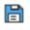 | Save As | For details see [here](<Save%20project%20As.md>)  
 | Undo | Undo the last action performed. A list can be displayed with all actions that have been performed. Every action is added to the top of the list, so the first one on the list is the last action performed.  
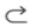 | Redo | Redo the last action you have "Undone".  
 | Print | For details see [here](<Print.md>)  
 | 3-matic | For details see [here](<3-matic.md>)  
 | Copy Objects to Clipboard |  By selecting this option, you can identify the objects that you want to copy to a second Mimics or 3-matic project. Objects that can be copied are Parts, STL files, polylines and primitives. The shortcut Ctrl + C can also be used, after indicating the objects from their respective tab in the Project Management.   
 | Paste Objects from Clipboard | This function allows you to paste the copied objects to your Mimics project. You can also use the Ctrl + V shortcut.  
 | Zoom | For details see [here](<Zoom1.md>)  
 | Fit to screen | For details see [here](<Unzoom1.md>)  
 | Full screen | For details see [here](<Zoom%20to%20full%20screen1.md>)

---

#### Menu Bar

> *File not found: Mimics Reference Guide/Menu Bar.htm#_Toc319338600*

---

#### 3D Toolbar

### 3D Toolbar  
  
The 3D toolbar is displayed at the right side of the 3D view. 

---

##### Toggle transparency

> *File not found: Mimics Reference Guide/Toggle transparency.htm#_Toc319338602*

---

##### Clipping

> *File not found: Mimics Reference Guide/Clipping.htm#_Toc319338603*

---

##### Volume rendering

> *File not found: Mimics Reference Guide/Volume rendering.htm#_Toc319338604*

---

##### Mask 3D Visibility

#### Mask 3D Preview

Mimics now allows viewing the 3D preview of the active mask. Click on the button  in the 3D toolbar or go to **View > 3D Viewports > Mask 3D Preview** to show or hide the 3D mask preview. The 3D mask preview is OFF by default.

 |    
---|---  
_2D mask_ | _3D mask preview_  
  
**General behavior of 3D preview**

To visualize the 3D preview of a mask the following conditions must be met.

  * The Mask 3D Preview button should be toggled ON.
  * Single or multiple masks should be selected in the project management tab.
  * The visibility of the selected mask(s) should be ON.

**Note** : The speed of displaying the mask preview can vary based on the number of processes running in the background and also on the computing power of the system in use. The higher the computing power of the system the faster the mask preview will be displayed (without any lag).

---

##### Show reference planes

> *File not found: Mimics Reference Guide/Show reference planes.htm#_Toc319338605*

---

##### Select 3D view

> *File not found: Mimics Reference Guide/Select 3D view.htm#_Toc319338606*

---

##### Rotate view

### Rotate View

The rotate function 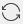 is only available on a Part. There are different ways to select the rotate function:

  * right-drag with your mouse button

  * use the arrows-keys for precise rotation

  * use Home / End to rotate 10 degrees Left / Right

  * use Page Up / Page Down to rotate 10 degrees Up / Down

  * right-click in the 3D view and select **Rotate** from the context menu

  * click on the **Rotate** button in the toolbar

  * select **View > Rotate** from the menu bar

There are two different modes when rotating the 3D view. When your mouse cursor is in the middle of the 3D window and you then hold down the right mouse button, the 3D view turns about a vertical axis when you move the mouse left and right. The 3D view tilts around a horizontal axis if you move the mouse up and down.

When your mouse cursor is at the side of the 3D window and you then hold down the right mouse button, the 3D view rotates around an axis perpendicular to your screen when moving the mouse.

---

##### 3D locator

> *File not found: Mimics Reference Guide/3D locator.htm#_Toc319338608*

---

##### Toggle visibility

#### Toggle visibility

By toggling the 3D representations in the 3D toolbar, you can make the 3D objects visible or invisible. For every 3D object in the project there is a corresponding miniature.

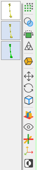

---

##### Show/Hide World Coordinate System

> *File not found: Mimics Reference Guide/Show Hide World Coordinate.htm#_Toc319338610*

---

##### Invert Background

# Invert Background

By using this button  the background color of the 3D window is inverted.

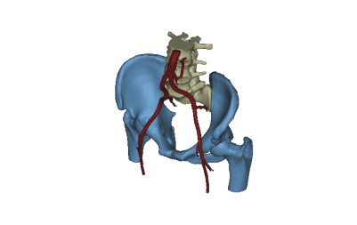 |  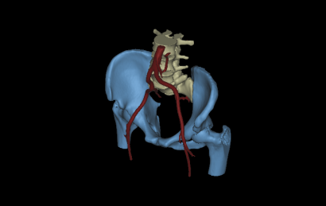  
---|---  
_Invert Background OFF_ | _Invert Background ON_

---

#### Indicators in the views

> *File not found: Mimics Reference Guide/Indicators in the views.htm#_Toc319338611*

---

##### Tick Marks

> *File not found: Mimics Reference Guide/Tick Marks.htm#_Toc319338612*

---

##### Intersection Lines

> *File not found: Mimics Reference Guide/Intersection Lines.htm#_Toc319338613*

---

##### Slice Position

> *File not found: Mimics Reference Guide/Slice Position.htm#_Toc319338614*

---

##### Orientation strings

> *File not found: Mimics Reference Guide/Orientation strings.htm#_Toc319338615*

---

##### Name of Images

#### Name of Images indicator  
  
The name of the image set that is visualized in a 2D view is shown in the top left corner of each 2D view. 

You can enable and disable it by clicking on **View** -> **Indicators** -> **Name of Images**.

2D view with the Name of Images indicator ON:

2D view with the Name of Images indicator OFF:

: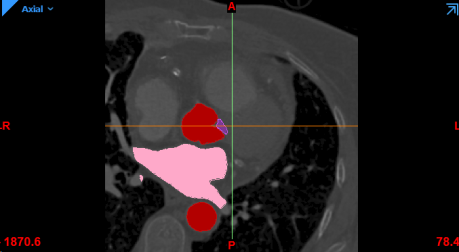

---

##### Active Images Indicator

#### Active Images indicator

The active image set indicator (blue triangle) is visualized in the top left corner of each 2D view. You can disable it for the layouts where only one image set can be visualised but it will be automatically on when a multi image set layout will be activated.

You can enable and disable it by clicking on **View** -> **Indicators** -> **Active Images indicator**.

2D view with the Active Images indicator ON:

2D view with the Active Images indicator OFF:

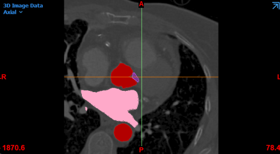

---

#### The Context Menu

> *File not found: Mimics Reference Guide/The Context Menu.htm#_Toc319338616*

---

### Navigation

#### 1-Click Navigation

> *File not found: Mimics Reference Guide/1 Click Navigation.htm#_Toc319338618*

---

#### Pan View

### Pan view

Every image and 3D object can be panned or moved. When you select the pan function, the cursor will change to a cross-shaped double arrow. There are different ways to select the pan function:

  * Press the scroll wheel and drag the mouse

  * hold down the SHIFT key, right-drag your mouse button

  * right-click in an image or in the 3D view and select Pan View from the context menu

  * click on the Pan View button in the toolbar

  * hold down the SHIFT key in combination with the arrows-keys for precise rotation

  * Hold down the SHIFT key in combination with Home / End for quick Left / Right panning

  * select View > Pan View from the menu bar

---

#### Rotate View

> *File not found: Mimics Reference Guide/Rotate view1.htm#_Toc319338620*

---

#### Zoom

### Zoom 

Allows to Zoom in at a user defined rectangle. Click on the left mouse button to indicate a corner of the zoom rectangle, drag and release to indicate the opposite corner. Can be used on every image.

There are different ways to select the zoom function:

  * hold down the CTRL key, right-drag your mouse button

  * hold down the CTRL key in combination with the Up / Down arrow keys

  * hold down the CTRL key in combination with the Page Up / Page Down key

  * right-click in an image or in the 3D view and select Zoom from the context menu

  * click on the Zoom button in the toolbar

  * select View > Zoom from the menu bar

Note: The behavior of zooming is different in Reslice Layout.

---

#### Zoom to Fixed Factor

> *File not found: Mimics Reference Guide/Zoom to fixed factor.htm#_Toc319338622*

---

#### Zoom to Full Screen

### Zoom to Full Screen

Allows you to display a view on the whole screen. Click on the Zoom to Full Screen button and the cursor will change to a magnifying glass. Then click on an image. To return to a normal view, click again on the Zoom to Full Screen button.

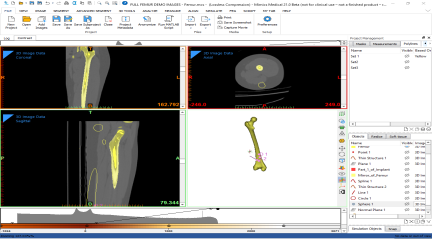 |  Zoom to full screen on axial view  
  
|  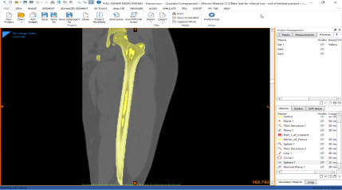  
---|---|---  
  
When you hover with the mouse over a view and press the spacebar the view is also put to full screen. To unzoom press the spacebar again.

---

#### Unzoom

### Fit to Screen

Changes the display scale to show the whole image. You need to select the function first and then indicate the view on which you want to apply the function.

To quickly toggle between the zoomed-in object and the un-zoomed object, press the backspace key.

---

### Project Management

> *File not found: Mimics Reference Guide/Project Management.htm#_Toc319338625*

---

#### Images

#### Images

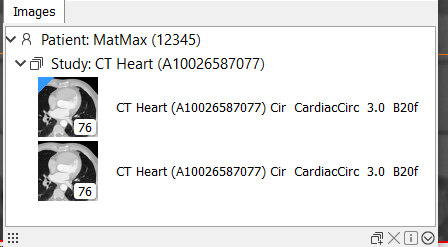

An Image set is a collection of DICOM or other images. Image sets are organized in a tree structure. Top level is the _Patient_. The information shown is retrieved from the DICOM tags (0010,0020) Patient ID and (0010,0010) Patient Name, if possible. When those tags are not available, the string n/a is used. One level below, the _Study_ information is exposed. Those are taken from the DICOM tags (0008,1030) Study description and (0020,0010) Study ID, if possible. When that tags are not available, the string n/a is used.

Image sets are shown in the tab as Image set preview (thumbnail). Each thumbnail contains information about the image set. The name, number of images of the image set and preview of the middle slice are shown.

At the Image set preview (thumbnail) an indicator (blue triangle) is shown to indicate the currently active image set of the project. The active image set corresponds to the image set in which you are working now. There is only one active image set in the project and it is always visualized in the 2D views. If the active image set is the only one visible in the project, then only this image set will have an indicator in the Image set preview (thumbnail), the blue one.

In case two image sets are visible simultaneously, then two indicators are present at the Image set preview. The blue indicator keeps the same meaning and the second indicator (grey triangle) refers to the image set that is only visualized at the 2D views but it is not currently the active one.

**Example** : Only the active image set is visible in the project

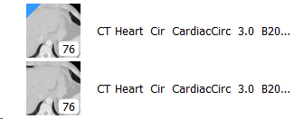

**Example** : There is one active and one visible image set in the project

##### List of the image sets

Name |  Name of the image set. By clicking on the name it can be renamed.  
---|---  
Number of slices |  Number of slices of the image set  
Image set preview |  It shows the middle slice of the image set  
Status indicator |  The blue indicator refers to the active image set. The grey indicator is the visualized image set.   
  
##### Functions on images

Add Images |  Adds image sets in the project  
---|---  
Delete |  Deletes the selected image set  
Image information |  Provides detailed information for the selected image set  
_Matrix View_ | Image sets are shown as a matrix  
List View | Image sets are shown as a list  
Drag and Drop | To visualize an image set in a view, drag it from the Images tab and drop it in a 2D view. I case the view contained an image set before that was the currently active one, then the image set will be replaced by the new one. The new image set will become the currently active image set  
  
##### Image set information

This window displays the image set information along with the DICOM tags.

With the **'Export'** button you can export all the DICOM tags (standard and custom) to a text document.  

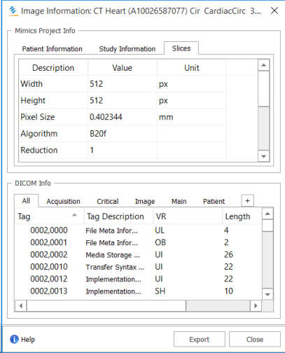

You can create custom tags tab, clicking the  button. In the pop window you can set the name of the custom tags tab.

To add a tag in the custom tags tab, right click to the selected tag and select **Add Tag to Tab**.

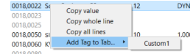

---

#### Masks

> *File not found: Mimics Reference Guide/Masks.htm#_Toc319338626*

---

#### Measurements

> *File not found: Mimics Reference Guide/Measurements.htm#_Toc319338630*

---

#### Annotation

> *File not found: Mimics Reference Guide/Annotation.htm#_Toc319338632*

---

#### X-ray Objects

# X-ray Objects

The X-ray tab has a tree structure that will contain the following new entities:

  * X-ray Object
    * Contour
    * Beads Set
    * Point Set
      * Point
  * 3D Beads Set

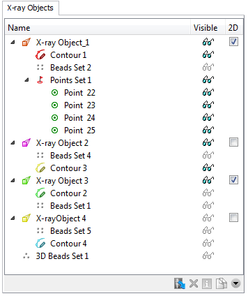

**List of created Objects**

Name | Name of the object. By clicking on the name of the object, it can be renamed.  
---|---  
Visible | Lists if the object is visible or not by means of glasses. You can change the visibility by clicking on the glasses.  
2D |  The 2D visualization of an X-ray Object in the X-ray layout can be toggled on by ticking the checkbox. If it is not checked, the X-ray Object will not appear in a 2D viewport of the X-ray layout.   
  
**Functions on Objects**

Import X-ray | This tool allows you to import 2D images and will convert them into X-ray Objects.  
---|---  
Delete | Deletes the selected object.  
Properties | Displays the properties of the selected object.  
Duplicate | Creates a duplicate of the selected object. (Only enabled for X-ray Objects)   
  
# X-ray Object Properties

An X-ray object represents the imported X-ray in the 3D space. It is visualized as a pyramid object with the X-ray image at the base and the X-ray source at the top. The color of the pyramid lines can be changed by ticking the colored label which will open the color picking window. To hide the construction lines of the pyramid, uncheck the checkbox.

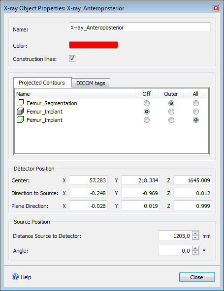

**Projected Contours**

It is possible to change the contour projection from the �projected Contours� tab. Select one of the radio buttons to hide (�Off�), show only outer contours (�Outer�) or show all contours (�All�) of a particular Part from the list.

**DICOM tags**

All the DICOM tags of the imported X-ray are organized and listed in the �DICOM tags� tab.

**Detector Position**

The position of the X-ray object is determined by the location of the �Center� (center of the X-ray image) and the direction of the �Direction to Source� (from the X-ray image center to the X-ray source) and �Plane Direction� (from the X-ray image center to the top of the X-ray image).

**Source Position**

The �Distance Source to Detector� can be edited in the X-ray object properties dialog box, regardless of the DICOM tag that is read during the import.

It is possible to edit the angle of the X-ray object in case the X-ray image is acquired with an angle. The X-ray source can be rotated in direction of the top or bottom of the image. The defined �Distance Source to Detector� Value will always be kept.

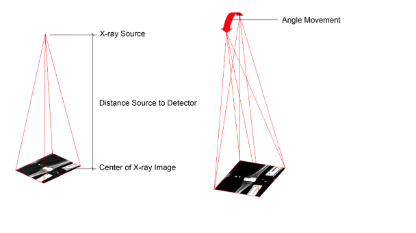

---

#### Objects

### Objects

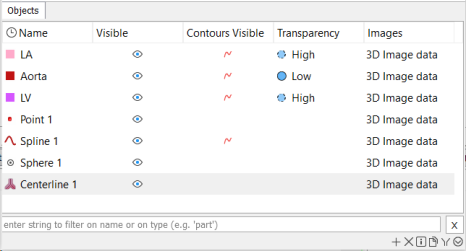

#### List of created Objects

Name |  Name of the object. By clicking on the name of the object, it can be renamed.  
---|---  
Visible |  Lists if the object is visible or not  
_Contour Visible_ | Lists if the contour of the Part or STL is visible on the 2D images or not. You can change the visibility of the contours by clicking on the visibility icon.   
Transparency  | Lists the transparency settings of the Part or STL, possible options are: opaque (= not transparent), low, medium and high. Change the transparency by clicking on the icon in the transparency column. To see your objects transparent, the transparency button has to be enabled  
_Images_ | The link to the image set. The link to the image set can be modified via the dropdown list.  
  
#### Functions on Objects

New |  Creates a new Object. The object menu appears :  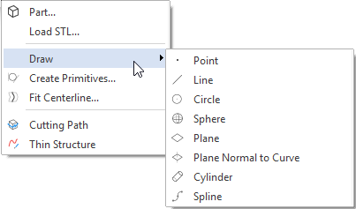 Click on the desired object to go to the correct help page.  
---|---  
Delete |  Deletes the selected objects.  
Properties |  Displays the properties of the selected object.  
Duplicate |  Creates a copy of selected objects  
_Filter_ | Filters objects by name and type. As you type, Mimics will start filtering and provide a list of objects that match the text you typed. The list of objects is simultaneously filtered for type of objects and name of the objects.  
  
**Filter objects in Object tab**

Assuming that there are the following objects in the Objects tab:

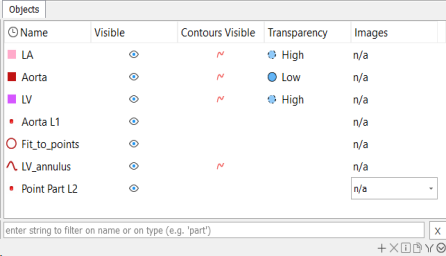

To filter the objects, type a string in the filter area.

Filter by type |  To filter the Parts, type "Part". The result will be the following: 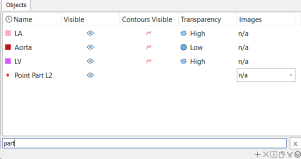 Notice that in case an object of different type contains the string "part" in it's name (in this case a Point that contains the string "part" in it's name) will also appear in the list. You can filter for different types of objects that are shown in the Object tab. Some of them are: point, part, stl, circle, spline etc.  
---|---  
Filter by name |  To filter all the objects that contain the string LV in their name, type "LV". The result will be the following: 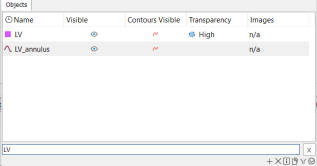 Only the objects that contain the string LV are shown in the list  
Filter a group |  To filter all the objects that are analytical primitives, type "primitive" or "analytical". The result will be: 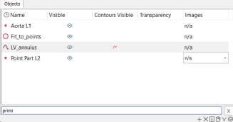  
  
##### Functions on 3D parts. 

Can be accessed by right-clicking on a part.

New |  Creates a new Part. The Calculate Part window appears.  
---|---  
Copy |  Copies the Part to the clipboard. The Part can then be pasted in another project.  
Delete |  Deletes a Part.  
Properties |  Gives the properties of the calculated Part.  
Duplicate |  Duplicates the selected Part.  
Move |  Activates the handles to move the STL to a new positions  
Rotate |  Activates the handles to rotate the STL around its axis  
_Remesh_ | Opens 3-matic with the selected part ready for remeshing  
_Transform_ |  Opens the transformation dialog: 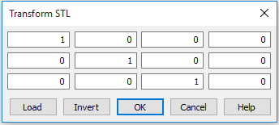 In this dialog, you can enter a transformation matrix, invert the transformation matrix if needed and apply it on the selected STL file. You can also load a transformation matrix file, written out by Mimics when reslicing or cropping a project or when doing an STL registration.  
_Action_ | Lists the available functions on the selected Part  
  
##### Properties of an Object

When you click on the Properties button in the Objects list, a dialog box will open. It's form depends on the type of the object chosen:

Part |  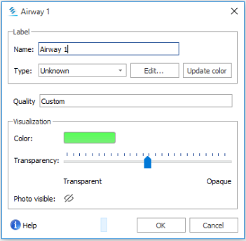  
---|---  
Point |  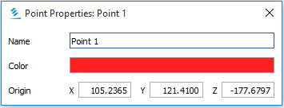  
Line |  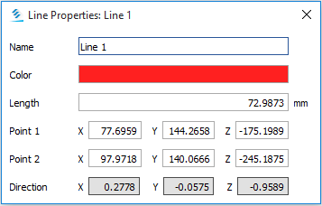  
Circle |  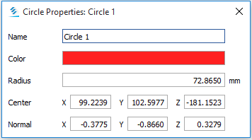  
Sphere |  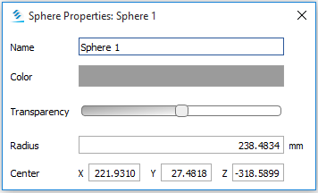  
Plane and Normal plane |  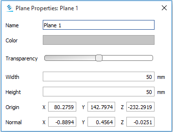  
Cylinder |  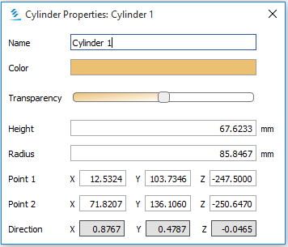  
Spline (Thin Structure) |    
  
Mimics displays the name, color and transparency of the object. The volume, surface, outer dimensional parameters and the number of points and/or triangles are also shown, which give a good idea if reducing of the file for further applications is needed.

You can change the transparency of the Part and make objects transparent. Drag the Transparency slider at the bottom of the 3D properties dialog. If the slider is all the way to the right, the 3D surface is opaque and nothing below the surface can be visualized. If the slider is all the way to the left, the 3D surface is completely transparent. In order to see the Part transparent, you need to click the Toggle Transparency button  in the 3D toolbar.

 |    
---|---  
Opaque 3D |  Transparent 3D  
  
If the Details button on the 3D Properties dialog is selected, some measurements of the Part are displayed.

##### Rotate

When you select a Part and click on the Rotate button, rotation handles will appear around the Part. 

You can rotate the Parts around the selected axes of rotation by grabbing one of the colored rotation handles. You can also rotate the object around an axis perpendicular to the camera by grabbing the outer ring of the rotation tool. To change the pivot point, select the yellow box and move it to its new position.

The orientation of the rotation handles can be altered in the rotation dialog. You can choose to rotate along the views, inertia or a user defined axis. The axis can be defined with selection of analytical points that already exist in the Project Management tab or with points that are created with the Measure and Analyze tool.

The user can select to position the pivot point initially at the center of the bounding box, at the mass center or fixed to a user defined point. The defined point can be an analytical point that already exist in the Project Management tab or a point that is created by the Measure and Analyze tool.

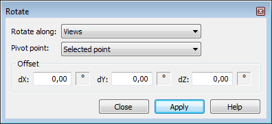

The rotation value is shown in the status bar.

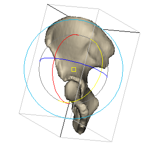 |  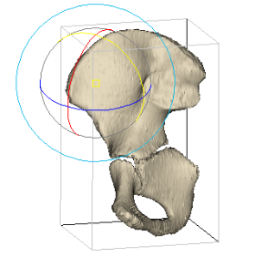  
---|---  
  
To rotate in discrete steps, enter an angle in the offset axis field along which you want to rotate. By clicking Apply you will rotate by the given angle.

##### Move

When you select a Part and click on the Move button, translation arrows appear. To translate the Part grab a translation arrow and move the mouse. To translate the object parallel to the viewing plane, grab and move the middle of the tool. 

You can change the translate axes in the Move dialog. You can choose to translate the object parallel to the viewing axes, inertia or along a user defined axis.

The axis can be defined with selection of analytical points that already exist in the Project Management tab or with points that are created with the Measure and Analyze tool.

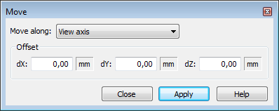

The translation value is shown in the status bar.

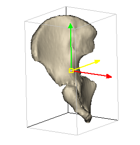 |    
---|---  
  
Translating in discrete steps is possible by entering a reposition measure in one of the offsets axes. By clicking on Apply you will translate the object by the selected offset.

---

#### Reslice Objects

> *File not found: Mimics Reference Guide/Reslice Objects.htm#_Toc319338631*

---

#### Polylines

> *File not found: Mimics Reference Guide/Polylines.htm#_Toc319338628*

---

#### Simulation Objects

> *File not found: Mimics Reference Guide/Simulation tab.htm#_Toc319338946*

---

#### FEA Mesh

> *File not found: Mimics Reference Guide/FEA Mesh tab.htm#_Toc319338890*

---

#### Contrast

> *File not found: Mimics Reference Guide/Contrast.htm#_Toc319338633*

---

#### Volume Rendering

> *File not found: Mimics Reference Guide/Volume rendering1.htm#_Toc319338634*

---

#### Clipping

> *File not found: Mimics Reference Guide/Clipping1.htm#_Toc319338635*

---

#### Snap

# Snap

Snap allows placement of points in a particular position. The cursor will be attracted to the point that coincides with the active snapping options when navigating within the defined region of influence.

The Snapping options are accessible via the Project Management tabs.

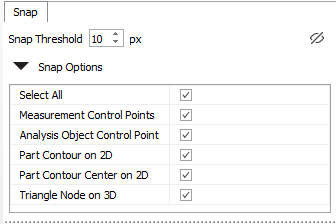

Snap Options | Activates the snapping behavior  
---|---  
Select All/Disable All | Enables or disables all options  
Measurements Control points | Enables snapping to the control points of measurements made in 2D images and on Part(s)  
Analysis Object Control Point | Enables snapping to the control points of analysis objects  
Part contour center on 2D | Enables snapping to a visible contour of a Part in the 2D images  
Part contour on 2D | Enables snapping to the geometric center of the visible contour of a Part in the 2D images  
Triangle node on 3D | Enables snapping to the triangle nodes of the Part  
Snap Threshold | Defines the radius of the region of influence for snapping behavior  
 Visualize snapping distance | Visualizes the region of influence for snapping on the 2D images and Part(s)

---

### Shortcut Keys

#### General Shortcuts

> *File not found: Mimics Reference Guide/General Shortcuts.htm#_Toc319338637*

---

#### Shortcuts on files

> *File not found: Mimics Reference Guide/Shortcuts on files.htm#_Toc319338638*

---

#### Shortcuts on the views

> *File not found: Mimics Reference Guide/Shortcuts on the views.htm#_Toc319338639*

---

#### Shortcuts on the 3D view

> *File not found: Mimics Reference Guide/Shortcuts on the 3D view.htm#_Toc319338640*

---

#### Shortcuts on the layouts

> *File not found: Mimics Reference Guide/Shortcuts on the layouts.htm#_Toc319338641*

---

#### Shortcuts on Segmentation functions

##### Region Growing

> *File not found: Mimics Reference Guide/Region Growing.htm#_Toc319338643*

---

##### Edit

> *File not found: Mimics Reference Guide/Edit.htm#_Toc319338644*

---

##### Shortcuts on text fields in dialogs

> *File not found: Mimics Reference Guide/Shortcuts on text fields in.htm#_Toc319338645*

---

##### Shortcuts on Movie Tool

> *File not found: Mimics Reference Guide/Shortcuts on Movie Tool.htm#_Toc319338646*

---

##### Shortcuts on Polylines

> *File not found: Mimics Reference Guide/Shortcuts on Polylines.htm#_Toc319338647*

---

### CT Gray Scale

> *File not found: Mimics Reference Guide/CT Gray scale.htm#_Toc319338648*

---

### DICOM patient coordinate update

## DICOM patient coordinate update  
  
When opening a project previously saved in MIS 15, in MIS 16 and following versions, a warning message is displayed.

You can choose to convert the project to the updated DICOM patient coordinate system, or not. The explanation on the differences can be found below.

### DICOM patient coordinate system

Mimics works in the DICOM patient coordinate system as described by NEMA in the DICOM 3.0. Required tags are:

**(0020,0032) image position (patient)** : The x, y, and z coordinates of the upper left

hand corner (center of the first voxel transmitted) of the image, in mm.

**(0020,0037) image orientation (patient)** : direction cosines of the first row and first column with respect to the patient.

The direction cosines for the orientation of the patient coordinate system determine the axis and orientation of the images. The first three values are the direction cosines of the row axis, the latter three values are the direction cosines of the columns. 

Image Orientation (Patient): 1 \ 0 \ 0 0 \ 1 \ 0

X \ Y \ Z X \ Y \ Z

Row Column

For this example the Row axis will be aligned with the X-axis of the WCS, the column axis will be aligned with Y-axis of the WCS.

The DICOM patient based coordinate system is a right handed coordinate system. The X-axis is increasing to the left hand side of the patient. The Y-axis is increasing to the posterior side and the Z-axis is increasing towards the head of the patient. 

### Mimics 14.x and Mimics 15.x Coordinate system

Mimics 14.x and Mimics 15.x applied the DICOM patient coordinate system according to the old image position (patient) definition.

**(0020,0032) image position (patient):** The x, y, and z coordinates of the upper left

hand corner (the center of the first pixel transmitted) of the image, in mm.

In the direction of the slice, the image position will indicate the start of the slice rather than the center of the slice. This gives rise to a shift of half a slice increment. 

### Loading 14.x and Mimics 15.x projects

On loading a Mimics 14.x or Mimics 15.x the option will be presented to update the DICOM patient coordinate system to the latest standard. 

Note: In some cases gantry tilted project cannot be converted. You can still work on this cases in the old coordinate system. 

### Mimics 11.11 until Mimics 13.x Coordinate system 

Mimics 13.1 works in the STL coordinate system, a right handed coordinate system. The X-axis and Y-axis are respectively aligned with the images rows and the image columns. Subsequently the Z-axis is always aligned in direction of the slices.

The X-axis and Y-axis are always positioned in the upper left hand corner of the image (in the upper left corner of the first pixel transmitted). The X and Y coordinate of the upper left hand voxel�s upper left corner is always 0. 

### Loading Mimics 11.11 to Mimics 13.x projects

On loading projects made in a Mimics version between Mimics 11.11 and 13.x, the option will be presented to update the STL coordinate system to the DICOM patient coordinate system.

Note: In some cases such as for projects with a gantry tilted, the project cannot be converted. In such case you will get a warning message, indicating the project will be in the STL coordinate system.

---

### Work with multiple image sets

### Work with multiple image sets

**Link an object to an image set**

A link is a physical connection between an object and an image set.

You can access the links in the Project Management tabs under the name Images.

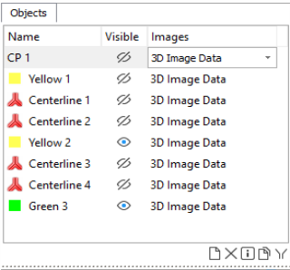

An object can be linked to an Image set. Objects can also stay without a link. To modify a link click on the dropdown list that appears under the column Images. You can select the desired image set from the full list of image sets loaded in the project. 

Objects can only be linked to image sets and not to other objects.

**Image sets and Mimics tools**

By default the Mimics tools work with the currently active image set. The Mimics tools that operate on image sets have effect only on the currently active image set. For example in case you want to reslice an image set, if you follow the procedure that is described in the Reslice menu, only the currently active image set will be resliced. To reslice more than one image sets you need to follow the process as many times as the number of the image sets that you target. 

_Note_ : To apply any operation that has effect on an image set, you need to make this image set active first. 

**Objects in Mimics tools**

As mentioned in the section above, a Mimics object can be linked to an image set or it can be not linked to any of the image sets. A lot of tools of Mimics have a dropdown list or a selection table where you can choose objects to apply the tool. By default, only the objects that are linked to the currently active image set and the objects that are not linked to any image set appear when you work with a tool. 

In case the tool creates new objects, they will be linked to the currently active image set if the object supports the link to an image set. For details see the sections of the different Mimics objects.

---

## Mimics Menus

### File

> *File not found: Mimics Reference Guide/File Menu.htm#_Toc319338650*

---

#### New Project

> *File not found: Mimics Reference Guide/New Project Wizard.htm#_Toc319338651*

---

##### Import

## Import 

The base module allows you to convert images from a variety of scanners to the Mimics file format. The images can be read from hard disk, floppy, CD, optical disk or tape. When the data is stored on an optical disk or tape you also need an optical drive that can read the optical disk or tape.

Importing images from hard disk, CD, MOD and tape is very easy using the Import images wizard. Importing DICOM, Tiff, Jpeg and Bitmap images from hard disk or CD doesn�t require a license, but license passwords are required for all other images that you want to import automatically. More details can be found on the import licenses page.

More details about the scanners and the devices supported by the Import module can be found in Overview scanner formats.

Links to the sites of the different drivers and some hardware specifications can be found in Hardware Specifications.

---

##### Supported images and modalities

###### DICOM

> *File not found: Mimics Reference Guide/DICOM1.htm#_Toc319338838*

---

###### BMP, TIFF, JPEG

> *File not found: Mimics Reference Guide/BMP TIFF JPEG.htm#_Toc319338839*

---

###### User-defined Import

> *File not found: Mimics Reference Guide/User defined Import.htm#_Toc319338840*

---

###### Supported Scanners and Modalities

> *File not found: Mimics Reference Guide/Supported Scanners.htm#_Toc319338841*

---

##### Selecting images to import

> *File not found: Mimics Reference Guide/Selecting images to import.htm#_Toc319338652*

---

##### Importing DICOM images

> *File not found: Mimics Reference Guide/Importing DICOM images.htm#_Toc319338653*

---

##### Reading 3D Ultrasound Data

# Reading 3D Ultrasound Data

The New Project Wizard provides the functionality of importing 3D Ultrasound images. The steps of importing the DICOMs are similar to the standard DICOM import as mentioned in the previous section. After you have chosen the file(s)/folder to be imported the following import dialog box will appear.

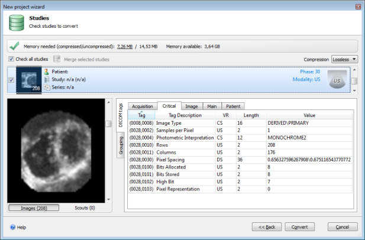

Press **'Convert'**.

If the pixels in the dataset are rectangular you will receive the following message.

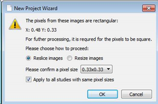

If you chose �Reslice images�, the anatomical proportions will be preserved, however the dimensions and greyvalues of the dataset will be recalculated and interpolated. It is recommended to use when the difference between the sides is rather big (e.g. 0.5x0.7).

If you chose �Resize images�, initial grey values will be preserved, however the dataset will be visually stretched and measurements will be influences. It can be picked if the deviation between width and height is very small (e.g. 3.9999999 and 4.0).

You can select the desired pixel size using the dropdown box. The action will be applied after you press 'OK'. If the checkbox �Apply to all studies with same pixel sizes� is checked, the settings will be repeated for all studies selected in the Import Wizard.

In case of square pixels, Mimics will directly come to the orientation window. Here you will have to define the orientation of the imported ultrasound images.

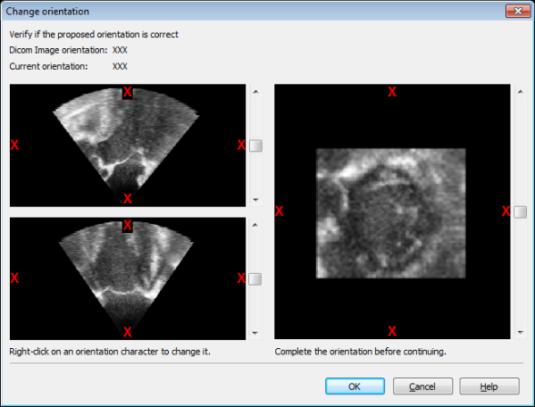

After you have defined the orientation of the images, you will have successfully imported 3D ultrasound images.

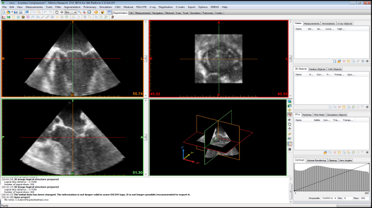

---

##### Reading VOL file format

# _Reading VOL File Format_

Mimics can now import .vol files. The .vol files have a different set of tags which are used during the import of the images. These tags are different from the DICOM tags and therefore are not stored in the project information.

The import of .vol files work in the same way as DICOM import.

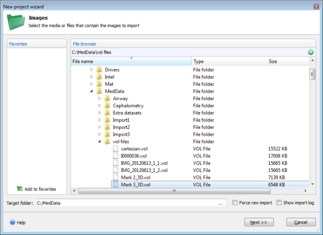

Select the file to be imported and press **Next**. You will see the following window with _Voluson_ tag displaying information of the file being imported.

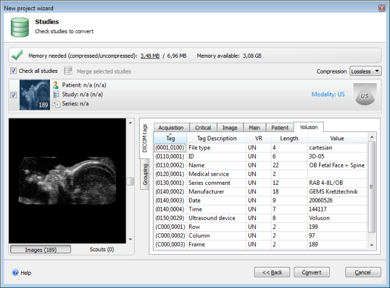

To import the images press **Convert**. The orientation will appear and you will be required to select the orientation for the imported file.

Select the appropriate orientation and press **OK**.

The files will be imported and a Mimics project will be created.

---

##### Reading Tiff, Bitmap and Jpeg images

> *File not found: Mimics Reference Guide/Reading Tiff Bitmap and Jpeg.htm#_Toc319338654*

---

##### Reading Raw images

> *File not found: Mimics Reference Guide/Reading Raw images.htm#_Toc319338655*

---

#### Open Project

> *File not found: Mimics Reference Guide/Open project.htm#_Toc319338657*

---

##### List of studies

> *File not found: Mimics Reference Guide/List of studies.htm#_Toc319338658*

---

##### Functions

> *File not found: Mimics Reference Guide/Functions.htm#_Toc319338659*

---

##### List of favorites

> *File not found: Mimics Reference Guide/List of favorites.htm#_Toc319338660*

---

##### Reduce Images

> *File not found: Mimics Reference Guide/Reduce Images.htm#_Toc319338661*

---

#### Add Images

### Add Images

To add images to the existing Mimics project, click on the Add Images  in the File menu. The new images will be appended in the existing project. For more info information about the type of the images supported, see the File -> [New Project](<New%20Project%20Wizard.md>) section.

---

#### Save Project

> *File not found: Mimics Reference Guide/Save project.htm#_Toc319338662*

---

#### Save Project As

> *File not found: Mimics Reference Guide/Save project As.htm#_Toc319338663*

---

#### Save Subproject As

### Save Subproject As

Allows you to create and save a subproject of the existing project.

Description of the main areas

Images |  Shows the images that exist in the Images tab in the Project management area. You can select from this list the images that will be included in the subproject.  
---|---  
Save as - Output directory |  When you click the  button a window appears. It will act like the Windows explorer. You can look at all the drives of your computer and their directory structure. Select the location where you want the text file to be placed. After your selection click Save on that dialog to confirm the selected location.  
Images to save |  After selecting the desired images and clicking the Add button, the will be placed in the queue. To remove images from the queue, select them and click the Remove button.  
  
Note: All Mimics objects that are linked to the selected images to save and all the objects that are not linked to any images will be included in the subproject.

---

#### Close

> *File not found: Mimics Reference Guide/Close project.htm#_Toc319338664*

---

#### Metadata

### Metadata

This window displays the metadata of the project. Metadata is a set of data that provides additional information for the project.

  

To create a new entry click on the button **Create** and add a name and a value. 

To delete an entry select it first and then click on the button **Delete**.

---

#### Anonymize

> *File not found: Mimics Reference Guide/Make project anonymous.htm#_Toc319338680*

---

#### Run Matlab Script

> *File not found: Mimics Reference Guide/Run Matlab script.htm#_Toc319338675*

---

##### Writing/ loading a Matlab script

> *File not found: Mimics Reference Guide/Writing loading a Matlab script.htm#_Toc319338677*

---

##### Import/export of objects between Mimics and Matlab scripts

> *File not found: Mimics Reference Guide/Import export of objects between.htm#_Toc319338678*

---

##### Example script

> *File not found: Mimics Reference Guide/Example script.htm#_Toc319338679*

---

##### Object Structures

# Object Structures

The Matlab interface works by allowing you to passing Mimics objects to your script. When a variable is defined in the input section and linked to the appropriate object, it is transferred to the Matlab environment using �%Mimics.Input: � command. Each object in Mimics is transferred as a structure to Matlab.

In Mimics, the following objects can be imported/exported using the Matlab interface.

Analysis objects: Point, line, circle, sphere, cylinder, plane, cylinder and spline.

Measurements: Distance 2D, Distance 3D (export only), Angle 2D, Angle 3D (Export only).

Analysis (export only).

The table below lists different fields in different objects.

Analysis Objects |   
---|---  
Point  |  An Analysis point object can be defined using the following Fields in Matlab:  Fields: {Type, Name, Points}  Type: string, always 'Mimics.Analysis.Point' Name: name of the Point as it is named in Mimics�  Points : array of [N X 3] float elements which holds the coordinates of points.  Since this object only requires one point, the first row will be taken as the coordinates of the points.  Script example: point = struct('Type', 'Mimics.Analysis.Point', 'Name', 'Point A', 'Points', [1 2 3]);   
Line  |  An Analysis line is defined in Mimics using two Points. The format to define an Analysisline object in Matlab is as follows:  Fields: {Type, Name, Points} Type : string, always 'Mimics.Analysis.Line' Name : string, name of the Line as it is named in Mimics� Points: array of [N X 3] floating elements which holds the coordinates of points. Since this object requires only two point, the first two rows will be taken as the coordinates of the two points. Script example: line = struct('Type', 'Mimics.Analysis.Line', 'Name', 'Line A', 'Points', [1 2 3; 4 5 6]);  
Circle  |  An Analysis Circle is defined in Mimics by defining a center point, the normal direction and the radius. The format to define an Analysis Circle object in Matlab is as follows. Fields: {Type, Name, Points, Normal, Radius} Type: string, always 'Mimics.Analysis.Circle' Name: string, name of the circle as it is named in Mimics� Points:array of [N X 3] float elements which holds the coordinates of point. Since this object only requires one point, the first row in this array will be taken as the coordinates of the circle�scenter. Radius: float � circle�s radius Script example: circle = struct('Type', 'Mimics.Analysis.Circle', 'Name', 'CircleA', �Points� , [1 2 3], 'Normal', [0 1 0], 'Radius', 5.5);  
Sphere  |  An Analysis Sphere is defined in Mimics by defining a center point and the radius. The format to define an Analysis Sphere object in Matlab is as follows.  Fields: {Type, Name, Points, Radius} Type: string, always 'Mimics.Analysis.Sphere' Name: string, name of the sphere as it is named in Mimics� Points: array of [N X 3] float elements which holds the coordinates of points. Since this object requires only one point, the first row in this array will be used as the coordinates of the sphere�scenter. Radius: float � sphere�s radius Script example: sphere = struct('Type', 'Mimics.Analysis.Sphere', 'Name', 'SphereA','Points, [2 3 4], 'Radius', 5.4);  
Plane |  An Analysis Plane is defined in Mimics by defining a center point, the normal direction and the dimensions (height & width) of the palne. The format to define an AnalysisPlane object in Matlab is as follows. Fields: {Type, Name, Points, Normal, Width, Height} Type: string, always 'Mimics.Analysis.Plane' Name: string, name of the plane as it is named in Mimics� Points: array of [N X 3] float elements which holds the coordinates of points. Since this object requires only one point, the first row in this array will be used as the coordinates of the plane�s center. Normal: array of 3 float elements � coordinates of the plane�s normal Width: width of the plane Height: height of the plane Script example: plane = struct('Type', 'Mimics.Analysis.Plane', 'Name', 'PlaneA',�Points�, [1 2 3], 'Normal', [4 5 6], 'Width', 5, 'Height', 101);  
Cylinder  |  An Analysis Cylinder is defined in Mimics by defining two points and the radius. The format to define an Analysis Cylinder object in Matlab is as follows.  Fields: {Type, Name, Points, Radius} Type: string, always 'Mimics.Analysis.Cylinder' Name: string, name of the cylinder as it is named in Mimics� Points: array of [N X 3] float elements which holds the coordinates of points. Since this object requires only two points, the first two rows in this array will be used. Radius: float, cylinder�s radius Script example: cylinder = struct('Type', 'Mimics.Analysis.Cylinder', 'Name', 'CylinderA','Point1', [1 2 3], 'Point2', [4 5 6], 'Radius', 3);  
Spline |  An Analysis Spline is defined in Mimics using several points. A spline may be open or closed. The format to define an Analysis Spline object in Matlab is as follows.  Fields: {Type, Name, Closed, Points} Type : string, always 'Mimics.Analysis.Spline' Name : string, name of the spline as it is named in Mimics� Closed : {0, 1} � 1 if spline is closed, 0 otherwise Points: array of [N X 3] float elements which holds the coordinates of points on which spline fitting will be performed. Script example: spline = struct('Type','Mimics.Analysis.Spline','Name', 'SplineA','Closed',1,'Points', [ [1 2 3]; [3 4 5]; [5 6 7]; [7 8 9] ]);  
Centerline  |  A Centerline is a collection of branch segments which are in turn made of Control Points. The centerline measurements are also exported to Matlab. Note: Import of Centerlines is not supported. Fields: {Type, Name, Branches} Type: string, always �Mimics.Analysis.Centerline� Name: string, name of the centerline as it is named in Mimics� Branches: structure Fields: {BranchSets, BranchSegments} Branches: cell array Example: BranchSet{2} = [1 5 6 4] BranchSegments: Structure Fields: {info, values} BranchSegments.info = cell array BranchSegments.info{1} = coordinates of points 1X3 or 2X3 or none BranchSegments.info{2} = [from branch segment; to branch segment] BranchSegments.values = cell array BranchSegments.values{1}= [Px, Py, Pz]: coordinates of control points BranchSegments.values{2}= [Tx, Ty, Tz]: tangent normals for control points BranchSegments.values{3}= [Dfit] BranchSegments.values{4}= [Dmin] BranchSegments.values{5}= [Dmax] BranchSegments.values{6}= [Curvature] BranchSegments.values{7}= [Dh] BranchSegments.values{8}= [Xh] BranchSegments.values{9}= [Scf] BranchSegments.values{10}= [Area] Script example: BranchSegments = struct(�info�, branchsegmentinfocellarray, �value�, branchsegmentvaluescellarray); Branch_struct = struct (�BranchSets�, branchsetcellarray, �BranchSegments�, Branchsegments_struct); Centerline = struct(�Type�, �Mimics.Analysis.Centerline�, �Name�, �Centerline1�, �Branches�, branch_struct);  
Measurements  |   
Distance  |  A linear distance measurement is defined in Mimics using two points. The format to define a linear distance measurement in Matlab is as follows. Fields: {Type, Name, Points } Type: string, always 'Mimics.Measurements.Distance' Name: string, name of the distance as it is named in Mimics� Points: array of [N X 3] floating elements which holds the coordinates of points. Since this object requires only two point, the first two rows will be taken as the coordinates of the two points. Script example: dist = struct('Type', 'Mimics.Measurements.Distance', 'Name', 'DistanceA', 'Points', [1 2 3; 4 5 6]);  
Angle  |  An angular measurement is defined in Mimics using three points. The format to define a linear distance measurement in Matlab is as follows. Fields: {Type, Name, Points } Type � string, always 'Mimics.Measurements.Angle' Name � string, name of the angle as it is named in Mimics� Points: array of [N X 3] floating elements which holds the coordinates of points. Since this object requires only three points, the first three rows will be taken as the coordinates of the three points. Script example: ang = struct('Type', 'Mimics.Measurements.Angle', 'Name', 'AngleA','Points', [1 2 3; 4 5 6; 8 59 0]);  
**Measure and Analyse** |   
Analysis  |  Fields: {Type, Name, Points, Planes, Measurements}  Type: string, always 'Mimics.Measurements.Analysis' Name: string, name of the analysis as it is named in Mimics� Points � map, key � string, name of the point, value � struct point, same as Analysis Point, but with the Type 'Mimics.Cephalometric.Points' Planes � map, key � string, name of the plane, value � struct plane, same as Analysis Plane, but with Type 'Mimics.Cephalometric.Plane' Measurements � map, key � string, name of the measurement, value � struct with fields {Type, Name, Value} Type � string, always 'Mimics.Cephalometric.Measurement' Name � string, name of the measurement as it is named in Mimics� Value � float � value of the measurement Script example: analys = struct ( 'Type', 'Mimics.Measurements.Analysis', 'Name', 'DownsNorthwestern', 'Points', containers.Map( {'A', 'B', 'GoL', 'GoR'}, {(struct ('Type', 'Mimics.MnA.Point', 'Name', 'A', 'Points', [0.00969049 -0.00503102 -0.0022] )), (struct ('Type', 'Mimics.MnA.Point', 'Name', 'B', 'Points', [0.00598869 -0.00800856 -0.0022] )), (struct ('Type', 'Mimics.MnA.Point', 'Name', 'GoL', 'Points', [0.00403496 -0.00506524 -0.0022] )), (struct ('Type', 'Mimics.MnA.Point', 'Name', 'GoR', 'Points', [0.00561165 -0.00756364 -0.0022] ))} ), 'Planes', containers.Map( {'DOP', 'FH', 'MP', 'Sagittal plane' }, { (struct ('Type', 'Mimics.MnA.Plane', 'Name', 'DOP', 'Points', [0 0 0], 'Normal', [0 0 0.0001], 'Width', 50, 'Height', 50)), (struct ('Type', 'Mimics.MnA.Plane', 'Name', 'FH', 'Points', [0 0 0], 'Normal', [0 0 0.0001], 'Width', 50, 'Height', 50)), (struct ('Type', 'Mimics.MnA.Plane', 'Name', 'MP', 'Points', [0 0 0], 'Normal', [0 0 0.0001], 'Width', 50, 'Height', 50)), (struct ('Type', 'Mimics.MnA.Plane', 'Name', 'Sagittal plane', 'Points', [0 0 0], 'Normal', [0.0001 0 0], 'Width', 55, 'Height', 128))}), 'Measurements', containers.Map( {'Angle of convexity' }, {(struct ('Type', 'Mimics.MnA.Measurement', 'Name', 'Angle of convexity', 'Value', 0.0813296))} ));  
Project information  |  Fields: {�PatientInformation�, �StudyInformation�, �Slices�, �ProjectFilePath' } PatientInformation = cell array containing values of {Name, ID, Age, and Sex}. The following is the sequence of information.  PatientInformation{1} = Anonymous; PatientInformation{2} = ID; PatientInformation{3} = Age; PatientInformation{5} = Sex StudyInformation = cell array containing values of {ID, Scanner, institute, Radiologist, Physician, Dentist, Clinician, Dental lab, Comments, Date}. The following is the sequence of information. StudyInformation{1} = ID StudyInformation{2} = Scannerinfo eg: [�scannername�, �100 KV�, �1.00 mAs�]; all are character variables, values to be exported with units StudyInformation{3} = Institute StudyInformation{4} = Radiologist StudyInformation{5} = Physician StudyInformation{6} = Dentist StudyInformation{7} = Clinician StudyInformation{8} = Dental lab StudyInformation{9} = Comments StudyInformation{10} = Date Slices = cell array containing values of {Width, Height, Pixelsize, Number of slices, Slice Increment, Slice thickness, Field of view, Gantry tilt, Algorithm, Reduction, Orientation}. All are character variables. The values should be exported with units. The following is the sequence of information. Slices{1} = height Slices{2} = Width Slices{3} = Pixel size Slices{4} = Number of slices Slices{5} = Slice increment Slices {6} = Slice Thickness Slices {7} = Field of view Slices {8} = Gantry tilt Slices {9} = Algorithm Slices {10} = Reduction Slices {11} = Orientation ProjectFilePath = character variable containing full path of the project file  
  
**Multiple objects selection**

It is also possible to create an array of Mimics inputs and export to Matlab. To do this just select the object groups instead of individual objects when assigning the Input. When using multiple inputs, your input variable in Matlab becomes a Cell Array of the individual Mimics objects. For example, if you have selected all the Analysis objects as shown below:

then the X,Y and Z coordinates of Point 1 can be assigned to a variable Point1_Coordinates by using the command:

Point1_Coordinates = input1{1}.Points;

Result:

Point1_Coordinates = [Xcoordinate Ycoordinate Zcoordinate]

---

#### Import

##### Project

> *File not found: Mimics Reference Guide/Import project.htm#_Toc319338667*

---

##### STL

> *File not found: Mimics Reference Guide/Import STL.htm#_Toc319338665*

---

##### STL Library

> *File not found: Mimics Reference Guide/STL Library.htm#_Toc319338666*

---

##### Mesh

#### Mesh

Allows to browse for a volumetric mesh that you would like to import into Mimics. First select the type of file you wish to import, and then browse to the correct location to select the corresponding file. When you have selected the right file and click on the Open button, the volumetric mesh will be loaded and listed in the FEA mesh tab. 

You can import Patran neutral, ANSYS and Abaqus volumetric meshes. For more information about which elements are supported please read the Supported Files section.

---

#### Export

> *File not found: Mimics Reference Guide/Export Menu.htm#_Toc319338796*

---

##### 3-matic

## Export to 3-matic

This menu provides a direct link to 3-matic. When any of these options are pressed, it will open a dialog that lets you select your 3D objects on which you would like to perform engineering changes in 3-matic. Once you select **OK** , 3-matic will start with your Parts loaded in it. 

For more information on how to use these different options, consult the 3-matic Reference Guide. 

---

##### DICOM

> *File not found: Mimics Reference Guide/DICOM.htm#_Toc319338797*

---

##### BMP/JPEG

> *File not found: Mimics Reference Guide/BMP JPEG.htm#_Toc319338799*

---

##### 2D Mask Area

> *File not found: Mimics Reference Guide/2D Mask Area.htm#_Toc319338800*

---

##### Exporting Iges files

> *File not found: Mimics Reference Guide/Exporting Iges files.htm#_Toc319338867*

---

###### Starting from the Export menu

> *File not found: Mimics Reference Guide/Starting from the Export menu.htm#_Toc319338868*

---

###### Starting from the Polylines tab page

> *File not found: Mimics Reference Guide/Starting from the Polylines.htm#_Toc319338869*

---

###### Starting from the Analysis Objects tab page

> *File not found: Mimics Reference Guide/Starting from the Analysis Objects.htm#_Toc319338870*

---

###### Starting from Analyze menu

> *File not found: Mimics Reference Guide/Starting from Analyze menu.htm#_Toc319338871*

---

###### Export all object to IGES

> *File not found: Mimics Reference Guide/Export all object to IGES.htm#_Toc319338887*

---

##### Exporting point cloud files

> *File not found: Mimics Reference Guide/Exporting point cloud files.htm#_Toc319338872*

---

###### Description of the main areas

> *File not found: Mimics Reference Guide/Description of the main areas.htm#_Toc319338873*

---

##### Grayvalues

> *File not found: Mimics Reference Guide/Grayvalues.htm#_Toc319338801*

---

##### Txt

> *File not found: Mimics Reference Guide/Txt.htm#_Toc319338802*

---

#### Print

> *File not found: Mimics Reference Guide/Print.htm#_Toc319338683*

---

##### Properties

> *File not found: Mimics Reference Guide/Properties.htm#_Toc319338684*

---

##### Navigation

> *File not found: Mimics Reference Guide/Navigation1.htm#_Toc319338685*

---

##### Print Pages

> *File not found: Mimics Reference Guide/Print Pages.htm#_Toc319338686*

---

##### Functions

> *File not found: Mimics Reference Guide/Functions1.htm#_Toc319338687*

---

##### Advanced Printing

> *File not found: Mimics Reference Guide/Advanced Printing.htm#_Toc319338688*

---

#### Save/Print Screenshot

> *File not found: Mimics Reference Guide/Save print screenshot.htm#_Toc319338682*

---

#### Capture Movie

> *File not found: Mimics Reference Guide/Capture Movie.htm#_Toc319338803*

---

#### Preferences

> *File not found: Mimics Reference Guide/Preferences.htm#_Toc319338807*

---

##### General preferences

> *File not found: Mimics Reference Guide/General preferences.htm#_Toc319338808*

---

##### Log

#### Log

You can hide the log panel or clear the folder with the stored files by changing the general preference settings.

---

##### Scripting

### Scripting

**General**

|  Set the path to the Python interpreter. Furthermore select if the namespace will be cleaned on run  
---|---  
  
**Editor**

|  Set the font size of the Editor  
---|---  
  
**Scripting Library**

|  Select the path to the scripting library. File that exist to that path will appear under the menu Scripting library  
---|---  
  
For more details about the scripting settings, see the Scripting Guide under the Help menu.

---

##### Visualization preferences

> *File not found: Mimics Reference Guide/Visualization preferences.htm#_Toc319338809*

---

##### 3D Settings

> *File not found: Mimics Reference Guide/3D Settings.htm#_Toc319338810*

---

##### Masks preferences

> *File not found: Mimics Reference Guide/Masks preferences.htm#_Toc319338811*

---

##### Predefined Thresholds

> *File not found: Mimics Reference Guide/Predefined Thresholds.htm#_Toc319338812*

---

##### STL Types

> *File not found: Mimics Reference Guide/STL Types.htm#_Toc319338813*

---

##### Import

> *File not found: Mimics Reference Guide/Import.htm#_Toc319338814*

---

##### Thin Structure

> *File not found: Mimics Reference Guide/Nerve.htm#_Toc319338815*

---

##### Annotation

> *File not found: Mimics Reference Guide/Annotation1.htm#_Toc319338816*

---

##### Printing preferences

> *File not found: Mimics Reference Guide/Printing preferences.htm#_Toc319338817*

---

##### Reslicing preferences

> *File not found: Mimics Reference Guide/Reslicing preferences.htm#_Toc319338818*

---

##### View Type

> *File not found: Mimics Reference Guide/View Type.htm#_Toc319338820*

---

### View

> *File not found: Mimics Reference Guide/View Menu.htm#_Toc319338697*

---

#### Pan view

> *File not found: Mimics Reference Guide/Pan view1.htm#_Toc319338708*

---

#### Zoom

> *File not found: Mimics Reference Guide/Zoom1.htm#_Toc319338710*

---

#### Unzoom

> *File not found: Mimics Reference Guide/Unzoom1.htm#_Toc319338711*

---

#### Zoom to Full Screen

> *File not found: Mimics Reference Guide/Zoom to full screen1.htm#_Toc319338712*

---

#### Image Data Visualization

##### Interpolated Images

> *File not found: Mimics Reference Guide/Interpolated images.htm#_Toc319338706*

---

##### Pseudo Colors

> *File not found: Mimics Reference Guide/Pseudo Colors.htm#_Toc319338715*

---

###### Gray

> *File not found: Mimics Reference Guide/Gray.htm#_Toc319338716*

---

###### Full Spectrum

> *File not found: Mimics Reference Guide/Full Spectrum.htm#_Toc319338717*

---

###### Sawtooth

> *File not found: Mimics Reference Guide/Sawtooth.htm#_Toc319338718*

---

###### Triangle

> *File not found: Mimics Reference Guide/Triangle.htm#_Toc319338719*

---

#### Reslice

### Reslice

Under Reslice option, there are different methods to reslice the project along a specified curve or plane without losing the original project (in contrast to Reslice Project). Select **View > Reslice** from the menu or go to Project Management, Reslice Objects tab and click on the button called New. There are several options:

**Along Plane**  |  **Along Curve**   
---|---  
  
**Note** : The reslice along a curve, create or select curve, is only available with the Analysis module.

It is also possible to select the reslice options in the Analysis objects tab action list. When selecting one or more (Analysis or Normal) planes, you can choose to create reslice planes. When selecting a centerline or a spline, you can choose to create a Curved Planar Reconstruction (CPR).

---

##### Along Plane

#### Along Plane

The reslice along plane function allows you to reslice the stack of images along a specified plane. As a result, three orthogonal views are obtained with one view parallel to the chosen plane. 

It is possible to:

  * Create plane: by selecting this option the cursor will change to a pencil. Indicating three points on the 2D images or on the Parts will define the plane.
  * Select Plane: Select an already created plane (an Analysis plane or a Normal plane): a window is shown in which all possible planes are listed.
  * Interactive MPR: Interactively reslice the stack of images: after choosing this option, a reslice plane parallel to the current axial view will be created. The crosshair in the Interactive MPR mode will be thicker than the normal crosshair. Rotate the reslice plane by grabbing the crosshair using the left mouse button. For repositioning the reslice plane go to the intersection of the crosshair, grab and move the center of the crosshair using left mouse button. This is possible in all 2D images.

In all cases, the reslice plane (RP) is added to the Reslice Objects tab. When the interactive reslice option is chosen, the last position is saved as reslice plane (RP) in the Reslice Objects tab.

##### Reslice Objects tab 

Several functions on the objects can be accessed via the Reslice Objects tab in Project Management area.

New |  Creates a new Reslice Object. The different options appear :   Click on the desired option.  
---|---  
Delete |  Deletes the selected objects.  
Properties |  Displays the properties of the selected object.  
Duplicate |  Duplicates the selected object  
Actions |  The action button lists all the available actions on the Reslice objects.   
  
##### Properties

Label | Change the name of the reslice plane  
---|---  
Modify

>  Rotate  Resize

|  Change the orientation and size of the reslice plane. Change the orientation of reslice plane by moving the rotation handles to the desired position or by manually entering the values in the dialog box. Change the size of the reslice plane by entering the values in the dialog box or by grabbing the mouse cursor  and moving to the desired location.  
Reslice step | Defines the distance by which the reslice plane will move through the image cube.  
Help | Opens the respective help chapter from the help file.  
  
Note: When creating a reslice plan by indicating 3 points, these points should not be placed on a straight line.

---

##### Along Curve

#### Along Curve

The reslice along curve function allows you to perform a CPR (curved planar reconstruction). As a result, the cross-section view perpendicular to the curve, and the straightened view are given, together with the Part.

By scrolling, the straightened view can be rotated around its axis (i.e. the curve), which is visualized by the yellow line in the cross-sectional view. In this cross-sectional view, you can scroll along the curve. This is visualized in the straightened view by the red line. Moreover, if the reference planes are toggled on in the 3D view, the cross-sectional view is shown as reference on the Part. 

It is possible to:

  * Select an already created curve: a window is shown in which all possible curves are listed

  * Select an already created spline or centerline from the dialog window which is shown.
  * Make sure that this curve�s visibility is toggled on. As a result, the control points of that curve will become visible.
  * Click the first point, and double click the second point. In the straightened view, the first clicked point will be on top.

  * Create a new curve: the cursor will change to a pencil . The points that define the curve can be indicated in all 2D views, or on the Part. While placing the points, you can use the interactive MPR. In this way, it is possible to reslice the stack of images as to obtain the desired views for correct placing of the spline points.
  * Panoramic: the axial view is zoomed to full screen, and the cursor will change to a pencil . The points that define the curve can be indicated in the axial view. The last point is indicated by a double click. The Reslice Curves toolbox will appear on the screen with the second button already selected (see below).  
The amount of cross-sectional grids can be changed via **Edit > Preferences,** and choosing the Reslicing section.

Note 1: STLs are only visible in the parallel images when a straight reslice curve is drawn.

Note 2: When you left-click once when zooming on a cross-sectional image, that image gets enlarged. By clicking with the unzoom tool on the enlarged cross-sectional image, you will see the original view again.

. 

For the first two options (select and create curve), the CPR is added to the Reslice Objects tab as CPR curve. For the last option (Panoramic), the CPR is added to the Reslice Objects tab as Reslice Curve (RC).

##### Reslice Objects tab

Several functions on the objects can be accessed via the Reslice Objects tab in Project Management area.

New |  Creates a new reslice object. The different options appear:  Click on the desired option  
---|---  
Delete |  Deletes the selected object  
Properties |  Displays the properties of the selected object  
Duplicate |  Duplicates the selected object  
Actions |  The action button lists all the available actions on the Reslice objects.   
  
##### Properties dialog for CPR curves (Select and Create Curve option)

Name |  Change the name of the CPR.  
---|---  
Rotation angle step |  Change the rotation angle step of the rotation of the straightened view around the axis (i.e. the curve) between the limits provided.  
Pixel size |  Change the pixel size of the resliced views (default size is the project's pixel size).  
Frame size |  Change the frame size of the straightened view (the width). The cross-sectional view size will change accordingly.   
Help | Opens the respective help chapter from the help file.  
  
##### Reslice Curves Properties

The Reslice Curves toolbox can be accessed via the Reslice Objects tab in the Project Management. Select the reslice object and click on the Properties button. 

Name | Change the name of the reslice curve  
---|---  
Modify

>  Add Point  Remove Point

|  Add or remove points on the reslice curve. Click on the Add point button to add a point in the middle of the selected line. When you hover the mouse above the reslice curve, the cursor will change into a pencil. Click with the left mouse button to add a point. In order to exclude a point from the reslice curve click on the point of the reslice curve you want to delete. The selected point will be colored green. Click then on the Remove point button.  
Cross-section Length | The cross-section length determines the width of the cross-section images. This length is set to optimal by default, but can you can modify it by selecting the Custom option and indicating the desired cross-section length in the edit field.  
  
##### X-Ray image (Panoramic option)

A yellow border surrounds the X-ray image or parallel view. Its thickness can be set in the Reslicing section of the Preference Settings (**Edit > Preferences > Reslicing**) from the menu bar. 

To display the x-ray view, click on this button , next to the parallel view. To return to the parallel view, click on this button: .

---

##### Interactive MPR

# Interactive MPR

The Interactive MPR option allows reslicing the stack of images interactively, by selecting this option, a reslice plane parallel to the current axial view will be created.

When using the Interactive MPR mode the crosshair will be thicker than the normal crosshair.

Normal View  |  MPR View   
---|---  
  
Rotate the reslice plane by grabbing the crosshair using the left mouse button. For repositioning the reslice plane go to the intersection of the crosshair, grab and move the center of the crosshair using the left mouse button. This is possible in all 2D images.

An orientation marker  is present at the top right corner which provides information on the orientation of the resliced images.

After starting the Interactive MPR option a new reslice plane (RP) is created under the Reslice Objects tab in the Project Management area. The last change made in the reslice plane is saved and shown when the reslice plane is activated. To return back to the normal view layout toggle off the visibility glasses or press F2 key.

---

#### Fluoroscopy

# Fluoroscopy

The Fluoroscopy tool is geared towards the planning of cardiovascular procedures e.g. Transcatheter Aortic Valve Implantation (TAVI), Transcatheter Mitral Valve Replacement (TMVR), etc. It is possible to visualize the region of interest in different view angles that are used in the clinical settings, LAO/RAO and CRAN/CAUD. The Fluoroscopy tool is part of the Base module and is accessible via the **View** menu and Reslice Objects tab in Project Management area. The Fluoroscopy view can be created either using the default view or based on an existing plane.

 | Create fluoroscopy view based on the default plane i.e. AP (frontal) plane  
---|---  
 | Create fluoroscopy view based on an existing plane

---

##### Layout

# Fluoroscopy Layout  
  
**Image and 3D viewport**

The fluoroscopy layout consists of the images and the 3D viewport with overlaying control buttons. The left half of the screen consists of the three standard image views, namely Coronal (Top), Axial (Bottom Left), and Sagittal (Bottom Right). The right half is the 3D viewport with control panel.

All the views consist of an orientation markerlocated in the top right corner. This marker updates accordingly to the specified view angles. The respective angle positions are shown on the 3D viewport (bottom right).

**Note:** : The currently active images are always shown in the views. You can modify the active images while the fluoroscopy tool is open.

The data is resliced to the specific view angle as entered by the user. It is possible to manipulate the angles in the following ways:

  * Using the sliders on the 3D viewport
  * Using the crosshair on the images
  * Manually entering the values in the boxes beside sliders

The angles are updated as soon as one of the methods is used for manipulation, the images and the 3D view are updated accordingly for the specified angle.

The 3D viewport also has an option to reset the view back to the AP plane  i.e. RAO/LAO 0� and CRAN/CAUD 0�.

**Control Panel**

Active view | Shows the list of all the fluoroscopy views that have been created. This list is also displayed in the Project Management tab under the Reslice Objects.  
---|---  
AP0 Plane | Defining the anteroposterior (AP) plane allows correcting for differences between the AP position of the CT scan, and the AP position of the fluoroscope. By default, this AP plane is defined normal to the AP position of the image data.  
Visualization | The visualization mode comprises of two modes: 3D View and fluoroscopy Simulation. The 3D view mode displays the 3D model(s) will be displayed. Simulation mode is used for fluoroscopy simulation.  
View alignment |  Free - The Part will not be linked with the rotation of the reslice planes. Reslice Plane - The view will be aligned to the resliced coronal view. As a result, the Part will rotate when manipulating the sliders.  
List of view angles | The list shows all the saved view angles. When a particular view angle is selected from the list, the images are aligned to the respective view angle.  
  
 | Show/hide sliders on the viewport.  
---|---  
 | Show/hide the crop box.  
 |  The settings for fluoroscopy simulation contain the following options.

  * Name - Name of the fluoroscopy view
  * Distance source to detector - Distance between the X-ray source and the detector
  * Distance source to patient - Distance between the X-ray source and the patient
  * Attenuation coefficient - Attenuation coefficient of the X-ray beams used for simulating the fluoroscopy view
  * Normalize contrast - Artificial normalization of the grayscale to improve the quality of the simulated image in case when too light or dark

  
 | Save view angles.  
 | Export view angles.  
 | Delete view angles.  
  
**Hint** : The layouts can be changed using the shortcut keys when using Fluoroscopy tool, e.g. press F2 key to switch to image layout.

---

##### S-Curve

# S-curve

The S-curve or the optimal projection curve is an important parameter which is required in the planning of cardiovascular procedures like Transcatheter Aortic Valve Implantation (TAVI) or Transcatheter Mitral Valve Replacement (TMVR). It is needed to achieve accurate device positioning during the interventions. The S-curve represents all the possible angles where the native valve plane can be seen edge on (=visible as a line).

In practice, the curve is made by plotting the values of the Cranial & Caudal angles for step changes in the LAO & RAO angles. The left and right oblique angles are changed at a fixed interval and the respective cranial and caudal angles are noted.

The S-curve can be calculated automatically for a defined plane. The range of the S-curve can be set manually and the S-curve will be generated for the defined range of angles.

**S-curve Plane**

The S-curve Plane shows a list of Analysis, simulation, mirror and reslice planes which can be used as input for creating the S-curve.

Note: If the analysis and/or simulation module have not been activated, it will not be possible to use analysis, simulation or mirror planes for the generation of the S-curve. It is however possible to use the reslice plane as an input for the S-curve.

**S-curve Viewport**

The S-curve is displayed in the graph viewport (right). Here, you can define the range and step increments of the S-curve based on your preference.

The display area shows the S-curve in red with LAO/RAO values on the horizontal axis and CRAN/CAUD values on the vertical axis. The images and the 3D viewport are automatically updated when a control point on the S-curve is selected on the graph viewport. The control points of the S-curve can also be sequentially browsed by using the   buttons at the bottom of the graph viewport.

RAO-LAO Rotation Range |  Defines the range of the S-curve.  
---|---  
Step increment | Defines the interval between two points representing the RAO/LAO angles in the S-curve.

---

##### Simulation

# Fluoroscopy Simulation  
  
The Fluoroscopy simulation tool generates simulated fluoroscopic images from the image data based on the view angle position. In practice, the fluoroscopic images are obtained with the help of a C-arm.

**Fluoroscopy simulation viewport**

In the fluoroscopy simulation viewport the 3D view is replaced by the simulation view which displays the simulated fluoroscopy image along with the projected 3D models, if any. There are two modes available for selecting the resolution of the simulated image. The default setting is on Low resolution.

  * Low (resolution 250 x 250)
  * Hi (resolution 600 x 600)

The control panel in the fluoroscopy simulation mode shows a list of the 3D objects that can be simulated. Only the objects that are linked to the active images or objects that are not linked to any images are shown in this list. These 3D models can be used for simulating the segmented anatomy.

To simulate the model, tick the check box in front of the desired 3D model(s). The image will be updated with the selected model(s). The contrast of the projected 3D model can be changed by manually entering the values in the **Contrast** column of the list.

 | Saves the active simulated fluoroscopic image in a .png file format to the defined location. This button is present on the right side of the simulation viewport.  
---|---

---

#### 2D Viewports

##### Indicators

### Indicators in the views  
  
On the different views you can see intersection lines, tick marks, slice positions and orientation strings. To hide the intersection lines, tick marks or slice positions, select its entry in View > 2D Viewports > Indicators. Select again its entry to show it again. If you never want to see one or more indicators when loading a project, select Preferences from the Edit menu and go to the Visualization tab. In this dialog you can make your selection of these indicators.

---

###### Tick Marks

#### Tick Marks

The set of red tick marks to the left of the sagittal and coronal images reference the position of each axial image in the study. The set of green tick marks below the axial images reference the position of each sagittal image in the study. The set of orange tick marks to the left of the axial images reference the position of each coronal image in the study.

 |    
---|---  
Tick marks on |  Tick marks off  
  
In the View menu, the preference setting for tick marks can be temporarily overruled. If you prefer another setting permanently, go to Edit > Preferences > Visualization.

---

###### Intersection Lines

#### Intersection Lines

In the View menu, the preference setting for intersection lines can be temporarily overruled. If you prefer another setting permanently, go to Edit > Preferences > Visualization. The relation between the different views is indicated by the colors of the intersection lines (dashed or full colored lines over the view). When you move to a new position, the intersection lines will be updated and show you your current position in the data set. They are in the matching color of the corresponding view. Notice the red horizontal line across the sagittal and coronal images. It references the exact location of the axial image.

When you move to a new position, the intersection lines will be updated and show you your current position in the data set. 

After performing a reslice, you will see 3 blue dashed or full lines and a yellow dashed or full line in the axial image. The middle blue line references the exact location of the cross-sectional image (surrounded by a blue border). The most left blue line reference the exact location of the cross-sectional image at the left top corner of the cross-sectional grid. The most right blue line reference the exact location of the cross-sectional image at the right bottom corner of the cross-sectional grid. The yellow line reference the exact location of the parallel image that is displayed.

Color Table

Axial |  Red  
---|---  
Cross-section |  Blue (only visible if the project is resliced in Reslice Layout)  
Parallel |  Yellow (only visible if the project is resliced in Reslice Layout)  
Sagittal |  Green  
Coronal |  Orange  
  
Note: You can choose between dashed or full lines in the Visualization tab of the Preferences window. 

---

###### Slice Position

#### Slice Position

In the view that contains the scanner images, the slice position is indicated in the lower left corner and the image number is indicated in the lower right corner. In the other views, the slice position is indicated in the lower right corner.

Image |  Numbering  
---|---  
Axial |  Increasing from bottom to top  
Sagittal |  Increasing from the right to the left side of the patient  
Coronal |  Increasing from posterior to anterior

---

###### Orientation strings

#### Orientation strings  
  
The colored letters located on each view shows the orientation of the images.

P : Posterior

A : Anterior

L : Left

R : Right

T : Top

B : Bottom

Looking at the images you can verify if they are correct, if not you can easily change them in the Change Orientation window going to Image > Change Orientation.

---

##### Masks Shade

> *File not found: Mimics Reference Guide/Masks Shade.htm#_Toc319338720*

---

##### Toggle Gray Scale

> *File not found: Mimics Reference Guide/Toggle gray scale.htm#_Toc319338714*

---

##### Interpolated Images

# Interpolated Images

Toggle between an interpolated view of the reslices in ZX and YZ direction. Note that mask objects will remain the same upon interpolating.

| [Introduction](<Mimics%20Reference%20Guide/Introduction_MedRes.md>) |   
---|---|---  
| [End-User Software License Agreement ](<Mimics%20Reference%20Guide/FRP/EULA_2018_Mimics21.md>) |   
---|---|---  
| [Instructions for Use](<Mimics%20Reference%20Guide/Research/Instructions%20for%20Use_Research.md>) |   
---|---|---  
| [Labeling information and manufacturer details](<Mimics%20Reference%20Guide/Research/Regulatory%20Information_Research_19.0.md>) |   
---|---|---  
| [Medical vs. Research Edition](<Mimics%20Reference%20Guide/Medical%20vs.%20Research%20Edition.md>) |   
---|---|---  
| [Overview MIS Modules](<Mimics%20Reference%20Guide/Overview%20MIS%20Modules.md>) |   
---|---|---  
| [Base](<Mimics%20Reference%20Guide/Mimics.md>) |   
---|---|---  
| [Analysis](<Mimics%20Reference%20Guide/Analysis%20Module.md>) |   
---|---|---  
| [Simulation](<Mimics%20Reference%20Guide/Simulation%20Module.md>) |   
---|---|---  
| [Design](<Mimics%20Reference%20Guide/Design.md>) |   
---|---|---  
| [Anatomical Reverse Engineering](<Mimics%20Reference%20Guide/Anatomical%20reverse%20engineering%20module.md>) |   
---|---|---  
| [FEA/CFD](<Mimics%20Reference%20Guide/FEA%20CFD%20Module.md>) |   
---|---|---  
| [C&V Segmentation](<Mimics%20Reference%20Guide/C%20V.md>) |   
---|---|---  
| [X-ray](<Mimics%20Reference%20Guide/X-ray/X-ray%20Overview.md>) |   
---|---|---  
| [Pulmonary](<Mimics%20Reference%20Guide/Pulmonary.md>) |   
---|---|---  
| [Script](<Mimics%20Reference%20Guide/Scripting_in_mimics_modules.md>) |   
---|---|---  
| [Muscular](<Mimics%20Reference%20Guide/Muscular_in_mimics_modules.md>) |   
---|---|---  
| [Using Help](<Mimics%20Reference%20Guide/Using%20Help.md>) |   
---|---|---  
| [System Requirements](<Mimics%20Reference%20Guide/General%20System%20Requirements_research.md>) |   
---|---|---  
| [Third-Party Disclaimers](<Mimics%20Reference%20Guide/Third%20Party%20Disclaimer_ResMed.md>) |   
---|---|---  
| [Contact Info](<Mimics%20Reference%20Guide/Contact%20Info.md>) |   
---|---|---  
| [The Different Views](<Mimics%20Reference%20Guide/The%20Different%20Views.md>) |   
---|---|---  
| [Title Bar](<Mimics%20Reference%20Guide/Title%20Bar_Research.md>) |   
---|---|---  
| [Menu Bar](<Mimics%20Reference%20Guide/Menu%20Bar.md>) |   
---|---|---  
| [3D Toolbar](<Mimics%20Reference%20Guide/3D%20Toolbar.md>) |   
---|---|---  
| [Toggle transparency](<Mimics%20Reference%20Guide/Toggle%20transparency.md>) |   
---|---|---  
| [Clipping](<Mimics%20Reference%20Guide/Clipping.md>) |   
---|---|---  
| [Volume rendering](<Mimics%20Reference%20Guide/Volume%20rendering.md>) |   
---|---|---  
| [Mask 3D Visibility](<Mimics%20Reference%20Guide/Mask%203D%20Preview.md>) |   
---|---|---  
| [Show reference planes](<Mimics%20Reference%20Guide/Show%20reference%20planes.md>) |   
---|---|---  
| [Select 3D view](<Mimics%20Reference%20Guide/Select%203D%20view.md>) |   
---|---|---  
| [Rotate view](<Mimics%20Reference%20Guide/Rotate%20view1.md>) |   
---|---|---  
| [3D locator](<Mimics%20Reference%20Guide/3D%20locator.md>) |   
---|---|---  
| [Toggle visibility](<Mimics%20Reference%20Guide/Toggle%20visibility.md>) |   
---|---|---  
| [Show/Hide World Coordinate System](<Mimics%20Reference%20Guide/Show%20Hide%20World%20Coordinate.md>) |   
---|---|---  
| [Invert Background](<Mimics%20Reference%20Guide/Invert%20Background.md>) |   
---|---|---  
| [Indicators in the views](<Mimics%20Reference%20Guide/Indicators%20in%20the%20views.md>) |   
---|---|---  
| [Tick Marks](<Mimics%20Reference%20Guide/Tick%20Marks.md>) |   
---|---|---  
| [Intersection Lines](<Mimics%20Reference%20Guide/Intersection%20Lines.md>) |   
---|---|---  
| [Slice Position](<Mimics%20Reference%20Guide/Slice%20Position.md>) |   
---|---|---  
| [Orientation strings](<Mimics%20Reference%20Guide/Orientation%20strings.md>) |   
---|---|---  
| [Name of Images](<Mimics%20Reference%20Guide/name_of_images_indicator.md>) |   
---|---|---  
| [Active Images Indicator](<Mimics%20Reference%20Guide/active_images_indicator.md>) |   
---|---|---  
| [The Context Menu](<Mimics%20Reference%20Guide/The%20Context%20Menu.md>) |   
---|---|---  
| [1-Click Navigation](<Mimics%20Reference%20Guide/1%20Click%20Navigation.md>) |   
---|---|---  
| [Pan View](<Mimics%20Reference%20Guide/Pan%20view1.md>) |   
---|---|---  
| [Rotate View](<Mimics%20Reference%20Guide/Rotate%20view1.md>) |   
---|---|---  
| [Zoom](<Mimics%20Reference%20Guide/Zoom1.md>) |   
---|---|---  
| [Zoom to Fixed Factor](<Mimics%20Reference%20Guide/Zoom%20to%20fixed%20factor.md>) |   
---|---|---  
| [Zoom to Full Screen](<Mimics%20Reference%20Guide/Zoom%20to%20full%20screen1.md>) |   
---|---|---  
| [Unzoom](<Mimics%20Reference%20Guide/Unzoom1.md>) |   
---|---|---  
| [Project Management](<Mimics%20Reference%20Guide/Project%20Management.md>) |   
---|---|---  
| [Images](<Mimics%20Reference%20Guide/Images.md>) |   
---|---|---  
| [Masks](<Mimics%20Reference%20Guide/Masks.md>) |   
---|---|---  
| [Measurements](<Mimics%20Reference%20Guide/Measurements.md>) |   
---|---|---  
| [Annotation](<Mimics%20Reference%20Guide/Annotation.md>) |   
---|---|---  
| [X-ray Objects](<Mimics%20Reference%20Guide/X-ray/X-ray%20Tab.md>) |   
---|---|---  
| [Objects](<Mimics%20Reference%20Guide/Analysis%20Objects%20tab.md>) |   
---|---|---  
| [Reslice Objects](<Mimics%20Reference%20Guide/Reslice%20Objects.md>) |   
---|---|---  
| [Polylines](<Mimics%20Reference%20Guide/Polylines.md>) |   
---|---|---  
| [Simulation Objects](<Mimics%20Reference%20Guide/Simulation%20tab.md>) |   
---|---|---  
| [FEA Mesh](<Mimics%20Reference%20Guide/FEA%20Mesh%20tab.md>) |   
---|---|---  
| [Contrast](<Mimics%20Reference%20Guide/Contrast.md>) |   
---|---|---  
| [Volume Rendering](<Mimics%20Reference%20Guide/Volume%20rendering1.md>) |   
---|---|---  
| [Clipping](<Mimics%20Reference%20Guide/Clipping1.md>) |   
---|---|---  
| [Snap](<Mimics%20Reference%20Guide/Snapping.md>) |   
---|---|---  
| [General Shortcuts](<Mimics%20Reference%20Guide/General%20Shortcuts.md>) |   
---|---|---  
| [Shortcuts on files](<Mimics%20Reference%20Guide/Shortcuts%20on%20files.md>) |   
---|---|---  
| [Shortcuts on the views](<Mimics%20Reference%20Guide/Shortcuts%20on%20the%20views.md>) |   
---|---|---  
| [Shortcuts on the 3D view](<Mimics%20Reference%20Guide/Shortcuts%20on%20the%203D%20view.md>) |   
---|---|---  
| [Shortcuts on the layouts](<Mimics%20Reference%20Guide/Shortcuts%20on%20the%20layouts.md>) |   
---|---|---  
| [Region Growing](<Mimics%20Reference%20Guide/Region%20Growing.md>) |   
---|---|---  
| [Edit](<Mimics%20Reference%20Guide/Edit.md>) |   
---|---|---  
| [Shortcuts on text fields in dialogs](<Mimics%20Reference%20Guide/Shortcuts%20on%20text%20fields%20in.md>) |   
---|---|---  
| [Shortcuts on Movie Tool](<Mimics%20Reference%20Guide/Shortcuts%20on%20Movie%20Tool.md>) |   
---|---|---  
| [Shortcuts on Polylines](<Mimics%20Reference%20Guide/Shortcuts%20on%20Polylines.md>) |   
---|---|---  
| [CT Gray Scale](<Mimics%20Reference%20Guide/CT%20Gray%20scale.md>) |   
---|---|---  
| [DICOM patient coordinate update](<Mimics%20Reference%20Guide/Coordinate%20System.md>) |   
---|---|---  
| [Work with multiple image sets](<Mimics%20Reference%20Guide/Link_Objects_to_Images.md>) |   
---|---|---  
| [File](<Mimics%20Reference%20Guide/File%20Menu.md>) |   
---|---|---  
| [New Project](<Mimics%20Reference%20Guide/New%20Project%20Wizard.md>) |   
---|---|---  
| [Import](<Mimics%20Reference%20Guide/Import1.md>) |   
---|---|---  
| [DICOM](<Mimics%20Reference%20Guide/DICOM1.md>) |   
---|---|---  
| [BMP, TIFF, JPEG](<Mimics%20Reference%20Guide/BMP%20TIFF%20JPEG.md>) |   
---|---|---  
| [User-defined Import](<Mimics%20Reference%20Guide/User%20defined%20Import.md>) |   
---|---|---  
| [Supported Scanners and Modalities](<Mimics%20Reference%20Guide/Supported%20Scanners.md>) |   
---|---|---  
| [Selecting images to import](<Mimics%20Reference%20Guide/Selecting%20images%20to%20import.md>) |   
---|---|---  
| [Importing DICOM images](<Mimics%20Reference%20Guide/Importing%20DICOM%20images.md>) |   
---|---|---  
| [Reading 3D Ultrasound Data](<Mimics%20Reference%20Guide/Reading%203D%20Ultrasound%20Data.md>) |   
---|---|---  
| [Reading VOL file format](<Mimics%20Reference%20Guide/Reading%20VOL%20File%20Format.md>) |   
---|---|---  
| [Reading Tiff, Bitmap and Jpeg images](<Mimics%20Reference%20Guide/Reading%20Tiff%20Bitmap%20and%20Jpeg.md>) |   
---|---|---  
| [Reading Raw images](<Mimics%20Reference%20Guide/Reading%20Raw%20images.md>) |   
---|---|---  
| [Open Project](<Mimics%20Reference%20Guide/Open%20project.md>) |   
---|---|---  
| [List of studies](<Mimics%20Reference%20Guide/List%20of%20studies.md>) |   
---|---|---  
| [Functions](<Mimics%20Reference%20Guide/Functions.md>) |   
---|---|---  
| [List of favorites](<Mimics%20Reference%20Guide/List%20of%20favorites.md>) |   
---|---|---  
| [Reduce Images](<Mimics%20Reference%20Guide/Reduce%20Images.md>) |   
---|---|---  
| [Add Images](<Mimics%20Reference%20Guide/Add%20Images.md>) |   
---|---|---  
| [Save Project](<Mimics%20Reference%20Guide/Save%20project.md>) |   
---|---|---  
| [Save Project As](<Mimics%20Reference%20Guide/Save%20project%20As.md>) |   
---|---|---  
| [Save Subproject As](<Save%20Subproject%20As.md>) |   
---|---|---  
| [Close](<Mimics%20Reference%20Guide/Close%20project.md>) |   
---|---|---  
| [Metadata](<Mimics%20Reference%20Guide/Project%20Metadata.md>) |   
---|---|---  
| [Anonymize](<Mimics%20Reference%20Guide/Make%20project%20anonymous.md>) |   
---|---|---  
| [Run Matlab Script](<Mimics%20Reference%20Guide/Run%20Matlab%20script.md>) |   
---|---|---  
| [Writing/ loading a Matlab script](<Mimics%20Reference%20Guide/Writing%20loading%20a%20Matlab%20script.md>) |   
---|---|---  
| [Import/export of objects between Mimics and Matlab scripts](<Mimics%20Reference%20Guide/Import%20export%20of%20objects%20between.md>) |   
---|---|---  
| [Example script](<Mimics%20Reference%20Guide/Example%20script.md>) |   
---|---|---  
| [Object Structures](<Object%20Structures.md>) |   
---|---|---  
| [Project](<Mimics%20Reference%20Guide/Import%20project.md>) |   
---|---|---  
| [STL](<Mimics%20Reference%20Guide/Import%20STL.md>) |   
---|---|---  
| [STL Library](<Mimics%20Reference%20Guide/STL%20Library.md>) |   
---|---|---  
| [Mesh](<Mimics%20Reference%20Guide/Import2.md>) |   
---|---|---  
| [Export](<Mimics%20Reference%20Guide/Export%20Menu.md>) |   
---|---|---  
| [3-matic](<Mimics%20Reference%20Guide/3-matic.md>) |   
---|---|---  
| [DICOM](<Mimics%20Reference%20Guide/DICOM.md>) |   
---|---|---  
| [BMP/JPEG](<Mimics%20Reference%20Guide/BMP%20JPEG.md>) |   
---|---|---  
| [2D Mask Area](<Mimics%20Reference%20Guide/2D%20Mask%20Area.md>) |   
---|---|---  
| [Exporting Iges files](<Mimics%20Reference%20Guide/Exporting%20Iges%20files.md>) |   
---|---|---  
| [Starting from the Export menu](<Mimics%20Reference%20Guide/Starting%20from%20the%20Export%20menu.md>) |   
---|---|---  
| [Starting from the Polylines tab page](<Mimics%20Reference%20Guide/Starting%20from%20the%20Polylines.md>) |   
---|---|---  
| [Starting from the Analysis Objects tab page](<Mimics%20Reference%20Guide/Starting%20from%20the%20Analysis%20Objects.md>) |   
---|---|---  
| [Starting from Analyze menu](<Mimics%20Reference%20Guide/Starting%20from%20Analyze%20menu.md>) |   
---|---|---  
| [Export all object to IGES](<Mimics%20Reference%20Guide/Export%20all%20object%20to%20IGES.md>) |   
---|---|---  
| [Exporting point cloud files](<Mimics%20Reference%20Guide/Exporting%20point%20cloud%20files.md>) |   
---|---|---  
| [Description of the main areas](<Mimics%20Reference%20Guide/Description%20of%20the%20main%20areas.md>) |   
---|---|---  
| [Grayvalues](<Mimics%20Reference%20Guide/Grayvalues.md>) |   
---|---|---  
| [Txt](<Mimics%20Reference%20Guide/Txt.md>) |   
---|---|---  
| [Print](<Mimics%20Reference%20Guide/Print.md>) |   
---|---|---  
| [Properties](<Mimics%20Reference%20Guide/Properties.md>) |   
---|---|---  
| [Navigation](<Mimics%20Reference%20Guide/Navigation1.md>) |   
---|---|---  
| [Print Pages](<Mimics%20Reference%20Guide/Print%20Pages.md>) |   
---|---|---  
| [Functions](<Mimics%20Reference%20Guide/Functions1.md>) |   
---|---|---  
| [Advanced Printing](<Mimics%20Reference%20Guide/Advanced%20Printing.md>) |   
---|---|---  
| [Save/Print Screenshot](<Mimics%20Reference%20Guide/Save%20print%20screenshot.md>) |   
---|---|---  
| [Capture Movie](<Mimics%20Reference%20Guide/Capture%20Movie.md>) |   
---|---|---  
| [Preferences](<Mimics%20Reference%20Guide/Preferences.md>) |   
---|---|---  
| [General preferences](<Mimics%20Reference%20Guide/General%20preferences.md>) |   
---|---|---  
| [Log](<Mimics%20Reference%20Guide/Log.md>) |   
---|---|---  
| [Scripting](<Scripting_in_preferences.md>) |   
---|---|---  
| [Visualization preferences](<Mimics%20Reference%20Guide/Visualization%20preferences.md>) |   
---|---|---  
| [3D Settings](<Mimics%20Reference%20Guide/3D%20Settings.md>) |   
---|---|---  
| [Masks preferences](<Mimics%20Reference%20Guide/Masks%20preferences.md>) |   
---|---|---  
| [Predefined Thresholds](<Mimics%20Reference%20Guide/Predefined%20Thresholds.md>) |   
---|---|---  
| [STL Types](<Mimics%20Reference%20Guide/STL%20Types.md>) |   
---|---|---  
| [Import](<Mimics%20Reference%20Guide/Import.md>) |   
---|---|---  
| [Thin Structure](<Mimics%20Reference%20Guide/Nerve.md>) |   
---|---|---  
| [Annotation](<Mimics%20Reference%20Guide/Annotation1.md>) |   
---|---|---  
| [Printing preferences](<Mimics%20Reference%20Guide/Printing%20preferences.md>) |   
---|---|---  
| [Reslicing preferences](<Mimics%20Reference%20Guide/Reslicing%20preferences.md>) |   
---|---|---  
| [View Type](<Mimics%20Reference%20Guide/View%20Type.md>) |   
---|---|---  
| [View](<Mimics%20Reference%20Guide/View%20Menu.md>) |   
---|---|---  
| [Pan view](<Mimics%20Reference%20Guide/Pan%20view1.md>) |   
---|---|---  
| [Rotate view](<Mimics%20Reference%20Guide/Rotate%20view1.md>) |   
---|---|---  
| [Zoom](<Mimics%20Reference%20Guide/Zoom1.md>) |   
---|---|---  
| [Unzoom](<Mimics%20Reference%20Guide/Unzoom1.md>) |   
---|---|---  
| [Zoom to Full Screen](<Mimics%20Reference%20Guide/Zoom%20to%20full%20screen1.md>) |   
---|---|---  
| [Interpolated Images](<Mimics%20Reference%20Guide/Interpolated%20images.md>) |   
---|---|---  
| [Pseudo Colors](<Mimics%20Reference%20Guide/Pseudo%20Colors.md>) |   
---|---|---  
| [Gray](<Mimics%20Reference%20Guide/Gray.md>) |   
---|---|---  
| [Full Spectrum](<Mimics%20Reference%20Guide/Full%20Spectrum.md>) |   
---|---|---  
| [Sawtooth](<Mimics%20Reference%20Guide/Sawtooth.md>) |   
---|---|---  
| [Triangle](<Mimics%20Reference%20Guide/Triangle.md>) |   
---|---|---  
| [Reslice](<Mimics%20Reference%20Guide/Reslice.md>) |   
---|---|---  
| [Along Plane](<Mimics%20Reference%20Guide/Along%20Plane2.md>) |   
---|---|---  
| [Along Curve](<Mimics%20Reference%20Guide/Along%20Curve2.md>) |   
---|---|---  
| [Interactive MPR](<Mimics%20Reference%20Guide/Interactive%20MPR.md>) |   
---|---|---  
| [Fluoroscopy](<Mimics%20Reference%20Guide/Fluoroscopy.md>) |   
---|---|---  
| [Layout](<Mimics%20Reference%20Guide/Fluoroscopy%20Layout.md>) |   
---|---|---  
| [S-Curve](<Mimics%20Reference%20Guide/S-Curve.md>) |   
---|---|---  
| [Simulation](<Mimics%20Reference%20Guide/Fluoroscopy%20Simulation.md>) |   
---|---|---  
| [Indicators](<Mimics%20Reference%20Guide/Indicators%20in%20the%20views.md>) |   
---|---|---  
| [Tick Marks](<Mimics%20Reference%20Guide/Tick%20Marks.md>) |   
---|---|---  
| [Intersection Lines](<Mimics%20Reference%20Guide/Intersection%20Lines.md>) |   
---|---|---  
| [Slice Position](<Mimics%20Reference%20Guide/Slice%20Position.md>) |   
---|---|---  
| [Orientation strings](<Mimics%20Reference%20Guide/Orientation%20strings.md>) |   
---|---|---  
| [Masks Shade](<Mimics%20Reference%20Guide/Masks%20Shade.md>) |   
---|---|---  
| [Toggle Gray Scale](<Mimics%20Reference%20Guide/Toggle%20gray%20scale.md>) |   
---|---|---  
| [Pseudo Colors](<Pseudo%20Colors.md>) |   
---|---|---  
| [3D Background Color](<Mimics%20Reference%20Guide/3D%20Background%20color.md>) |   
---|---|---  
| [Toggle 3D Window](<Mimics%20Reference%20Guide/Toggle%203D%20Window.md>) |   
---|---|---  
| [Mask 3D Preview](<Mimics%20Reference%20Guide/Mask%203D%20Preview.md>) |   
---|---|---  
| [Project Management](<Mimics%20Reference%20Guide/Project%20Management%20tabs.md>) |   
---|---|---  
| [Status bar](<Mimics%20Reference%20Guide/Status%20bar.md>) |   
---|---|---  
| [Log Panel](<Mimics%20Reference%20Guide/Log%20Panel.md>) |   
---|---|---  
| [Volume Rendering](<Mimics%20Reference%20Guide/Volume%20rendering1.md>) |   
---|---|---  
| [Contrast](<Mimics%20Reference%20Guide/Contrast.md>) |   
---|---|---  
| [Layouts](<Mimics%20Reference%20Guide/Layouts.md>) |   
---|---|---  
| [Standard](<Mimics%20Reference%20Guide/Image%20layout.md>) |   
---|---|---  
| [Horizontal](<Horizontal.md>) |   
---|---|---  
| [Vertical](<Vertical.md>) |   
---|---|---  
| [2D by 3D](<2Dby3D_layout.md>) |   
---|---|---  
| [3D](<Mimics%20Reference%20Guide/3D%20layout.md>) |   
---|---|---  
| [Simulation](<Mimics%20Reference%20Guide/Simulation%20Layout.md>) |   
---|---|---  
| [X-ray](<Mimics%20Reference%20Guide/X-ray/X-ray%20Layout.md>) |   
---|---|---  
| [Fluoroscopy](<Mimics%20Reference%20Guide/Fluoroscopy%20Layout2.md>) |   
---|---|---  
| [Two 2D over Double 3D](<Two%202D%20over%20Double%203D.md>) |   
---|---|---  
| [2D by 2D](<2D%20by%202D.md>) |   
---|---|---  
| [Two Vertical Standard](<Mimics%20Reference%20Guide/Two%20Vertical%20Standard.md>) |   
---|---|---  
| [Three 2D by 3D](<Mimics%20Reference%20Guide/Three%202D%20by%203D.md>) |   
---|---|---  
| [Three 2D all views by 3D](<Mimics%20Reference%20Guide/Three%202D%20all%20views%20by%203D.md>) |   
---|---|---  
| [Overlay](<Mimics%20Reference%20Guide/Overlay.md>) |   
---|---|---  
| [Cineloop](<Mimics%20Reference%20Guide/Cineloop.md>) |   
---|---|---  
| [Image](<Mimics%20Reference%20Guide/Image%20Menu.md>) |   
---|---|---  
| [Apply Filter](<Mimics%20Reference%20Guide/Apply%20filter.md>) |   
---|---|---  
| [Binomial blur](<Mimics%20Reference%20Guide/Binomial%20blur.md>) |   
---|---|---  
| [Curvature flow](<Mimics%20Reference%20Guide/Curvature%20flow.md>) |   
---|---|---  
| [Discrete gaussian](<Mimics%20Reference%20Guide/Discrete%20Gaussian.md>) |   
---|---|---  
| [Gradient magnitude](<Mimics%20Reference%20Guide/Gradient%20magnitude.md>) |   
---|---|---  
| [Mean](<Mimics%20Reference%20Guide/Mean.md>) |   
---|---|---  
| [Median](<Mimics%20Reference%20Guide/Median.md>) |   
---|---|---  
| [Show filtered images](<Mimics%20Reference%20Guide/Show%20filtered%20images.md>) |   
---|---|---  
| [Change Orientation](<Mimics%20Reference%20Guide/Change%20orientation.md>) |   
---|---|---  
| [Organize Images](<Mimics%20Reference%20Guide/Organize%20images.md>) |   
---|---|---  
| [Crop Images](<Mimics%20Reference%20Guide/Crop%20Project.md>) |   
---|---|---  
| [Reslice Images](<Mimics%20Reference%20Guide/Reslice%20Project.md>) |   
---|---|---  
| [Image Registration](<Mimics%20Reference%20Guide/Image%20Registration.md>) |   
---|---|---  
| [Loading second dataset](<Mimics%20Reference%20Guide/Load%20in%20the%20second%20dataset.md>) |   
---|---|---  
| [Landmark Points](<Mimics%20Reference%20Guide/Landmark%20Points.md>) |   
---|---|---  
| [Fusion Method](<Mimics%20Reference%20Guide/Fusion%20Method.md>) |   
---|---|---  
| [Applying the registration](<Mimics%20Reference%20Guide/Applying%20the%20registration.md>) |   
---|---|---  
| [Alignment Image](<Mimics%20Reference%20Guide/Alignment%20image.md>) |   
---|---|---  
| [Segment](<Mimics%20Reference%20Guide/Segmentation%20Menu.md>) |   
---|---|---  
| [New Mask](<New%20Mask.md>) |   
---|---|---  
| [Profile Line](<Mimics%20Reference%20Guide/Profile%20line.md>) |   
---|---|---  
| [Figure](<Mimics%20Reference%20Guide/Figure.md>) |   
---|---|---  
| [List of profile lines](<Mimics%20Reference%20Guide/List%20of%20profile%20lines.md>) |   
---|---|---  
| [Functions on profile lines](<Mimics%20Reference%20Guide/Functions%20on%20profile%20lines.md>) |   
---|---|---  
| [Options](<Mimics%20Reference%20Guide/Options.md>) |   
---|---|---  
| [Measuring](<Mimics%20Reference%20Guide/Measuring.md>) |   
---|---|---  
| [Threshold](<Mimics%20Reference%20Guide/Thresholding.md>) |   
---|---|---  
| [With the thresholding toolbar](<Mimics%20Reference%20Guide/With%20the%20thresholding%20toolbar.md>) |   
---|---|---  
| [With a Profile Line](<Mimics%20Reference%20Guide/With%20a%20Profile%20Line.md>) |   
---|---|---  
| [Region Grow](<Mimics%20Reference%20Guide/Region%20Growing1.md>) |   
---|---|---  
| [Dynamic Region Grow](<Mimics%20Reference%20Guide/Dynamic%20Region%20Growing.md>) |   
---|---|---  
| [Crop Mask](<Mimics%20Reference%20Guide/Crop%20Mask.md>) |   
---|---|---  
| [Split Mask](<Mimics%20Reference%20Guide/Split%20Mask.md>) |   
---|---|---  
| [3D LiveWire](<Mimics%20Reference%20Guide/3D%20LiveWire.md>) |   
---|---|---  
| [The 3D LiveWire Interface](<Mimics%20Reference%20Guide/The%203D%20LiveWire%20Interface.md>) |   
---|---|---  
| [Edit Masks](<Mimics%20Reference%20Guide/Edit%20Masks.md>) |   
---|---|---  
| [Multiple Slice Edit](<Mimics%20Reference%20Guide/Multiple%20slice%20edit.md>) |   
---|---|---  
| [3D Interpolate](<3D%20Interpolate.md>) |   
---|---|---  
| [Morphology Operations](<Mimics%20Reference%20Guide/Morphology%20Operations.md>) |   
---|---|---  
| [Boolean Operations](<Mimics%20Reference%20Guide/Boolean%20Operations.md>) |   
---|---|---  
| [Cavity Fill](<Mimics%20Reference%20Guide/Cavity%20Fill.md>) |   
---|---|---  
| [Smart Fill](<Mimics%20Reference%20Guide/Smart_Fill.md>) |   
---|---|---  
| [Smart Expand](<Mimics%20Reference%20Guide/Smart%20Expand.md>) |   
---|---|---  
| [Smooth Mask](<Mimics%20Reference%20Guide/Smooth%20Mask.md>) |   
---|---|---  
| [Calculate Polylines](<Mimics%20Reference%20Guide/Calculate%20Polylines.md>) |   
---|---|---  
| [Update Polylines](<Mimics%20Reference%20Guide/Update%20Polylines.md>) |   
---|---|---  
| [Cavity Fill from Polylines](<Mimics%20Reference%20Guide/Cavity%20Fill%20from%20Polylines.md>) |   
---|---|---  
| [Calculate Polylines from Part](<Mimics%20Reference%20Guide/Calculate%20polylines%20from%203D.md>) |   
---|---|---  
| [Trace Thin Structure](<Mimics%20Reference%20Guide/Nerves%20toolbox.md>) |   
---|---|---  
| [Draw a spline](<Mimics%20Reference%20Guide/Draw%20a%20nerve.md>) |   
---|---|---  
| [Select a spline](<Mimics%20Reference%20Guide/Select%20a%20nerve.md>) |   
---|---|---  
| [Delete a spline](<Mimics%20Reference%20Guide/Delete%20a%20nerve.md>) |   
---|---|---  
| [Add a point to a spline](<Mimics%20Reference%20Guide/Add%20a%20point%20to%20a%20nerve.md>) |   
---|---|---  
| [Remove a point from a spline](<Mimics%20Reference%20Guide/Remove%20a%20point%20from%20a%20nerve.md>) |   
---|---|---  
| [Change spline properties](<Mimics%20Reference%20Guide/Show%20the%20list%20of%20nerves.md>) |   
---|---|---  
| [Calculate Part](<Mimics%20Reference%20Guide/Calculate%203D.md>) |   
---|---|---  
| [Listed masks](<Mimics%20Reference%20Guide/Listed%20masks.md>) |   
---|---|---  
| [Quality](<Mimics%20Reference%20Guide/Quality.md>) |   
---|---|---  
| [Calculate](<Mimics%20Reference%20Guide/Calculate.md>) |   
---|---|---  
| [Options](<Mimics%20Reference%20Guide/Options1.md>) |   
---|---|---  
| [Label](<Mimics%20Reference%20Guide/Label.md>) |   
---|---|---  
| [Calculate Mask from Object](<Mimics%20Reference%20Guide/Calculate%20mask%20from%203D.md>) |   
---|---|---  
| [Cardiovascular](<Mimics%20Reference%20Guide/Cardiovascular%20Menu.md>) |   
---|---|---  
| [Coronary](<Mimics%20Reference%20Guide/Coronary%20Segmentation.md>) |   
---|---|---  
| [CT Heart](<Mimics%20Reference%20Guide/CT%20Heart.md>) |   
---|---|---  
| [4D CT Heart](<Mimics%20Reference%20Guide/4D%20CT%20Heart.md>) |   
---|---|---  
| [4D CT Stent](<Mimics%20Reference%20Guide/4D%20CT%20Stent.md>) |   
---|---|---  
| [Pulmonary](<Mimics%20Reference%20Guide/Pulmonary%20Menu.md>) |   
---|---|---  
| [Starting Pulmonary](<Mimics%20Reference%20Guide/Pulmonary/Starting%20Pulmonary.md>) |   
---|---|---  
| [Segment Airway](<Mimics%20Reference%20Guide/Pulmonary/Segment%20Airway.md>) |   
---|---|---  
| [Threshold Region Growing](<Mimics%20Reference%20Guide/Pulmonary/Threshold%20Region%20Growing.md>) |   
---|---|---  
| [Dynamic Region Growing](<Mimics%20Reference%20Guide/Pulmonary/Dynamic%20Region%20Growing%20Pulmonary.md>) |   
---|---|---  
| [Label Centerline](<Mimics%20Reference%20Guide/Pulmonary/Label%20Centerline.md>) |   
---|---|---  
| [Analyze Airways](<Mimics%20Reference%20Guide/Pulmonary/Analyse%20Airways.md>) |   
---|---|---  
| [Cut Airways](<Mimics%20Reference%20Guide/Pulmonary/Cut%20Airways.md>) |   
---|---|---  
| [Segment Lung & Lobes](<Mimics Reference Guide/Pulmonary/Segment Lung & Lobes.md>) |   
---|---|---  
| [Segment Lungs](<Mimics%20Reference%20Guide/Pulmonary/Segment%20Lungs.md>) |   
---|---|---  
| [Segment Lung Lobes](<Mimics%20Reference%20Guide/Pulmonary/Segment%20Lung%20Lobes.md>) |   
---|---|---  
| [Cut Through Points](<Mimics%20Reference%20Guide/Pulmonary/Cut%20Through%20Points.md>) |   
---|---|---  
| [Muscular](<Muscular_menu.md>) |   
---|---|---  
| [Gradient Threshold](<GradientThreshold.md>) |   
---|---|---  
| [Muscle Segmentation](<Muscle%20Segmentation.md>) |   
---|---|---  
| [3D Tools](<Mimics%20Reference%20Guide/Tools%20Menu.md>) |   
---|---|---  
| [Edit Contours](<Mimics%20Reference%20Guide/Contour%20Editing.md>) |   
---|---|---  
| [Grab](<Mimics%20Reference%20Guide/Grab.md>) |   
---|---|---  
| [Magnet](<Mimics%20Reference%20Guide/Magnet.md>) |   
---|---|---  
| [Smooth](<Mimics%20Reference%20Guide/Smooth.md>) |   
---|---|---  
| [Smooth](<Mimics%20Reference%20Guide/Smoothing.md>) |   
---|---|---  
| [Reduce](<Mimics%20Reference%20Guide/Triangle%20Reduction.md>) |   
---|---|---  
| [Wrap](<Mimics%20Reference%20Guide/Wrap.md>) |   
---|---|---  
| [Hollow](<Mimics%20Reference%20Guide/Hollow.md>) |   
---|---|---  
| [Merge](<Mimics%20Reference%20Guide/Merge.md>) |   
---|---|---  
| [Split](<Mimics%20Reference%20Guide/Split\(3D%20tools\).md>) |   
---|---|---  
| [Mirror](<Mimics%20Reference%20Guide/Mirror.md>) |   
---|---|---  
| [Boolean](<Mimics%20Reference%20Guide/Boolean.md>) |   
---|---|---  
| [Rescale](<Mimics%20Reference%20Guide/Rescale.md>) |   
---|---|---  
| [Cut](<Mimics%20Reference%20Guide/Cut.md>) |   
---|---|---  
| [Analyze](<Mimics%20Reference%20Guide/Analyze%20Menu.md>) |   
---|---|---  
| [Point](<Mimics%20Reference%20Guide/Point.md>) |   
---|---|---  
| [Line](<Mimics%20Reference%20Guide/Line.md>) |   
---|---|---  
| [Circle](<Mimics%20Reference%20Guide/Circle.md>) |   
---|---|---  
| [Sphere](<Mimics%20Reference%20Guide/Sphere.md>) |   
---|---|---  
| [Cylinder](<Mimics%20Reference%20Guide/Cylinder.md>) |   
---|---|---  
| [Spline](<Mimics%20Reference%20Guide/Splines.md>) |   
---|---|---  
| [Plane](<Mimics%20Reference%20Guide/Plane.md>) |   
---|---|---  
| [Plane Normal to Curve](<Mimics%20Reference%20Guide/Plane%20Normal%20to%20Curve.md>) |   
---|---|---  
| [Create_Primitives](<Mimics%20Reference%20Guide/Create_Primitives.md>) |   
---|---|---  
| [Fit Centerline](<Mimics%20Reference%20Guide/Centerline.md>) |   
---|---|---  
| [Centerline properties](<Mimics%20Reference%20Guide/Centerline%20properties.md>) |   
---|---|---  
| [Export of centerline properties](<Mimics%20Reference%20Guide/Export%20of%20centerline%20properties.md>) |   
---|---|---  
| [Centerline actions](<Mimics%20Reference%20Guide/Centerline%20actions.md>) |   
---|---|---  
| [Cut centerline endings](<Mimics%20Reference%20Guide/Cut%20centerline%20endings.md>) |   
---|---|---  
| [Edit centerline control points](<Mimics%20Reference%20Guide/Edit%20centerline%20control%20points.md>) |   
---|---|---  
| [Centerline post-processing](<Mimics%20Reference%20Guide/Centerline%20post%20processing.md>) |   
---|---|---  
| [Split centerline](<Mimics%20Reference%20Guide/Split%20centerline.md>) |   
---|---|---  
| [Delete centerline part](<Mimics%20Reference%20Guide/Delete%20centerline%20part.md>) |   
---|---|---  
| [Add Branch to the Centerline](<Mimics%20Reference%20Guide/Add%20Branch%20to%20the%20Centerline.md>) |   
---|---|---  
| [Grow Segment of the Centerline](<Mimics%20Reference%20Guide/Grow%20Segment%20of%20the%20Centerline.md>) |   
---|---|---  
| [Centerline Measurements](<Mimics%20Reference%20Guide/Centerline%20measurements3.md>) |   
---|---|---  
| [Polylines](<Mimics%20Reference%20Guide/Polyline%20Growing.md>) |   
---|---|---  
| [Measure and Analyse](<Mimics%20Reference%20Guide/Measure%20and%20Analyse.md>) |   
---|---|---  
| [AnyBody template](<Mimics%20Reference%20Guide/Using%20Mimics%20with%20AnyBody.md>) |   
---|---|---  
| [Measure](<Mimics%20Reference%20Guide/Measurements%20Menu.md>) |   
---|---|---  
| [Distance](<Mimics%20Reference%20Guide/Measure%20distance.md>) |   
---|---|---  
| [Angle](<Mimics%20Reference%20Guide/Measure%20angle.md>) |   
---|---|---  
| [Diameter](<Mimics%20Reference%20Guide/Measure%20diameter.md>) |   
---|---|---  
| [Area](<Mimics%20Reference%20Guide/Measure%20Area.md>) |   
---|---|---  
| [Ellipse](<Mimics%20Reference%20Guide/Measure%20Ellipse.md>) |   
---|---|---  
| [Distance Over the Surface](<Mimics%20Reference%20Guide/Shortest%20distance%20over%20surface.md>) |   
---|---|---  
| [Density in Rectangle](<Mimics%20Reference%20Guide/Measure%20density%20in%20rectangle.md>) |   
---|---|---  
| [Density in Ellipse](<Mimics%20Reference%20Guide/Measure%20density%20in%20ellipse.md>) |   
---|---|---  
| [Add Text Annotations](<Mimics%20Reference%20Guide/Add%20Text%20Annotations.md>) |   
---|---|---  
| [Centerline Measurements](<Mimics%20Reference%20Guide/Centerline%20measurements3.md>) |   
---|---|---  
| [3D Histogram](<Mimics%20Reference%20Guide/3D%20Histogram.md>) |   
---|---|---  
| [Align](<Mimics%20Reference%20Guide/Align%20Menu.md>) |   
---|---|---  
| [Reposition](<Mimics%20Reference%20Guide/Reposition.md>) |   
---|---|---  
| [Point Registration](<Mimics%20Reference%20Guide/Point%20Registration.md>) |   
---|---|---  
| [List of STLs](<Mimics%20Reference%20Guide/List%20of%20STLs.md>) |   
---|---|---  
| [List of Landmark points](<Mimics%20Reference%20Guide/List%20of%20Landmark%20points.md>) |   
---|---|---  
| [Global Registration](<Mimics%20Reference%20Guide/Global%20registration.md>) |   
---|---|---  
| [List of Movable Part](<Mimics%20Reference%20Guide/List%20of%20Movable%20Part.md>) |   
---|---|---  
| [List of Fixed Part](<Mimics%20Reference%20Guide/List%20of%20Fixed%20Part.md>) |   
---|---|---  
| [Settings](<Mimics%20Reference%20Guide/Settings.md>) |   
---|---|---  
| [STL Registration](<Mimics%20Reference%20Guide/STL%20Registration.md>) |   
---|---|---  
| [List of STLs](<Mimics%20Reference%20Guide/List%20of%20STLs1.md>) |   
---|---|---  
| [List of Masks](<Mimics%20Reference%20Guide/List%20of%20Masks.md>) |   
---|---|---  
| [Settings](<Mimics%20Reference%20Guide/Settings1.md>) |   
---|---|---  
| [Inertia Axis Align](<Mimics%20Reference%20Guide/Inertia%20Axis%20Align.md>) |   
---|---|---  
| [Simulate](<Mimics%20Reference%20Guide/Simulation%20Menu.md>) |   
---|---|---  
| [Place Distractor](<Mimics%20Reference%20Guide/Place%20Distractor.md>) |   
---|---|---  
| [Reposition with Distractor](<Mimics%20Reference%20Guide/Reposition%20with%20Distractor.md>) |   
---|---|---  
| [Soft tissue](<Mimics%20Reference%20Guide/Soft%20tissue.md>) |   
---|---|---  
| [FEA/CFD](<Mimics%20Reference%20Guide/FEA%20menu1.md>) |   
---|---|---  
| [Calculate Non-Manifold](<Mimics%20Reference%20Guide/Calculate%20Non%20Manifold.md>) |   
---|---|---  
| [Remesh](<Mimics%20Reference%20Guide/Remesh.md>) |   
---|---|---  
| [Create Voxel mesh](<Mimics%20Reference%20Guide/Create%20Voxel%20mesh.md>) |   
---|---|---  
| [Assign Material](<Mimics%20Reference%20Guide/Assign%20Material.md>) |   
---|---|---  
| [Material assignment method](<Mimics%20Reference%20Guide/Material%20assignment%20method.md>) |   
---|---|---  
| [Gray value based](<Mimics%20Reference%20Guide/Gray%20value%20based.md>) |   
---|---|---  
| [Mask based](<Mimics%20Reference%20Guide/Mask%20based.md>) |   
---|---|---  
| [Homogeneous](<Mimics%20Reference%20Guide/Homogeneous.md>) |   
---|---|---  
| [Assigned materials](<Mimics%20Reference%20Guide/Assigned%20Materials.md>) |   
---|---|---  
| [Lookup file](<Mimics%20Reference%20Guide/Lookup%20files.md>) |   
---|---|---  
| [Examples](<Mimics%20Reference%20Guide/Look-up%20file%20examples.md>) |   
---|---|---  
| [Material Expressions](<Mimics%20Reference%20Guide/Material%20Expressions.md>) |   
---|---|---  
| [Empirical Expressions](<Mimics%20Reference%20Guide/Empirical%20Expressions.md>) |   
---|---|---  
| [Expressions for Trabecular/Cancellous Bone](<Mimics%20Reference%20Guide/Expressions%20for%20Trabecular.md>) |   
---|---|---  
| [Expressions for Cortical Bone](<Mimics%20Reference%20Guide/Expressions%20for%20Cortical%20Bone.md>) |   
---|---|---  
| [Legend](<Mimics%20Reference%20Guide/Legend1.md>) |   
---|---|---  
| [References](<Mimics%20Reference%20Guide/References.md>) |   
---|---|---  
| [Material Editor](<Mimics%20Reference%20Guide/Material%20Editor.md>) |   
---|---|---  
| [Export a volumetric file to Patran](<Mimics%20Reference%20Guide/Export%20a%20volumetric%20file%20to.md>) |   
---|---|---  
| [Export a surface file to Patran](<Mimics%20Reference%20Guide/Export%20a%20surface%20file%20to%20Patran.md>) |   
---|---|---  
| [Import a mesh in Patran](<Mimics%20Reference%20Guide/Import%20a%20mesh%20in%20Patran.md>) |   
---|---|---  
| [Export the volume mesh from Patran](<Mimics%20Reference%20Guide/Export%20the%20volume%20mesh%20from.md>) |   
---|---|---  
| [Import the Patran volume mesh in Mimics](<Mimics%20Reference%20Guide/Import%20the%20Patran%20volume%20mesh.md>) |   
---|---|---  
| [Export an Abaqus volume mesh](<Mimics%20Reference%20Guide/Export%20an%20ABAQUS%20volume%20mesh.md>) |   
---|---|---  
| [Import a mesh in Abaqus](<Mimics%20Reference%20Guide/Import%20a%20mesh%20in%20ABAQUS.md>) |   
---|---|---  
| [Export the volume mesh from Abaqus](<Mimics%20Reference%20Guide/Export%20the%20volume%20mesh%20from1.md>) |   
---|---|---  
| [Import the Abaqus volume mesh in Mimics](<Mimics%20Reference%20Guide/Import%20the%20ABAQUS%20volume%20mesh.md>) |   
---|---|---  
| [Abaqus file](<Mimics%20Reference%20Guide/Abaqus%20file.md>) |   
---|---|---  
| [Export a volumetric file to ANSYS Mechanical APDL](<Mimics%20Reference%20Guide/Export%20a%20volumetric%20file%20to1.md>) |   
---|---|---  
| [Import a mesh in ANSYS Mechanical APDL](<Mimics%20Reference%20Guide/Import%20a%20mesh%20in%20ANSYS%20Mechanical.md>) |   
---|---|---  
| [Export the volume mesh from ANSYS Mechanical APDL](<Mimics%20Reference%20Guide/Export%20the%20volume%20mesh%20from2.md>) |   
---|---|---  
| [Import a volume mesh in Mimics](<Mimics%20Reference%20Guide/Import%20a%20volume%20mesh%20in%20Mimics.md>) |   
---|---|---  
| [PREP7 file](<Mimics%20Reference%20Guide/The%20PREP7%20file.md>) |   
---|---|---  
| [Nodes file](<Mimics%20Reference%20Guide/The%20nodes%20file.md>) |   
---|---|---  
| [Elements file](<Mimics%20Reference%20Guide/The%20elements%20file.md>) |   
---|---|---  
| [Supported element types](<Mimics%20Reference%20Guide/Supported%20element%20types.md>) |   
---|---|---  
| [Supported material properties](<Mimics%20Reference%20Guide/Supported%20material%20properties.md>) |   
---|---|---  
| [Supported PREP7 commands](<Mimics%20Reference%20Guide/Supported%20PREP7%20commands.md>) |   
---|---|---  
| [Using Mimics with ANSYS Workbench](<Mimics%20Reference%20Guide/Using%20Mimics%20with%20ANSYS%20Workbench.md>) |   
---|---|---  
| [Export to ANSYS workbench](<Mimics%20Reference%20Guide/Export%20to%20ANSYS%20workbench.md>) |   
---|---|---  
| [Import in ANSYS workbench](<Mimics%20Reference%20Guide/Import%20in%20ANSYS%20workbench.md>) |   
---|---|---  
| [Export a volumetric file from Mimics](<Mimics%20Reference%20Guide/Export%20a%20volumetric%20file%20from.md>) |   
---|---|---  
| [Change the Abaqus pattern in Simmetrix](<Mimics%20Reference%20Guide/Change%20the%20Abaqus%20pattern.md>) |   
---|---|---  
| [Import Simmetrix files in Mimics](<Mimics%20Reference%20Guide/Import%20Simmetrix%20files%20in.md>) |   
---|---|---  
| [Using Mimics with Fluent](<Mimics%20Reference%20Guide/Using%20Mimics%20with%20Fluent.md>) |   
---|---|---  
| [Exporting volume mesh to Fluent](<Mimics%20Reference%20Guide/Exporting%20volume%20mesh%20to%20Fluent.md>) |   
---|---|---  
| [Exporting surface mesh to a Fluent](<Mimics%20Reference%20Guide/Exporting%20surface%20mesh%20to.md>) |   
---|---|---  
| [X-ray](<Mimics%20Reference%20Guide/X-ray/X-ray%20Overview.md>) |   
---|---|---  
| [Import X-ray](<Mimics%20Reference%20Guide/X-ray/Import%20X-ray.md>) |   
---|---|---  
| [Manual Registration](<Mimics%20Reference%20Guide/X-ray/Manual%20Registration.md>) |   
---|---|---  
| [Contour-based Registration](<Mimics%20Reference%20Guide/X-ray/Contour-based%20Registration.md>) |   
---|---|---  
| [Beads-based Registration](<Mimics%20Reference%20Guide/X-ray/Beads-based%20Registration.md>) |   
---|---|---  
| [Create Contour](<Mimics%20Reference%20Guide/X-ray/Create%20Contour.md>) |   
---|---|---  
| [Contour-based Measurement](<Mimics%20Reference%20Guide/X-ray/Contour-based%20Measurement.md>) |   
---|---|---  
| [Calculate 3D Object Position Difference](<Mimics%20Reference%20Guide/X-ray/Calculate%203D%20Object%20Position%20Difference.md>) |   
---|---|---  
| [Measure Matching Points Distance](<Mimics%20Reference%20Guide/X-ray/Measure%20Matching%20Points%20Distance.md>) |   
---|---|---  
| [Create Point on X-ray](<Mimics%20Reference%20Guide/X-ray/Create%20Point%20on%20X-ray.md>) |   
---|---|---  
| [Reproduce Point in 3D](<Mimics%20Reference%20Guide/X-ray/Reproduce%20Point%20in%203D.md>) |   
---|---|---  
| [Virtual X-ray](<Mimics%20Reference%20Guide/X-ray/Virtual%20X-ray.md>) |   
---|---|---  
| [Script](<Script_menu.md>) |   
---|---|---  
| [My Tab](<Mimics%20Reference%20Guide/my_tab.md>) |   
---|---|---  
| [Help](<Mimics%20Reference%20Guide/Help%20Menu.md>) |   
---|---|---  
| [Manual](<Mimics%20Reference%20Guide/General%20Help.md>) |   
---|---|---  
| [Tutorial](<Mimics%20Reference%20Guide/Tutorial.md>) |   
---|---|---  
| [Scripting Guide](<Scripting_guide_at_help_menu_page.md>) |   
---|---|---  
| [License](<Mimics%20Reference%20Guide/Research/Registration_Research.md>) |   
---|---|---  
| [Evaluation](<Mimics%20Reference%20Guide/License%20Registration/Evaluation.md>) |   
---|---|---  
| [License](<Mimics%20Reference%20Guide/License%20Registration/License.md>) |   
---|---|---  
| [Floating License Server](<Mimics%20Reference%20Guide/License%20Registration/Floating%20License%20Server.md>) |   
---|---|---  
| [Show license and system information](<Mimics%20Reference%20Guide/License%20Registration/Show%20License%20and%20System%20Information.md>) |   
---|---|---  
| [About](<Mimics%20Reference%20Guide/Research/About_Research.md>) |   
---|---|---  
| [Mimics Tutorial](<Mimics%20Reference%20Guide/Mimics%20Tutorial.md>) |   
---|---|---  
| [Import](<Mimics%20Reference%20Guide/Import3.md>) |   
---|---|---  
| [Automatic import](<Mimics%20Reference%20Guide/Automatic%20import.md>) |   
---|---|---  
| [Organizing images](<Mimics%20Reference%20Guide/Organizing%20images.md>) |   
---|---|---  
| [Semi-automatic import](<Mimics%20Reference%20Guide/Semi%20automatic%20import.md>) |   
---|---|---  
| [Mimi](<Mimics%20Reference%20Guide/Mimi.md>) |   
---|---|---  
| [Opening the project](<Mimics%20Reference%20Guide/Opening%20the%20project.md>) |   
---|---|---  
| [Windowing](<Mimics%20Reference%20Guide/Windowing.md>) |   
---|---|---  
| [Thresholding](<Mimics%20Reference%20Guide/Thresholding1.md>) |   
---|---|---  
| [Region growing](<Mimics%20Reference%20Guide/Region%20growing2.md>) |   
---|---|---  
| [Creating a 3D representation](<Mimics%20Reference%20Guide/Creating%20a%203D%20representation.md>) |   
---|---|---  
| [Displaying a 3D representation](<Mimics%20Reference%20Guide/Displaying%20a%203D%20representation.md>) |   
---|---|---  
| [View of end result](<Mimics%20Reference%20Guide/View%20of%20end%20result.md>) |   
---|---|---  
| [Simon](<Mimics%20Reference%20Guide/Simon.md>) |   
---|---|---  
| [Opening the project](<Mimics%20Reference%20Guide/Opening%20the%20project1.md>) |   
---|---|---  
| [Windowing](<Mimics%20Reference%20Guide/Windowing1.md>) |   
---|---|---  
| [Thresholding](<Mimics%20Reference%20Guide/Thresholding2.md>) |   
---|---|---  
| [Region growing](<Mimics%20Reference%20Guide/Region%20growing3.md>) |   
---|---|---  
| [Editing - Thresholding](<Mimics%20Reference%20Guide/Editing%20Thresholding.md>) |   
---|---|---  
| [Boolean Operations](<Mimics%20Reference%20Guide/Boolean%20Operations1.md>) |   
---|---|---  
| [View of end result](<Mimics%20Reference%20Guide/View%20of%20end%20result1.md>) |   
---|---|---  
| [Smart Expand](<Mimics%20Reference%20Guide/Smart%20expand%20tutorial.md>) |   
---|---|---  
| [Opening the project](<Mimics%20Reference%20Guide/Opening%20the%20project6.md>) |   
---|---|---  
| [Creating the source mask](<Mimics%20Reference%20Guide/Creating%20the%20source%20mask.md>) |   
---|---|---  
| [Initialize the source mask](<Mimics%20Reference%20Guide/Initialize%20the%20source%20mask.md>) |   
---|---|---  
| [Launch smart expand](<Mimics%20Reference%20Guide/Launch%20smart%20expand.md>) |   
---|---|---  
| [Smooth mask](<Mimics%20Reference%20Guide/Smooth%20mask2.md>) |   
---|---|---  
| [Calculate Part](<Mimics%20Reference%20Guide/Calculate%203D_2.md>) |   
---|---|---  
| [Hip](<Mimics%20Reference%20Guide/Hip.md>) |   
---|---|---  
| [Opening the project](<Mimics%20Reference%20Guide/Opening%20the%20project2.md>) |   
---|---|---  
| [Thresholding](<Mimics%20Reference%20Guide/Thresholding3.md>) |   
---|---|---  
| [Region growing](<Mimics%20Reference%20Guide/Region%20growing4.md>) |   
---|---|---  
| [Calculation of the Polylines](<Mimics%20Reference%20Guide/Calculation%20of%20the%20Polylines.md>) |   
---|---|---  
| [Patching of contours](<Mimics%20Reference%20Guide/Patching%20of%20contours.md>) |   
---|---|---  
| [Creation of Analysis objects](<Mimics%20Reference%20Guide/Creation%20of%20MedCAD%20objects.md>) |   
---|---|---  
| [Visualization possibilities](<Mimics%20Reference%20Guide/Visualization%20possibilities.md>) |   
---|---|---  
| [Obturator](<Mimics%20Reference%20Guide/Obturator.md>) |   
---|---|---  
| [Obturator prosthesis for oncologic patients](<Mimics%20Reference%20Guide/Obturator%20prosthesis%20for%20oncologic.md>) |   
---|---|---  
| [Preparation of the data](<Mimics%20Reference%20Guide/Preparation%20of%20the%20data3.md>) |   
---|---|---  
| [Windowing](<Mimics%20Reference%20Guide/Windowing2.md>) |   
---|---|---  
| [Orientation](<Mimics%20Reference%20Guide/Orientation.md>) |   
---|---|---  
| [Thresholding](<Mimics%20Reference%20Guide/Thresholding4.md>) |   
---|---|---  
| [Editing](<Mimics%20Reference%20Guide/Editing.md>) |   
---|---|---  
| [Region growing](<Mimics%20Reference%20Guide/Region%20growing5.md>) |   
---|---|---  
| [View of end result](<Mimics%20Reference%20Guide/View%20of%20end%20result2.md>) |   
---|---|---  
| [Import Raw Images](<Mimics%20Reference%20Guide/Import%20Raw%20images.md>) |   
---|---|---  
| [Import images](<Mimics%20Reference%20Guide/Import%20images.md>) |   
---|---|---  
| [Edit images](<Mimics%20Reference%20Guide/Edit%20images.md>) |   
---|---|---  
| [Simulation](<Mimics%20Reference%20Guide/Simulation1.md>) |   
---|---|---  
| [Opening the project](<Mimics%20Reference%20Guide/Opening%20the%20project3.md>) |   
---|---|---  
| [Windowing](<Mimics%20Reference%20Guide/Windowing3.md>) |   
---|---|---  
| [Thresholding](<Mimics%20Reference%20Guide/Thresholding5.md>) |   
---|---|---  
| [Region Growing](<Mimics%20Reference%20Guide/Region%20Growing6.md>) |   
---|---|---  
| [Calculating a 3D](<Mimics%20Reference%20Guide/Calculating%20a%203D.md>) |   
---|---|---  
| [Cutting](<Mimics%20Reference%20Guide/Cutting.md>) |   
---|---|---  
| [Splitting](<Mimics%20Reference%20Guide/Splitting.md>) |   
---|---|---  
| [Mirroring](<Mimics%20Reference%20Guide/Mirroring.md>) |   
---|---|---  
| [Repositioning](<Mimics%20Reference%20Guide/Repositioning.md>) |   
---|---|---  
| [FEA](<Mimics%20Reference%20Guide/FEA.md>) |   
---|---|---  
| [Opening the project](<Mimics%20Reference%20Guide/Opening%20the%20project4.md>) |   
---|---|---  
| [Calculating a Part](<Mimics%20Reference%20Guide/Calculating%20a%203D1.md>) |   
---|---|---  
| [Remeshing the Part](<Mimics%20Reference%20Guide/Remeshing%20the%203D.md>) |   
---|---|---  
| [Material Assignment](<Mimics%20Reference%20Guide/Material%20Assignment1.md>) |   
---|---|---  
| [Exporting the Volumetric Mesh](<Mimics%20Reference%20Guide/Exporting%20the%20Volumetric%20Mesh.md>) |   
---|---|---  
| [CFD](<Mimics%20Reference%20Guide/CFD.md>) |   
---|---|---  
| [Non-Manifold Assembly](<Mimics%20Reference%20Guide/Non%20Manifold%20Assembly.md>) |   
---|---|---  
| [Opening the project](<Mimics%20Reference%20Guide/Opening%20the%20project5.md>) |   
---|---|---  
| [Calculating a Part](<Mimics%20Reference%20Guide/Calculating%20a%203D2.md>) |   
---|---|---  
| [Import the STL](<Mimics%20Reference%20Guide/Import%20the%20STL.md>) |   
---|---|---  
| [Point registration](<Mimics%20Reference%20Guide/Point%20registration1.md>) |   
---|---|---  
| [Reposition the implant](<Mimics%20Reference%20Guide/Reposition%20the%20implant.md>) |   
---|---|---  
| [Osteotomy of the femoral head](<Mimics%20Reference%20Guide/Ostectomy%20of%20the%20femoral%20head.md>) |   
---|---|---  
| [Remesh of the femur and implant](<Mimics%20Reference%20Guide/Remesh%20of%20the%20femur%20and%20implant.md>) |   
---|---|---  
| [Exporting the Volume mesh](<Mimics%20Reference%20Guide/Exporting%20the%20Volume%20mesh.md>) |   
---|---|---

---

##### Pseudo Colors

# Pseudo Colors  
  
Change color scale to enhance small differences of the soft tissue or the bone. One gray scane and three pseudo-color scales are available.

---

#### 3D Viewports

##### 3D Background Color

> *File not found: Mimics Reference Guide/3D Background color.htm#_Toc319338713*

---

##### Toggle 3D Window

> *File not found: Mimics Reference Guide/Toggle 3D Window.htm#_Toc319338725*

---

#### Project Management

### Project Management Tabs

You can show/hide each tab in the Project Management via **View > Project Management**. Also it is possible to show/hide the Project Management tab or reset the layout of the Project Management tab.

More information on separate tabs in the Project Management is present under _General Information_ section.

**Smart Visibility mode**

In case a Mimics project does not contain objects that belong to the Annotations, Clipping, Polylines and Volume Mesh tabs, the tabs are by default hidden. In case the project contains at least one of the mentioned objects then the correspondent tab is shown. A hidden tab becomes visible automatically when the first object that belongs to it is created.

It is possible to turn on and off the smart visibility mode by clicking on it.

---

#### Bottom Panel

##### Status bar

> *File not found: Mimics Reference Guide/Status bar.htm#_Toc319338703*

---

##### Log Panel

## Log Panel

The Log Panel keeps track of every action done in Mimics and is displayed at the bottom of the layout. It gives all feedback information about the operation you do. When an operation fails to be performing, the reason is logged.

The log file can be saved as track record in your quality system or can be stored for your reference on how to process future cases. 

You can hide the log panel or clear the folder with the stored files by changing the general preference settings.

Alternatively, it is possible to show/hide the log panel via **View > Bottom Panel > Log Panel**.

---

##### Volume Rendering

> *File not found: Mimics Reference Guide/Volume rendering1.htm#_Toc319338634*

---

##### Contrast

> *File not found: Mimics Reference Guide/Contrast.htm#_Toc319338633*

---

#### Layouts

### Layouts

The Layouts list let you easily switch between different layouts. Click on the image below to see more information about the different layouts.

---

##### Standard

#### Standard

The Standard Layout is the default layout. It shows the axial, coronal and sagittal and the 3D view by default.

---

##### Horizontal

#### Horizontal

The Horizontal layout shows the axial, coronal and sagittal and the 3D view by default.

---

##### Vertical

#### Vertical

The Vertical layout shows the axial, coronal and sagittal and the 3D view by default.

---

##### 2D by 3D

#### 2D by 3D

The 2D by 3D layout shows a 2D view and the 3D view by default.

---

##### 3D

> *File not found: Mimics Reference Guide/3D layout.htm#_Toc319338723*

---

##### Simulation

# Simulation

The simulation mode can be activated by going to **View > Layouts > Simulation Layout** in the menu or by pressing F5. Simulation module is needed to activate the Simulation layout.

The left side of the layout consists of the _3D view (top left)_ and _coronal view (bottom left)_. The right side of the layout consists of the _axial view (top right)_ and the _parallel view (bottom right)_. The parallel view shows the reconstruction of the sagittal plane. The settings can be changed in the Reslicing menu of the Preference Settings (**Edit > Preferences > Reslicing**) from the menu bar. 

To display the X-ray view, click on this button , next to the parallel view. To return to the parallel view, click on this button: . To go back to the image layout press F2.

---

##### X-ray

# X-ray

# 

The X-ray module introduces a new layout which can be activated by pressing F6 or through **View > Layouts > X-ray Layout** in the menu.

# 2D X-ray Viewport

The X-ray Layout will always show the 3D viewport and will divide the remaining viewport area in multiple 2D X-ray Viewports. 2D X-ray viewports can be added and removed to the viewport area by toggling the �2D� checkbox from the X-ray objects in the Project Management tab. A maximum of four 2D X-ray Viewports can be shown in the X-ray Layout.

# Contour Projection

When the X-ray Layout is active, it is possible to show and hide the projected contours of the visible Parts and STLs on the 2D X-ray viewport(s). The buttons to control the contour projection can be found at the right side of each 2D X-ray viewport.

_Project outer contours_ |   Project inner and outer contours |  Hide contours  
---|---|---

---

##### Fluoroscopy

# Fluoroscopy  
  
The Fluoroscopy layout is enabled after creating a Fluoroscopy view. In the Fluoroscopy layout the 2D resliced images, the 3D view and the control panel are displayed. The left side of the layout displays the resliced images _coronal (top image)_ , _axial (bottom left)_ , and _sagittal (bottom middle)_. The right side of the display shows the _3D view (top right)_ along with a _control panel (bottom right)_. To go back to the image layout press F2 or toggle the visibility glass of the respective reslice view in the Reslice Objects tab under Project Management.

---

##### Two 2D over Double 3D

#### Two 2D over Double 3D

The Two 2D over Double 3D layout shows the axial view of two different images and two 3D views by default. In each 3D view, there is a 3D toolbar and each 3D can be manipulated separately.

---

##### 2D by 2D

#### 2D by 2D

The 2D by 2D layout shows the axial view of two images by default.

---

##### Two Vertical Standard

#### Two Vertical Standard

The Two Vertical Standard layout shows the axial, coronal and sagittal view of two different images and two 3D views by default. In each 3D view, there is a 3D toolbar and each 3D can be manipulated separately.

---

##### Three 2D by 3D

#### Three 2D by 3D

The Three 2D by 3D layout shows the axial view of three different images and a 3D view.

---

##### Three 2D all views by 3D

#### Three 2D all views by 3D

The Three 2D all views by 3D layout shows the axial, coronal and sagittal view of three different images and a 3D view by default.

---

#### Overlay

### Overlay

Overlay is a tool that is developed to allow you to visualize objects that are linked to an image set on other image sets. The objects in Mimics can be linked to an image sets. Others can stay without a link.

The Overlay tool is by default OFF. You can turn it on by clicking on the icon **Overlay** in the View menu.

##### 2D views

2D views show slices of images. A 2D view can only show slices of one image set. By default when the overlay is OFF, only objects that are linked to the shown image set in a 2D view can be superimposed on it. Objects that are linked to other images cannot be shown to this 2D view even though this image is shown in another 2D view. The objects that are not linked to an image set are shown to all the 2D views by default and the status of the Overlay does not affect their visualisation. When the Overlay is turned on, all the objects that have their visibility icon ON , are shown to all the 2D views regardless to the images that are linked.

##### 3D views

The 3D views can show Mimics objects. When the Overlay is Off, only objects that are linked to the currently visible image sets (currently active image set or image sets that are visualized to other views) can be visualized in a 3D view. To make such an object visible to the 3D view you should turn on the visibility of the object using the visibility icon . 

Note: More than one images can be visible simultaneously in a Mimics project. 

The objects that are not linked to any images can be visualised to the 3D view regardless of the status of the Overlay tool. When the Overlay is turned on, all the objects that have their visibility icon on , and can be shown in a 3D view are shown to all the 3D views regardless to the image sets that are linked.

_Note_ : Even though more than one 3D views can exist, they always show exactly the same objects. You can modify the visualisation angles (translation, rotation, zoom,...) but you cannot select different objects to be visualised in different 3D views

---

#### Cineloop

### Cineloop

Cineloop is a tool developed mainly for cardiac applications. The heart is a moving tissue and images can be produced for the different phases of the cardiac cycle. The tool allows to visualize the images of each phase in one loop and simulate the heart cycle in the 2D views. Access the tool via the **View** menu -> **Cineloop**. When the tool is active, the loop is playing in the 2D views. A control panel is superimposed in the 2D views.

Assuming that there are image sets from a single patient and a single study loaded in a Mimics project as they are shown in the image below:

When the cineloop tool is activated only the image sets that fulfill the following conditions will be included in the loop:

  1. Image sets that have the same geometrical characteristics with the currently active image set by the time that the tool was activated
  2. Image sets that belong to the same patient as the currently active image set by the time that the tool was activated
  3. Image sets the belong to the same study as the currently active image set by the time that the tool was activated

Assuming that the slice of Image 1 (marked in red) is shown in the Axial 2D view, then the slices marked in red from the other datasets that fulfill the requirements above, will be shown in the Axial 2D view while the cineloop is in play mode (see image below).

##### Control panel

. 

(1) Currently Active Image set, (2) Speed bar, (3) Previous image set, (4) Play/Pause mode, (5) Next image set, (6) Loop ON/OFF, (7) Close tool. 

Currently Active Image set |  When the tool is in pause mode, the name of the currently shown image set is shown. This is the currently active image set  
---|---  
Speed bar |  Controls the speed of the playback  
Previous Image |  Navigates to the previous image set when the tool is in pause mode. That image set will become the currently active image  
Play/Pause mode |  Plays or pauses the loop. The image set that is shown while the video is in pause mode becomes the currently active one.  
Next Image |  Navigates to the next image set when the tool is in pause mode. That image set will become the currently active one  
Loop ON/OFF |  Turns the loop On or OFF. When the loop is ON the tool plays the loop of the image sets from the beginning to the end continuously.  
Close tool |  Closes the cineloop tool. The last image set that is shown before closing the tool becomes the active one.  
  
##### Interaction with other tools

While the cineloop is in play mode, most of the tools are deactivated. Consequently no actions as Segmentation or Measurements can be performed. Exceptions are the Pan and Zoom operations, the Reslice Along Plane and the Interactive MPR.

While the cineloop is in pause mode, it is allowed to work on the 2D images. All the objects that are created in pause mode follow the normal behavior of Mimics objects as described in the different sections of the reference guide.

---

### Image

## Image Menu

This menu contains the following items:

Image processing is commonly used to enhance low quality images, by performing high degree noise reduction. Therefore, digital filters can improve higher-level processing steps, such as segmentation.

---

#### Apply Filter

### Apply filter

In the list of filters you can add, edit or remove the filters that have been applied to the image set. 

New  |  Creates a new filter.  
---|---  
Delete  |  Deletes a filter.  
Move Up / Down  |  Reorganizes the order of the filters.  
Help  |  Opens the Help pages under the Edit filter list   
  
Note: When the order of the filters is altered, these filters will be reapplied to the image set. This operation may take a few minutes. 

---

##### Binomial blur

> *File not found: Mimics Reference Guide/Binomial blur.htm#_Toc319338743*

---

##### Curvature flow

> *File not found: Mimics Reference Guide/Curvature flow.htm#_Toc319338744*

---

##### Discrete gaussian

> *File not found: Mimics Reference Guide/Discrete Gaussian.htm#_Toc319338745*

---

##### Gradient magnitude

> *File not found: Mimics Reference Guide/Gradient magnitude.htm#_Toc319338746*

---

##### Mean

> *File not found: Mimics Reference Guide/Mean.htm#_Toc319338747*

---

##### Median

> *File not found: Mimics Reference Guide/Median.htm#_Toc319338748*

---

#### Show filtered images

> *File not found: Mimics Reference Guide/Show filtered images.htm#_Toc319338749*

---

#### Change Orientation

> *File not found: Mimics Reference Guide/Change orientation.htm#_Toc319338669*

---

#### Organize Images

> *File not found: Mimics Reference Guide/Organize images.htm#_Toc319338668*

---

#### Crop Images

> *File not found: Mimics Reference Guide/Crop Project.htm#_Toc319338674*

---

#### Reslice Images

> *File not found: Mimics Reference Guide/Reslice Project.htm#_Toc319338673*

---

#### Image Registration

> *File not found: Mimics Reference Guide/Image Registration.htm#_Toc319338791*

---

##### Loading second dataset

> *File not found: Mimics Reference Guide/Load in the second dataset.htm#_Toc319338792*

---

##### Landmark Points

> *File not found: Mimics Reference Guide/Landmark Points.htm#_Toc319338793*

---

##### Fusion Method

> *File not found: Mimics Reference Guide/Fusion Method.htm#_Toc319338794*

---

##### Applying the registration

> *File not found: Mimics Reference Guide/Applying the registration.htm#_Toc319338795*

---

#### Alignment Image

> *File not found: Mimics Reference Guide/Alignment image.htm#_Toc319338726*

---

### Segment

> *File not found: Mimics Reference Guide/Segmentation Menu.htm#_Toc319338751*

---

#### New Mask

### New Mask

Creates a new mask with Threshold tool. The mask will appear in the Masks tab of the Project Management.

---

#### Profile Line

> *File not found: Mimics Reference Guide/Profile line.htm#_Toc319338735*

---

##### Figure

> *File not found: Mimics Reference Guide/Figure.htm#_Toc319338736*

---

##### List of profile lines

> *File not found: Mimics Reference Guide/List of profile lines.htm#_Toc319338737*

---

##### Functions on profile lines

> *File not found: Mimics Reference Guide/Functions on profile lines.htm#_Toc319338738*

---

##### Options

> *File not found: Mimics Reference Guide/Options.htm#_Toc319338739*

---

##### Measuring

> *File not found: Mimics Reference Guide/Measuring.htm#_Toc319338740*

---

#### Threshold

> *File not found: Mimics Reference Guide/Thresholding.htm#_Toc319338752*

---

##### With the thresholding toolbar

> *File not found: Mimics Reference Guide/With the thresholding toolbar.htm#_Toc319338753*

---

##### With a Profile Line

> *File not found: Mimics Reference Guide/With a Profile Line.htm#_Toc319338754*

---

#### Region Grow

> *File not found: Mimics Reference Guide/Region Growing1.htm#_Toc319338755*

---

#### Dynamic Region Grow

> *File not found: Mimics Reference Guide/Dynamic Region Growing.htm#_Toc319338756*

---

#### Crop Mask

> *File not found: Mimics Reference Guide/Crop Mask.htm#_Toc319338767*

---

#### Split Mask

### Split Mask

The Split Mask tool is part of the **Segment** menu and allows splitting of a single mask into two separate masks. To open the tool go to _Segment > Split Mask_ in the menu or click on the  icon in the Segment toolbar. This tool allows easy and quick separation of anatomical parts e.g. heart from the surrounding rib cage or separating talus and calcaneus in the foot.

The Split tool requires two marked regions to be used as input for splitting the selected mask. Region A is active by default and marking is possible on the axial, coronal and sagittal viewport. Start by marking Region A and then click the Region B button to mark the second region.

 |   |    
---|---|---  
Mark region A | Mark region B | Unmark (press Alt key)  
  
Click on OK to start the splitting operation. After the operation is complete the dialog box will automatically close and the result will be added to the Masks tab as Region A and Region B.

In most of the cases the Split Mask tool gives good results with markings on just single slice. It is not mandatory to mark on multiple slices, but this can improve the result in case of undesired splitting.

_Diameter_

To resize the diameter of the brush, use the diameter slider or hold the CTRL button and left mouse button down while moving the mouse to the left (decrease) or right (increase).

**Unmark**

To unmark the region click on the Alt key and a minus sign will appear at the top right of the brush circle.

**Advanced options**

The Split Mask tool allows using existing masks as input for Region A and Region B. Click on the icon at the right of the entity selection box to expand the list of existing masks in the project and select one of the existing masks.

The Split Mask tool also allows saving the marked regions as separate masks. Tick ON the checkbox of �Save masks of input regions� in the advanced options to save the input as separate masks. After the operation is complete the input masks will be saved in the Masks tab with suffix _input along with results of the Split Mask operation.

---

#### 3D LiveWire

> *File not found: Mimics Reference Guide/3D LiveWire.htm#_Toc319338757*

---

##### The 3D LiveWire Interface

> *File not found: Mimics Reference Guide/The 3D LiveWire Interface.htm#_Toc319338758*

---

#### Edit Masks

> *File not found: Mimics Reference Guide/Edit Masks.htm#_Toc319338762*

---

#### Multiple Slice Edit

> *File not found: Mimics Reference Guide/Multiple slice edit.htm#_Toc319338763*

---

#### 3D Interpolate

### 3D Interpolate

The '3D Interpolate' allows to edit large regions based on input of marked slices in all 2D viewports . The tool interpolates the marked input slices to create a temporary volume of voxels which can be added, removed, or applied with a threshold to the active mask. 

  
---  
Segmentation of the heart myocardium. The input slices (red) are marked in all viewports and interpolated to create a temporary volume (green).   
  
When the tool is launched, all masks are hidden except the active mask. 

The active mask is marked in blue in the Masks PM tab, 

  
---  
(1) Input Type, (2) Input Type Parameters, (3) Mode, (4) Interpolate controls, (5) Operation on Mask (6) Threshold Mode Parameters  
  
#### Input Type

The type defines the shape and characteristics of the editing cursor.

##### Ellipse 

While click and holding the left mouse button, the voxels inside the ellipse will be added, removed or applied with a threshold to the active mask. 

Parameter |  Description |  Shortcut  
---|---|---  
Height  | Length of the vertical ellipse axis. | ctrl + left click + move up/down  
Width | Length of the horizontal ellipse axis. | ctrl + left click + move left/right  
Same Width and Heigth | The cursor will try to preserve a circular shape in regards to the dimensions of the project voxel dimensions.  | -  
  
##### Rectangle

While click and holding the left mouse button, the voxels inside the rectangle will be added, removed or applied with a threshold to the active mask. 

Parameter |  Description |  Shortcut  
---|---|---  
Height  | Height of the rectangle. | ctrl + left click + move up/down  
Width | Width of the rectangle.  | ctrl + left click + move left/right  
Same Width and Heigth | The cursor will try to preserve a square shape in regards to the dimensions of the project voxel dimensions.  | -  
  
##### Lasso

The lasso type allows you to draw a freeform shape on the viewports. Hold the left mouse button while outlining the region of interest and release to perform the action. The area within the freeform line will be applied with the selected mode to the active mask. 

##### Flood-Fill

To use the Flood-Fill tool: select Flood-Fill as Type, select a point in the area you are interested in selecting and move your mouse keeping the left mouse button pressed. The selected area grows until an edge in the image is detected

Parameter |  Description  
---|---  
Tolerance | The tolerance controls the edge detection in the image, in order to stop the contour from growing outside the limits. The higher the value, the sharper the image edge has to be to stop the contour growth.   
Impatience | The impatience represents the speed of expansion out of current region. When the contour approaches an edge, the speed of expansion will gradually decrease.  
  
##### LiveWire

Start indicating some points at the boundaries of the part of interest. A line is created between the points and snaps to the contours of the object. The line indicates the region where the selected operation will be applied.

Parameter |  Description  
---|---  
Gradient Magnitude | This parameter indicates to which kind of gradients the contour will be attracted. If the selected value is close to 0, the contour will be attracted to darker regions on the boundaries of the object. If the selected value is close to 1, the contour will be attracted to brighter regions lying at the boundary of the object/   
Attraction | The attraction coefficient indicates if some cavities in the boundaries of the object should be taken into account or should be neglected. If a value near to -3 is selected, all the small inclusions will be included in the mask. If a value near to 3 is selected, the inclusions will be excluded from the automatic contour.   
  
#### Mode

While marking input slices the 'Select' or 'Deselect' mode can be used with any input type.

Mode | Description | Shortcut  
---|---|---  
Select | Add voxels to the input slice.  | D  
Deselect | Remove voxels from the input slice. | E  
  
#### Interpolate

The interpolation of the input slices can be triggered by clicking the 'Interpolate' button ( see picture below). 

Tick the 'Auto-interpolate' checkbox to have the interpolation triggered each time a new input slice is added or existing input slice is modified. 

  
---  
'Interpolate' control with 'Auto-interpolate' checkbox (top) and 'Interpolate' button (bottom)  
  
#### Operation on mask

Determines the operation that will be done on the active mask. You can choose to remove the voxels in the temporary mask from the active mask, add the voxels in the temporary mask to the active mask or do a local thresholding on the voxels of the active mask, where the voxels of the temporary mask are active.

ModeDescriptionShortcut   
Mode | Description  
Add | Adds the voxels of the interpolated volume to the active mask.  
Remove | Removes the voxels of the interpolated volume from the active mask.   
Threshold | Applies a threshold to the interpolated volume and replaces the intersecting volume of the active mask.

---

#### Morphology Operations

> *File not found: Mimics Reference Guide/Morphology Operations.htm#_Toc319338759*

---

#### Boolean Operations

> *File not found: Mimics Reference Guide/Boolean Operations.htm#_Toc319338760*

---

#### Cavity Fill

> *File not found: Mimics Reference Guide/Cavity Fill.htm#_Toc319338761*

---

#### Smart Fill

### Smart Fill  
  
The Smart Fill tool fills holes and cavities of the selected mask by global and local filling. Click on the Smart Fill icon in the Segment menu to open the following dialog box:

**Selection**

In the selection field, choose the mask for which holes and cavities need to be filled. To change the selection, choose another mask from the list.

**Global**

The global filling will look at the entire selected mask and try to close the holes and cavities that have a certain size which is defined by the 'Hole Closing Distance' parameter. To define this parameter the closing size of the hole, measured in voxels, needs to be estimated at the border of the mask where the hole leaks to the outside. When pressing on the 'Fill Holes' button the cavities and holes in the selected mask will be filled taking into account the defined parameter for the 'Hole Closing Distance'. 

Areas closed by theSmart Fill tool will be visualized in a green preview color. Via the visibility icon in the dialog box the preview can be anytime hidden to view the input or original images. 

  
Note:   
| A large 'Hole Closing Distance' parameter can cause smoothening of the selected mask at the borders.   
---|---  
For optimal result the selected mask should be separated from surrounding anatomies before filling.  
  
**Local**

With the Local fill it is possible to fill locally holes of the selected mask with the 'Mark Hole' brush. 

_Mark Hole_

The 'Mark Hole' option is a cursor with two circles: a solid inner circle and a dotted outer circle. 

The inner circle will add the exact colored pixels to the mask and the outer circle will only add the pixels that are needed to close the hole after which it will be filled. 

|   |   |    
---|---|---|---  
  
_Erase_

With the Erase tool pixels can be removed from the filled areas in the 2D images. 

Note: To make a selection through the slices, hold the left mouse button and scroll through the slices by either using the mouse scroll wheel or the Up and Down arrow keys.

_Brush parameters_

Diameter |  Defines the diameter of the brush  
---|---

---

#### Smart Expand

### Smart Expand  
  
The Smart expand dilates a rough initial mask until it meets the contours of the desired anatomy. It will add pixels from the edges of a given Source Mask. However, the Smart Expand detects the gray value gradients in the images and limits the growth of the source mask to these gradients. In other words, it stops expanding when it finds an edge in the image. The Smart expand is ideal to create an initial mask in those cases where a normal threshold fails to well delineate the anatomy. It can as well be used to close holes in a mask.

Source Mask |  The Source mask is the initial mask that will be expanded. It will expand till it finds an edge in the images according to Gray value gradients. To learn how to create a good Source mask so that all the desired regions are detected, see the tutorial on Smart Expand.  
---|---  
Target Mask  |  The Target mask is the resulting mask. You can chose to create a new mask as the output or replace an existing mask with the output of the algorithm.  
Maximum Expand Distance |  Maximum expand distance defines the region in which the algorithm searches for an edge. Note that larger the expand distance, more time the algorithm takes to run.

---

#### Smooth Mask

> *File not found: Mimics Reference Guide/Smooth Mask.htm#_Toc319338766*

---

#### Polylines

##### Calculate Polylines

> *File not found: Mimics Reference Guide/Calculate Polylines.htm#_Toc319338768*

---

##### Update Polylines

> *File not found: Mimics Reference Guide/Update Polylines.htm#_Toc319338769*

---

##### Cavity Fill from Polylines

> *File not found: Mimics Reference Guide/Cavity Fill from Polylines.htm#_Toc319338776*

---

##### Calculate Polylines from Part

> *File not found: Mimics Reference Guide/Calculate polylines from 3D.htm#_Toc319338777*

---

#### Trace Thin Structure

> *File not found: Mimics Reference Guide/Nerves toolbox.htm#_Toc319338959*

---

##### Draw a spline

> *File not found: Mimics Reference Guide/Draw a nerve.htm#_Toc319338960*

---

##### Select a spline

> *File not found: Mimics Reference Guide/Select a nerve.htm#_Toc319338961*

---

##### Delete a spline

> *File not found: Mimics Reference Guide/Delete a nerve.htm#_Toc319338962*

---

##### Add a point to a spline

> *File not found: Mimics Reference Guide/Add a point to a nerve.htm#_Toc319338963*

---

##### Remove a point from a spline

> *File not found: Mimics Reference Guide/Remove a point from a nerve.htm#_Toc319338964*

---

##### Change spline properties

> *File not found: Mimics Reference Guide/Show the list of nerves.htm#_Toc319338965*

---

#### Calculate Part

> *File not found: Mimics Reference Guide/Calculate 3D.htm#_Toc319338770*

---

##### Listed masks

> *File not found: Mimics Reference Guide/Listed masks.htm#_Toc319338771*

---

##### Quality

> *File not found: Mimics Reference Guide/Quality.htm#_Toc319338772*

---

##### Calculate

> *File not found: Mimics Reference Guide/Calculate.htm#_Toc319338773*

---

##### Options

> *File not found: Mimics Reference Guide/Options1.htm#_Toc319338774*

---

#### Label

> *File not found: Mimics Reference Guide/Label.htm#_Toc319338775*

---

#### Calculate Mask from Object

> *File not found: Mimics Reference Guide/Calculate mask from 3D.htm#_Toc319338778*

---

### Advanced Segment

#### Cardiovascular

# Cardiovascular  
  
The Cardiovascular menu and toolbar consists of the following tools.

---

##### Coronary

### Coronary Segmentation

The coronary segmentation tool is designed for semi-automatic segmentation of coronary arteries on contrast enhanced CT images using user provided start and end points. The outputs of the tool are masks of the coronary arteries, the blood vessel lumen and calcification (optional). 

After creating 3D models from these masks, regions of narrowing can be recognized. It is important to investigate these regions on the images, and evaluate if the narrowing is caused due to a physical narrowing in the coronary, or due to undersegmentation of the coronary segmentation�s algorithm. In general, it is important to evaluate the results of the algorithm by visual examination of the images.

#### General workflow

The algorithm will first extract coronary paths, connecting the start and end points. In a second step, it will segment the coronaries themselves, and create coronary masks. The latter will be previewed as coronary models in the 3D view. However, when saving the results of the coronary segmentation, only the masks are saved. The coronary paths, and the coronary models are not saved. From the created coronary masks, 3D models can be generated following the general 3D model creation steps in Mimics. Moreover, a centerline of these coronary 3D models can be extracted via the general centerline extraction tool in Mimics.

  

#### Points placing

  1. Open the coronary segmentation tool via the C&V Segmentation menu or toolbar. 
  2. 

  2. A white bordered ROI (region of interest) box is shown on the images. Resize this ROI box by grabbing and dropping the borders so that the box contains the heart chambers, myocardium, and the coronaries.
  3. Press the �Indicate aorta� button, or press the �a� key on your keyboard to indicate the aorta point. 

Indicate the aorta point on an axial slice, somewhere on the ascending aorta above the aortic valve between the two levels at which the coronaries branch off. It is important that the aorta has no connections to other structures, and that no coronary ostia are present. 

  4. As a result, a part of the ascending aorta is segmented. This is shown as STL in the 3D view, and as contours on the 2D images. If the aorta point is placed correctly, the segmented aorta part is that part of aorta from which the coronary arteries branch off.

  5. If you are not satisfied with the results, you may reindicate the aorta point on a higher or lower slice. The aorta segmentation results will be immediately updated.
  6. Once the aorta point is indicated, the algorithm starts preparing the images for segmentation which is shown in the progress bar. Meanwhile, you can indicate the coronary ostia (start points), and the coronary end points.

Press the �Add� button below the Coronary points table, and indicate the first start point on the 2D images on the coronary ostium. The start point appears in the table. Make sure not to place the start point in the area masked with the aorta mask. You can also add a start point by pressing �s� on your keyboard.

  7. To add end points corresponding to this coronary branch (and therefore, corresponding to this start point), press the �+� button located in the same row as the current start point. Scroll through the slices and indicate the end-point. You may indicate several end points for one start point. All end points appear in the table in the corresponding row. You can also add a start point by pressing �e� on your keyboard. In such a way, you don�t always have to go back to the coronary segmentation window for placing end points.

It is important that the user assigns the end points to the correct start point. Otherwise, no coronary path will be calculated.

If there are blockages in a coronary artery, the algorithm won�t be able to find the complete coronary. If this is the case, an end point should be placed before the blockage, and a new start point should be placed after the blockage. Finally, the �real� end point of the coronary artery can be place. 

#### Preview Coronary path and Coronary models

The algorithm might take some time. The process can be followed in the progress bar. In the meantime, it is possible to add start and end points.

In the 3D view, you will first see the coronary path, shown by a green, one voxel wide, STL. It roughly shows the coronary path direction, and structure, while the coronary mask is being calculated. The latter is shown as a red coronary STL in the 3D view.

You can examine vessel contours on images.

The transparency of the coronary models can be toggled on by clicking . 

#### Adjust points and/or parameters

##### Adjusting points

You can add or remove end points and start points. In addition, all points can be dragged to a new location. Removing a start point also removes all corresponding end points. To remove an end point, right click on the point and select �Delete� in the context menu.

When a coronary STL shows a �gap� due to noncalcified plaques (bottom right corner in the image below), placing an end point before the �gap�, and an additional start point after the �gap� can help segmentation.

##### Adjusting the coronary path

Besides end points position, there are several parameters which influence the correctness of the coronary path found by the algorithm. 

  1. **Average myocardium intensity** : this parameter restricts the coronary path from going through myocardium voxels which have a lower intensity (brightness) than the coronary artery voxels. Therefore, the average myocardium intensity should be filled in.   
If the path found by the algorithm doesn�t reach the specified point, this may be due to a too high average myocardium intensity parameter value. Try to decrease the value, and press the �Apply� button. Similarly, if you notice that the path is incorrect and passes through the myocardium, try to increase the value.

Hint: the myocardium intensity can be checked in the gray zone at the bottom when hovering over the images.

  2. **Air gray value** : this parameter is used to limit the region of interest of the algorithm to the heart tissue, exempt of the background. Therefore, you need to fill in the average value of the background voxels in the heart area, or the �air voxels� in the heart area. Limiting the algorithm to the heart tissue without the background voxels, makes the algorithm work faster.

  3. **Radius:** this parameter defines the range of vessel radii to be detected. The algorithm will detect vessels with sizes in the specified range.   
In most cases, 0.5 to 2 mm and step 0.5 (meaning that vessels with radii 0.5, 1, 1.5, 2 mm have to be detected) range is satisfying for coronary arteries. However, if you notice that the radius of the coronaries in this case is higher, the maximum radius value must be increased. The more radii are in range, the longer the algorithm needs to calculate.

After pressing �Apply�, the results based on the changed parameters are given. �Reset� puts the parameter values back to the previous values. �Defaults� puts all parameters back to the default values. After clicking �Reset�, or �Defaults�, you have to click �Apply� to see the results.

##### Adjusting the Coronaries model

The output of the algorithm is the coronary masks (which includes lumen and calcifications if present). The result of the segmentation can be checked in the 3D view. If you are not satisfied with the results, you may use several parameters to adjust it.

  1. **Intensity deviation (GV)** : this parameter influences the gray values allowed to be included in the coronary mask. A bigger value leads to more voxels being included into the coronary mask, as more intensity values are accepted as belonging to the coronary mask.

  2. **Localization radius (mm)** : this parameter is used in the step of refining the coronary�s mask border. It correlates with the average coronary radius. Use higher values in case of undersegmentation.

  3. **Smoothing coefficient (0 - 1; no units)** : this parameter influences the smoothness of the coronary mask. Values close to 1 may cause small details or thin branches to be lost. Decrease it in case of undersegmentation.

  4. **Number of iterations:** this parameter influences the thickness of the coronary mask. Increase the value in case of undersegmentation.

Hint: If the algorithm extracts the coronary path in the periphery of the blood vessel (not in the blood vessel�s center, but close to the blood vessel�s borders), the coronary mask may be undersegmented in the segmentation step. This may happen when the maximum radius used in the coronary path extraction, is actually smaller than the real vessel radius. Try to recalculate the coronary path with a bigger maximum radius value. 

 

**Left:** The coronary artery is undersegmented when using the default parameters: Localization radius: 2 mm, Number of iterations: 20, Smoothing coefficient: 0.5; Radius for coronary path: 0.5 - 2 mm, step 0.5 mm

**Right:** The coronary artery is segmented when using the following parameters: Localization radius: 3 mm, Number of iterations: 20, Smoothing coefficient: 0.5; Radius for coronary path: 1 � 3 mm, step 1 mm.

After pressing �Apply�, the results based on the changed parameters are given. �Reset� puts the parameter values back to the previous values. �Defaults� puts all parameters back to the default values. After clicking �Reset�, or �Defaults�, you have to click �Apply� to see the results.

#### Calcification separation

The default output of the algorithm is a mask containing vessel lumen and calcifications together. In order to separate the calcifications press the �Calcifications� button. Here, you can choose to �Enable calcification separation�. Moreover, you can adjust the default threshold (in gray values) by moving the slider on the histogram, or by putting a value in the �Calcification threshold� edit box. With the shortcut, the sliders of the histogram can be moved to interactively change the threshold values and immediately review the colored pixels on the images. Press the shortcut SHIFT + CTRL on the keyboard and the left mouse button for the Minimum threshold value. While pressing down, move the mouse to change the histogram slider. For the Maximum threshold values do the same but use the right mouse button.

After pressing �Apply�, a separate calcifications mask will be generated for preview. �Reset� puts the threshold value back to its previous value. �Defaults� puts all calcification separation parameters back to the default values, which means in this case that the calcification separation is disabled. After clicking �Reset�, or �Defaults�, you have to click �Apply� to see the results.

#### Save the results

Several results can be saved, namely the points placed, the aorta mask, and the coronaries and calcifications masks. The masks, as all other masks in Mimics, can be edited, and used to create 3D models. The 3D models can be wrapped, smoothed, etc. The points are saved in the Analysis objects tab. When continuing with the coronary segmentation at another time point, these points can be used as references for placing the aorta, start, and end points again. The coronary path cannot be saved. A centerline can be extracted by using the centerline extraction tool of the Analysis module.

---

##### CT Heart

# CT Heart

The CT Heart tool is part of the _Cardiovascular_ menu and it allows semiautomatic segmentation of heart chambers based on CT data. The Cardiovascular menu is accessible via the Segment menu and is only visible when the C&V Segmentation module is activated. In the toolbar, it can be found under the Cardiovascular tab.

When CT Heart is initiated, the following dialog box appears on the screen.

The first step is to select the region of interest by adjusting the crop box on the image views.

The next step is to select the desired threshold by changing the sliders or entering the minimum and maximum values manually. With the shortcut, the sliders of the histogram can be moved to interactively change the threshold values and immediately review the colored pixels on the images. Press the shortcut SHIFT + CTRL on the keyboard and the left mouse button for the Minimum threshold value. While pressing down, move the mouse to change the histogram slider. For the Maximum threshold values do the same but use the right mouse button. The initial mask is updated accordingly when the threshold values are changed.

Once the threshold is selected, press '**Calculate** '. A percentage of completion will be displayed in the progress bar as the masks are calculated.

After segmentation is completed, the resulting temporary masks are displayed in the Current Active Masks list.

If the result is acceptable, press 'Close'. After this action the resulting masks are displayed in the Project Management tab.

Editing masks

After the masks have been created, it is possible to verify the masks by scrolling through the images and using 3D preview by selecting the temporary mask in the list and ensuring that the 3D preview button is turned ON. 

In case the masks are not optimally segmented, it is possible to correct the masks in the following ways.

_Changing threshold_

The result of the semi-automatic segmentation can be suboptimal if an inappropriate threshold is selected. A new threshold can be selected which will generate new masks. 

**Adding seed points**

When the masks are generated and you defined that the specific mask corresponds to the specific chamber, you can use seed points to assign specific chambers to a specific masks. In specific scenarios it is possible that part of the mask is either missing or is part of another mask. Seed points can then be added on the images to generate the corrected masks, corresponding to the desired anatomical part.

The left column contains the list of generated masks while the right column contains a tabbed structure for the addition of the seed points.

The seven tabs allow to indicate seed points for the heart chambers, aorta, and the pulmonary artery:

  * LA � Left Atrium
  * LV � Left Ventricle
  * RA � Right Atrium
  * RV � Right Ventricle
  * Aorta
  * PA - Pulmonary Artery
  * Other

Other group can be used differently. If you need to separate anatomical parts not related to chambers in a separate mask, or there�s a chamber of the heart that cannot be certainly defined as a specific chamber (e.g. in congenital heart cases), you can place seed points there to define this area.

Pressing the **Add** button will add a seed point for the selected tab. It is possible to change the radius of the seed point by modifying the Radius parameter or changing it interactively on the 2D views.

It is possible to remove a single seed point with the **Remove** button or remove all seed points at once with the **Remove All** button.

The seed points can be located on the image views by using the **Locate** button.

As soon as a seed point is marked on the images, it appears on the list of seed points of the corresponding chamber. After the seed points have been defined on the images, press **Calculate** to generate the new masks.

Only the masks on which the seed points have been placed are considered during recalculation.

Alternate workflow

Alternatively, you can also start the CT Heart tool, use the crop box to define the region of interest and immediately place seed points for chambers under the respective tabs, and calculate the masks. The resulting masks will have the respective colors and names of the chambers.

Hint: if you need to segment only one chamber, you can place one group of seeds to this specific chamber and another group of seeds to Other. In such a way the result will be separated in two masks: your desired chamber in one and all the rest in another one.

After the masks are reviewed and accepted, press **Close** to exit the CT Heart tool. The masks generated from the tool are saved in the Project Management tab; all existing operations are possible on the resulting masks.

---

##### 4D CT Heart

### 4D CT Heart

The 4D CT Heart is a tool that allows you to automatically segment the anatomical structures of the left side of the heart. The prerequisite to run the segmentation is that one image set is already segmented and the masks that represent the left atrium, the left ventricle and the Aorta are already present..

Click on the 4D CT Heart icon in the Advanced Segment menu to open the following dialog box:

_Note_ : The tool will semi-automatically segment image sets that represent the cardiac phases of a 4D CT Cadiac dataset. Before you run the tool make sure that you have opened or imported a 4D CT Cardiac dataset and there is at least one image set segmented.

##### 

The dialog box of the tool consists from three main sections. The _Images selection_ , the **Masks selection** and the **Parameters selection** section.

##### Images selection

Images |  Select the image set that is the source image set. The Images selection section, contains a list of image sets which will be processed and segmented. The list shows only the image sets that belong to the same patient and study as the image sets that is currently active at the time that the tool is launched. In case the Mimics project contains image sets from more than one Patients in the Project Management tab or there are more than one studies under one patient, the images will be ignored. The currently active image set is automatically selected as the source image set when launching the tool. You can use the dropdown menu to select a different image set that will be used as the source image set. This needs to be the image set that is segmented. During the segmentation process, all the images that are present in this list will be segmented in a continuous loop. There is no way to do a step-by-step segmentation.  
---|---  
  
##### 

##### Masks selection

Select the input masks in this section. You can select masks from a dropdown menu. Note that in the dropdown menu are shown only masks that are linked to the image set that you have selected as the source image set. 

Threshold mask |  The mask that defines the threshold range. This mask is used as a reference for the output masks. The output masks will get the same threshold range as this mask. You can select a mask that represents the blood pool or one of the masks below as reference.  
---|---  
Aorta mask | Select the mask that represents the aorta  
LA mask | Select the mask that represents the left atrium  
LV mask | Select the mask that represents the left ventricle  
  
_Note_ : To start the calculation of the segmentation all the fields in this section need to be filled with a mask.

##### Advanced Parameters selection

The Advanced parameters section is by default collapsed. To show the parameters click on the **Advanced** button.

Hole size threshold |  This parameter is used to fill the holes in the masks.   
Range: 1-100  
---|---  
Dilatation Aorta | Aorta mask from previously segmented image set is dilated to be used as restriction area for the next image set to avoid segmentation leakage problems. If these parameters are higher, segmentation results may include surrounding irrelevant parts.   
Range: 1-100  
Dilatation LA | LA mask from previously segmented image set is dilated to be used as restriction area for the next image set to avoid segmentation leakage problems. If these parameters are higher, segmentation results may include surrounding irrelevant parts.  
Range: 1-100  
Dilatation LV | LV mask from previously segmented image set is dilated to be used as restriction area for the next image set to avoid segmentation leakage problems. If these parameters are higher, segmentation results may include surrounding irrelevant parts.   
Range: 1-100  
Seed mask erosion distance |  A large input seed for each mask helps to obtain good segmentation results. If this parameter is higher, then it means more erosion and consequently smaller seeds. It may reduce segmentation quality. And if the parameter is very high, it may erode whole seed and the user will get an error.   
Range: 1-100  
  
##### 

Description of the output

The tool produces masks that correspond to the segmentation of the left side of the heart (LA, LV and Aorta) for all the image sets that are given as input in the tool. For each image set that is successfully segmented, the tool produces exactly three masks that represent the LA, LV and Aorta if this is the given input anatomy. Output masks are linked to the correspondent image set. Resulting masks that are produced by the algorithm are listed in the Project Management Masks tab. The name and color of a resulted mask is the same as the respective mask that is used as input and it represents the same anatomy.

In the image below the masks that are linked to the image set 60%, and more specifically the Aorta, Blood Pool, LA and LV masks, are used as input to the tool. The segmentation algorithm produced set of three masks (LA, LV, Aorta) for each segmented image set that are automatically linked to the image sets that are segmented (70%, 80%..). You can see that the Blood Pool mask with threshold range (229, 3071) defines the threshold range of the output masks.

---

##### 4D CT Stent

**4D CT Stent**

The 4D CT Stent tool allows morphing of the mask of a frame from a manually segmented phase to all other phases in the dataset. As input, the algorithm requires a mask of the frame of a stent. The algorithm outputs a mask and corresponding STL for a frame skeleton and two frames generated with different techniques. The frame skeleton mask is useful for editing purposes.

The tool is able to work in batch mode to process multiple phases consecutively. The processing order of the phase projects is not important because the algorithm takes the initial manual mask as the input for each of the target projects.

In addition to the automatic algorithm for segmenting the stent frames, the tool also contains functionality for manual editing. The �Add link� and �Remove link� buttons allow the stent to be quickly fixed.

  1. Start �4D CT Stent� tool  from the C&V Segmentation tab.
  2. Press the  button to import the phase projects to be segmented.
  3. Open the phase project containing the manual segmentation of the stent frame by a left mouse button double click. It will be given the �Source� status. This can also be an empty project, but the frame will then need to be manually segmented to serve as the input for the morphing algorithm.
  4. In the �Masks� window, select the source mask (manually segmented frame) to be morphed by checking the box in the �Morph� column. 
  5. Adjust the parameters for the 4D CT Stent algorithm. There are three parameters which can be specified: Connectivity, Intensity threshold, and Radius.

Connectivity corresponds to the number of connections between each of the nodes of the frame to the neighboring nodes. This parameter depends on the stent morphology.

Hint: the points which are connected by the algorithm may not exactly correspond to the geometrical nodes of the stent frame. Increase the value of connectivity compared to the expected connectivity to achieve best results.

Intensity threshold defines the minimum intensity of pixels which will be included into the frame volume. Pixels with intensity values bigger than (Intensity_threshold * Intensity) will be included in the mask. This parameter depends on the quality of the images.

Note: the further away the pixel is located from the skeleton, the stricter the intensity threshold is.

Radius defines the area to which the algorithm will grow the frame volume from the frame skeleton. Both the Radius and Intensity threshold parameters will determine the thickness of the final frame. 

  6. In order to start the algorithm, click the �Apply� button. The project which is being processed by the algorithm gets �In process� status and is opened in Mimics. The button will change to �Stop� which will enable the user to stop the processing. When batch processing, the user is able to navigate through images, change contrast, and control visibility of masks. 
  7. After completion, the algorithm outputs 3 masks and corresponding 3D models. The user can review the frames and choose the one that will result in minimal editing.

  1. The skeleton of the frame generated by the algorithm (�parent mask�_skeleton)
  2. The frame generated by the algorithm (�parent mask�_frame)
  3. The frame created using a threshold derived from the manually segmented frame (�parent mask�_threshold)

Note: The �threshold� mask is useful for cases when the CT data is very clean. It results in a model that requires little to no editing. It can also serve as an aid for manual editing. Also note that the �threshold� frame cannot be edited using the Add/Remove link tool.

  8. Once the project is processed, it gets �Completed� status.
  9. The user is able to open any project for editing with a left mouse button double click.
  10. The frame can be rebuilt with new parameters for any processed phase using the �Rebuild frame� button.

  11. If links are missing from the frame, the user is able to add missing links using the �Add link� button. Click �Add link�. The cursor changes to a pen shape. Place two connected points on the image data or frame skeleton model to bridge the gap of the missing link. Left mouse button double click to start the algorithm which will try to find the connection between the points. The masks and STLs will be recalculated. In the case the user has placed the points and decided not to add the link, just press the Escape button on the keyboard. 

Hint: The position of the points can be adjusted by clicking and dragging with the left mouse button. It is better to adjust the point positions by looking at the images because the STL of the skeleton is wrapped for better visualization. Make sure to place the points on bright spots of the stent frame to find a correct link.

  12. In the case where an extra link is included in the model, the user is able to remove the wrong link using the �Remove link� button. Click �Remove link� and select a point on the skeleton link to be removed. Two points will be shown on the skeleton STL to define the link end points. If this is the proper link to be removed, left mouse button double click. All masks and STL�s will be recalculated.

Note: If the user rebuilds the frame with changed Connectivity, the manual changes done using �Add link� and �Remove link� are lost.

---

#### Pulmonary

# Pulmonary

The Pulmonary menu and toolbar consists of the following tools.

---

##### Starting Pulmonary

# Starting Pulmonary

After registration of the Pulmonary module the tools will appear in the menu and in the pulmonary toolbar.

**On the menu bar:**

  * The Pulmonary menu lists **Segment Airway** and manual segmentation editing tools, a tool to prepare the airway for CFD analysis, namely **Cut Airways** , a tool to compare the volume and surface area of the lower airway branches, namely **Analyse Airways**. Finally the menu contains automated tools to segment the lung and lung lobes, namely **Segment Lung**.

**In the Project management:**

  * No new tabs will appear. The created objects will appear in the following existing tabs:

**Tool** | **Project Management Tab** | **Object**  
---|---|---  
Segment Airway |  Masks Parts |  Airway mask Airway Part  
Threshold Region Grow | Masks | New mask/Existing mask  
Dynamic Region Grow | Masks | New mask/Existing mask  
Label Airway | Analysis Objects | Centerline  
Analyse Airway | Measurements |   
Cut Airways | Parts | <Centerline name>_Cut  
Segment Lungs and Lobes |  Masks 3D model |  Left Lung, Right Lung Right Upper Lobe Right Middle Lobe Right Lower Lobe Left Upper Lobe Left Lower Lobe  
  
Note: If you're not able to start the pulmonary module, it is possible that you haven't entered the License File yet. Go to **Help > Licenses** and select a key file.

---

##### Pulmonary Menu

###### Segment Airway

# Segment Airway

The **Segment Airway** tool is intended to semi-automatically segment the airway track on inspiration or expiration scans. By indicating the start of the trachea the user initiates the airway segmentation process. The outputs of the tool are a mask and 3D model of the segmented airway.

During the segmentation process it is important to investigate the segmentation for leakages. Leakages occur in regions where the contrast between the airway and the airway wall decreases, in such regions the segmentation can leak into the pulmonary parenchyma and subsequently lung tissue gets erroneously marked as airway. The level of leakages can be controlled with the leakage detection parameter, applying weak leakage detection will result in finding the most airway branches as well as resulting in the most leakages.

The segmentation process will preview the segmentation result in 2D and 3D. Leakages can be removed by placing a leakage indicator on the 3D preview or afterwards by post-processing the mask using edit mask tools.

**General workflow**

  1. Initialization
  2. Manual editing
     1. Add missing branches 
     2. Delete erroneous branches
     3. Indicate leakages
     4. Split leakages
  3. Calculate Part

**Initialization**

The Segment Airways tool allows semi-automatically segmentation of the airway by indicating the trachea.

**Settings**

Preprocessing | The noise filter should only be used for those subjects where the algorithm fails to start or many branches are missing.  
---|---  
Leakage detection | Weak leakage detection will result in most branches found, the result will contain most leakages. Strong leakage detections will result in a shorter airway and less leakages.  
3D Object post processing | Part post processing will improve the quality of the triangles while maintaining the essential characteristics of the airway; this will facilitate subsequent 3D model based operations.   
  
To initiate the **Airway Segmentation** tool click **Start**. In any 2D view locate the start of the trachea and indicate it by selecting two points.

**Manual Editing**

**Add missing branches**

Missing branches can be added by indicating the start of the missing branch, similarly to how the trachea is indicated. After indicating the missing branch, click on **Continue** in the Segment Airway dialog. Lowering the leakage detection may be needed for the algorithm to detect the missing branch.

**Delete erroneous branches**

Erroneous branches can be deleted by selecting the branch part in the 3D preview, Right-Click on the part opens the context menu, now select **Delete** or **Delete with children**.

 |    
---|---  
Right-click to open the context menu, select **Put leakage marker** |  Right-click and select **Delete** or **Delete with Children** to remove the part.  
  
**Indicate Leakage**

Leakages can be resolved by indicating a leakage detector, click in the 3D preview on the leakage, Right-Click to launch the context menu, now select **Put leakage marker**. The leakage marker will resolve the leakage. To remove the leakage marker, select the leakage marker, launch the context menu and select **Delete leakage marker**.

 |   |    
---|---|---  
Select part with a leakage |  Right-click to open the context menu, select **Put leakage marker** | The leakage is resolved  
  
**Split Leakage**

An alternative approach to the **Put leakage marker** tool is to split the leakage into subparts and delete to undesired subparts.

Select the part with a leakage and Right-Click to open the context menu, select **Subdivide** in parts from the menu. The leakage will be split into several subparts, select the subparts that can be removed, now select **Delete** from the context menu. To accept the changes, Right-Click on the remaining subparts and select **Accept current setting**.

 |    
---|---  
From the context menu select **Subdivide into parts**. | The part is subdivided into several subparts.  
 |    
Use left-click to select the undesired subparts. The selected parts are indicated in red. From the context menu select **Delete**. |  To accept the changes select **Accept current setting** from the context menu.  
  
**Calculate Part**

Click on calculate Part to calculate the 3D model.

To obtain the same 3D result starting from a mask, the calculate Part and wrap operation should be launched using the following parameters:

**Calculate Part**

Interpolation method: Gray Value

Smoothing

  * Enabled;
  * Smoothing factor 0.7;
  * Iterations 3;
  * Compensate shrinkage ON;

Triangle Reduction Disabled

Matrix reduction: 1x1

_Wrap_

Protect thin walls: Enabled

Closing distance: 0.35

SetSmallestDetail = pixel size

---

###### Threshold Region Growing

# Threshold Region Growing

The **Threshold Region Growing** tool allow to grow a mask from a selected seed point, all connected voxels within the threshold range and boundary limits will be added to the mask.

Settings

Target |  The marked voxels will be added to the target mask, the user can select an existing mask or create a new mask.  
---|---  
Fill Cavities |  Enables filling internal gaps.  
Multiple Layer | When marked, Threshold Region Growing will be applied on the 3D image stack. When unmarked, the tool will be applied on the slice where the seed point was indicated.  
Threshold |  Only voxels with intensity values within the threshold range will be marked.  
Bounds |  Limits the operation to a user defined cylinder.

---

###### Dynamic Region Growing

### Dynamic Region Growing  
  

The **Dynamic Region Growing** tool allows you to segment an object based on the connectivity of the gray values in a dynamically selected gray value range.

The creation of this new mask starts when you select a pixel. Mimics starts comparing the gray values of the neighboring pixels. The pixels with gray values that obey the following rule will be added to the new mask. 

|� -i | < d  with 

� the average gray value 

i the new gray value 

d the deviation. 

If you make a second mouse click while holding down the CTRL key on your keyboard,

above rule will also be applied on the gray value of the selected pixel.

Target |  The new mask that will be created or if you select an existing mask, Mimics will take into account the gray values of the pixels that are already in this mask.   
---|---  
Fill Cavities |  This feature enables filling internal gaps of the selected mask and places this in a new mask or in an existing one.  
Multiple Layer |  When this is marked, Mimics will look in the complete data set. When it is unmarked, the function will only be applied on the single slice.   
Seed point |  Shows the Hounsfield/Gray value of the last selected seed point.  
Deviation |  Min and max indicate the deviation range from the seed point.  
Distance | Limits the operation to a user defined cylinder.

---

###### Label Centerline

# Label Centerline  
  
Label centerline assigns names to centerline branches based on the IKEDA naming conventions.

_A schematic representation of the labeling within Mimics_

**New**

Creates a new centerline from a 3D model of the airway.

**Initialization**

Select the Part of the airway and click **Next** to start airway labeling.

A labelled centerline will appear in the Analysis object tab and the Label: centerline dialog will list the labelled bronchi.

Branches that are labelled with high probability are colored green. The labeling of red colored branches should be manually verified on their correctness.

 |    
---|---  
List of assigned and free labels. | Labelled centerline. Red colored branches need verification.   
  
**Adjust labeling**

To adjust a label Right-Click on the centerline branch and select the appropriate label from the context menu. To adjust the label in the Label: centerline dialog, Double-Click the label and select the correct label from the dropdown list.

 |    
---|---  
To adjust the label, Double-Click on the label and select the correct label. |  To adjust the label, select the centerline branch and right-click to select the appropriate label from the context menu.  
  
**Edit**

Allows adjusting the labeling of a centerline.

**Initialization**

Select the centerline and click **Next** to update the labeling.

**Adjust labeling**

To adjust the label Right-Click on the centerline branch and select the appropriate label from the context menu. To adjust the label in the dialog, Double-Click the label and select the correct label from the dropdown list.

 |    
---|---  
To adjust the label, double click on the label and select the correct label. |  To adjust the label, select the centerline branch and right-click to select the appropriate label from the context menu.

---

###### Analyze Airways

# Analyze Airways  
  
The **Analyze Airways** tool compares the bronchi volume and surface area of two airways. The comparison is realized by matching the corresponding branch points, subsequently the airway trees are made topology corresponding and the endings are pruned to the same length. Finally a volume analysis measurement is created in the measurement tab and visualized in the 3D view.

**General workflow**

  1. Initialization
  2. Centerline Matching
  3. Airway Cutting
  4. Volume Analysis

**Initialization**

**Analyze Airways** requires two labelled centerlines as input.

To import a centerline from another project use the Copy and Paste functionality between two Mimics instances or select Import Project under the **File** menu.

From the dropdown menu select the centerlines you want to compare.

**Centerline Matching**

**Airway Matching** connects the corresponding branch points and endings. The connections between matched branch points are visualized by green connection lines; the matched endings are visualized by orange connections lines.

**Options**

Browsing Mode | Allows visualizing and updating the labels.  
---|---  
Editing Mode | Allows to add, remove or update connections.  
3D visibility | Shows / hides the 3D models.  
  
**Editing mode**

**Edit connection between branch points**

To change a branch point connection, grab the endpoint of the connection and drag it to a neighboring branching point.

 |    
---|---  
To move a branch connection point, hold the Left Mouse Button and drag the connection point to its new position. | Release the Left Mouse Button to apply the change.  
  
**Remove a connection**

To remove a connection, select the connection and select Remove Connection from the context menu.

 |    
---|---  
Left-click on the connection to select it. | From the context menu select **Remove Connection**.  
  
**Add a new connection**

To add a branch point connection, select the branch points, Right-Click on the branch connection point and select Add Connection from the context menu. To create the connection, select a branching point on the other centerline.

 |    
---|---  
Left-Click on a branch point to select it, Right-click and select **Add Connection** from the context menu. | Select the corresponding branch point on the other centerline.  
  
**Browsing mode**

**Verify Label**

To verify the labels on the two centerlines, select a connection in Browsing Mode, a list will give you an overview of the branch labels that constitute the branch point.

  
---  
Select a connection in browsing mode.  
  
**Update Label**

By making the branch labels consistent for the two centerlines, you can improve the matching results.

To update the branch label, Double-Click on the branch and select the correct label from the dropdown menu in the **Change Branch Label** dialog.

 |   |    
---|---|---  
Double-Click launches the Change Branch Label Dialog. | Select from the dropdown list a new label. | Centerline matching will be updated based on the new label.  
  
**Airway Cutting**

Based on the matching results, the **Airway Cutting** generates the cutting planes at b-levels and at endpoints. After cutting the branch sections will be topology corresponding and pruned at the same length, allowing volume and surface comparisons between branch sections.

Cutting of the branches will succeed for the green colored planes. Cutting will not succeed for fuchsia colored cutting planes. The position and orientation of those cutting planes can be manually updated. In cases no optimal cutting plane can be found manually the branch will not be cut.

**Options**

Reset | Resets the cutting planes position or orientation  
---|---  
Save CFD model | Saves a non-manifold model of the cut Airways  
3D visibility | Shows / hides the 3D models   
  
**Adjust the cutting plane**

To update the position of the cutting plane, grab the center of cutting plane and dragging it over the centerline.

 |    
---|---  
Left-click on the center of the cutting plane and hold the left mouse button. | Drag the center of the cutting plane over the centerline.  
  
To update the orientation of the cutting plane, grab the contour of the cutting plane and move mouse.

 |    
---|---  
Left-click on the contour of the cutting plane and hold the left mouse button. |  Move the mouse while holding the left-mouse button to change the cutting plane orientation.  
  
_Volume Analysis_

The volume comparison is visualized in the 3D view. To make changes in a previous step, click **Back** or select the relevant step from the left panel.

The measurements are stored in the measurement tab and can be exported via the **Txt** export in the **Export** menu.

---

###### Cut Airways

# Cut Airways

The Cut Airways tool allows cutting the airways at b-level or at the endings starting from a Centerline. The cut airways can be used as input for lung segmentation, to prepare the model for CFD analysis or as a starting point to create a realistic benchtop model.

 |   |    
---|---|---  
  
**Settings**

Dropdown | Make a selection between �Cut lower ending� and �Cut on b-level�  
---|---  
Select Centerline | The cutting planes are automatically created based on a centerline. A centerline can be created using label centerline or using the centerline tool in the Analyze menu.  
Cutting planes | Shows a list of cutting planes. Cutting will fail for the fuchsia colored cutting planes, these planes need to be manually corrected or deleted. Cutting will succeed for green and brown colored cutting planes.  
Delete | Removes the selected cutting plane.  
  
**Adjust the cutting plane**

To update the position of the cutting plane, grab the center of cutting plane and drag it over the centerline.

 |    
---|---  
Left-click on the center of the cutting plane and hold the left mouse button. | Drag the center of the cutting plane over the centerline.  
  
To update the orientation of the cutting plane, grab the contour of the cutting plane and move mouse.

 |    
---|---  
Left-click on the contour of the cutting plane and hold the left mouse button. |  Move the mouse while holding the left-mouse button to change the cutting plane orientation.

---

###### Segment Lung

###### Segment Lung &amp; Lobes

> *File not found: Mimics Reference Guide/Pulmonary/Segment Lung &amp; Lobes.htm*

---

###### Segment Lungs

# Segment Lungs  
  
The **Segment Lungs** tool segments the left and right lung and stores the results as masks and 3D models.

 |    
---|---  
To initiate **Segment Lungs** select an airway centerline and click **Calculate**. |  Airways cut at b-level can be created using the Segment airway, Label airway and cut airway tool.

---

###### Segment Lung Lobes

# Segment Lung Lobes  
  
The **Segment Lung Lobes** tool detects and fits freeform surfaces through the lung lobe separating fissures. The freeform surfaces can still be updated by adjusting points. Finally the lungs are cut using the freeform surfaces.

**General workflow**

  1. Initialization
  2. Edit Fissures
  3. Cut lung lobes

**Initialization**

Indicate the 3D model of the left and right lung; click **Detect Fissure** to proceed.

**Edit Fissure**

The **Edit Fissure** options are explained in the relevant sections of the **Segment Lung and Lobes** tool.

**Cut lung lobes**

In a last step the 3D models of the lung are cut into the different lung lobes.

 |    
---|---  
Freeform surfaces following the lung lobe separating fissures. | The resulting 3D models of the separate lung lobes.

---

###### Cut Through Points

# Cut Through Points  
  
The **Cut Through Points** tool reconstructs a freeform surface through a set of points. The tool can be used to manually indicate the lung lobe separating fissures and subsequently cut the lungs into lung lobes using the freeform surface.

Tools

New | Create a new Freefrom Surface by indicating points on the 2D views. To create a surface minimally 4 points are required.  
---|---  
Add point | Adds a point to the selected cutting plane.  
Properties | In the properties you can select the extension.  
Preview | Gives a preview of the cut 3D model.  
OK | Applies to cut operation.  
Cancel | Cancels the cutting operation.  
Keep Original | When enabled the original 3D models will be preserved.  
  
**New**

To create a freeform surface, select the object you want to cut from the Object To Cut list and click **New**. By indicating points on the 2D view a cutting path is created. After indicating 4 points a preview of the freeform surface is visualized in the 2D and 3D view. The visibility of the freeform surface can be toggled by clicking the glasses in the cutting path list.

**Add point**

To add a point to a cutting plane, select a cutting path from the list and click on add point. A point can be added in the 2D or 3D view.

**Remove point**

To remove a point from a cutting path, select a cutting path from the list, select a point on the cutting path, Right-Click and select **Remove Point** from the context menu.

**Adjust point**

To adjust the position of a point, select the point, hold the Left mouse button and drag the point to its new location.

---

#### Muscular

## Introduction

The Muscle Segmentation tool that is part of the Segment -> Muscular menu allows you to semi-automatically segment many muscles in one go, rather than segmenting them all one-by-one. This can yield a large reduction in segmentation time. As input, the Muscle Segmentation tool needs one or more input masks that you need to create for the current scan that you want to segment. The ideal input mask would look like the image on the right. It contains all muscle tissue and has some 'gaps' between muscles which will help the algorithm to automatically segment the muscles. Before you start creating your input mask, make sure your project has been sliced with a consistent thickness as this is a requirement for the Muscle Segmentation algorithm. You can check this by clicking on �Organize Images� in the Image menu and scrolling through the slices. If the slice increment is inconsistent, reslice your project before using Muscle Segmentation. Very small differences like 0.999 and 1.001 are no problem for the tool.

 |    
---|---  
  
The **Advanced Segment > Muscular** menu offers a typical sequence for creating such an input mask.

  
---  
Muscular menu items  
  
Starting with 'New Mask', you should select an area that encompasses all muscle tissue.

 |    
---|---  
  
For help in using the next step, 'Gradient Threshold', [see this section in the help file.](<GradientThreshold.md>)

After running Gradient Threshold, use 'Split Mask', 'Region Growing' and/or 'Edit Masks' to remove parts of the mask that are not muscle tissue, such as the large section in the bottom left of the image below.

  
---  
Result of the Gradient threshold.   
  
Once your mask looks like shown in the example at the beginning of this help file, you can proceed with running Muscle Segmentation, [see this section in the help file.](<Muscle%20Segmentation.md>)

---

##### Gradient Threshold

## Gradient Threshold

### Introduction

The Gradient Threshold tool allows you to remove regions from a mask where there are strong gradients. This can be useful in several circumstances, for example if you want to generate a mask from MRI that encompasses several muscles and want to largely remove the boundaries between them to create a suitable mask to use in the Muscle Segmentation tool. When you open Gradient Threshold (part of the **Segment > Muscular** menu), the following window will appear.

  
---  
Gradient Threshold dialog box  
  
The tool always needs an existing mask ('Input Mask'), from which it will remove strong gradients. With the 'Gradient Threshold' value, you can define how strong the gradients are that should be removed from the 'Input Mask'. If you decrease the value, large parts of the mask will be removed, since even the smallest gradients will be removed by the tool. If you increase the value, the tool will only remove areas where the gradient is very large. The value that is ideal for your specific dataset can vary, with typical values for MRI lying between 5 and 200. See the 'Tips and Tricks' section for more information.

_Output Name - > Add Suffix_

When the Gradient Threshold tool has finished, it will create a new mask in the current project that contains the result. This mask will be named identical to the 'Input Mask'. If desired, the 'Add Suffix' tick box can be ticked, in which case the new mask will get a suffix to its name. In any case, the 'Input Mask' will remain unaffected by the tool.

#### Tips and Tricks

In order to find the most optimal value to set as the Gradient Threshold, there is a trick that you can use. First, go to the Image menu and click on 'Apply Filter'. The following window will open. In this window, add a new filter and choose 'Gradient Magnitude'. This will visualize the strong gradients in your image, and thereby simulate what the Gradient Threshold tool will 'see' when it runs. After clicking 'Ok', you may need to change the windowing of your dataset to achieve an optimal visualization of the filter.

  
---  
Filter images dialog box  
  
Here is an example of what an unfiltered and a filtered image look like.

 |    
---|---  
Image without filter | Image with filter  
  
Now, if you apply a threshold on this filtered image and slide the minimum threshold value from left to right or vice versa, you can find the ideal value for your dataset. In the case of segmenting muscles from MRI, the value should be set in a way such that as many muscle boundaries as possible are included in the threshold, without including too many other structures. Once you have found your ideal value, you can click 'Cancel' and go back to showing your original images by clicking on 'Show Filtered Images' in the 'Image' menu. Then, you can use that value when you run Gradient Threshold.

 |    
---|---  
  
#### Examples of Settings of Gradient Threshold

In the images below, you see (from left to right) the original mask, and the effects of setting a Gradient Threshold value of 10, 25 and 100. As input to the Muscle Segmentation tool, setting the Gradient Threshold at 25 works best for this particular dataset. It is perfectly fine if the muscle mask contains some gaps within its volume, even within muscles. The mask resulting from a value of 10 does not contain a large enough volume of each muscle, whereas most muscle boundaries in the mask resulting from a value of 100 are still included which is not the way it should be as input to the Muscle Segmentation algorithm.

 |    
---|---  
 |    
  
Note that once you have run the Gradient Threshold tool, it may still be necessary to proceed with using Split Mask and other manual editing tools to obtain a suitable input mask for the Muscle Segmentation tool.

---

##### Muscle Segmentation

## Muscle Segmentation

### Introduction

The Muscle Segmentation tool allows you to semi-automatically segment many muscles in one go, rather than segmenting them all one-by-one. This can yield a large reduction in segmentation time. The tool is particularly suitable when dealing with MRI images on which muscle boundaries are well visible, such as in the example shown below. The individual muscles comprising the quadriceps, hamstrings and adductors can be clearly observed in the image on the left. Two inputs are needed to run Muscle Segmentation: a number of previously created atlases (each atlas stored in a separate Mimics project) and one or more input masks that you need to create for the current scan that you want to segment. See the Atlases section for more information on how to create atlases. The ideal input mask that is used as input for the Muscle Segmentation tool would look like the image on the right. It contains all muscle tissue and has some 'gaps' between muscles which will help the algorithm to automatically segment the muscles.

 |    
---|---  
  
The Muscle Segmentation algorithm will first register the atlases to the current scan, segment by segment. Next, it determines the best matching atlases. Finally, it creates the individual muscle masks by using a voting mechanism on the basis of the best matching atlases. More details are given below.

### Selecting Masks and Atlases

When you open Muscle Segmentation, the following window will appear:

  
---  
Muscle Segmentation dialog box  
  
The first step is to browse to the folder that contains the atlases that you want to use. Then, select the input masks that you want to use. One input mask should be selected for each segment that the tool should segment. Note that the names of these input masks should match with the mask names in the atlases. See the Atlases section for more information.In this case, the atlases contain masks according to the convention

'upper_right_input_mask',

'upper_left_input_mask',

'upper_right_input_mask_right_tensor_fasciae_latae', 'upper_left_input_mask_right_tensor_fasciae_latae'.

Therefore, the only mask names that can be recognized by the Muscle Segmentation tool are �upper_left�, �upper_right�, �lower_left�, and �lower_right�. In the example shown in the screenshot, the 'upper_right' and 'upper_left' masks are recognized after clicking 'Check Project Compatibility'. 'Correct Mask Naming' will appear in green if the selected masks in the present scan are named correctly.

### Setting the Tool's Parameters

#### Grid Size of Transformation

When the Muscle Segmentation algorithm runs, the atlases are registered to the current scan, segment by segment (e.g. lower leg, upper leg, ...). The 'Grid Size of Transformation' parameter determines how accurately this is done. If a larger value is set, the transformation will use fewer points as input, and as a result, the calculation time will be reduced. A smaller grid size provides a more flexible and accurate transformation. Note that the grid size has a significant influence on the processing time of the algorithm.

#### Sample Percentage

This parameter allows you to set the percentage of voxel samples that will be used to measure the correspondence between each segment and the corresponding atlas segments. If you increase the value, more voxels will be used in this process, leading to a more accurate registration. This parameter has a considerable effect on the processing time. Therefore, caution is advised when increasing this parameter above its default value (1%). Setting this parameter above 50%, and even above 10% is hardly ever needed.

#### Available Atlases

This is a number that is provided for your information, so that you can verify if all the atlases in your atlas folder have been correctly found by the Muscle Segmentation tool.

#### Number of Best Matching Atlases to be used

This parameter allows you to limit the maximum number of matching atlases that are used during the segmentation. The number of atlases that is set here does not have any influence on the calculation time. However, the reason for wanting to limit this number is that in most situations, there will be atlases that are very similar to the current scan (i.e. that have high correspondence, see next parameter), and there will be atlases that are not as similar as the current scan. For example, if there are 10 atlases available, using only the best matching ~3-6 atlases will likely lead to better segmentation results than using all 10 atlases.

Tip: The correspondence values per segment of each atlas are shown in the log panel while the algorithm runs. In this way, you can observe if one or more atlases are performing poorly.

#### Atlas Filtering Threshold

Here you can set a minimum threshold for the correspondence value between an atlas and the current scan. Atlases having a lower correspondence will automatically set to be not used.

#### Minimum Number of Agreeing Atlases

The Muscle Segmentation tool contains a voting mechanism between the atlases with the highest correspondence that determines whether to assign a certain voxel to a certain muscle. This parameter allows you to set how many atlases have to agree. In most cases, setting this parameter to about one third to half of the total number of atlases works best. If there are only very few atlases available, the value can be set to 1 or to the total number of atlases.

#### Output Name -> Add Suffix

When the Muscle Segmentation tool has performed the segmentation, it will create new masks in the current project that contain the newly segmented muscles. If desired, the 'Add Suffix' tick box can be ticked. If this is ticked, when the tool is done, the current Mimics project will be 'saved as' a new Mimics project in the folder where the current Mimics project is stored, with the chosen suffix. The currently opened project will be saved before the algorithm starts and remain unaffected.

After running the Tool: Manual Check and Touch-ups

When the algorithm has finished, it is recommended to inspect the results and to correct manually where needed using the regular mask editing tools or using Contour Editing (after creating a 3D model).

### Atlases

#### Description of TLEMsafe atlases

The Muscle Segmentation tool was created in the European Commission FP7 collaboration project TLEMsafe (Twente Lower Extremity Model � safe, grant agreement no: 247860), of which Materialise was a partner. We gratefully acknowledge the financial support for this project. A set of 10 healthy subject atlases for the lower limb that was created in the course of this project is available upon request from Materialise, through your local application engineer or account manager, or through mimics@materialise.be. For legal reasons, these atlases are in an encrypted format, and can only be used as atlases in the Muscle Segmentation tool. The following collection of screenshots shows what the atlases look like, the muscle masks that are present in the atlases and the naming convention of the masks in the atlases. Note that there are two types of masks present in the atlases: individual muscle masks according to the convention 'upper_right_input_mask_right_tensor_fasciae_latae' as well as larger masks that contain all muscles for a particular segment, according to the convention 'upper_right_input_mask'. The latter mask is very similar to the mask that you should strive to achieve in your own scans to be segmented, to increase the chance of obtaining a good registration between atlas and new scan. The lower limb has been divided into and upper part (hip and thigh) and a lower part (lower leg) because the knee flexion angle during a scan can vary between subjects, and this would negatively affect the registration of the atlases to the scan to be segmented. If you are working with partial leg scans rather than full leg scans (e.g. only the hip area), then the atlases should be cropped to match as well as possible with the input scan. In such a case, please contact your local application engineer or account manager, or mimics@materialise.be, with a brief description of your project and how the atlases should be cropped. You will then be sent cropped atlases rather than full leg atlases.

  
---  
  
  
  
Here is a list of all 39 individual muscle masks per side present in each of the TLEMsafe atlases. Identical 39 masks are present as well for the right limb.

  
---  
  
Here is a table describing the physical characteristics of the atlas subjects. Note that the Muscle Segmentation tool performs scaling during the registration process, therefore manually including or excluding atlases based on height or weight is not needed.

Subject |  Age (y) |  Sex |  Preferred Leg |  Weight (kg) |  Height (mm)  
---|---|---|---|---|---  
1 |  27 |  M |  right |  91,7 |  1800  
2 |  23 |  M |  left |  83,1 |  1820  
3 |  25 |  M |  right |  90,4 |  1950  
4 |  27 |  F |  right |  58 |  1661  
5 |  23 |  F |  right |  77,6 |  1875  
6 |  59 |  F |  right |  64,5 |  1600  
7 |  57 |  F |  right |  55,5 |  1625  
8 |  60 |  F |  right |  70,7 |  1640  
9 |  56 |  M |  right |  75,9 |  1783  
10 |  44 |  M |  right |  81 |  1735  
  
#### Creating your own atlases

Your own atlases should follow a naming convention that is similar to the one used in the TLEMsafe atlases. There should be two types of masks present in the atlases. The first type are individual muscle masks according to the convention 'upper_right_input_mask_right_tensor_fasciae_latae' These masks should follow the contours of the muscle as well as possible, and then be eroded by 1 or 2 pixels, such that they are slightly smaller than the visible contours of the muscle (see screenshot for an example on the psoas muscle).

The second type of masks in atlases are a larger type of masks that are very similar to the input masks that you should strive to achieve in your own scans to be segmented. This is to increase the chance of obtaining a good registration between atlas and new scan. The naming convention should follow this example: 'upper_right_input_mask'. The atlases that you create should be stored as normal Mimics projects (each atlas being a separate Mimics project). If you create additional atlases for the lower limb, you can use a combination of your own atlases and TLEMsafe atlases or use only your own atlases. Materialise does not yet have atlases for other anatomies available. If you would like to collaborate in creating atlases for additional anatomies and make them available to other users, either in encrypted or open format, feel free to contact your local application engineer or account manager, or send an email to [mimics@materialise.be](<mailto:mimics@materialise.be>).

### Frequently Asked Questions

#### Is it faster when segmenting single muscles?

The Muscle Segmentation tool does not provide a benefit when segmenting just one or a few muscles. In those cases, tools like the 3D LiveWire are faster.

#### Does it work on CT?

It will give a result, but the results will not be as good as on MRI, since the muscle boundaries are not visible on CT. If you cannot see the muscle boundaries yourself, neither can the tool.

#### Does it work for segmenting bones from MRI?

It will give a result, but using manual tools like thresholding or 3D LiveWire will likely be faster and lead to better results.

#### Does it work on other anatomies besides muscles?

The tool is optimized for segmenting individual muscles based on one complete initial mask that contains all the muscles. The tool might work on other anatomies when a similar objective is aimed for and if the scan is of sufficient quality, but is unlikely to yield an appreciable benefit compared to other tools (e.g. thresholding, 3D LiveWire, multiple slice edit) in most other circumstances.

#### Do you have a suitable MRI scan protocol?

Refer to Kolk et al. 2015: Muscle Activity during Walking Measured Using 3D MRI Segmentations and [18F]-Fluorodeoxyglucose in Combination with Positron Emission Tomography. Medicine and Science in Sports and Exercise 47(9):1896-1905. Alternatively, the out-of-phase sequence of the DIXON protocol may work as well.

---

### 3D Tools

### 3D Tools Menu

This menu includes three functions for modifying the surface of the Parts after the 3D calculation.

---

#### Edit Contours

# Contour Editing

The contour editing tool facilitates in fine-tuning the 3D model by editing the contours in the 2D images. To start the tool press the  icon in the **3D tools** menu.

When the Contour Editing tool is initiated, the following control panel appears on the screen.

There are three options in the Contour Editing tool which can be used to modify the 3D model.

  * Grab
  * Magnet
  * Smooth

Before the tool can be used, the 3D model which requires modification, has to be selected from the list.

Main Entity |  The model to be modified. The dropdown menu shows a list of all existing 3D models in the project  
---|---  
Move along Entity | The model that needs to be modified in sync with the originally selected entity. The dropdown menu shows a list of all existing 3D models in the project except the one selected in the Main Entity field

---

##### Grab

# Grab  
  

This option allows dragging the contour of the 3D model on all the three image views. When this option is selected, the region of influence (red line) is shown on the contour. Only the part within this region of influence is altered when editing the contour.

**Brush Properties**

Diameter | defines the region of influence on the active slice  
---|---  
Slice Depth | defines the region of influence across slices  
Cone Factor | defines the smoothness of the cone in the edited contour  
 Link parameters | makes the diameter and slice depth parameters identical  
  
**Note** : The **Grab** tool of the Contour Editing toolbox is intended to fine-tune your Parts by making small edits to the contours visualized in the 2D images. Results are optimal for small changes. For large changes under specific conditions, contours could warp. The effect of the change is immediately visualized, so should a change be undesired, it is advised to simply undo the change and make the edit with smaller alterations in succession.

---

##### Magnet

# Magnet

This option allows snapping of the contour either to the defined cursor position or to the gradient within the defined diameter.

**Brush Properties**

Diameter | defines the region of influence on the active slice  
---|---

---

##### Smooth

# Smooth  
  

This option allows smoothing of the contour based on a predefined smoothing strength.

**Brush Properties**

Diameter | defines the region of influence on the active slice  
---|---  
Slice Depth | defines the region of influence across slices  
Strength | defines the smoothing strength

---

#### Smooth

#### Smooth  
  
The smoothing tool allows you to smooth Parts or STLs. The result of the smoothing operation will be put in the Parts list. 

To launch the smoothing tool, select the corresponding option from the Tools menu or you can go to the context menu by clicking on this button  in the project management tab and select **Smooth** in the options.

The following window will pop up:

Functions on Objects to Smooth

Visible |  Lists if the object is visible or not by means of glasses. Click on the glasses to change the visibility of the object.  
---|---  
Contour visible |  Lists if the contour of the object is visible or not by means of glasses. Click on the glasses to change the visibility of the contour of the object.  
Show only selected objects |  Makes the selected objects visible and the unselected objects invisible.  
Iterations |  You can choose how many smoothing iterations will be performed.  
Smooth factor |  The smooth factor determines how much smoothing is performed.  
Compensate shrinkage |  If the compensate shrinkage setting is enabled, the shrinkage of the object due to the smoothing will be countered.  
Keep originals |  If the keep originals checkbox is checked, the original objects will be kept, otherwise they will be deleted and only the cut objects will remain.

---

#### Reduce

#### Reduce  
  
The triangle reduction tool allows you to do a triangle reduction of Parts or STLs. The result of the triangle reduction operation will be put in the Parts list. 

To launch the triangle reduction tool, select the corresponding option from the Tools menu or you can go to the context menu by clicking on this button  in the project management tab and select **Reduce** in the options.

The following window will pop up:

Functions on Objects to Reduce Triangles

Visible |  Lists if the object is visible or not by means of glasses. Click on the glasses to change the visibility of the object.  
---|---  
Contour visible |  Lists if the contour of the object is visible or not by means of glasses. Click on the glasses to change the visibility of the contour of the object.  
Show only selected objects |  Makes the selected objects visible and the unselected objects invisible.  
Reducing mode |  You can choose between a Point based triangle reduction, an Edge based triangle reduction or an Advanced Edge based triangle reduction.  
Tolerance |  The Tolerance indicates the maximum deviation in mm that a related triangle may have, to be part of the same plane that contains the selected triangle.  
Edge Angle |  The Edge Angle-value defines which angle should be used to determine edges of the part that cannot be removed. Triangles deviating less than this angle will be grouped into the plane of the other triangles.   
Iterations |  You can choose how many triangle reduction iterations will be performed.

---

#### Wrap

#### Wrap  
  
The wrap function creates a wrapping surface of the selected entities. This tool is particularly useful for medical parts, to filter small inclusions or close small holes. Furthermore, the function is a useful tool towards Finite Element Analysis, where an enveloping surface is needed.

To launch the wrap tool, select the corresponding option from the 3D Tools menu or you can go to the context menu by clicking on this button  in the project management tab and select **Wrap** in the options.

The following window will pop up:

Functions on Objects to Wrap

Visible |  Lists if the object is visible or not by means of glasses. Click on the glasses to change the visibility of the object.  
---|---  
Contour visible |  Lists if the contour of the object is visible or not by means of glasses. Click on the glasses to change the visibility of the contour of the object.  
Smallest Detail |  Corresponds to the size of the triangles on the newly created surface.  
Closing Distance |  Determines the size of gaps that will be wrapped away via the operation.  
Dilate result | If the checkbox is ticked, the result after wrapping will be dilated such that the pixels around the extremities of the mask are included.  
Protect thin walls |  If this option is not selected, there is no protection of thin walls. Depending on the smallest detail, it is possible that walls with a thickness within the same range are collapsed. If this option is selected, thin walls will be preserved. This means, however, that the resulting model will be slightly thicker than the original, entirely depending on the smallest detail parameter that is chosen.   
Keep originals |  If the keep originals checkbox is checked, the original objects will be kept, otherwise they will be deleted and only the cut objects will remain.

---

#### Hollow

#### Hollow  
  
The Hollow tool generates parts with a defined thickness. The hollow parts are mainly used to analyze the internal structures of an anatomy. 

Click on the Hollow icon and the following window will pop up:

**Selection**   

Select the Part that needs to be converted to a hollow part. To change the selection, click the desired Parts from the list of Parts.

Functions on Objects to Hollow

Visible |  Defines if the object is visible or not in the views. Click on the visibility icon to change the visibility of the object.  
---|---  
Hollow type |  There are two options when choosing the hollowing type, the inside and the outside. For the inside option, the existing surface of the Part stays outside and an inside surface is created. For the outside option, the opposite happens.  
Thickness |  This value defines the thickness added to the part. The value can be increased or decreased by entering the value in the input field. The default value is set at 1,5 mm.  
Keep originals |  If the keep originals checkbox is checked, the original Parts will be kept, otherwise they will be deleted and only the hollowed Parts will remain.

---

#### Merge

####   
  
#### Merge

##### 

To launch the merge tool, select the corresponding option from the **3D tools** menu.

The following window will appear:

Functions on Objects to Merge

Visible |  Lists if the object is visible or not by means of glasses. Click on the glasses to change the visibility of the object.  
---|---  
Contour visible |  Lists if the contour of the object is visible or not by means of glasses. Click on the glasses to change the visibility of the contour of the object.  
Show only selected objects |  Makes the selected objects visible and the unselected objects invisible.  
Keep originals |  If the keep originals checkbox is checked, the original objects will be kept, otherwise they will be deleted and only the cut objects will remain.  
  
To merge, you always need to select two or more Parts or STLs. The selected objects will then be merged to one STL by clicking on the Ok button.

Note: When merging overlapping objects, all triangles will remain to exist, which is also reflected in the calculation of volume, surface and triangles.

---

#### Split

#### 

#### Split

##### 

To launch the split tool, select the corresponding option from the **3D tools** menu.

The following window will appear:

Functions on Objects to Split

Visible |  Lists if the object is visible or not by means of glasses. Click on the glasses to change the visibility of the object.  
---|---  
Contour visible |  Lists if the contour of the object is visible or not by means of glasses. Click on the glasses to change the visibility of the contour of the object.  
Show only selected objects |  Makes the selected objects visible and the unselected objects invisible.  
All parts  
Largest part  
Two largest parts |  This way you can choose which parts you want to keep, all cut parts, only the largest part or only the two largest parts.  
Keep originals |  If the keep originals checkbox is checked, the original objects will be kept, otherwise they will be deleted and only the cut objects will remain.  
  
To split, you always need a cut first (with the cutting tool)

Then you select which object you want to cut and press the Preview and or the Apply button.

---

#### Mirror

#### Mirror

##### 

To launch the Miror tool, select the corresponding option from the **3D tools** menu.

The following window will pop up:

Functions on Objects to Mirror

Visible |  Lists if the object is visible or not by means of glasses. Click on the glasses to change the visibility of the object.  
---|---  
Contour visible |  Lists if the contour of the object is visible or not by means of glasses. Click on the glasses to change the visibility of the contour of the object.  
Show only selected objects |  Makes the selected objects visible and the unselected objects invisible.  
Keep originals |  If the keep originals checkbox is checked, the original objects will be kept, otherwise they will be deleted and only the cut objects will remain.  
  
Functions on Mirror planes

New |  Allows you to indicate a new plane. To do this, left-click three times in any 2D or 3D view. A plane will then be constructed through those three points.  
---|---  
  
You can mirror a complete part of the bone, or a split part. This can be checked in 3D and in 2D.

Select the part you want to mirror. Then select a mirror plane or create your own by clicking on the New button and indicating three points of the plane in 2D or 3D.

With the Preview button you can check the result. If the result looks good, press Apply.

---

#### Boolean

#### Boolean

##### 

To launch the boolean tool, select the corresponding option from the **3D tools** menu.

The boolean tool allows you to do a boolean operation (Minus, Unite or Intersect) between Parts, STLs or Analysis Spheres and Cylinders. The result of the boolean operation will be put in the Parts list. 

The following window will pop up:

Functions on Objects to Boolean

Visible |  Lists if the object is visible or not by means of glasses. Click on the glasses to change the visibility of the object.  
---|---  
Contour visible |  Lists if the contour of the object is visible or not by means of glasses. Click on the glasses to change the visibility of the contour of the object.  
Show only selected objects |  Makes the selected objects visible and the unselected objects invisible.  
Operation |  The boolean operation you want to perform on object 1 and 2.  
Keep originals |  If the keep originals checkbox is checked, the original objects will be kept, otherwise they will be deleted and only the cut objects will remain.

---

#### Rescale

#### Rescale  
  
##### 

To launch the rescale tool, select the corresponding option from the **3D tools** menu.

The rescale tool allows you to rescale Parts or STLs. The result of the rescale operation will be put in the Parts list. 

The following window will pop up:

Functions on Objects to Rescale

Visible |  Lists if the object is visible or not by means of glasses. Click on the glasses to change the visibility of the object.  
---|---  
Contour visible |  Lists if the contour of the object is visible or not by means of glasses. Click on the glasses to change the visibility of the contour of the object.  
Show only selected objects |  Makes the selected objects visible and the unselected objects invisible.  
Factor |  You can choose the rescale factor in X, Y and Z direction.  
Size |  The size field displays what the size of the object will be in X, Y and Z direction with the specified factor.  You can also give in a size in X, Y or Z and the rescale factor will be calculated automatically.  
Uniform |  If the uniform option is selected, the rescale factor will be the same for X, Y and Z direction.  
Keep originals |  If the keep originals checkbox is checked, the original objects will be kept, otherwise they will be deleted and only the cut objects will remain.

---

#### Cut

> *File not found: Mimics Reference Guide/Cut.htm#_Toc319338949*

---

### Analyze

#### Analyze Menu  
  
This menu contains the following items:

The corresponding buttons are also part of the Analyze toolbar.

---

#### Point

> *File not found: Mimics Reference Guide/Point.htm#_Toc319338877*

---

#### Line

> *File not found: Mimics Reference Guide/Line.htm#_Toc319338878*

---

#### Circle

> *File not found: Mimics Reference Guide/Circle.htm#_Toc319338879*

---

#### Sphere

#### Sphere

##### Draw Sphere

To create spheres click on the icon Sphere in the Analyze menu.The cursor will change to . Simply click four points on the 2D images to create a sphere. Changing to another slice or to another 2D window is possible.

The sphere can be moved in the 2D images by dragging the control points with the left mouse button.

##### Context menu

Delete |  Deletes the selected sphere.  
---|---  
Hide |  Hides the selected sphere.  
Objects List |  Opens the Objects tab page in the Project Management.

---

#### Cylinder

> *File not found: Mimics Reference Guide/Cylinder.htm#_Toc319338882*

---

#### Spline

> *File not found: Mimics Reference Guide/Splines.htm#_Toc319338883*

---

#### Plane

> *File not found: Mimics Reference Guide/Plane.htm#_Toc319338881*

---

#### Plane Normal to Curve

#### Plane Normal to Curve  
  
##### Draw Plane

To create planes with this option click on the icon Plane Normal to Curve in the Analyze menu. With this option, you can create a plane perpendicular to a centerline, a spline or a line.

The cursor will change to  . Simply click one point on the curve in the 3D view to create a plane.

The plane can be moved over the curve in the 3D view by dragging the origin point with the left mouse button. If you want to change the position of this plane to a non-normal position, create an Analysis plane from this normal plane via the action list of the Analysis Objects tab. In such a way, the three points defining this plane are visualized, and can be moved.

##### Context menu

Delete |  Deletes the selected plane.  
---|---  
Hide |  Hides the selected plane.  
Objects List |  Opens the Objects tab page in the Project Management.  
  
##### Actions

Create reslice plane(s): to create one or more reslices along the plane(s) selected. Both normal, and Analysis planes can be used.

Create Analysis plane(s): to transform one or more normal planes to Analysis plane(s), and regain all flexibility associated with Analysis planes.

---

#### Create_Primitives

#### Create Primitives

The Create Primitives tool allows you to create analytical primitives with a variety of creation methods.

  * First select the **type** of object that you want to create. The tool supports creation of points, lines, planes, cylinders, circles, spheres and splines.
  * After having selected the type of object to create, the list of creation **methods** will automatically adapt.
  * After having selected the creation method, the **input parameters** to be supplied will automatically adapt. For instance, when you selected to create a Line with the method �Through 2 points�, input fields for supplying two points will appear.

An input point can be selected in three possible ways. You can indicate a point in a 2D view or 3D view (left click to indicate the point), select an already existing analytical point via the dropdown control with the icon , or select an already existing analytical point by clicking on it in the Project Management tab. When hovering your mouse over the 2D or 3D views, existing points will highlight in blue when hovering over them, as an indication that they can be selected. After having selected a point, it will be visualized in green in the 2D and 3D views (until �Create� is pressed). You can then proceed with selecting the next point.

Selection of other types of inputs (such as lines etc) in other creation methods works in the same way.

  * After having selected all inputs, a preview of the object to be created automatically appears, and you can still revise any inputs. Finally you can change the **name** and **color** of the object to be created. Pressing �Create� will create the object. The dialog window remains open, but all input fields in the dialog will be cleared. You can then immediately proceed with creating the next primitive or press �Close�.

One particular creation method is �Fit to surface�. This method is available for Line, Sphere, Plane and Cylinder.

As �Fitting entity�, select a part. By default, the object to be created will be fitted to the entire fitting entity. Alternatively, you can fit to only a particular area of the fitting entity. Press the �Mark� button and a marking toolbar will appear.

You can then mark the area of interest on the fitting entity. To mark, hold the left mouse button. Pressing SHIFT while marking will �mark through� the entity. Pressing CTRL while holding the left mouse button will unmark.

**Type** |  **Method** | Description  
---|---|---  
Point |  Center of gravity | Creates a point at the center of gravity of a part  
|  Closest point | Creates the closest point to a given point on a given entity. Supported types of entity are parts, lines and planes (when the �Entity� field in the dialog is in focus and the user hovers over objects in the 2D or 3D views, objects that are supported as input entity are highlighted).   
| Coordinates | Creates a point with the supplied (X,Y,Z) coordinates. Note that the coordinates can only be entered via keyboard input. It is possible to copy-paste coordinates in text format into the input fields of the dialog with a single copy-paste action. This works of the coordinates are separated by space, tab or semicolon, e.g. 1.0 2.0 3.0. If you wish to create a point at a certain position in the 2D or 3D views, please use Draw Point instead of Create Primitives.   
| Line and Plane intersection | Creates a point at the intersection of a line and plane. Exceptions: if the line is within the plane or the line and plane don't intersect, a warning is returned.   
| Lines intersection | Creates a point at the intersection of two lines. Exceptions: if the lines coincide or don't intersect, a warning is returned.   
| Midpoint | Creates the midpoint between two given points  
| Project point on part | Projects a point an a part along a given direction. If �Project through� is unchecked, it will create (at most) one point, namely the closed point to the given point. If �Project through� is checked, it will create multiple points (not only the closed one).   
|  |   
Line | Fit to surface | Fits a line to either a part or marked triangles on the part. See general explanation above.  
| Inertia axes | Creates three lines corresponding to the inertia axes of the given part.  
| Origin, direction and length | Creates a line starting from a given point in a certain direction and a given length.  
| Planes intersection | Creates a line at the intersection of two planes. Exceptions: if the planes coincide or don't intersect, a warning is returned.   
| Through 2 points | Creates a line through 2 points  
|  |   
Circle | Center, normal and radius | Creates a circle with a given center and radius, in a plane with a given normal.  
| Through 3 points | Creates a circle through 3 points  
|  |   
Sphere | Center and radius | Creates a sphere with a given center and radius.  
| Fit to surface | Fits a sphere to either a part or marked triangles on the part. See general explanation above.  
| Through 4 points | Creates a sphere through 4 points.  
|  |   
Plane | Fit to surface | Fits a plane to either a part or marked triangles on the part. See general explanation above.  
| Origin and normal | Creates a plane with a given original an normal.  
| Through 3 points | Creates a plane through 3 points.  
|  |   
Cylinder | 2 points and radius | Creates a cylinder with a given radius and an axis going through 2 given points.  
| Fit to surface | Fits a cylinder to either a part or marked triangles on the part. See general explanation above.  
| Through 3 points | Creates a cylinder based on 3 given points. The first and second point will form the begin and end point of the cylinder axis. The third point will determines the radius of the cylinder (the radius is equal to the distance between the third point and the infinite cylinder axis).  
|  |   
Spline | Project on plane | Creates a spline as a projection of a given spine on a plane (direction of projection is normal to the plane)

---

#### Fit Centerline

> *File not found: Mimics Reference Guide/Centerline.htm#_Toc319338885*

---

##### Centerline properties

##### Centerline properties  
  
In the Analysis Objects tab, after selecting the centerline of interest, you can choose to show, and change the properties of the centerline.

The representation of spline in Mimics utilizes cubic representation as default setting. This representation is an improvement over the quadratic representation. The cubic spline is more continuous and smooth compared to its predecessor. You can switch between the two options by selecting the appropriate radio button in the Spline section of the centerline properties.

Label  
---  
Name |  Name of the centerline.  
Visualization  
Centerline color |  Sets the color of the centerline.  
Highlight color |  Sets the color of the highlighted branches of the centerline.  
Show branching points |  Sets the visibility of the branching points on or off.  
Spline  
Cubic | Calculates the spline based on cubic polynomials.  
Quadratic | Calculates the spline based on quadratic polynomials.  
Branches  
Name |  The name of the branch  
Length(mm) |  Length of the branch  
Visibility |  The visibility of a branch can be toggled by clicking on the sunglasses.  
Group |  You can group branches together by selecting the branches segments you want to include in the same set and clicking on Group, or simply by dragging and dropping branch sets.  
Delete |  Select a branch and click on delete to remove the branch from the list.  
Export |  You can export the centerlines as Iges files or export the coordinates of the centerlines control points and the measurements on the centerlines as Text file.

---

##### Export of centerline properties

Export Centerline Properties  
  
The centerline export dialog can be reached via the centerline properties dialog, and after selecting the branch sets which you want to be exported.

Hint: the centerline can also be used in Matlab via the Matlab function (see the section on 'Run Matlab Script').

Export  
---  
Output Directory |  Select the destination folder.  
File Name |  Select the file name  
Save as type |  The centerlines can be exported as Text or as Iges file.  The text file will list the position and measurement information of the control points. The information is grouped per branch segment (i.e. a part of the centerline between two branching points or end points)and is listed in columns. The coordinates of the control points are indicated by Px, Py and Pz, the coordinates of the tangent vector in the control point are represented as Tx, Ty, and Tz, the ones of the normal vector are represented as Nx, Ny and Nz, and the ones of the binormal vector as BNx,BNy, and BNz.  The Iges file exports the control points and the connection between them. Besides the control points also the best fitted, minimal and maximal diameter can be exported as an Iges file.  
Measurements  
Best fitted diameter |  Diameter (mm) of the best fit circle in each control point. The measurement is exported as Dfit.  
Minimal diameter |  Diameter (mm) of the inscribing circle in each control point. The measurement is exported as Dmin.  
Maximal diameter |  Diameter (mm) of the subscribing circle in each control point. The measurement is exported as Dmax.  
Curvature |  Curvature at each control point (definition: see below). The measurement is exported as C.   
Hydraulic Diameter |  Hydraulic diameter (mm) at each control point. The Hydraulic diameter is exported as Dh.  
Hydraulic Ratio |  Hydraulic ratio at each control point. The Hydraulic ratio is exported as Xh.  
Circumference |  Perimeter (mm) of the cross section normal to the centerline at each control point. The measurement is exported as Scf.  
Sectional area | Area (mm�) of the cross section normal to the centerline at each control point. The measurement is exported as Area.  
Ellipticity |  Ellipticity of the best fit ellipse at each control point (definition: see below). The measurement is exported as E.

---

##### Centerline actions

##### Centerline actions  
  
After selecting a centerline of interest, the following actions are available in the action list in the Analysis Objects tab in the project management:

---

###### Cut centerline endings

##### Cut Centerline Ending

The Cut Centerline Ending tool allows you to cut the centerline endings, in order to obtain adequate flat surfaces that can serve as inlet/outlet surfaces for CFD analyses. This tool can be accessed by going to the action list in the Analysis objects tab in the project management.

In the Cut Centerline Ending dialog, press the Indicate button to indicate one or more cutting surfaces along the centerline of the blood vessel in the 3D view. The centerline and the STL will be cut according to these cutting surfaces which are perpendicular to the centerline. The original STL is not removed, and a new STL with cu endings is created. The original centerline is replaced by the cut version.

It is only possible to create a cutting surface in a centerline part between one end point and one branching point, and not between two branching points.

The centerline extraction results in a centerline which is central in the blood vessel except near the endings of the blood vessel. In this region, the centerline deviates to the contour of the blood vessel. This Cut Centerline Ending tool allows removal of this incorrect part of the centerline.

 |    
---|---  
Centerline with irregular endings |  Centerline with flat surfaces after Cut Centerline Ending tool

---

###### Edit centerline control points

##### Edit Centerline Control Points  
  
You can edit the centerline by manipulating the position of the control points. Select edit Centerline Control Points and indicate the control point you want to change, in the 2D view, or in the 3D view. You can deselect it by clicking it again. This control point will turn green. Subsequently, two control points turn black. They indicate the boundaries of the admissible changes in the centerline. You can change those black limitation points by either changing the influence distance in the dialog, or by clicking one black limitation point in the 3D view to deselect it, and then, selecting a new control point. When the limitation points are in a correct position, you can drag the selected control point to its final position, both in the 2D views, and in the 3D view, until the centerline displays the desired shape. Apply the changes by double-clicking. Subsequently, you can choose a new control point which you want to edit. To go out of this tool, press the Escape (Esc) key on the keyboard, by closing the dialog or by choosing another tool.

Note: the influence distance in the dialog is taken as the minimal distance between the control point which will be edited, and the limitation points. If there is no control point exactly as far as the influence distance, the nearest control point with a larger distance is indicated.

 

You can also edit the branch points the same way. First select the branch point you would like to move, and then select the three control points that indicate the boundaries of the admissible changes in the centerline on the corresponding branches.

 

---

###### Centerline post-processing

##### Centerline post-processing

The centerline Post processing dialog allows smoothing and filtering options on the selected centerline. 

###### Additional smoothing

The smoothing functionality smooths out high frequency noise in the centerline curve via a Fourier smoothing method. This can improve the accuracy of your centerline measurements, for example curvature measurements. The value of the slider can be set from 0 to 1, indicating low to high levels of smoothing. Loss in accuracy of the centerline may occur when using very high levels of smoothing.

The level of smoothing is determined by a threshold. The smoothing stops when at least one point in the branch deviates from its original position more than the threshold (mm) = (smooth factor) * (average branch radius).

###### Filter short branches

Sometimes very small branches or noise branches are also detected in the centerline detection stage. These branches can be removed by using the Filter short branches. The function works by removing all peripheral (connected at one end to the main centerline tree) or lose branches (not connected to the main centerline tree) whose length is below the specified filtering threshold. If you are not sure which value to choose for the filtering threshold, go to centerline properties and click on the branch you feel is noise, the branch will be highlighted in the properties dialog. Note down the length of this branch and use this as the threshold value.

---

###### Split centerline

##### Split Centerline

The split centerline action allows splitting the centerline in a control point. Click with the left mouse button on a control point to select it. After selection, it can still be changed by clicking another control point. Double clicking confirms the split operation.

##### 

---

###### Delete centerline part

##### Delete Centerline part

The delete centerline part action allows deletion of a part of the centerline. Click with the left mouse button on the first control point, and on the second control point to define the part which needs to be deleted. Deselecting the control points is possible by clicking it again. Confirmation of the deletion should be done by double clicking. 

 

---

###### Add Branch to the Centerline

# Centerline Branch Adding

With this new functionality it is possible to add a branch to the already existing centerline. This feature is part of the centerline tools which appears under the Analyze menu. You can access this feature via the Project Management tab under Analysis objects, where you can right-click on the centerline for which you want to add a branch.

To add a branch, you can indicate the desired point on the STL where you prefer the branch to be drawn. The branch is automatically added.

This tool aids you in creating branches on a centerline on a desired location.

---

###### Grow Segment of the Centerline

# Centerline Segment Growing

This feature allows the user to grow the already existing centerline through a user-selected point on the STL. It is part of the centerline tools which appear under the Analyze menu. You can access this feature via the Project Management tab under Analysis objects, where you can right-click on the centerline which you want to grow.

Once the marker appears on the screen, you can choose the centerline and then indicate the point on the STL till where you want to grow the centerline. The grown centerline will appear on the screen.

---

##### Centerline Measurements

##### Centerline Measurements

A complete range of measurements can be made on the calculated centerline by clicking on _New_ in the Measurements project management tab, by choosing the Measure toolbar, or **Measure > Centerline** in the menu.

Best Fit Diameter |  Diameter of the best fit circle in a control point. The measurement is exported as Dfit.  
---|---  
Circumference | Perimeter of the surface in a control point. The measurement is exported as Scf.  
Sectional Area | Area of the sectional surface normal to the centerline. The measurement is exported as Area.  
Minimal Diameter |  Diameter of the inscribing circle in a control point. The measurement is exported as Dmin.  
Maximal Diameter |  Diameter of the subscribing circle in a control point. The measurement is exported as Dmax.  
Curvature |  Curvature of the centerline in the indicated point  
Tortuosity |  Tortuosity of the segment between the two points indicated in the measurement interface. Tortuosity = 1 - (linear distance / distance along the branch)  
Hydraulic Diameter |  Hydraulic diameter in the indicated point. The hydraulic diameter is exported as Dh. Hydraulic diameter = 4 * Sectional Area / Circumference  
Hydraulic Ratio |  Hydraulic ratio in the indicated point. The hydraulic ratio is exported as Xh. Hydraulic ratio = Hydraulic diameter / Maximal diameter  
Distance Over Centerline |  Shortest distance between points P1 and P2 over centerline.  
Triad | TNB (Frenet-Serret) frame visualizing, and measuring the tangent, normal and binormal vector directions in a point selected on the centerline. Color code for the tangent, normal, and binormal is yellow, green, and blue respectively. To create a triad measurement use left mouse click to pin the location and at the same point use right mouse click to create the measurement.  
Ellipticity | Ellipticity of the best fit ellipse at each control point. The measurement is exported as E. Ellipticity  with R1 the largest radius and R2 the smallest radius.

---

#### Polylines

> *File not found: Mimics Reference Guide/Polyline Growing.htm#_Toc319338876*

---

#### Measure and Analyse

> *File not found: Mimics Reference Guide/Measure and Analyse.htm#_Toc319338948*

---

##### AnyBody template

##### Using Mimics with AnyBody Modeling System  
  
In order to create subject-specific musculoskeletal models, Scaling function in AnyBody Modeling System (AMS) morphs generic to subject landmark points and bones in a step-wise procedure, and updates the location of muscle and ligament attachment points accordingly. First step of Scaling function is to use bony landmarks selected on subject and generic bones. In collaboration with AMS, a template including a set of bony landmarks has been defined for the femur bone. These bony landmarks should be selected on subject femur bone and exported to AMS, while a similar template is provided for generic femur bone in AMS. 

The AMS femur template includes the following points:

  1. **Medial Head Point:** A point located ca. 5mm posteriorly from fovea capitis
  2. **Anterior Lateral Condyle Poin** t: The outermost point on the anterior side of the lateral condyle surface
  3. **Anterior Medial Condyle Point:** The outermost point on the anterior side of the medial condyle surface
  4. **Posterior Greater Trochanter Point:** Superior peak point of the intertrochanteric crest
  5. **Anterior Greater Trochanter Point:** Anteriorly and laterally positioned point of the greater trochanter, please refer to the visual aid
  6. **Anterior Shaft Point:** Anteriorly positioned mid-femur point
  7. **Posterior Lateral Condyle Point: T** he outermost point on the posterior side of the lateral condyle surface
  8. **Posterior Medial Condyle Point:** The outermost point on the posterior side of the medial condyle surface
  9. **Posterior Head Point:** The outermost posterior point on the femoral head, coincides with the femoral head center if projected onto the coronal plane
  10. **Anterior Head Point:** The outermost anterior point on the femoral head, coincides with the femoral head center if projected onto the coronal plane
  11. **Proximal Head Point:** The most superior point on the femoral head, coincides with the femoral head center if projected onto the transverse plane
  12. **Proximal Greater Trochanter Point:** Anteriorly and proximally positioned point of the greater trochanter, please refer to the visual aid
  13. **Medial Lesser Trochanter Point:** Most Medial point on lesser trochanter
  14. **Distal Trochanteric Fossa Point:** Most distal point of the trochanteric fossa
  15. **Posterior Trochanteric Fossa Point:** Most posterior point of the trochanteric fossa
  16. **Proximal Posterior Greater Trochanter Point:** Most posterior-proximal peak point of the intertrochanteric crest 
  17. **Lateral Distal Trochanteric Fossa Point:** Point on the lateral side of the greater trochanter at the same proximo-distal level as the distal trochanteric fossa point
  18. **Lateral Lesser Trochanter Point:** Point on the lateral side on the femur shaft at the same proximo-distal level as the medial lesser trochanter point
  19. **Femoral COR:** Center of rotation of femoral head

   

These points are used in a first step of the AMS Scaling function. Therefore, inaccurate location of (some) the points will not jeopardize the results of the AMS Scaling. In case some of the points cannot be selected due to low image resolution, or limited image field of view, points should be removed from the subject template, as explained later (�Editing template�), as well as from the generic template in AMS. 

###### Getting Started

The pre-defined AnyBody femur template tool allows for selecting a set of femur bony landmarks to be used in AnyBody to morph generic femur to subject femur. To use the AnyBody femur template, go to the Simulation menu and choose Measure and Analysis.

###### Choosing the type of analysis

Before starting the selection of femur bony landmarks, you first have to choose the �**AnyBody femur landmarks** � template in the pull down menu.

###### Points of analysis

The points of the analysis pane provide you with a list of pre-defined points in the currently selected template. The pane allows you to indicate, locate, edit or clear the points in the list. 

###### Indicating points

To place a point, first select it from the list and click on the �Indicate� button. You can indicate a point in both the 2D and the 3D views. Note that you first need to indicate the point before you can use any of the other option in the pane. When you have clicked the Indicate button, the description of the point will be displayed.

You can always move the points of the analysis after their indication. If you are not able to select the landmark points, first enable the right mouse mode by clicking on the Indicate button. Now you will be able to move the points.

###### Locating points

If you want to easily view the image on the location where a point was placed, highlight the point and click on �locate�. This will move both the axial and the sagittal view to the position where the point is located. 

###### Clearing points

If you have misplaced a point you can easily remove it by selecting the point in the list and clicking on the �delete� button.

###### Editing points

After having indicated a point you can change its properties. If you click on the �edit� button you can easily change the color in which the point is shown on the images. You can also change the position of the point here by changing its coordinates.

###### Exporting points

When the points are correctly located, they can be exported as xml file that is compatible with AMS.

###### Editing template

In case you do not want to include some of the points defined in the template, do not indicate these points, and if they have been already located, delete them. The name of these points appears in grey in the selection pane. When exporting points, these points will not appear in the xml file.

In case you want to add new points in the template, you need to create a new template. Go to Overview, Select AnyBody femur template, and click on Change. A copy of the template will automatically be created that you can rename. To add some points, click on New in Points pane, and create as many points as needed. Once these points are created, same properties (Indicate, Locate, Edit, Delete) than for pre-defined points apply to them.

---

### Measure

> *File not found: Mimics Reference Guide/Measurements Menu.htm#_Toc319338727*

---

#### Distance

> *File not found: Mimics Reference Guide/Measure distance.htm#_Toc319338728*

---

#### Angle

> *File not found: Mimics Reference Guide/Measure angle.htm#_Toc319338729*

---

#### Diameter

> *File not found: Mimics Reference Guide/Measure diameter.htm#_Toc319338730*

---

#### Area

# Area

This tool allows measuring of the area within a closed polygon which is created on a 2D surface (single slice), after which area, perimeter, diameter, and centroid coordinate information is displayed. Select the  icon from the Measure toolbar or select **Measure > Area** from the menu.

The cursor will change to a pen pointer, place the points at the desired location and then close the polygon by double-clicking. The measurements will appear on the screen as soon as the polygon is closed. The measurement details will also be present in the Project Management under the Measurements tab.

You can view the measurement in the project management tab.

This tool measures the following parameters of the enclosed polygon.

  * **Area** \- Area of the defined contour
  * **Perimeter** \- Perimeter of the defined contour
  * _Da_ \- Area derived Diameter
  * **Dp** \- Perimeter derived Diameter
  * **Centroid** \- The centroid coordinate information
  * **Lmax** \- Maximum distance through the centroid
  * **L** \- Distance perpendicular to the Lmax (also passing through the centroid)

It is possible to edit the control points of the created contour, the measurements are updated as soon as the control points are changed. This measurement can be performed on all views - normal as well as resliced (MPR) views.

You can add point or remove point by right-clicking on the point.

---

#### Ellipse

###  Ellipse

This tool allows you to measure several measurements of ellipses within the images and on 3D models. Select the  icon from the Measure toolbar or select Measure > Ellipse from the menu.

The cursor will change in a measuring rule. Click once the left mouse button to set the first point of the largest diameter. An ellipse will be shown, together with its variables. Click again to fix the other end of the largest diameter. Move the mouse to define the smallest diameter. Fine adjustments can be made by dragging either end of both the largest and smallest diameter to a new location. The ellipse can be rotated by rotating the corners, and translated by dragging the center to a new location. The label can be dragged and dropped to a desired position.The following measurements will be shown on the image:

  * D1: Largest diameter (mm)
  * D2: Smallest diameter (mm)
  * E: ellipticity, defined as  with R1 the largest radius, and R2 the smallest radius; a higher ellipticity means a more elliptical, and less circular form.
  * P: Perimeter (mm)
  * A: Area (mm�)
  * DP: The circular diameter associated with the perimeter (calculated via 2pr) (mm)
  * DA: The circular diameter associated with the area (calculated via pr�) (mm)

This measurement doesn�t have a context menu.

---

#### Distance Over the Surface

> *File not found: Mimics Reference Guide/Shortest distance over surface.htm#_Toc319338731*

---

#### Density in Rectangle

> *File not found: Mimics Reference Guide/Measure density in rectangle.htm#_Toc319338732*

---

#### Density in Ellipse

> *File not found: Mimics Reference Guide/Measure density in ellipse.htm#_Toc319338733*

---

#### Add Text Annotations

> *File not found: Mimics Reference Guide/Add Text Annotations.htm#_Toc319338734*

---

#### 3D Histogram

> *File not found: Mimics Reference Guide/3D Histogram.htm#_Toc319338741*

---

### Align

# Align Menu

This menu consists the following items:

---

#### Reposition

> *File not found: Mimics Reference Guide/Reposition.htm#_Toc319338951*

---

#### Point Registration

> *File not found: Mimics Reference Guide/Point Registration.htm#_Toc319338780*

---

##### List of STLs

> *File not found: Mimics Reference Guide/List of STLs.htm#_Toc319338781*

---

##### List of Landmark points

> *File not found: Mimics Reference Guide/List of Landmark points.htm#_Toc319338782*

---

#### Global Registration

> *File not found: Mimics Reference Guide/Global registration.htm#_Toc319338783*

---

##### List of Movable Part

> *File not found: Mimics Reference Guide/List of Movable Part.htm#_Toc319338784*

---

##### List of Fixed Part

> *File not found: Mimics Reference Guide/List of Fixed Part.htm#_Toc319338785*

---

##### Settings

> *File not found: Mimics Reference Guide/Settings.htm#_Toc319338786*

---

#### STL Registration

> *File not found: Mimics Reference Guide/STL Registration.htm#_Toc319338787*

---

##### List of STLs

> *File not found: Mimics Reference Guide/List of STLs1.htm#_Toc319338788*

---

##### List of Masks

> *File not found: Mimics Reference Guide/List of Masks.htm#_Toc319338789*

---

##### Settings

> *File not found: Mimics Reference Guide/Settings1.htm#_Toc319338790*

---

#### Inertia Axis Align

# Inertia Axis Align

The Inertia Axis Align tool aligns two objects by using the object specific coordinate system that is calculated based on the moment of inertia.

The alignment process is done by moving the inertia axes coordinate system of one object towards the inertia axes coordinate system of a fixed object. Additional objects that move along with the moving entity can also be selected.

---

### Simulate

### Simulation Menu

When the Simulation module is licensed, the Simulate menu appears in the menu bar. This menu lists different features of the Simulation module:

---

#### Distraction

##### Place Distractor

> *File not found: Mimics Reference Guide/Place Distractor.htm#_Toc319338952*

---

##### Reposition with Distractor

> *File not found: Mimics Reference Guide/Reposition with Distractor.htm#_Toc319338953*

---

#### Soft tissue

> *File not found: Mimics Reference Guide/Soft tissue.htm#_Toc319338954*

---

### FEA/CFD

#### FEA menu

This menu consists of the following items:

---

#### Calculate Non-Manifold

> *File not found: Mimics Reference Guide/Calculate Non Manifold.htm#_Toc319338895*

---

#### Remesh

> *File not found: Mimics Reference Guide/Remesh.htm#_Toc319338896*

---

#### Create Voxel mesh

> *File not found: Mimics Reference Guide/Create Voxel mesh.htm#_Toc319338897*

---

#### Assign Material

> *File not found: Mimics Reference Guide/Assign Material.htm#_Toc319338901*

---

##### Material assignment method

#### Material assignment method

Mimics provides multiple options for material assignment.

Gray value based method | Assign piecewise linear material properties based on the gray value  
---|---  
Mask based method | Assign linear material expressions to each intersecting mask  
Homogeneous method | Assign homogenous material properties to the whole part  
Assigned materials method | Display and edit assigned material values   
Load lookup file | Loads an xml file that contains the settings of the assignment

---

###### Gray value based

# Gray value based  
  
This method allows splitting up to gray value range in multiple material types. To each type a different material expression can be assigned.

**Limit to Mask**

This option allows for a recalculation of the gray values per volume element limiting it to the values covered by the selected mask. This to intercepts the deviation in the boundary elements due to the partial volume effect. As boundary voxels typically represent multiple tissues by excluding these voxels, the material assignment will become more accurate.

**Note** : If there are elements in the volume mesh that fall completely outside the selected mask, one extra material is created for those elements. This material is typically colored gray.

**Material type**

When adding a number of additional material types, the gray value range will be split equally by the corresponding amount of types. Each Material type can have its own material expressions allowing the user to create piecewise linear material properties. The gray value range of each material type can be adjusted. The ranges of the neighboring types will be adjusted automatically, to keep the whole range covered. For each material type a separate Material Editor view is created. The + and x button allow to easily add and remove material types.

**Note** : When working with multiple material types you can change the gray value range by moving the separator in the histogram.

**Number of materials**

Allows to discretize the gray values of a material type by dividing the range of gray values that occur in the volume mesh into a specified number of equal sized intervals that each represents a material. The center gray value of each interval is chosen as a representative for that interval.

 |    
---|---

---

###### Mask based

# Mask based  
  
By using the material assignment from mask, you can use the segmentation in your project to assign materials to your elements. For each used mask, a linear material expression can be created. Each element is assigned to a mask based on the volume of intersection of that element with each mask. If an element has the same intersection volume with several masks, the mask with the highest priority is used for assigning a material to that element.

**Note** : If there are elements in the volume mesh that fall completely outside the selected mask, one extra material is created for those elements. This material is typically colored gray.

**Selecting the masks**

Click on the entity selection box to select which masks you want to use. Depending on the order of selection the priorities are set. For each mask a material tab is created. For each mask a separate material histogram and Material Editor is created.

**Number of materials**

Allows to discretize the gray values by dividing the range of gray values that occur in the mask into a specified number of equal sized intervals that each represents a material. The center gray value of each interval is chosen as a representative for that interval.

 |    
---|---

---

###### Homogeneous

# Homogeneous  
  
This method assigns a single density, young modulus and Poisson coefficient to the whole part. It is useful for objects that are not based on gray values e.g. when adding 3D designs of implants for example.

**Note** : With this method it is possible to assign material properties before the histogram is calculated.

---

###### Assigned materials

# Assigned Materials

The material values that are assigned to the volume mesh are displayed in the Assigned material menu.

**Edit**

Values can be altered by double clicking on the specific value in the Material Editor.

---

###### Lookup file

# Lookup files

A lookup file can be used to assign material properties according to user specific ranges and material values. A lookup file is in XML format that defines which intervals are used to divide the range of gray values (look-up files can also be expressed in Hounsfield units or with Mask names in your project). Each interval can be assigned a specific density, Young�s modulus and Poisson�s ratio values.Material expressions can be saved in a lookup file with the **Save Lookup file** button. To automatically fill in material expressions with a lookup file use the **Load Lookup file** button.

It is possible to limit the assignment of material properties to only the tetrahedrons that lie inside a specified mask by using the **Limit to Mask** feature.

Sometimes, the ranges defined in the lookup table do not cover all the tetrahedrons of an FEA mesh. All such tetrahedrons are assigned the color Gray. As explained below, you may assign material properties to these tetrahedrons using the �TetrahedronsOutsideMask� tag or you can also define material properties to such materials directly from the Material Editor tab. 

The format of the lookup table is very simple. The first line specifies the xml format of the file. In the header of the xml file, the version of the file can be specified (1.0 for the moment). Next, the Units in which the ranges are defined is specified, this can be Hounsfield, Gray value or Mask. Then, under the Table header, the gray value/ Housfield Unit intervals or Mask name is defined along with the corresponding Density, Youngs modulus and Poisson�s ratio values. Next, material properties of tetrahedrons that do not lie in the defined Hounsfield unit/gray value ranges or in the defined Masks are provided using in a different section under the tags �TetrahedronsOutsideMask�. The following example shows the structure of the lookup file.

---

###### Examples

# Lookup file examples

Example lookup file for Gray value based material assignment:

  
---  
  
  
<?xml version="1.0" encoding="UTF-8"?>

<LookupTable>

<Header>

<Version>

<Major>2</Major>

<Minor>0</Minor>

</Version>

<Units>Hounsfield</Units>

</Header>

<Table>

<Interval>

> <Start>-1024</Start>
> 
> <NumberOfMaterials>1</NumberOfMaterials>
> 
> <Density>
> 
> <A>0.35</A>
> 
> <B>0</B>
> 
> </Density>
> 
> <EModulus>
> 
> <A>4000</A>
> 
> <B>0</B>
> 
> <C>1</C>
> 
> <D>0</D>
> 
> <E>1</E>
> 
> </EModulus>
> 
> <PoissonCoefficient>
> 
> <A>0.3</A>
> 
> <B>0</B>
> 
> <C>1</C>
> 
> <D>0</D>
> 
> <E>1</E>
> 
> </PoissonCoefficient>

</Interval>

<Interval>

> <Start>700</Start>
> 
> <NumberOfMaterials>10</NumberOfMaterials>
> 
> <Density>
> 
> <PixelValue1> 700</PixelValue1>
> 
> <Coefficient1> 1.2</Coefficient1>
> 
> <PixelValue2> 1500</PixelValue2>
> 
> <Coefficient2> 1.92</Coefficient2>
> 
> </Density>
> 
> <EModulus>
> 
> <A>-22000</A>
> 
> <B>24000</B>
> 
> <C>1</C>
> 
> <D>0</D>
> 
> <E>1</E>
> 
> </EModulus>
> 
> <PoissonCoefficient>
> 
> <A>0.3</A>
> 
> <B>0</B>
> 
> <C>1</C>
> 
> <D>0</D>
> 
> <E>1</E>
> 
> </PoissonCoefficient>

</Interval>

</Table>

<TetrahedronsOutsideMask>

<Density>1.92</Density><Emod>24</Emod><PR>0.3e0</PR>

</TetrahedronsOutsideMask>

</LookupTable>

Example lookup file for Mask based material assignment:

  
---  
  
  
<?xml version="1.0" encoding="UTF-8"?>

<LookupTable>

<Header>

<Version>

<Major>2</Major>

<Minor>0</Minor>

</Version>

<Units>Mask</Units>

</Header>

<Table>

<Interval>

> <Mask>Trabecular</Mask>
> 
> <NumberOfMaterials>1</NumberOfMaterials>
> 
> <Density>
> 
> <A>0.35</A>
> 
> <B>0</B>
> 
> </Density>
> 
> <EModulus>
> 
> <A>4000</A>
> 
> <B>0</B>
> 
> <C>1</C>
> 
> <D>0</D>
> 
> <E>1</E>
> 
> </EModulus>
> 
> <PoissonCoefficient>
> 
> <A>0.3</A>
> 
> <B>0</B>
> 
> <C>1</C>
> 
> <D>0</D>
> 
> <E>1</E>
> 
> </PoissonCoefficient>

</Interval>

<Interval>

> <Mask>Cortical</Mask>
> 
> <NumberOfMaterials>10</NumberOfMaterials>
> 
> <Density>
> 
> <PixelValue1> 700</PixelValue1>
> 
> <Coefficient1> 1.2</Coefficient1>
> 
> <PixelValue2> 1500</PixelValue2>
> 
> <Coefficient2> 1.92</Coefficient2>
> 
> </Density>
> 
> <EModulus>
> 
> <A>-22000</A>
> 
> <B>24000</B>
> 
> <C>1</C>
> 
> <D>0</D>
> 
> <E>1</E>
> 
> </EModulus>
> 
> <PoissonCoefficient>
> 
> <A>0.3</A>
> 
> <B>0</B>
> 
> <C>1</C>
> 
> <D>0</D>
> 
> <E>1</E>
> 
> </PoissonCoefficient>

</Interval>

</Table>

<TetrahedronsOutsideMask>

<Density>1.92</Density><Emod>24</Emod><PR>0.3e0</PR>

</TetrahedronsOutsideMask>

</LookupTable>

Examples Lookup file Mimics 17.0 and older versions

**Note** : Mimics 17.0 and older versions are still supported by the newest Mimics releases. The values shown in the older format of the lookup files are directly used in the Material Editor menu and are not showed in the material expressions.

Example lookup file for Hounsfield Unit based material assignment (Mimics 17.0 and older versions):

<?xml version="1.0" encoding="UTF-8"?>

<LookupTable>

<Header>

<Version>

<Major>1</Major>

<Minor>0</Minor>

</Version>

<Units>Hounsfield</Units>

</Header>

<Table>

<Interval><Start> -100</Start><Density> 1.0 </Density><Emod> 1904000000</Emod><PR>0.3e0</PR></Interval>

<Interval><Start> 0 </Start><Density> 1.125 </Density><Emod> 2309700000</Emod><PR>0.3e0</PR></Interval>

<Interval><Start> 500 </Start><Density> 1.25 </Density><Emod> 2745400000</Emod><PR>0.3e0</PR></Interval>

</Table>

<TetrahedronsOutsideMask>

<Density>2000</Density><Emod>17583000000</Emod><PR>0.3e0</PR>

</TetrahedronsOutsideMask>

</LookupTable>

This Lookup file specifies 3 materials:

  * Material 1 contains all elements with HU (Hounsfield Unit) between -100 and 0. That material is assigned a density of 1 , Young�s modulus of 1.904e9 and Poisson�s ratio of 0.3.

  * Material 2 contains all elements with HU between 0 and 500. That material is assigned a density of 1.125, Young�s modulus of 2.3097e9 and Poisson�s ratio of 0.3.

  * Material 3 contains all elements with HU above 500. That material is assigned a density of 1.25, Young�s modulus of 2.7454e9 and Poisson�s ratio of 0.3.

Example lookup file for Mask based material assignment (Mimics 17.0 and older versions):

<?xml version="1.0" encoding="UTF-8"?>

<LookupTable>

<Header>

<Version>

<Major>1</Major>

<Minor>1</Minor>

</Version>

<Units>Mask</Units>

</Header>

<Table>

<Interval><Mask>Green</Mask><Density> 0.0 </Density><Emod>1.0e9</Emod><PR>0.3e0</PR></Interval>

<Interval><Mask>Yellow</Mask><Density> 1.0 </Density><Emod>1.1e9</Emod><PR>0.3e0</PR></Interval>

<Interval><Mask>Cyan</Mask><Density> 1.1 </Density><Emod>1.2e9</Emod><PR>0.3e0</PR></Interval>

</Table>

<ExclusionMaterial>

<value><Density> 1.3 </Density><Emod>1.0e9</Emod><PR>0.3e0</PR></value>

</ExclusionMaterial>

</LookupTable>

The following table introduces the tags used in Lookup file to define material properties. 

Interval |  Defines the starting of Hounsfield unit or Gray value range. It can also contain a Mask name from the project.  
---|---  
Density |  Defines the density for the above defined interval.  
Emod |  Contains value of E modulus  
PR |  Contains value of poissons ratio  
  
Note: You can choose between the type of lookup file by specifying "Hounsfield", "Gray value", or �Mask� as the Units section of your Lookup file.

Several example lookup files are available in the MedData folder of the local installation directory.

---

##### Material Expressions

#### Material Expressions

**Density Expression**

The density expression can be used for translating the gray value of an element to a density.

To do this, an empirical expression of the form ρ = α+β*GV can be entered to convert the gray value into a density value. This method can also be used to export gray values: if ρ = 0+1*GV is used as a density expression, the representatives of each interval are written out as densities.

**Note** : Most FEA software do not allow you to enter a density with a negative value, so make sure you choose your expression accordingly or adjust the values manually in the material editor.

**E-Modulus expression**

Based on the density value, an expression can be entered to define the e-modulus for each material. The entered expression will only be used if the checkmark is enabled. If there is no density value available for a certain element, the e-modulus value will also remain empty.

**Poisson expression**

Based on the density value, an expression can be entered to define the poisson coefficient for each material. The entered expression will only be used if the checkmark is enabled. If there is no density value available for a certain element, the poisson coefficient value will also remain empty.

**Note** : About units (Hounsfield units/Gray values): Hounsfield units are the unit image data that comes from medical scanning devices. Grayvalues are the unit that is used internally in Mimics. Both units relate as value in GV = value in HU + 1024. Mimics has a preference setting to select which unit is used in the user interface (Edit -> Preferences -> General -> Pixel Unit).

**Warning** : The following default values are used when leaving one of the checkboxes on OFF. Density = 0, Young�s modulus = 0 and Poisson Coefficient = 0.5.

---

###### Empirical Expressions

> *File not found: Mimics Reference Guide/Empirical Expressions.htm#_Toc319338939*

---

###### Expressions for Trabecular/Cancellous Bone

> *File not found: Mimics Reference Guide/Expressions for Trabecular.htm#_Toc319338940*

---

###### Expressions for Cortical Bone

> *File not found: Mimics Reference Guide/Expressions for Cortical Bone.htm#_Toc319338941*

---

###### Legend

> *File not found: Mimics Reference Guide/Legend1.htm#_Toc319338942*

---

###### References

> *File not found: Mimics Reference Guide/References.htm#_Toc319338943*

---

##### Material Editor

> *File not found: Mimics Reference Guide/Material Editor.htm#_Toc319338904*

---

#### Using Mimics with FEA solvers

##### Using Mimics with Patran

###### Export a volumetric file to Patran

> *File not found: Mimics Reference Guide/Export a volumetric file to.htm#_Toc319338907*

---

###### Export a surface file to Patran

> *File not found: Mimics Reference Guide/Export a surface file to Patran.htm#_Toc319338908*

---

###### Import a mesh in Patran

> *File not found: Mimics Reference Guide/Import a mesh in Patran.htm#_Toc319338909*

---

###### Export the volume mesh from Patran

> *File not found: Mimics Reference Guide/Export the volume mesh from.htm#_Toc319338910*

---

###### Import the Patran volume mesh in Mimics

> *File not found: Mimics Reference Guide/Import the Patran volume mesh.htm#_Toc319338911*

---

##### Using Mimics with Abaqus

###### Export an Abaqus volume mesh

> *File not found: Mimics Reference Guide/Export an ABAQUS volume mesh.htm#_Toc319338913*

---

###### Import a mesh in Abaqus

> *File not found: Mimics Reference Guide/Import a mesh in ABAQUS.htm#_Toc319338914*

---

###### Export the volume mesh from Abaqus

> *File not found: Mimics Reference Guide/Export the volume mesh from1.htm#_Toc319338915*

---

###### Import the Abaqus volume mesh in Mimics

> *File not found: Mimics Reference Guide/Import the ABAQUS volume mesh.htm#_Toc319338916*

---

###### Abaqus file

> *File not found: Mimics Reference Guide/Abaqus file.htm#_Toc319338917*

---

##### Using Mimics with ANSYS Mechanical APDL

###### Export a volumetric file to ANSYS Mechanical APDL

> *File not found: Mimics Reference Guide/Export a volumetric file to1.htm#_Toc319338919*

---

###### Import a mesh in ANSYS Mechanical APDL

> *File not found: Mimics Reference Guide/Import a mesh in ANSYS Mechanical.htm#_Toc319338920*

---

###### Export the volume mesh from ANSYS Mechanical APDL

> *File not found: Mimics Reference Guide/Export the volume mesh from2.htm#_Toc319338921*

---

###### Import a volume mesh in Mimics

> *File not found: Mimics Reference Guide/Import a volume mesh in Mimics.htm#_Toc319338922*

---

###### PREP7 file

> *File not found: Mimics Reference Guide/The PREP7 file.htm#_Toc319338923*

---

###### Nodes file

> *File not found: Mimics Reference Guide/The nodes file.htm#_Toc319338924*

---

###### Elements file

> *File not found: Mimics Reference Guide/The elements file.htm#_Toc319338925*

---

###### Supported element types

> *File not found: Mimics Reference Guide/Supported element types.htm#_Toc319338926*

---

###### Supported material properties

> *File not found: Mimics Reference Guide/Supported material properties.htm#_Toc319338927*

---

###### Supported PREP7 commands

> *File not found: Mimics Reference Guide/Supported PREP7 commands.htm#_Toc319338928*

---

##### Using Mimics with ANSYS Workbench

> *File not found: Mimics Reference Guide/Using Mimics with ANSYS Workbench.htm#_Toc319338929*

---

###### Export to ANSYS workbench

> *File not found: Mimics Reference Guide/Export to ANSYS workbench.htm#_Toc319338930*

---

###### Import in ANSYS workbench

> *File not found: Mimics Reference Guide/Import in ANSYS workbench.htm#_Toc319338931*

---

##### Using Mimics with Simmetrix

###### Export a volumetric file from Mimics

> *File not found: Mimics Reference Guide/Export a volumetric file from.htm#_Toc319338933*

---

###### Change the Abaqus pattern in Simmetrix

> *File not found: Mimics Reference Guide/Change the Abaqus pattern.htm#_Toc319338934*

---

###### Import Simmetrix files in Mimics

> *File not found: Mimics Reference Guide/Import Simmetrix files in.htm#_Toc319338935*

---

##### Using Mimics with Fluent

> *File not found: Mimics Reference Guide/Using Mimics with Fluent.htm#_Toc319338936*

---

###### Exporting volume mesh to Fluent

> *File not found: Mimics Reference Guide/Exporting volume mesh to Fluent.htm#_Toc319338937*

---

###### Exporting surface mesh to a Fluent

> *File not found: Mimics Reference Guide/Exporting surface mesh to.htm#_Toc319338938*

---

#### Import X-ray

# Import X-ray

The X-ray module allows you to import X-rays  into your Mimics project. Mimics supports importing of the following image formats:

  * DCM - DICOM images
  * JPEG
  * BMP
  * TIFF
  * Raw Images

The imported X-ray images will be converted into X-ray Objects in your current Mimics project. These X-ray Objects will appear as pyramid like objects having the image at the base and the X-ray source at the top. The size of the image will be determined by a set of image properties.

Note: X-rays cannot be imported through the new project wizard. If the new project wizard is run, the images will be used to create a new project instead of being converted into an X-ray object.

_Required X-ray image properties_

  * Pixel width and height: the amount of pixel rows and columns that compose the image.
  * Pixel spacing: the distance between the centers of neighboring pixels.
  * Distance source to detector: the distance between the center of the image and the X-ray beam source.

When launching Import X-ray, the first step is to select one or several images in the file browser window to be imported. Use CTRL-click to individually select multiple images or SHIFT-click to select a list.

The next page of the wizard step will be customized depending on the selected image format. If the image format is not DICOM, a set of required image properties need to be filled in manually.

In order to correctly import your DICOM X-ray images, the following acquisition properties need to be known:

DICOM tag | DICOM tag name |  Description  
---|---|---  
(0018,1110) | Distance Source to Detector | Distance in mm from source to detector.   
(0018,1164) | Imager Pixel Spacing  | Physical distance measured at the front plane of the Image Receptor housing between the centers of each pixel. Specified by a numeric pair - row spacing value (delimiter) column spacing value - in mm. In the case of CR, the front plane is defined to be the external surface of the CR plate closest to the patient and radiation source.  
(0028,0010) | Rows | Amount of pixels in height, Y-direction  
(0028,0011) | Columns | Amount of pixels in width, X-direction  
(0008,0060) | Modality | The image modality tag should always be �CR� (Computed Radiography).  
  
After pressing **Next** , the selected images will be shown as a list of studies. When clicking on one of the images from the list, a preview of the image will be generated. If a DICOM image is selected, the attached DICOM tags will be organized in the tabs.

All images that are checked will be converted and imported in the Mimics project where they will appear in the X-ray Object PM tab as �**X-ray Objects** �.

You can create custom tags tab, clicking the  button. In the pop window you can set the name of the custom tags tab.

To add a tag in the custom tags tab, right click to the selected tag and select **Add Tag to Tab**.

_Raw Import_

When importing Raw images, a set of image properties need to be manually entered. The Scan resolution, Distance Source to Detector, Image parameters, and the Pixel properties are required to successfully import and convert the images. Adding Study Information is optional. The options for pixel properties can be chosen from one the drop down menus.

If the required fields (yellow) are filled in, the Convert button will become enabled. When clicking Convert, the Raw image will be converted into an X-ray Object and imported into the current Mimics project.

_Import .JPEG, .BMP or .TIFF image_

The X-ray module supports importing images which have the .JPEG, .BMP or .TIFF format. When selecting images in one of the mentioned formats, you will be requested to fill in the required image properties (yellow fields). Once the required fields are filled in, the images can be converted to X-ray Objects.

Note: �Import X-ray� only supports images with square pixels so the pixel size in X and Y direction is always kept equal.

---

#### Registration Methods

##### Manual Registration

# Manual Registration

The Manual Registration tool allows manual positioning of an X-ray object or Part in the 3D space.

  * Select �X-ray Object Registration� as the registration type from the drop-down menu to move the X-ray object around a selected Part.
  * Select �3D Object Registration� as the registration type to move the selected Part while the X-ray Object remains fixed.

First, the desired registration type needs to be selected in the drop-down menu. This will define the moving and fixed entities. Checking the initial alignment checkbox will align the Part�s center of mass and the centerline of the X-ray Object. After pressing **OK** , a set of buttons will appear in the bottom right corner of the 3D viewport. These buttons allow translating and rotating the X-ray Object or Part respectively.

Note: Although �X-ray Object Registration� is selected, the Part will appear to move. In fact the X-ray object will move �behind the scenes�. This inverse visualization is implemented because rotating the Part makes it easier to predict the transformation of the contour projection.

_Pivot Point_

The pivot point represents the center around which the X-ray Object or 3D Object rotate. The position of the pivot point can be moved to facilitate the manual registration procedure.

There are 3 options to move the position of the pivot point:

  * Indicate: Position the pivot point by clicking on the desired location.
  * Translate: Move the location of the pivot point by manipulating the translate handles.
  * Reset: The pivot point is reset to the center of mass of the selected 3D Object.

_Manual Registration Buttons_

The manual registration buttons enable the translation and rotation of the selected moving entity. The functionality of each of the buttons is annotated in the picture below.

Tip: In order to quickly change the step increment value, scroll the mouse wheel while hovering over the step increment text box.

Manual registration can also be performed by using the keyboard. By toggling the CTRL or the NUM5 button, the arrow buttons will switch between the translation and rotation functionality.

_Align view with X-ray_

The �Align view with X-ray� button at the bottom left of the manual registration buttons indicates whether the 3D viewport should keep the alignment with the X-ray or not. If the button shows this icon , the viewport will keep the view direction orthogonal to the X-ray. If the button is toggled and this icon  is shown, it is possible to freely rotate the scene and perform manual registration.

Tip: By default, only the outline of the object is projected on the X-ray. Projecting all contours (including contour outlines of features inside the projected outline) can help performing Manual Registration. This can be toggled with the buttons on the right hand side of the 2D X-ray viewport.

|   
---|---

---

##### Contour-based Registration

# Contour-based Registration  
  

Contour-based registration will optimize the contour fit between the projected contour of the selected Part and the selected Contour of an X-ray object. Depending on the selected type of registration in the drop-down menu, X-ray Object Registration or 3D Object Registration, the X-ray object or Part will move. A contour-based measurement will automatically be created to provide an indication of the registration accuracy. The contour-based measurement will appear in the PM tab as well as in the log.

! Important: Before launching Contour-based Registration, it is necessary to perform manual registration so the algorithm is able to optimize the registration. The Contour-based Registration feature is not able to converge the distance between the projected and created contour if the selected entities are initially too distant from each other. The contour projection of the selected Part should roughly fit the created contour on the X-ray object. The projected outline should share the same distinctive features as the created contour.

The algorithm will not start if the selected Part is not visible in the 3D viewport or if the Part is not positioned inside the X-ray object pyramid.

**X-ray Object Registration**

X-ray Object Registration only allows the selection of one Contour and one Part. The contour can contain multiple segments and does not need to be closed (more info in the Create Contour help chapter). The contour-based algorithm will optimize the fit of the contour segments with the corresponding areas of the contour projection.

 |    
---|---  
  
**3D Object Registration**

3D Object Registration will optimize the fit of the selected Contour and contour projection by moving the selected Part. Multiple Contours can be selected as an input to guide the Part registration. The selected Part will be moved so the contour projection will fit best to all the selected contours.

---

##### Beads-based Registration

# Beads-based Registration

The X-ray module provides an X-ray object registration method that uses the position of beads in the 3D image data and the X-ray images as an input. First, the beads should be indicated on the X-ray images and in the 3D image dataset. Next, the beads are paired so the beads in the 3D image data are linked to the matching beads on the X-ray image. When the beads are paired, a registration algorithm can accurately position the selected X-ray objects in the 3D space. The last step allows to create Analysis spheres from the registration result.

Required input:

  * 3D image data including beads
    * Minimum 4 beads are required to perform the workflow.
  * 2 X-ray objects
    * Best results are obtained if the 2 X-rays have a relative angle of approximately 90� to each other.

1\. **Select X-ray Objects**

Select two different X-ray objects, one in each list.

2\. **Place beads**

When proceeding to the Place beads step, the window layout will change and combine the standard image layout and the 2D X-ray viewports of the selected X-ray objects.

**Placing 2D beads**

In the 2D X-ray viewports, a single click inside the white dot of the bead will automatically fit a circle. If the bead gradient is not detected, a circle with default diameter will be created. The circle is solely used as a visual guide to match the circular bead. Make sure the center point matches the center of the bead. Move the entity by simply click and drag the center point of the circle. The diameter of the circle can be adjusted by clicking and dragging any point on the circle. Delete a bead by clicking the center point and pressing delete or via the context menu. The placed beads will automatically be stored as a 2D Beads set of the respective X-ray Object in the PM tab.

**Placing 3D beads**

Beads in the 3D image dataset are created with a single click in one of the 2D image viewports. By default a spherical bead will be created of which the contour will be visible in the image viewports. The placed beads will automatically be grouped in the 3D beads set in the PM tab. The diameter of the sphere can be changed by clicking and dragging any point of the contour. To move the bead, scroll to the slice with the center point of the sphere and drag the point. Delete a 3D bead by selecting the center point and pressing delete or via the context menu.

Pair Beads

 |   
---|---  
  
When clicking on a numbered bead, a window will pop-up which allows you to assign a particular number, unassign the selected bead, or unassign all the beads numbering. Once all the beads are numbered, rotate the 3D viewport so the 3D beads align with the beads on the X-ray.

**Perform Registration**

To perform the X-ray object registration, at least 4 bead pairs should be indicated. After pressing Perform registration the selected X-ray objects will adjust their position. Now, the bead projection lines (the line from a bead on the X-ray to the X-ray source) will cross each other at the paired bead in the 3D image data.

**Create 3D beads**

Pressing �Create 3D beads� will create new beads (Parts in the PM tab) based on the registration result. The contour projection of the Parts can be used to visually check the accuracy of the registration.

---

#### Create Contour

# Create Contour

In the 2D X-ray Viewport, a contour can be created to mark the outline of a particular part that is depicted on the X-ray. Creating contours can only be done in the 2D viewports and will not work in the project image data set. In the PM tab, a Contour entity will be created as a child entity of the X-ray Object where the contour is created upon. Contours will serve as an input for the Contour-based Registration method in order to match the projected and created contour of the desired part.

When the Create Contour icon  is clicked, the cursor will change to a pen tool where control points can be placed with a single click. When placing the first point, a line will automatically appear and be attracted to the gradient of the X-ray image. If the contour is not correctly attracted to the border of the desired anatomy, CTRL can be held down to disable the attraction and enable the creation of straight contour sections. When CTRL is released, the contour will be attracted again to the gradient. It is also possible to create spline contours while holding SHIFT during point placement.

 |   |    
---|---|---  
  
The contour can either be closed by clicking on the first control point or left open by double-clicking at the desired end location.

 |    
---|---  
  
A Contour can exist of multiple segments and does not need to be closed.

Exit the Create Contour tool by pressing Esc or clicking the active icon in the X-ray toolbar.

The control points of the Contour can be edited when the tool is not active. Next, an overview of the contour editing actions is given:

Delete point | A control point can be deleted by selecting the point and pressing delete or via the context menu.   
---|---  
Add Point  | Control points can be added to an existing contour by selecting �Add point� in the context menu. When the cursor appearance has changed to  it will create a new control point when clicking on the contour.  
Remove Point | A control point can be removed from a contour by clicking on a control point and selecting �Remove point� in the context menu. The contour will remain closed and will either be attracted to the image gradient or create a linear connection depending on the connection with the adjacent points.  
Split | A contour can be split by selecting a control point and selecting Split from the context menu. The contour will not change visually, but it is now possible to drag the control point to another location.   
Grow | When selecting an end point of a Contour, the Grow functionality enables to extend the contour.   
  
It is possible to change the name and color of the selected contour object by clicking the properties icon in the X-ray Objects tab.

**Recommendations for Contour creation**

Only create contours on locations where the border of the depicted object is clear. X-rays often have areas with low contrast where Contours will not accurately be attracted to the border. In this case, it is better not to draw a contour and skip the area. It is better to use a contour of multiple segments which perfectly match with the border, than a closed contour with parts that don�t fit the border well. |    
---|---  
Place control points in sharp corners to prevent smooth corners.  |     
It is recommended to draw contours that exceed the contour projection of a particular Part (yellow) if the part is smaller than the created contours.  |  

---

#### Contour-based Measurement

# Contour-based Measurement  
  
The contour-based measurement gives an indication of the accuracy of the registration by measuring the distance between a contour and a contour projection at a set of corresponding points.

Parameters | Description  
---|---  
Accuracy (%) | Indicates how many percentage of the full contour projection could be used to create a measurement to corresponding points on the selected Contour.   
Standard deviation (mm) | Standard deviation of the set of point to point measurements.  
Average value (mm) | Average value of the set of point to point measurements.   
Comparison points number | Number of points on the contour that were used to create a set of point to point measurements.   
  
 |    
---|---

---

#### Calculate 3D Object Position Difference

# Calculate Part Position Difference  
  
The translation and rotation of the inertia coordinate systems of two geometry identical objects can be measured using the Calculate Part Position Difference tool.

An inertia coordinate system is fitted to the selected Part with the origin at the center of mass.

The two inertia coordinate systems will be visualized in the 3D viewport. A gray line connects the two origins of the coordinate systems and represents the translation of the center of mass.

The rotation angle is measured between the two respective axes of the coordinate systems, in the plane defined by the two axes.

The translation of the center of mass is calculated along each of the three axes of the inertia coordinate system as well as the total (L) translation.

 |    
---|---

---

#### Measure Matching Points Distance

# Measure Matching Points Distance  
  
The Measure Matching Points Distance tool allows measuring the distance between two identical points of two identical objects. First, two 3D models with identical geometry should be selected in the two lists in the dialog box. When pressing OK, a point can be indicated on one of the selected Parts. The measurement will automatically be created and added to the Measurements tab.

Multiple measurements can be created at once by re-clicking OK in the dialog box. Press Cancel to end the feature and close the dialog box window.

  |   
---|---

---

#### Create Point on X-ray

# Create Point on X-ray  
  
Create Point on X-ray allows placing point entities on X-rays. A point is created with a single click on an X-ray in the 2D viewport. The point will be grouped in a Point Set as a child entity of the X-ray Object.

When Create Point on X-ray is selected, the pen cursor will appear. It is possible to place points anywhere on the X-ray. The created point has an adjustable circle which can be used to accurately center the point. The point can be moved by click and dragging the center point. The size of the circle can be adjusted by click and dragging any point on the circle.

The projection line of a point can be visualized by ticking the �Projection line� checkbox in the Point properties dialog box. This line connects the indicated point on the X-ray with the X-ray source.

 |    
---|---

---

#### Reproduce Point in 3D

# Reproduce Point in 3D  
  
The Reproduce Point in 3D tool is able to create a point in the 3D space based on the location of 2 points on registered X-ray objects. Two points on different X-ray objects are required as an input to reproduce a point in 3D.

The selected points should share the same target or landmark in order to create the 3D point accurately. The 3D point will be created in the middle of the shortest line between the two point projection lines. The length of the shortest line will be added to the log as the �point projection difference� measurement. The smaller the value of the point projection difference, the more accurate reproduction of the point.

---

#### Virtual X-ray

# Virtual X-ray

The Virtual X-ray tool allows you to find the optimal angle, in preparation of the actual scan. The tool can virtually take X-ray images from your patient�s CT scan under any configuration e.g. simulate how an X-ray would look like after an implant was placed. This allows you to find an optimal scanning protocol for your X-ray workflow.

The Virtual X-ray tool can be launched via the X-ray menu as well as the X-ray toolbar by pressing the  icon.

The tool starts with setting the desired properties of the X-ray object. These settings correspond with the required DICOM tags regarding the detector plate and distance to source. Next, the manual registration dialog box is launched to allow positioning the X-ray object relative to a Part.

When the X-ray object is positioned in the desired location, a virtual X-ray can be created by pressing the Create Virtual X-ray button in the lower left corner of the 3D viewport.

The Virtual X-ray tool is able to use the gray values of the CT image data while generating the image. The appearance of Parts can be highlighted by assigning a specific attenuation coefficient. Tick one or multiple checkboxes of those items that should appear on the virtual X-ray.

---

### Script

### Script Menu

The Script Menu contains the following items:

The Scripting Library contains the list of the scripts under the path that is defined in **Preferences**.

For details, see the **Scripting Guide** under the **Help** menu.

---

### My Tab

#### 

### My Tab

Here you can create your custom tab with tools.

Functions on Edit Tab

Choose tools from |  A list that shows all the available menus in Mimics. By selecting one of the menus, the Available Tools list is filtered and only the tools that belong to the selected menu are shown.  
---|---  
Available tools |  Table that presents the available tools.  
_Name_ | Name of the tab  
_Tools in My Tab_ |  Tools that are selected to be present in the tab  
  
To include a tool in the tab, select it in the Available Tools table and then click on the right arrow. To remove a tool from the Tools in My Tab table, select the tools and click on the left arrow.

To sort the tools in the Tools in My Tab, use the up and down arrow.

_Note_ : Each tool can be included only once in My Tab.

---

### Help

> *File not found: Mimics Reference Guide/Help Menu.htm#_Toc319338821*

---

#### Manual

> *File not found: Mimics Reference Guide/General Help.htm#_Toc319338822*

---

#### Tutorial

> *File not found: Mimics Reference Guide/Tutorial.htm#_Toc319338824*

---

#### Scripting Guide

###  Scripting guide

Click here to see the Scripting Guide. The scripting guide is the help for scripting in Mimics.

---

#### License

## Registration

To start Mimics, double click the Mimics icon  on your desktop or go via the Start button to Programs, Materialise and choose to start Mimics.

Materialise Software is key protected. When you start Mimics for the first time or when your key has expired, the Key Request Wizard will automatically start up to assist you in registering. You will be presented with the following options to apply for key files:

---

##### Evaluation

# Evaluation

Chose this option if you want to evaluate the software or if you want to enter an evaluation key file.

Note: this option will not work when using Windows Vista x64. Please, use one of the other options.

**Use a voucher code**

Enter the received voucher code and press _Next_.

A message will be displayed once the voucher code is registered successfully.

**Request a key file**

To request a key file select the second option and press _Next_.

You will be requested to fill in your contact details. Fill them in as required and click on _Next_ to continue.

Once you finish filling in your contact details, a confirmation message will be displayed.

By clicking Finish, your e-mail client will open with a filled-in e-mail message. Just click on �Send� to forward the message to a Materialise office.

**Register a key file**

To register the key file select the third option and press Next.

Enter the key file either manually or press _Browse_ button to load the key file and press _Next_ to register.

---

##### License

# License

Chose this option if you have purchased the Mimics Innovation Suite. A CCKey is delivered at the time of purchase of the software and is unique for your purchase order. You will need this CCKey to activate your copy.

When you Click Next, you will be prompted to Activate your copy of Mimics innovation Suite. This can be done in 3-ways:

  1. Instant activation
  2. Apply for a key file via website.
  3. Apply for a key file via e-mail.

**Instant Activation**

This option allows to instantly activate your Mimics Innovation Suite by connected to Materialise servers. When you select this option and click Next, you will be prompted to enter the CCKey.

Click _Next_ and the wizard will connect to Materialise servers to activate the Mimics Innovation Suite. In case the system fails to register please check your internet connection and proceed as instructed.

**Apply for a Key file via Website**

When you select this option and click _Next_ the following window will open up.

Click _Finish_ and you will be directed to the online Materialise password generation system. Here, select your language and you will be directed to the following page:

Enter the CCKey and follow the instructions. A License file will then be emailed to you.

**Apply for a key file via e-mail**

When you chose to Apply for a key file via e-mail and click Next, you will be prompted to enter your contact details. Click Finish, and your email system will open with specific information about your computer and the CCKey. Send this information to your local Materialise office and you will receive a Key file. Please allow 3-5 working days to receive your Key file after your request has been sent.

I want to register a License key file I received via e-mail

Once you have received your Key file, select this option. In the following window, browse to the location where the Key file is stored and click _Next_.

The key file you entered will be verified and if it is valid, your software will be licensed and the success dialogue will be shown with a list of all the activated modules.

---

##### Floating License Server

# Floating license server

Pick this option to connect to a floating license server if you have one available. The Floating License Server Manager dialog will be shown.

To add a new floating license server, click on the _Add a server_ button. This will open the following dialog:

In this dialog you can fill in the IP Address or hostname, IP Port (generally 7000) and Description for the floating license server. Click _Next_ and you will see a list of all the floating servers that have been added.

To remove a floating license server from the list, select the server and click on the _Remove selected server_ button.

To change a floating license server, select the server in the list and click on the _Edit the selected server_ button.

Once completed, click _Next_ and you will be able to see all the licenses available. Here you can also chose to deactivate a floating license by unchecking the checkbox in _Use FSL_ column.

---

##### Show license and system information

# Show license and system information

This option shows the System information, and also an Overview of all the licenses installed on your system.

In the System Information section of the License information dialog you can find your System ID and your CCKey (if filled in).

##### System ID

Your System ID is a unique identifier for your system. This ID is dependent on your hardware and will be used to generate a key file (in case a local key file would be required).

##### CCKey

The CCKey is a unique identifier for your software license. You can use this key for generating key files with our on-line generation system. The CCKey can be found on your Certificate of Authenticity that you will receive when you buy the software (so evaluators don't have a CCKey). It is optional to fill in the CCKey, but we advise you to do this because this will facilitate the license generation process.

 

##### Register

Here you can enter a key file you received by e-mail. To register, browse to the key file you saved locally on your disk, select the key file and click on Register.

##### Overview licenses

This section gives you an overview on the modules that are available for your software. The name, version, type of license, days left and a comment is displayed for each module. If you are using a Floating License Server and have limited seats on certain modules shared amongst your colleagues, you can use the checkbox in the _Use FLS_ column to disable a certain license.

If you haven't got a password for a certain module, there will appear n/a as number of days left and "no license found for this module" will be displayed under the comments section.

Here you can also disconnect a particular module from the floating server, to be used at another client site.

---

#### About

> *File not found: Mimics Reference Guide/Research/About_Research.htm#_Toc319338826*

---

## Mimics Tutorial

> *File not found: Mimics Reference Guide/Mimics Tutorial.htm#_Toc319338966*

---

### Import

> *File not found: Mimics Reference Guide/Import3.htm#_Toc319338967*

---

#### Automatic import

> *File not found: Mimics Reference Guide/Automatic import.htm#_Toc319338968*

---

#### Organizing images

> *File not found: Mimics Reference Guide/Organizing images.htm#_Toc319338969*

---

#### Semi-automatic import

> *File not found: Mimics Reference Guide/Semi automatic import.htm#_Toc319338970*

---

### Mimi

> *File not found: Mimics Reference Guide/Mimi.htm#_Toc319338971*

---

#### Opening the project

> *File not found: Mimics Reference Guide/Opening the project.htm#_Toc319338972*

---

#### Windowing

> *File not found: Mimics Reference Guide/Windowing.htm#_Toc319338973*

---

#### Thresholding

> *File not found: Mimics Reference Guide/Thresholding1.htm#_Toc319338974*

---

#### Region growing

> *File not found: Mimics Reference Guide/Region growing2.htm#_Toc319338975*

---

#### Creating a 3D representation

> *File not found: Mimics Reference Guide/Creating a 3D representation.htm#_Toc319338976*

---

#### Displaying a 3D representation

> *File not found: Mimics Reference Guide/Displaying a 3D representation.htm#_Toc319338977*

---

#### View of end result

> *File not found: Mimics Reference Guide/View of end result.htm#_Toc319338984*

---

### Simon

> *File not found: Mimics Reference Guide/Simon.htm#_Toc319338985*

---

#### Opening the project

> *File not found: Mimics Reference Guide/Opening the project1.htm#_Toc319338986*

---

#### Preparation of the data

##### Windowing

> *File not found: Mimics Reference Guide/Windowing1.htm#_Toc319338988*

---

##### Thresholding

> *File not found: Mimics Reference Guide/Thresholding2.htm#_Toc319338989*

---

##### Region growing

> *File not found: Mimics Reference Guide/Region growing3.htm#_Toc319338990*

---

##### Editing - Thresholding

> *File not found: Mimics Reference Guide/Editing Thresholding.htm#_Toc319338991*

---

##### Boolean Operations

> *File not found: Mimics Reference Guide/Boolean Operations1.htm#_Toc319338992*

---

#### View of end result

> *File not found: Mimics Reference Guide/View of end result1.htm#_Toc319338993*

---

### Smart Expand

## Smart Expand

In the Smart Expand tutorial we will explain how Smart Expand can be applied to segment a liver. The Smart expand tool dilates a rough initial mask until it meets gray value gradients in the images and limit itself to the gradients. In other words, it stops expanding when it finds an edge in the image. The region of operation can be limited by setting the maximum expand distance.

---

#### Opening the project

## Opening the project

Open the project Liver.mcs. The project is a CT scan of the liver.

---

#### Creating the source mask

## Creating the source mask

The smart expand tool needs a source mask from which it grows. The growth is limited to the boundaries or gray value gradients in the images.

To create a source mask, first create an empty mask. This can be done by clicking on the New mask button in Project Management tab.

When you click the New button, the threshold window will open. The threshold will not be used during the segmentation process, but it is used when calculating the 3D model. A good selected threshold will result in a better looking 3D. In this case we will use a minimum threshold of -50 and a maximum threshold of 280.

Next, select the just created mask and click on �Clear Mask� button in the project management, see below. This will clear the mask you have selected. Now you have an empty mask and we will edit this to create the input for the Smart Expand tool.

---

#### Initialize the source mask

## Initialize the source mask

To initialize the source mask, we will roughly indicate the source mask on several slices. When drawing the mask it is important to only select the liver and not any neighboring anatomy.

Go to the Edit masks tool in segmentation toolbar and select the Draw option (Alternatively, press Control on your keyboard and hold while pressing D to go to this option directly.) We will now go to the Full screen mode on the Axial slices and start to draw in the interior of the liver as shown below. We should paint only the inside of the liver.

Start from Slice 100.00 and use Page down key to go 10 slices down. Repeat the process till slice 265.00.

The results should look somewhat like shown.

 

 

 

Next, we will repeat the process for Sagittal slices. We�ll start at slice number 48.2383 and go 10 slices up like before using Page up. Repeat the process till slice 230.2695. The mask will look somewhat like this:

 

 

 

Once complete, look at the coronal view and you will see a grid like mask.

---

#### Launch smart expand

## Launch Smart Expand

Launch the Smart Expand tool from the Segmentation toolbar by pressing the  icon.

In the Source Mask field, choose the mask you just created and confirm target mask field is set to New Mask. Since we made slices with maximum distance of 10 slices, we can set the Maximum Expand Distance field to be 10 pixels. Click Apply and let the algorithm run.

After the algorithm finishes, the result should be a full mask.

Run the Smart Expand tool again, to obtain a better result.

---

#### Smooth mask

## Smooth mask

The result of Smart Expand will typically show spikes. Click on Smooth Mask in the segmentation toolbar to obtain a smoother result. By clicking multiple times on Smooth Mask you will smooth more.

---

#### Calculate Part

## Calculate 3D

Click on the Calculate 3D button.

The Calculate 3D Dialog box is displayed. Here select Custom and click on options. In the custom dialog select triangle reduction and smoothing.

Click OK, followed by clicking calculate. A 3D model of the liver will be visualized in the 3D view.

---

### Hip

> *File not found: Mimics Reference Guide/Hip.htm#_Toc319338994*

---

#### Opening the project

> *File not found: Mimics Reference Guide/Opening the project2.htm#_Toc319338995*

---

#### Preparation of the data

##### Thresholding

> *File not found: Mimics Reference Guide/Thresholding3.htm#_Toc319338997*

---

##### Region growing

> *File not found: Mimics Reference Guide/Region growing4.htm#_Toc319338998*

---

#### Calculation of the Polylines

> *File not found: Mimics Reference Guide/Calculation of the Polylines.htm#_Toc319338999*

---

#### Patching of contours

> *File not found: Mimics Reference Guide/Patching of contours.htm#_Toc319339000*

---

#### Creation of Analysis objects

> *File not found: Mimics Reference Guide/Creation of MedCAD objects.htm#_Toc319339001*

---

#### Visualization possibilities

> *File not found: Mimics Reference Guide/Visualization possibilities.htm#_Toc319339002*

---

### Obturator

> *File not found: Mimics Reference Guide/Obturator.htm#_Toc319339003*

---

#### Case study

##### Obturator prosthesis for oncologic patients

> *File not found: Mimics Reference Guide/Obturator prosthesis for oncologic.htm#_Toc319339005*

---

#### Preparation of the data

##### Preparation of the data

> *File not found: Mimics Reference Guide/Preparation of the data3.htm#_Toc319339007*

---

##### Windowing

> *File not found: Mimics Reference Guide/Windowing2.htm#_Toc319339008*

---

##### Orientation

> *File not found: Mimics Reference Guide/Orientation.htm#_Toc319339009*

---

##### Thresholding

> *File not found: Mimics Reference Guide/Thresholding4.htm#_Toc319339010*

---

#### Editing

> *File not found: Mimics Reference Guide/Editing.htm#_Toc319339011*

---

#### Region growing

> *File not found: Mimics Reference Guide/Region growing5.htm#_Toc319339012*

---

#### View of end result

> *File not found: Mimics Reference Guide/View of end result2.htm#_Toc319339013*

---

### Import Raw Images

> *File not found: Mimics Reference Guide/Import Raw images.htm#_Toc319339014*

---

#### Raw import

##### Import images

> *File not found: Mimics Reference Guide/Import images.htm#_Toc319339016*

---

#### Edit images

> *File not found: Mimics Reference Guide/Edit images.htm#_Toc319339017*

---

### Simulation

> *File not found: Mimics Reference Guide/Simulation1.htm#_Toc319339018*

---

#### Opening the project

> *File not found: Mimics Reference Guide/Opening the project3.htm#_Toc319339019*

---

#### Windowing

> *File not found: Mimics Reference Guide/Windowing3.htm#_Toc319339020*

---

#### Thresholding

> *File not found: Mimics Reference Guide/Thresholding5.htm#_Toc319339021*

---

#### Region Growing

> *File not found: Mimics Reference Guide/Region Growing6.htm#_Toc319339022*

---

#### Calculating a 3D

> *File not found: Mimics Reference Guide/Calculating a 3D.htm#_Toc319339023*

---

#### Cutting

> *File not found: Mimics Reference Guide/Cutting.htm#_Toc319339024*

---

#### Splitting

> *File not found: Mimics Reference Guide/Splitting.htm#_Toc319339025*

---

#### Mirroring

> *File not found: Mimics Reference Guide/Mirroring.htm#_Toc319339026*

---

#### Repositioning

> *File not found: Mimics Reference Guide/Repositioning.htm#_Toc319339027*

---

### FEA

> *File not found: Mimics Reference Guide/FEA.htm#_Toc319339028*

---

#### Opening the project

> *File not found: Mimics Reference Guide/Opening the project4.htm#_Toc319339029*

---

#### Calculating a Part

> *File not found: Mimics Reference Guide/Calculating a 3D1.htm#_Toc319339030*

---

#### Remeshing the Part

> *File not found: Mimics Reference Guide/Remeshing the 3D.htm#_Toc319339031*

---

#### Material Assignment

> *File not found: Mimics Reference Guide/Material Assignment1.htm#_Toc319339033*

---

#### Exporting the Volumetric Mesh

> *File not found: Mimics Reference Guide/Exporting the Volumetric Mesh.htm#_Toc319339034*

---

### CFD

> *File not found: Mimics Reference Guide/CFD.htm#_Toc319339035*

---

### Non-Manifold Assembly

> *File not found: Mimics Reference Guide/Non Manifold Assembly.htm#_Toc319339047*

---

#### Opening the project

> *File not found: Mimics Reference Guide/Opening the project5.htm#_Toc319339048*

---

#### Calculating a Part

> *File not found: Mimics Reference Guide/Calculating a 3D2.htm#_Toc319339049*

---

#### Registration of the implant

##### Import the STL

> *File not found: Mimics Reference Guide/Import the STL.htm#_Toc319339051*

---

##### Point registration

> *File not found: Mimics Reference Guide/Point registration1.htm#_Toc319339052*

---

##### Reposition the implant

> *File not found: Mimics Reference Guide/Reposition the implant.htm#_Toc319339053*

---

#### Osteotomy of the femoral head

> *File not found: Mimics Reference Guide/Ostectomy of the femoral head.htm#_Toc319339054*

---

#### Remesh of the femur and implant

> *File not found: Mimics Reference Guide/Remesh of the femur and implant.htm#_Toc319339055*

---

#### Exporting the Volume mesh

> *File not found: Mimics Reference Guide/Exporting the Volume mesh.htm#_Toc319339063*

---

