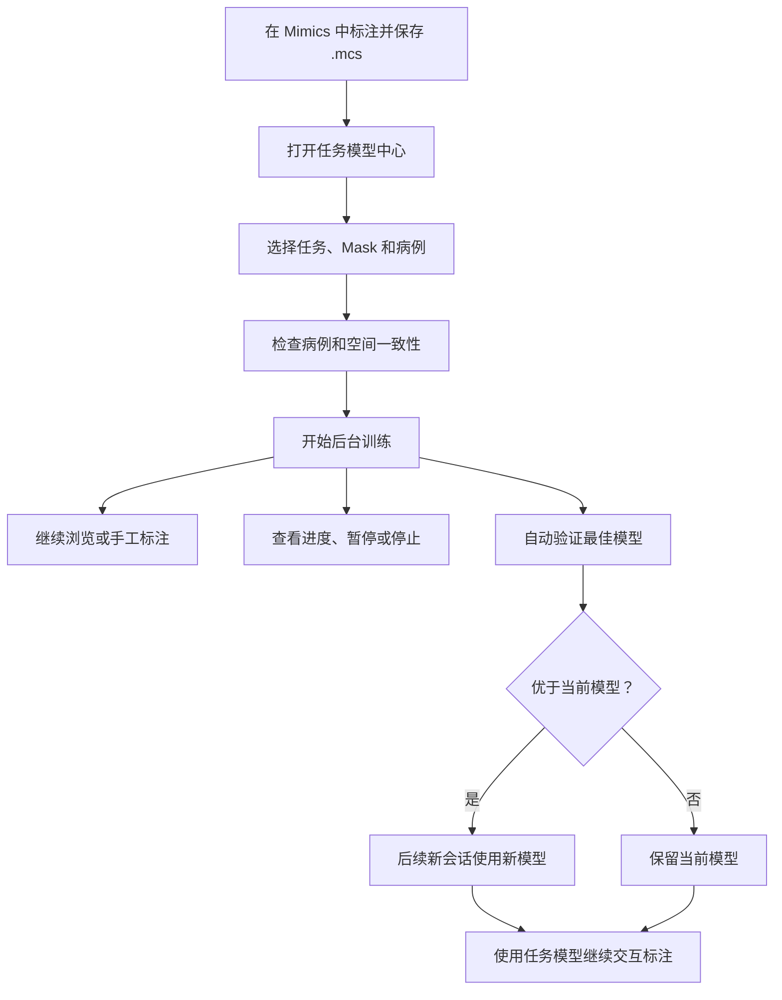

# Mimics 中的 nnInteractive 任务微调与标注集成设计

## 1. 文档目标

本设计用于把已经完成实验验证的 nnInteractive 微调能力集成到 Mimics，
让标注者可以使用自己在 `.mcs` 项目中积累的图像和 Mask 训练任务模型，
再使用该模型继续进行交互式标注。

设计同时满足以下要求：

1. 原版 nnInteractive 的入口、模型和工作流保持不变。
2. 微调、验证和模型加载均在外部 Python 进程中运行，不阻塞 Mimics GUI。
3. 标注者不需要理解 Job、candidate、checkpoint、模型注册表等工程概念。
4. 训练过程可见、可暂停、可恢复、可停止，异常后不会长期占用 GPU。
5. 微调模型继续复用原版的点、涂画、框选、套索和 Mask 修改流程。
6. 图像、训练标签、预测结果与 Mimics Mask 使用同一套经过验证的空间映射。
7. 功能入口、窗口数量和弹窗数量尽可能少。

## 2. 实验结论对产品设计的约束

实验结果见
`external/nninteractive-finetune/validation/EXPERIMENT_RESULTS.md`。

已经确认的结论包括：

- `clopa_in` 只训练 27,648 个参数，适合低成本、低过拟合风险的任务适配。
- `clopa_conv` 训练 145,216 个参数，在已测试的 CT 主动脉和肾上腺任务上
  平均效果更高。
- 脑 T1 MRI 在 `clopa_in` 下已经获得显著改善。
- 最佳验证结果通常出现在第 4 至第 8 个 epoch，最后一个 epoch 不一定最好。
- 平均 AUC 提升并不代表每个病例都提升，个别病例可能退化。
- 当前得到充分验证的是 click 训练协议。涂画和框选在推理时仍然可用，
  但尚不能宣称已经分别完成对应训练策略验证。
- 一次训练在 A10 上大约需要一小时，在 3060 Windows 机器上可能更久。

因此，集成设计采用以下原则：

- 始终保存并部署最佳验证 epoch，而不是最后一个 epoch。
- 新训练完成的模型先在后台自动比较，但不把 candidate 审核流程暴露给用户。
- 新模型只有在验证优于当前模型且兼容性检查通过时，才成为后续会话的默认模型。
- 当前正在运行的标注会话永远固定使用启动时的模型，不会中途切换。
- UI 只开放已经验证且用户能够理解的少量训练参数。

## 3. 用户真正需要完成的事情

从标注者角度，完整流程只有四个动作：

1. 标注并保存若干 `.mcs` 项目。
2. 选择任务、Mask 和病例，开始训练。
3. 需要时查看进度，或者暂停训练让出 GPU。
4. 使用任务模型继续标注。

以下内容不应成为正常工作流中的必答问题：

- 模型 ID。
- Job ID。
- checkpoint 文件路径。
- candidate、validated、promoted 等状态名称。
- GPU 锁文件。
- 临时导出目录。
- qform、sform、RAS、LPS 等几何实现细节。
- 训练命令行。

这些信息仍然保存在日志和技术详情中，用于复查和问题定位。

## 4. Scripting Library 入口设计

官方模型、自定义模型和训练管理归入同一功能组：

```text
02_AI/
  nnInteractive/
    01_Annotate_Official_Model.py
    02_Annotate_Custom_Model.py
    03_Train_and_Manage_Custom_Models.py
```

三个入口按“官方标注、自定义模型标注、训练管理”的使用顺序排列。

### 4.1 Train and Manage Models

打开统一的外部“任务模型中心”，包含：

- 训练设置。
- 当前训练进度。
- 当前使用模型。
- 历史模型和回退。
- 暂停、恢复、重试和停止。

不再为训练设置、状态查看、模型列表和停止任务分别创建四个入口。

### 4.2 Annotate with Task Model

根据当前图像、选中 Mask、Mask metadata 和项目绑定自动寻找任务模型。

只有以下情况才打开一个轻量选择窗口：

- 同一个 Mask 名称匹配多个任务。
- 当前项目没有绑定任务。
- 用户主动要求更换任务或模型。
- 推荐模型不可用，需要用户处理。

正常情况下直接使用已绑定的任务模型开始预热，避免每次标注前重复选择。

### 4.3 紧急停止

任务模型中心内提供正常的暂停和停止。

现有 Admin 下的 `Stop All Owned Services` 继续作为异常兜底入口。它只根据
所有权 token、PID 和进程启动标记清理本项目创建的进程，不新增一个容易被误用的
“Kill All”日常入口。

## 5. 总体用户流程



训练完成后不弹出必须立即处理的 Mimics 对话框。Mimics 日志显示简短结果，
任务模型中心显示完整结果。

## 6. 任务模型中心

### 6.1 窗口定位

任务模型中心是一个非模态 PySide6 窗口：

- Mimics 可继续点击、切换图像、修改 Mask 和保存项目。
- 窗口可隐藏和重新打开，隐藏不影响训练。
- 不使用 `QFileDialog` 扫描大盘。
- 路径输入框允许粘贴路径，并使用项目已有的异步自定义路径浏览器。
- 同一时间只打开一个任务模型中心实例，再次运行入口时激活已有窗口。

建议尺寸：

- 默认：`1020 × 720`。
- 最小：`880 × 620`。
- 支持 Windows 100%、125%、150% 和 175% DPI。
- 底部主操作区固定，不因内容滚动而消失。
- 只有主内容区允许滚动，不出现多个嵌套滚动区域。

### 6.2 信息结构

窗口只使用三个功能明确的页面：

```text
训练设置 | 训练进度 | 模型版本
```

这三个页面对应不同工作阶段，不再区分“基础参数”和“高级参数”。

左侧不显示所有历史 Job。窗口顶部只显示当前任务选择器，所有内容跟随当前任务。

### 6.3 顶部区域

顶部固定包含：

- 标题：`nnInteractive Task Models`。
- 当前任务选择器。
- 当前状态：`Ready`、`Training`、`Paused`、`Needs attention`。
- 当前默认模型的简短说明。

不显示内部模型 ID。用户在技术详情中仍可查看。

### 6.4 训练设置页面

页面采用上下排列的三个无嵌套区域。

#### 数据

包含：

- 任务名称。
- 数据来源。
- 保存的 `.mcs` 文件夹。
- 原始图像位置，仅在 metadata 无法自动解析时显示。
- 目标 Mask 名称。
- 病例列表和训练/验证分配。

数据来源提供两个选项：

1. `Saved Mimics projects`，默认选项。
2. `Prepared image and label folder`，用于已经导出的 NIfTI 图像和标签。

对于 Saved Mimics projects：

- 优先从当前图像 metadata 推断数据集和 `.mcs` 位置。
- 用户可以修改 `.mcs` 文件夹。
- 原始图像位置能够由 import manifest 或 project metadata 解析时不要求用户填写。
- 无法解析时才显示一条明确的路径缺失提示和 `Choose Image Folder`。

病例扫描在外部进程执行。列表逐步显示，不等待全盘扫描结束后一次出现。

每个病例只显示用户关心的状态：

- `Ready`。
- `Mask missing`。
- `Mask empty`。
- `Project not saved`。
- `Image geometry unavailable`。

默认只选择 `Ready` 病例。

训练/验证分配默认自动完成：

- 通常使用 80% 训练、20% 验证。
- 数据量允许时至少保留 2 个验证病例。
- 用户可在病例列表中直接把病例设为 Train、Validation 或 Exclude。
- 不要求用户输入抽象的 validation fraction。

#### 适配方式

只提供两个单选项：

- `Lightweight adaptation`。
  - 对应 `clopa_in`。
  - 默认选项。
  - 参数更少，适合作为新任务的稳健起点。
- `Stronger boundary adaptation`。
  - 对应 `clopa_conv`。
  - 已测试 CT 任务中效果更高。
  - 适合边界或域差异仍然明显的任务。

每个选项只有一行说明，不展示内部参数数量和网络层名称。

#### 训练

只提供：

- `Maximum epochs`，默认 10，范围 4 至 20。
- `Starting model`。
  - 新任务固定为 Official nnInteractive。
  - 更新任务默认使用 Current task model。
  - 用户可以选择 Restart from official。

固定但记录到 manifest 的参数包括：

- patch size。
- learning rate。
- steps per epoch。
- batch size。
- gradient accumulation。
- click 数量和编码参数。
- augmentation。
- mixed precision。

这些参数当前只有一套经过实际实验验证的组合，不在 GUI 中制造未经验证的任意组合。

#### 提交摘要

主按钮上方显示一行动态摘要：

```text
12 training · 3 validation · Lightweight adaptation · up to 10 epochs
```

有错误时摘要替换为最先需要处理的问题，例如：

```text
3 selected cases have no matching Liver Mask
```

`Start Training` 仅在以下条件全部满足时启用：

- 任务名称有效。
- 至少一个训练病例。
- 满足最低验证要求，或用户明确选择不自动启用新模型。
- 所有选中病例通过图像和标签几何检查。
- 输出目录可写。
- 当前没有同任务训练正在运行。

### 6.5 训练开始后的联动

点击 `Start Training` 后：

1. 按钮立即进入已提交状态，防止重复点击。
2. 同一个窗口自动切换到训练进度页面。
3. Mimics 侧只记录一条英文日志，不再弹“Training started”对话框。
4. 后台任务使用提交时的数据快照。
5. 用户此后继续修改 `.mcs` 不会改变正在运行的训练数据。

数据快照能够避免以下竞态：

- 训练过程中用户继续修改同一个 Mask。
- 项目自动保存覆盖导出来源。
- 新增病例在本轮训练中只导出了一部分。

### 6.6 训练进度页面

默认只显示当前任务的当前训练，不显示所有过去的失败和取消 Job。

顶部状态区显示：

- 当前阶段。
- 一句用户可理解的说明。
- 进度条。
- 已用时间。
- 当前处理病例或 epoch。

阶段文案示例：

| 内部阶段 | 用户看到的内容 |
| --- | --- |
| `validating_masks` | Checking selected Masks |
| `exporting_labels` | Preparing labels, 8 of 12 cases |
| `waiting_for_gpu` | Waiting for the GPU |
| `training` | Training, epoch 4 of 10 |
| `validating` | Checking model quality |
| `registering` | Saving the best model |
| `completed` | Training completed |
| `paused` | Training paused; GPU released |
| `failed` | Training needs attention |

进度区域下面显示两个信息层次。

默认可见：

- Train loss。
- Validation trajectory AUC。
- Best validation AUC。
- 训练曲线。
- 最近 5 至 8 条用户可读事件。

通过 `Technical Details` 查看：

- 完整英文日志。
- Job ID。
- PID。
- 配置路径。
- checkpoint 路径。
- GPU 锁和后台 Mimics 信息。
- traceback。

日志行为必须满足：

- 默认自动跟随最新内容。
- 用户向上滚动后暂停自动滚动。
- 显示 `New log entries` 按钮，而不是强制跳回底部。
- 恢复自动跟随后再跳到最新内容。
- 只读取新增日志，不反复重载整个文件。
- UTF-8 解码失败时保留可读替换字符并给出日志编码提示。

### 6.7 暂停、恢复和停止

训练进度页面提供：

- `Pause and Release GPU`。
- `Resume Training`。
- `Stop Training`，放在更多操作菜单中。
- `Hide Window`。

暂停行为：

1. 请求训练进程在安全边界停止。
2. 保存训练状态和最佳参数。
3. 等待训练子进程真正退出。
4. 释放显存和 GPU 锁。
5. 状态变为 `Paused`。

恢复行为：

- 使用相同的数据快照、基础模型、策略和随机状态继续。
- 不重新导出没有变化的数据。
- 恢复前重新检查基础模型和已保存训练状态。

永久停止行为：

- 先走与暂停相同的安全退出。
- 将任务标记为取消。
- 保留小型状态、配置和日志。
- 大型临时数据按清理策略回收。

无法安全退出时：

- 状态进入 `Stopping`。
- 明确显示仍在等待哪个 PID。
- GPU 锁在进程真正退出前不释放。
- 超过宽限期后只终止本任务拥有的进程树。

### 6.8 模型版本页面

默认区域显示：

- 当前使用模型。
- 训练日期。
- 适配方式。
- 训练和验证病例数量。
- 最佳 epoch。
- 相对当前模型的验证变化。

历史模型使用紧凑表格，不使用大量卡片：

| 日期 | 适配方式 | 数据 | 验证结果 | 使用状态 |
| --- | --- | --- | --- | --- |
| 2026-07-26 | Lightweight | 12 + 3 | +4.8% | Current |
| 2026-07-22 | Stronger boundary | 10 + 3 | -1.2% | Not selected |

默认隐藏失败和损坏版本，通过 `Show failed versions` 查看。

可用操作：

- `Use This Version`。
- `Compare`。
- `Archive`。
- `Open Details`。

用户切换版本只改变后续新会话，不影响正在运行的标注 worker。

## 7. 视觉与交互规范

### 7.1 视觉风格

沿用项目统一的 PySide6 主题，但需要针对任务模型中心做以下约束：

- 中性浅灰背景，白色内容区。
- 蓝色只用于主操作。
- 青绿色用于成功和运行状态。
- 黄色用于可恢复警告。
- 红色只用于失败和永久停止。
- 不使用渐变、重阴影或大面积单一深色。
- 圆角不超过 7 px。
- 不在卡片内继续嵌套卡片。
- 不为每个参数制造独立带阴影的容器。

字体优先级：

```text
Segoe UI
Microsoft YaHei UI
Microsoft YaHei
sans-serif
```

层级建议：

- 窗口标题：18 pt。
- 页面标题：13 pt。
- 正文和控件：10 pt。
- 辅助说明：9 pt。

不使用随窗口宽度变化的字体缩放。

### 7.2 布局稳定性

- 表单标签使用稳定宽度，对齐输入框起点。
- 路径行使用“可编辑路径 + 浏览图标按钮”，不能只有不可复制的路径标签。
- 病例列表有稳定最小高度。
- 小屏或高 DPI 下主内容滚动，底部按钮不被挤出。
- 曲线根据可用区域重绘，不超过容器边界。
- 禁止固定像素内容导致 Windows 高 DPI 遮挡。
- 所有动态文本允许换行，不覆盖相邻控件。
- 空状态、加载状态、失败状态保持相同布局尺寸，避免窗口跳动。

### 7.3 控件联动

| 条件 | 控件行为 |
| --- | --- |
| 新任务 | Starting model 固定为 Official |
| 已有任务 | Starting model 默认 Current task model |
| 选择 Prepared folder | `.mcs` 路径隐藏，图像/标签路径显示 |
| metadata 可解析原图 | 原始图像路径隐藏 |
| metadata 不完整 | 显示原始图像路径和修复提示 |
| 病例扫描中 | Start 禁用，列表逐步更新 |
| 无验证病例 | 自动启用新模型选项禁用 |
| 同任务正在训练 | Start 禁用，提供 Show Progress |
| 训练占用 GPU | AI 标注入口不采集提示 |
| 训练已暂停 | Resume 启用，Pause 禁用 |
| 模型不兼容 | Use This Version 禁用并显示原因 |

禁用控件必须同时给出简短原因，不能只变灰而没有解释。

## 8. 标注入口的低负担模型选择

### 8.1 自动解析顺序

运行 `Annotate with Task Model` 时按以下顺序解析：

1. 当前 Mask metadata 中已绑定的 `task_id` 和 `model_id`。
2. 当前 Mask 名称与任务 Mask 名称或 aliases 的唯一匹配。
3. 当前 `.mcs` 项目的任务绑定。
4. 当前数据集最近使用的任务。
5. 仍然无法唯一确定时，打开轻量选择窗口。

自动解析成功后，Mimics 日志显示：

```text
Using the Liver task model trained on 2026-07-26.
```

不弹出确认框。

### 8.2 轻量选择窗口

窗口只包含：

- Task。
- Model version，默认 Current。
- 一行验证摘要。
- `Use Model`。
- `Open Model Center`。

不显示完整训练配置和文件路径。

用户可以勾选：

```text
Use this task for the current project
```

后续同项目不再询问。

### 8.3 会话内模型不可变

一次 Mask 交互会话必须绑定：

- task ID。
- model ID。
- checkpoint SHA-256。
- worker ID。

如果用户在已有会话中选择其他模型：

1. 当前 Mask 不做任何修改。
2. 提示现有会话属于另一个模型。
3. 用户可继续原会话，或从当前 Mask 启动新模型会话。
4. 不允许在同一个 worker 中替换 checkpoint。

## 9. 原版 nnInteractive 的隔离

原版入口必须满足：

- 继续使用 `nninteractive_config.json` 中的官方模型。
- 不读取任务模型默认指针。
- 不弹任务模型选择窗口。
- 不修改任务模型注册表。
- 不写入任务模型目录。
- 任务模型失败不能更改原版配置。

任务模型使用独立配置和注册表。

当前 `_ASYNC_IMAGE_WORKERS` 只按图像 GUID 缓存，集成前必须改为：

```text
(image_guid, model_profile_id, checkpoint_sha256)
```

否则同一图像先使用官方模型、再使用任务模型时，可能错误复用已经加载官方模型的
worker。

模型身份必须写入：

- `image_worker.json`。
- async job JSON。
- command 和 result JSON。
- Mask session metadata。

应用结果前同时检查：

- 图像 GUID。
- 目标 Mask GUID。
- Mask 内容哈希。
- model ID。
- checkpoint SHA-256。

任何一项不一致都不得应用结果。

## 10. 训练数据与空间一致性

任务训练默认使用源图像网格。

对于 `.mcs` 中的 Mask：

1. 根据当前项目和 Mask 名称确定导出对象。
2. 从 Mimics grid 导出 Mask。
3. 使用导入时保存的空间 metadata 映射回原始图像 grid。
4. 写出与原图 shape、affine、qform、sform 一致的标签。
5. 运行微调包已有的严格几何检查。
6. 无法证明对应关系时拒绝该病例，不做隐式猜测。

训练清单记录：

- 原图路径和内容哈希。
- `.mcs` 路径和修改时间。
- Mask GUID、名称和标签哈希。
- 原图与 Mimics grid 的几何指纹。
- 训练或验证分配。
- 导出器版本。

训练提交后使用不可变快照。用户在 Mimics 中继续修改项目，不会让一轮训练读取到
前后不一致的标签。

## 11. 后台进程与功能联动

### 11.1 阶段顺序


后台 Mimics 进程和 GPU 训练进程不应同时长期持有资源。

训练必须在标签导出进程真正退出、相关锁释放后再申请 GPU。

### 11.2 与原版 nnInteractive 的关系

训练占用 GPU 时，运行原版或任务版 nnInteractive：

- 不采集提示。
- 不创建 AI Draft。
- 不修改 Mask metadata。
- 显示简短说明并提供 `Open Training Progress`。

用户可以在任务模型中心选择 `Pause and Release GPU`，随后使用 nnInteractive。

官方 nnInteractive server 空闲时，训练可以请求其正常关闭后取得 GPU。
正在执行预测的 server 不得被训练任务强制终止。

### 11.3 GPU 共享锁

继续使用共享 GPU 锁：

- nnInteractive 官方推理。
- nnInteractive 任务模型推理。
- nnInteractive 微调。
- nnU-Net 训练和推理。

同一时刻只允许一个 GPU 重任务。

等待 GPU 不等于失败，状态页面必须明确显示当前占用者和可执行的操作。

### 11.4 与导入导出的关系

任务微调复用现有 Mask 导出和几何映射实现，但使用独立 job staging 目录。

导入、普通 Mask 导出和训练标签导出：

- 不共享可被彼此删除的临时目录。
- 每个任务使用唯一 job ID 和所有权 token。
- cleanup 只清理终态且超过保留期的目录。
- 正在导出的标签不被普通 cleanup 删除。

## 12. 模型自动选择规则

后台仍保留完整模型状态，但不暴露工程术语。

训练完成后自动执行：

1. 使用真实 `nnInteractiveInferenceSession` 加载最佳 checkpoint。
2. 在相同验证病例上评估当前模型和新模型。
3. 检查 trajectory AUC、空预测和严重病例退化。
4. 检查 checkpoint 和模型 metadata 完整性。

结果只有三种用户状态：

- `New model is ready`：新模型通过检查，后续会话默认使用。
- `Current model retained`：训练完成，但验证没有超过当前模型。
- `Training needs attention`：训练、几何或模型检查失败。

如果验证病例不足：

- 模型保存在历史中。
- 不自动替换当前模型。
- 用户可在模型版本页面显式使用。
- UI 清楚显示 `Not enough validation cases for automatic selection`。

模型自动切换只更新未来会话的默认指针，不替换已经运行的 worker。

## 13. 模型与任务管理

用户训练模型不能放在 `nninteractive_env/models`。环境修复、升级或重装不能删除
用户模型。

建议目录：

```text
nninteractive_task_models/
  registry.json
  project_bindings.json
  tasks/
    <task_id>/
      task.json
      models/
        <model_id>/
          plans.json
          dataset.json
          inference_info.json
          inference_session_class.json
          fold_0/checkpoint_final.pth
          finetune_manifest.json
          integration_manifest.json
          metrics.json
  jobs/
  logs/
  staging/
```

每次训练生成不可变版本，不覆盖旧模型。

更新模型默认：

- 使用当前任务模型作为起点。
- 重放用户选择的旧病例和新增病例。
- 在同一验证集上与当前模型比较。

用户可以选择从官方模型重新开始，避免长期连续微调带来的遗忘。

## 14. 日志、提示与错误恢复

### 14.1 Mimics 日志

Mimics 日志统一使用英文，只记录关键节点：

- training submitted；
- labels prepared；
- waiting for GPU；
- epoch summary；
- training paused；
- model selected or current model retained；
- actionable failure。

不把每个 update 的训练日志刷入 Mimics。

### 14.2 Mimics 弹窗

只在需要用户立即决策时使用：

- 当前会话与所选模型冲突。
- 训练占用 GPU，用户希望立即使用 AI。
- 即将永久停止并删除未完成训练。
- 结果目标 Mask 在推理期间被修改。

训练开始、阶段变化和正常完成不使用阻塞弹窗。

### 14.3 错误显示

错误页面必须同时包含：

- 发生在哪个用户阶段。
- 是否已经停止。
- 是否仍占用 GPU 或后台 Mimics。
- 用户下一步可以做什么。
- `Retry`、`Edit Settings`、`Open Log` 或 `Stop` 中适用的操作。

不只显示 traceback，也不能只弹窗而不写日志。

## 15. 打包与离线环境

便携包只包含：

- `external/nninteractive-finetune/src`。
- 运行配置模板。
- Mimics 入口和 runtime 模块。
- 任务模型中心和选择窗口。

必须排除：

- 当前约 2.4 GB 的 validation 数据。
- prepared cache。
- 实验输出。
- Modal 运行结果。
- 用户训练模型。
- `__pycache__` 和 egg-info。

所有外部窗口和训练命令优先使用项目 `nninteractive_env`。

离线检查需要验证：

- PySide6。
- torch 和 CUDA。
- nnInteractive。
- nibabel、scipy、PyYAML。
- 官方模型 metadata 和 checkpoint。
- 微调包可导入。

## 16. 分阶段实现

### 阶段一：任务模型推理隔离

- 引入显式 model profile。
- 修改 worker cache key。
- 将模型身份写入 job 和 Mask metadata。
- 增加任务模型注册表读取。
- 使用已有验证模型在 Mimics 中运行完整提示流程。
- 验证 standalone 与 Mimics 输出一致。

这一阶段不接训练 UI，先证明推理、坐标和原版隔离正确。

### 阶段二：任务模型中心和训练编排

- 实现统一 PySide6 窗口。
- 实现 `.mcs`、Mask 和病例选择。
- 接入后台标签导出与几何检查。
- 接入外部训练、状态、暂停、恢复和停止。
- 注册不可变模型版本。

### 阶段三：自动验证和模型更新

- 同验证集比较官方、当前任务模型和新模型。
- 实现未来会话的推荐模型自动更新。
- 实现模型历史、回退和项目绑定。

### 阶段四：稳定性与离线部署

- fake Mimics 流程测试。
- GPU 和后台 Mimics 竞态压测。
- Windows 高 DPI UI 测试。
- 实际 Mimics 几何和交互验证。
- 更新 Stop All Owned Services。
- 更新 portable 和 offline package。

## 17. 测试矩阵

### 17.1 自动测试

- 原版入口只能解析官方模型。
- 任务入口必须得到明确任务模型。
- 同图像的官方模型和任务模型不能共享 worker。
- 会话中途不能静默换模型。
- checkpoint 缺失或损坏时在提示采集前失败。
- 训练导出、等待 GPU、训练、验证和注册阶段均可暂停或停止。
- GPU 锁只在子进程退出后释放。
- 模型版本更新不覆盖旧版本。
- 训练快照不受后续 `.mcs` 修改影响。
- RAS、LPS、轴翻转、非恒等轴映射和倾斜数据的 Mask round-trip 正确。

### 17.2 Fake Mimics 测试

- 空 Mask、手工 Mask 和 AI Draft 的行为与原版一致。
- `Update Selected Mask` 和 `Create Editable Copy` 均可用。
- 推理期间手工修改 Mask 后结果被识别为 stale。
- 训练期间 Mimics 导航、选择和手工编辑不受影响。
- 训练占用 GPU 时不采集提示、不创建 Mask。
- 暂停后可以启动原版 nnInteractive。
- 任务模型中心关闭和重开后能恢复状态。

### 17.3 Windows UI 测试

- 100%、125%、150%、175% DPI 下无控件遮挡。
- 1366×768 分辨率下主按钮始终可见。
- 病例数量较多时窗口仍可响应。
- 路径可粘贴，大盘浏览不阻塞 Mimics。
- 训练曲线不会超出布局。
- 日志刷新不抢滚动位置。
- 禁用项均显示原因。

### 17.4 实际 Mimics 验证

- 横断、冠状和矢状视图中的提示位置一致。
- standalone 与 Mimics 使用相同图像、初始 Mask、提示和 checkpoint 时结果一致。
- 官方和任务模型可交替使用而不复用错误 worker。
- 结果能够更新已有 Mask 或创建可编辑副本。
- 关闭 Mimics、训练窗口或状态窗口不会遗留资源。

## 18. 验收标准

功能只有同时满足以下条件才可交付：

1. 原版 nnInteractive 回归测试全部通过。
2. 正常工作流只需要“管理模型”和“任务模型标注”两个新入口。
3. 用户不需要理解 Job、candidate 和 checkpoint。
4. 微调模型不能覆盖或修改官方模型。
5. 所有长任务均在外部进程运行。
6. Mimics 中不存在批量扫描、模型加载、预处理、训练和推理造成的 GUI 阻塞。
7. 每个后台阶段均有进度、暂停或停止路径。
8. 训练失败不会长期占用 GPU 或后台 Mimics。
9. 新模型只影响未来会话，不改变正在运行的标注会话。
10. 训练标签、独立推理结果和 Mimics Mask 的空间对应通过真实数据验证。
11. 模型来源、训练数据、验证结果和实际使用版本均可追溯。

## 19. 当前设计中的默认决定

为了减少用户负担，本设计暂定：

- 外部 UI 和日志继续使用英文，与现有项目一致；本设计文档使用中文。
- `Lightweight adaptation` 为默认适配方式。
- 自动 80/20 划分训练和验证病例，用户可直接调整病例归属。
- 验证改善后自动用于未来会话，不要求人工执行模型 promotion。
- 同项目存在唯一匹配时自动选择任务模型，不每次弹出模型选择窗口。
- 训练进行时允许手工标注；需要 AI 时由用户暂停训练释放 GPU。

这些默认项不影响底层能力，可以在实现前根据实际标注习惯调整。

## 20. 实现状态与验证边界

截至 2026-07-26，本设计已落实到以下代码路径。

### 20.1 已实现

- 官方模型入口
  `02_AI/nnInteractive/01_Annotate_Official_Model.py` 仍只加载官方模型。
- 自定义模型入口位于同一功能组：
  - `02_AI/nnInteractive/02_Annotate_Custom_Model.py`。
  - `02_AI/nnInteractive/03_Train_and_Manage_Custom_Models.py`。
- 新增 Mimics 轻量控制层
  `runtime_py35/nninteractive_finetune_mimics.py`，负责当前 Mask、项目绑定、
  任务解析、外部窗口启动和非阻塞结果监控。
- `runtime_py35/nninteractive_mimics.py` 已支持显式任务模型 profile。
  官方模型、不同任务和不同模型版本使用不同 image worker 缓存键，结果文件也携带
  模型身份；身份不一致的结果不会写回 Mask。
- 统一 PySide6 模型中心已经实现：
  - Training Setup。
  - Training Progress。
  - Model Versions。
- 训练设置只暴露已验证且有实际用途的选项：
  - 数据来源、病例和训练/验证划分。
  - Lightweight 或 Stronger boundary adaptation。
  - 最大 epoch。
  - 从官方模型或当前任务模型继续训练。
- `.mcs` 数据源复用现有 Mask 导出与 source-image grid 映射，输出进入独立作业
  staging，不覆盖用户原始标签。
- 训练、验证和模型注册均运行在 `nninteractive_env` 外部进程。
- 训练状态持久化 epoch、loss、validation AUC、完整曲线历史和英文日志。
- 支持 Pause and Release GPU、Resume Training 和 Stop Training。
- Stop 会删除未注册模型和大体积暂存数据；Pause 和失败会保留恢复及诊断材料。
- 模型只有在验证病例数达到门槛、平均轨迹 AUC 不下降且不存在严重单病例退化时，
  才自动成为推荐模型。用户仍可在 Model Versions 中显式选择其他完整版本。
- `Stop All Owned Services` 已识别本功能的控制器、训练器和两个外部窗口；先写终止
  标记并等待安全边界，再清理仍未退出的项目自有进程。
- portable 和 offline 打包已加入新增配置、UI 和运行代码，并排除 2.4 GB 的实验
  validation/work 数据。

### 20.2 已完成的自动验证

- 独立微调包测试：16 项通过。
- nnInteractive 任务模型集成单元测试：5 项通过。
- fake Mimics 全流程：14 项通过。
- Python 语法检查和本次改动范围的 whitespace 检查通过。
- 真实 PySide6 窗口已在 1040×800 下实例化并截图，设置页和进度页未出现重叠。
- 交互网页模拟已用 Playwright 验证：
  - 1280×900 桌面视口。
  - 390×844 窄视口。
  - 扫描、开始、训练曲线、日志、暂停/恢复/停止和完成状态。
  - 窄视口 `scrollWidth == clientWidth`，没有横向溢出。

交互预览位于
`docs/previews/nninteractive_task_models_interactive.html`。

### 20.3 必须在 Windows Mimics 上完成的验收

本机没有 Mimics，以下项目不能由 fake API 或 macOS Qt 完全替代：

1. 从真实 `.mcs` 批量导出同名 Mask，确认每个标签在原始图像网格上的位置、shape、
   qform/sform 和边缘均正确。
2. 使用至少一个真实任务模型完成 point、scribble、box 和 lasso 的连续多轮提示，
   确认任务模型结果正确写回所选 Mask 或 Editable Copy。
3. 在任务模型推理后切回原版入口，确认官方模型 worker 独立重建且结果不串用。
4. 在真实 GPU 训练中执行 Pause、Resume、Stop 和 Stop All，使用任务管理器和
   `nvidia-smi` 确认 Python 子进程、显存、GPU 锁和后台 Mimics 均按状态释放。
5. 在 Windows 100%、125% 和 150% 显示缩放下检查 PySide6 窗口，确认路径、
   病例表、底部按钮和日志区域没有遮挡。
6. 验证 `nninteractive_env` 离线安装包包含 PySide6 和独立微调包运行依赖。

上述真实环境验收失败时，必须保留对应作业目录中的 `status.json`、`job.log`、
`trainer.log`、背景 Mimics 日志和模型 integration manifest，再根据证据修正，
不能用回退到官方模型掩盖任务模型链路问题。
