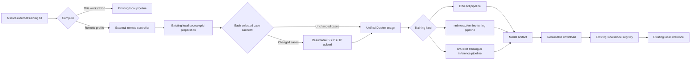

# Optional Remote Training Design

## 1. Goal and compatibility boundary

This feature adds optional SSH/Docker execution for DINOv3 few-shot training,
nnInteractive task fine-tuning, and managed nnU-Net training/inference.

The primary compatibility rule is:

- Every training window starts with **This workstation** selected.
- The existing local command, environment, GPU lock, data preparation,
  training, model registry, and inference paths are unchanged.
- Remote modules do not import Paramiko until a saved remote server is
  explicitly selected and used.
- If remote modules or Paramiko are missing, the local training UI and local
  training still work.
- No remote code is imported by the Mimics Python runtime. Mimics only launches
  the existing external PySide6 process.

DINOv3 and nnInteractive inference remain local after the downloaded model is
registered. Managed nnU-Net additionally supports optional remote batch
inference; its prediction is downloaded, geometry-validated, and then applied
through the same Mimics-side buffer path as a local prediction. Local remains
the default for every framework.

## 2. User workflow

The DINOv3, nnInteractive, and nnU-Net setup windows use the same additive
**Compute** section:

1. **This workstation** remains the default.
2. **Manage Servers...** opens an external PySide6 server editor.
3. The user enters:
   - Profile name
   - Host name or IP address
   - SSH port, normally `22`
   - SSH username
   - Password or SSH private-key path
   - Remote work folder, normally `mimics-ai`
   - Runtime image, normally `mimics-ai-runtime:1.0`
   - GPU device: Automatic, a numeric index, or an NVIDIA GPU/MIG UUID
   - Whether unchanged uploaded training data should be reused
4. **Test Connection** verifies SSH host identity, authentication, work-folder
   permissions, Docker, NVIDIA GPU access, free disk space, all three AI
   frameworks, required default weights, and enforced offline mode.
5. The user explicitly selects `Remote · <profile>` and starts training.

Passwords are stored in Windows Credential Manager. They are never written to
`servers.json`, a job JSON, a command line, or a log. On first connection the
server SSH fingerprint must be accepted. A changed fingerprint is rejected.

## 3. Architecture



One image contains both training frameworks because the local project already
uses one compatible Python/CUDA environment. Separate containers are still
used per job, so process termination and GPU-memory release remain isolated.

The Windows client connects to the Linux host's SSH service, not to a service
inside a training container. The remote controller uses the host Docker daemon
to start the job container. Job containers expose no SSH port and run with
`--network none`; passwords, private keys, and host SSH configuration are never
copied into them.

Key implementation files:

- `tools/remote_compute.py`: profiles, Credential Manager, SSH host keys,
  SSH/SFTP transport, and connection preflight.
- `tools/remote_compute_ui.py`: shared server profile and compute selector UI.
- `tools/remote_training_controller.py`: local preparation, transfer, remote
  lifecycle, status mirroring, download, and local registration.
- `tools/remote_worker.py`: container entry point for all three pipelines.
- `remote/Dockerfile`: unified CUDA runtime.
- `remote/build_image.sh`: image build and optional archive export.
- `remote/setup_remote_server.sh`: one-time server initialization.

## 4. Data and geometry

The remote server never opens `.mcs` files and does not need a Mimics license.

All Mimics-dependent work remains local:

- `mcs_refresh`: the existing background Mimics export first creates labels.
- `exported_masks`: the selected exported label folder is used.
- `source_dataset`: existing source labels are used.

The controller then calls the same existing materialization functions used by
local training:

- Images are represented as source-grid NIfTI.
- Labels are mapped to the source-image grid before upload.
- Image and label shape/affine checks remain in the existing pipeline.
- nnInteractive uses its existing manifest preparation and input contract.
- nnU-Net uses source-grid image/label preparation, a dataset-fingerprint
  isolated raw/preprocessed cache, and its existing model geometry contract.

The upload contains only the selected cases, labels, job request, and an
explicitly selected custom base model when applicable. Public/shared storage is
not mounted into the container. This avoids cross-user share permissions and
slow random reads from a network drive during training.

NIfTI files are already compressed, so the transfer archive is an uncompressed
tar. SFTP writes `.part` files and resumes both upload and model download after
a connection interruption.

Image and label files are placed in deterministic per-case tar archives. Each
case archive has its own SHA-256 cache key. With the
**Reuse unchanged uploaded training data** option enabled, the controller
checks:

```text
<remote-root>/cache/<ssh-username>/datasets/<sha256>.tar
```

An exact case cache hit skips that case's transfer. Adding or changing one case
therefore does not re-upload every unchanged case. The small job configuration
and any job-specific custom model are still sent for each run. Changed image or
label bytes produce a different case fingerprint. The aggregate dataset
fingerprint records the exact selected set and case fingerprints. Cache entries
unused for 30 days are removed. The cache is per SSH user and is never silently
shared across accounts.

## 5. Models and reproducibility

Base models are installed once by the server administrator under:

```text
<remote-root>/models/dinov3/dinov3-vits16/
<remote-root>/models/dinov3/dinov3-vitb16/
<remote-root>/models/dinov3/dinov3-vitl16/
<remote-root>/models/nninteractive/nnInteractive_v1.0/
```

The model directory is mounted read-only in every training container. A custom
base model selected by the user is copied into that job only.

Base weights are deliberately not baked into the Docker image. The image
contains the pinned Python/CUDA environment and the training code; the
persistent remote work folder contains large weights, jobs, logs, locks, and
content-addressed data caches. Updating a weight therefore does not require
rebuilding the runtime image, and rebuilding code does not duplicate large
weights in every image layer.

Before upload, the controller verifies that the required remote base-model path
exists. When the corresponding local official model is available, the client
and server content fingerprints must match or training is refused. It records:

- Server profile
- Runtime image name and immutable Docker image ID
- Selected GPU device
- Training dataset fingerprint
- Required remote base-model path
- Base-model weight fingerprint

After successful training, only the final model artifact is downloaded. It is
audited and registered through the same local functions used by local
training. The downloaded model therefore appears in the existing model history
and can be selected by the existing local prediction entry.

## 6. GPU scheduling and multiple users

Each training job uses one GPU. These training pipelines do not currently use
distributed multi-GPU training, so selecting multiple GPUs for one job would
only increase ambiguity without accelerating the supported code.

The server profile supports:

- `Automatic`: Docker exposes all configured GPUs and the framework uses its
  first visible GPU. This mode takes an exclusive server-wide GPU lock.
- Numeric index such as `0` or `1`: Docker exposes only that GPU.
- NVIDIA GPU or MIG UUID: Docker exposes only that device.

Explicit devices use a shared global scheduler lock plus an exclusive
per-device lock:

```text
<remote-root>/locks/gpu-all.lock
<remote-root>/locks/gpu-0.lock
<remote-root>/locks/gpu-1.lock
```

Jobs assigned to GPU 0 and GPU 1 can run concurrently. Two jobs assigned to
GPU 0 are serialized. Automatic mode is mutually exclusive with all explicit
GPU jobs, preventing it from choosing a device already in use. Locks use the
Linux kernel's `flock`, so they are released automatically if a container
exits or is killed. A waiting job reports the selected GPU instead of consuming
GPU memory or being mistaken for a failed startup.

Jobs are stored under:

```text
<remote-root>/jobs/<ssh-username>/<job-id>/
```

This prevents name collisions and supports separate SSH accounts. For a
multi-user server, the administrator should use one absolute shared
`remote-root`, make `models` read-only to users, make `locks` writable by the
training group, and give each user ownership of their job subdirectory.

This version shares administrator-provided base models only. User-trained
models are downloaded to each user's existing local registry; it does not add
a central model database, permissions UI, or cross-user publishing workflow.

## 7. Lifecycle and failure behavior

The local status file is the UI-facing source of truth. Remote status is
mirrored into it without replacing local paths such as `workspace`,
`cancel_path`, or `control_path`.

The UI shows preparation counts, upload/download percentages, current transfer
rate and ETA, cache hit or
miss, selected server/GPU, GPU wait, epoch/loss/validation metrics emitted by
the existing trainer, reconnect attempts, model verification, and the final
result. `remote_worker.log` is appended to the local task log while training is
running rather than being downloaded only at the end. The remote file rotates
at 32 MiB and retains three backups, so a verbose or long job cannot grow it
without bound. SSH/controller
diagnostics are kept in `remote_controller.log` for DINOv3 and in the existing
nnInteractive task log. Both status viewers expose the relevant log paths.

Expected states include:

```text
preparing_remote
connecting_remote
uploading
starting_remote
waiting_for_remote_gpu
training / validating
reconnecting_remote
remote_control_unavailable
finalizing_remote
downloading
completed / failed / cancelled / abandoned
```

During upload, progress is aggregated across all selected case archives.
Finishing one case and starting the next cannot reset the visible progress bar.
Status also records total/completed case counts and cache-hit counts.

Failure handling:

| Failure | Behavior |
|---|---|
| Paramiko absent | Remote test/start fails clearly; local training remains available |
| Unknown SSH host | User must confirm the displayed fingerprint |
| Changed SSH host key | Connection is rejected |
| Authentication failure | No remote job is created |
| Missing Docker/GPU/image/framework | Connection preflight fails |
| Missing base model | Job fails before the large upload |
| Upload/download interruption | `.part` transfer resumes after reconnect |
| Download disk shortage | Download is refused before transfer; the existing local model remains unchanged |
| SSH loss during training | Container continues; controller reports reconnecting and retries |
| Docker status temporarily unavailable | Job remains non-terminal and monitoring retries |
| User stops a job | Framework stop marker/control is written first, then bounded `docker stop` |
| Container crash | Exit code, pipeline status, and remote worker log are retained locally |
| Successful job | Model downloads, is locally audited/registered, then the container and per-job files are removed; verified dataset cache remains. Cleanup failure is recorded as a warning and does not turn a registered model into a failed training result |
| Cancelled job | Container and remote job data are removed after stop confirmation |
| Server permanently unreachable | Status remains unknown; the single Stop button changes to **Abandon Locally**, which ends local waiting but explicitly warns that the remote container may still run |
| Failed job | Container is stopped and removed; remote job files are retained for diagnosis. They are not deleted by an age-only cleanup that could mistake a long-running task for stale work |

The controller never reports `cancelled` until the remote container stop is
confirmed. If the server is unreachable, the state stays non-terminal so the
user is not told that GPU memory was released when that cannot be proven.
Likewise, a failed controller remains in `stopping` when termination cannot be
confirmed. Before any stop, removal, or control-marker write, the controller
verifies the container owner/job labels and confines the path to
`jobs/<ssh-user>/<job-id>`. A second controller cannot replace a still-running
container for the same job.

When remote state is unknown, **Abandon Locally** is an explicit escape path.
It marks only the local task terminal, stops automatic local waiting, preserves
the server/container identity in status, and never claims that the GPU lock or
container was released. This action does not contact, stop, or delete anything
on the server. It is shown only for an unknown remote state and requires one
confirmation, so normal users do not see another routine action.

The Docker image is never removed by a job. A subsequent training starts a new
disposable container from the already-installed image, normally in seconds.
Base weights also remain mounted read-only.

## 8. Server deployment

The simplest one-time setup builds directly from a project checkout on the
Linux GPU server:

```bash
MIMICS_AI_ROOT=/srv/mimics-ai \
  remote/setup_remote_server.sh --build
```

This builds the image, creates the remote folders, verifies base weights, and
runs DINOv3, nnInteractive, nnU-Net, CUDA, and offline-runtime preflights.

Job containers use `--network none` and also set
`HF_HUB_OFFLINE=1`, `TRANSFORMERS_OFFLINE=1`,
`HF_DATASETS_OFFLINE=1`, and `WANDB_MODE=offline`. Base weights are supplied by
explicit paths under the read-only `/models` mount; writable library caches use
container-local `/tmp`. Consequently, a missing weight fails during preflight
or job asset validation instead of causing a hidden first-run download.

For an offline server, build an image archive on another Linux machine:

```bash
remote/build_image.sh /tmp/mimics-ai-runtime.tar
```

Copy the image archive, source checkout, and base weights to the server. Then
load and verify it once as the intended SSH user or through the administrator:

```bash
MIMICS_AI_ROOT=/srv/mimics-ai \
  remote/setup_remote_server.sh /tmp/mimics-ai-runtime.tar
```

The server needs:

- Linux
- NVIDIA driver
- Docker with NVIDIA Container Toolkit
- Permission for the SSH user to run Docker
- Enough space for uploaded datasets and model outputs

The Windows client needs Paramiko only for remote use:

```text
python tools/setup_env.py install-remote
```

The offline bundle includes Paramiko and its Windows wheel dependencies.

## 9. Verification

Automated local tests cover:

- Server profiles never serialize passwords.
- Reading profiles does not create files for local-only users.
- Parent-path traversal is rejected.
- Invalid GPU selectors are rejected and numeric devices are translated into
  Docker's single-device request.
- Automatic and explicit GPU locks have the intended mutual-exclusion rules.
- Deterministic dataset archives produce stable cache fingerprints.
- A verified cache hit skips the large data upload.
- Growing remote logs are appended locally without rereading the full file.
- Remote subprocess logs rotate at a bounded size.
- Local artifact space is checked before model download/extraction.
- Local abandon is terminal without claiming remote stop confirmation.
- The default DINOv3 launch calls the unchanged local command.
- Remote execution occurs only when explicitly selected.
- Remote status cannot replace local control paths.
- Result archives reject traversal paths and links.
- Stop requests reach the framework before container termination.
- Remote worker argument translation is deterministic.

Run:

```text
python -m unittest tools.test_remote_training -v
```

Required Windows/Mimics acceptance tests:

1. Start local DINOv3, nnInteractive, and nnU-Net training without creating a server
   profile; compare command, status, model registration, and inference with the
   previous version.
2. Save a password profile, restart Windows, and confirm the password is read
   from Credential Manager while absent from project JSON/logs.
3. Train one small DINOv3, nnInteractive, and nnU-Net job remotely, then run
   inference with each downloaded model; also verify one remote nnU-Net inference.
4. Compare local and remote training using identical data, seed, image, and
   parameters. Exact floating-point identity is not guaranteed across CUDA
   hardware, but input manifests and model configuration must match.
5. Disconnect the client network during upload, training, and download; verify
   transfer resume and status recovery.
6. On a two-GPU server, run one job on GPU 0 and one on GPU 1 concurrently,
   then queue two jobs on GPU 0 and verify the second reports waiting.
7. Stop while uploading, waiting for GPU, training, and downloading. Confirm
   the terminal state, container removal, GPU release, and local partial-file
   cleanup.
8. Verify that no action in the external UI blocks or closes the open Mimics
   GUI.
9. Disconnect the server permanently, request Stop, then use **Abandon
   Locally**. Confirm the local task becomes terminal while the UI continues to
   warn that server GPU/container state is unknown.

## 10. Deliberate limitations

- No remote interactive nnInteractive inference and no remote DINOv3
  single-case inference. Managed nnU-Net remote inference is supported.
- No central model marketplace or cross-user model approval workflow.
- No password is stored on non-Windows development machines; use an SSH key or
  a test-only environment variable there.
- One job uses one selected GPU. Distributed training across several GPUs for
  one job is not implemented.
- A permanently unreachable server cannot provide proof that its container
  stopped. Stop therefore remains non-terminal; the user may explicitly
  abandon local monitoring, which retains an unresolved-remote warning.
