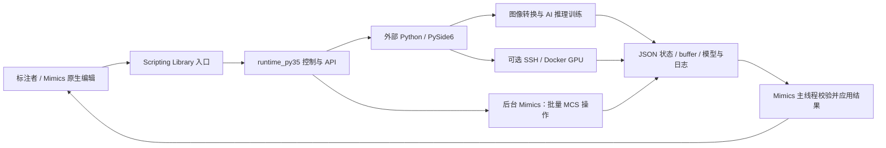
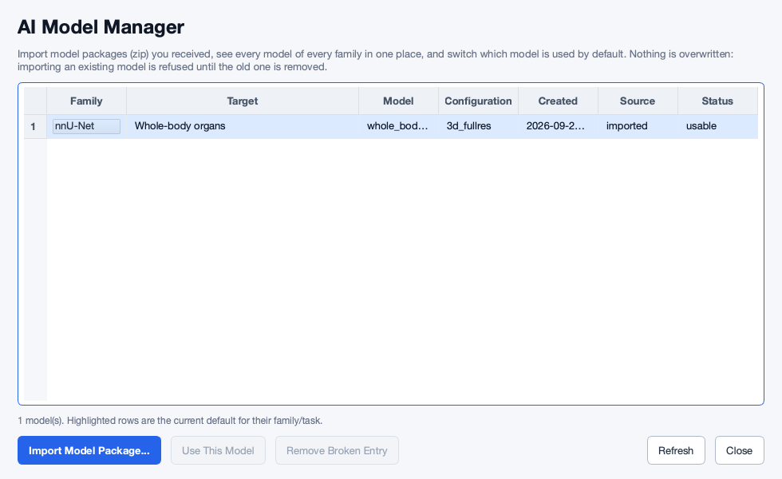
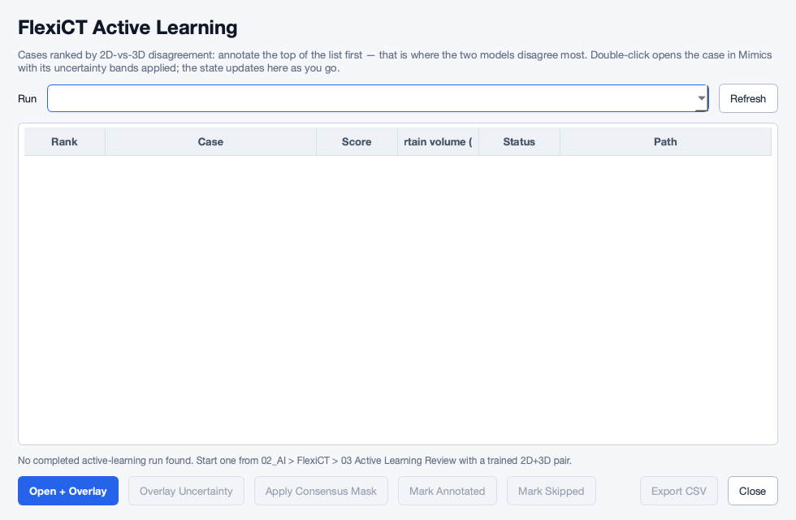

**MIMICS_SCRIPTS 跨职能评审与修改建议记录**

评审日期：2026-09-29。基线提交：`36eac04`。仓库：`ShijianRuan/MIMICS_SCRIPTS`。本次仅审查与记录，不实施业务代码修改。

**后续补查：** 2026-09-30新增F18–F29，包含两项P0；优先级与开发验收以[第二轮报告](2026-09-30-scenario-review.md)和[交接说明](development-handoff.md)为准。以下保留第一轮结论与验证范围。

**总体判断：架构方向合理，主要缺口集中在完整工作流、数据身份、异常路径和部署一致性。** 已有双环境隔离、异步任务、资源锁、结果回写、模型管理和较丰富测试，不建议推倒重建。当前仍有可复现的功能中断和状态错误，因此尚不能保证所有入口都能稳定联动 Mimics。对全身器官标注，应优先完成“导入正确的序列 → 多器官草稿 → 人工修正 → 核查完成度 → 导出原始空间”的闭环。

**评审范围与证据边界**

用户已确认：Windows、有 Scripting 许可、有 GPU，但不同工作站的 CUDA 环境可能不同；场景包括全身器官分割。尚未提供 Mimics 精确版本、GPU/驱动清单、真实病例、当前模型权重和现场日志。仓库内 API 文档为 Mimics Research 21.0 / Python 3.5，不能据此宣称兼容所有后续 Mimics 版本。

本次读取了仓库结构、入口速查、架构/配置/测试文档、历史评审账本，以及导入导出、Mask 回写、交互标注、模型管理、训练编排、部署和主要 Qt 界面代码。Git 跟踪 192 个 Python 文件，其中 33 个 Scripting Library 入口；不是每一行都已审计。根目录没有 README；主要入口说明在 docs 中。历史账本只作为线索，结论以当前代码为准。

验证环境是 macOS 的临时 Python 3.12 环境，使用合成数据、真实 Qt 离屏控件和边界桩。没有运行真实 Mimics、CUDA 推理/训练或远程 SSH/Docker 任务。离屏截图应用了正式 `ui_theme`，但不能替代 Windows 的字体、DPI、多显示器和焦点验证。

证据等级：**A**＝已执行最小复现或真实离屏控件验证；**B**＝源码调用链明确、尚缺目标环境端到端验证；**C**＝产品/性能假设，需要测量或用户确认。P1＝应在对应功能交付给标注者前修复；P2＝影响效率、体验、维护或特定输入的风险；P3＝文档与收尾。这里没有把每个问题都升级为 P0，也没有把测试通过解释为功能全面可用。

**当前架构适合保留，但数据和任务契约需要收紧。**



`scripting_library` 的薄入口、`runtime_py35` 的旧 Python 兼容层、外部现代 Python 和独立计算进程，是合理的 Mimics 扩展方式。派生 DICOM 导入也有 API 背景：Materialise 官方社区在 2023 年明确表示当时 Image voxel buffer 没有写入 API，而 Mask 有；这一资料支持现有绕行路线，但不能证明新版永远没有更直接的接口。[Materialise 官方回复](https://community.materialise.com/t/update-voxel-buffer/768)

JSON 文件与本地锁足够支撑当前规模。需要优先统一的是病例/序列身份、目标图像网格、状态转换和线程回调，而非引入数据库、消息队列或微服务。远程训练是可选能力，宜继续隔离，不应成为日常标注的必需前置条件。

**优先处理清单**

| 编号 | 级别 / 证据 | 当前问题 | 直接影响 |
|---|---|---|---|
| F01 | P1 / A+B | DICOM 源几何按文件汇总，未正确隔离系列或展开多帧 | 导出原始空间的尺寸/网格可能错误 |
| F02 | P1 / A | AL buffer 在应用前被删除 | 不确定度叠加失败，可能留下新建空 Mask |
| F03 | P1 / A | AL 非空列表引用未定义 Qt 名称 | 打开真实排序结果时报 NameError |
| F04 | P1 / B | AL 首次运行没有可达的图形入口 | 已有算法，但标注者无法从菜单启动排序 |
| F05 | P1 / B | 仅应用 AL 叠加即标记 annotated | 未审阅病例被计为已标注 |
| F06 | P1 / A+B | FlexiCT 推理重建网络仍读取预训练 backbone | 模型迁移到新工作站后推理失败 |
| F07 | P1 / A | Repair 把 import 名当 pip 包名 | 缺 yaml 时修复失败；ONNX 可能装成 CPU 分发 |
| F08 | P1 / A | 核心依赖导入失败仍能显示检查通过 | 错误环境被误判为可用 |
| F09 | P1 / A | 模型管理器选择后按钮仍永久禁用 | 默认模型切换与失效项清理不可达；历史 R61-4 仍存在 |
| F10 | P1 / B | 同父目录拖拽多选扩大到整个父目录 | 导入超出用户选择范围；跨父目录多选又不可提交 |
| F11 | P1 / A+B | Mask 导入终止回调从回收线程调用 Mimics 对话框 | 异常/取消路径违反线程边界 |
| F12 | P2 / B | 在线/离线依赖组合不一致且在线安装浮动 | 换工作站或修复环境后行为漂移 |
| F13 | P2 / B+C | 全量 buffer 复制/哈希与自动模态续问 | 大体积或连续标注时卡顿、抢焦点 |
| F14 | P2 / A+B | AL 失败反馈被刷新摘要覆盖 | 用户无法看到为什么叠加失败 |
| F15 | P2 / A+B | 禁用主按钮仍蓝色、列宽截断、入口和状态语言不统一 | 界面可构造，但不够明确、精美 |
| F16 | P2 / B+C | 数据划分以 case_id 为单位，缺少患者级分组契约 | 同患者多期/多次扫描时可能验证泄漏 |
| F17 | P1 / A+B | 项目保护依赖未核实 API，异常后仍打开另一项目 | 接口缺失时绕过已有项目/未保存工作保护 |

<a id="f01"></a>

**F01：DICOM 几何解析必须绑定一个明确的系列与帧集合。**

- 位置：[get_image_affine_from_dicom](https://github.com/ShijianRuan/MIMICS_SCRIPTS/blob/36eac0409d89ea1e8bca5c255f9b6c1cf13e1a32/mimics_bridge.py#L1551)、[get_image_shape_from_dicom](https://github.com/ShijianRuan/MIMICS_SCRIPTS/blob/36eac0409d89ea1e8bca5c255f9b6c1cf13e1a32/mimics_bridge.py#L1625)、[prepare 的文件计层逻辑](https://github.com/ShijianRuan/MIMICS_SCRIPTS/blob/36eac0409d89ea1e8bca5c255f9b6c1cf13e1a32/mimics_bridge.py#L1840)。
- 触发：一个目录含多个 SeriesInstanceUID，或单文件多帧 DICOM。当前读到含 Rows/Columns 的文件就加入集合，shape 的第三维取文件数；没有在这些函数内选择系列，也没有按多帧功能组展开几何。
- 复现：两个不同 UID、各 3 层的合成目录，被 `do_prepare` 接受为 `status=ok, source_image_shape=[4,4,6]`；一个声明 60 帧的文件被接受为 `[4,4,1]`。多帧复现验证的是 header 解析缺口，不是完整 Enhanced CT 解码测试。
- 为什么要改：后台 Mimics 后续测量的真实网格可以修正 Mask 导入目标，但[该分支](https://github.com/ShijianRuan/MIMICS_SCRIPTS/blob/36eac0409d89ea1e8bca5c255f9b6c1cf13e1a32/runtime_py35/create_mcs_batch.py#L941)并未重建正确的原始系列身份；[原空间导出](https://github.com/ShijianRuan/MIMICS_SCRIPTS/blob/36eac0409d89ea1e8bca5c255f9b6c1cf13e1a32/mimics_bridge.py#L2224)仍会使用 source geometry。不能仅凭“当前视图看起来对齐”就认为往返正确。
- 怎么改：在外部发现阶段产生统一 DICOM series descriptor，包含 Study/Series UID、选定文件/帧、尺寸、方向、位置和强度变换；导入、推理、导出共用。多个候选必须让用户选择，或按明确且可见的规则选择。检查重复位置、非均匀间距、混合方向；多帧能正确读 per-frame 几何才支持，否则明确拒绝，不能默认为一层。不同入口不要再各自扫描一次并猜测系列。
- 验收：混合薄/厚层 CT、平扫/增强、多回波 MR、单文件多帧、斜位、重复/缺层各有合成或脱敏样本；导出标签的 shape、affine、物理角点与选定系列一致；未选择系列时不得静默合并。真实 Mimics 往返仍待 Windows 验证。

<a id="f02"></a>

**F02：AL 转换结果的清理顺序错误。**

- 位置：[转换目录与 buffer 路径](https://github.com/ShijianRuan/MIMICS_SCRIPTS/blob/36eac0409d89ea1e8bca5c255f9b6c1cf13e1a32/runtime_py35/flexict_mimics.py#L1462)、[应用函数](https://github.com/ShijianRuan/MIMICS_SCRIPTS/blob/36eac0409d89ea1e8bca5c255f9b6c1cf13e1a32/runtime_py35/flexict_mimics.py#L1536)。1548 行先删除 `bridge_root`，1565 行才读取其中的 `output_path`。
- 复现：原函数体加真实临时 `.u8` 文件，在读取时文件已不存在，抛出 FileNotFoundError。
- 为什么要改：这会中断“排序 → 打开病例 → 叠加不确定度”的主要工作流。旧 R61-3 的同步等待问题虽已修复，当前异步版本又引入了文件生命周期错误。
- 怎么改：buffer 保持到全部应用成功或失败回滚结束；先校验所有路径、尺寸、字节数，再创建 Mask；记录本次新建对象，失败撤销本次对象；清理放在完整事务末尾，失败时保留足够的诊断信息，并更新 failed 终态。
- 验收：真实文件驱动两张 band Mask 成功应用；第二张故意缺失/截断时无半套叠加或遗留空 Mask；失败状态可见；取消和异常路径最终释放资源。

<a id="f03"></a>

**F03：AL 窗口只在有真实数据时出错。**

- 位置：[ActiveLearningWindow._job_selected](https://github.com/ShijianRuan/MIMICS_SCRIPTS/blob/36eac0409d89ea1e8bca5c255f9b6c1cf13e1a32/tools/flexict_active_learning_ui.py#L288)，313/316 行使用 `QtWidgets` / `QtCore`，但这些名字只在其他函数的局部作用域绑定。
- 复现：真实 PySide6 控件，传入一行合成 ranking，得到 `NameError: name 'QtWidgets' is not defined`。空窗口构造测试不会进入该循环。
- 怎么改：在该方法内从 `self.QtWidgets/self.QtCore` 取得引用，或一致使用实例字段；同时审查其他回调的模块/局部作用域。补“非空数据 → 选中行 → 触发动作”行为测试。
- 验收：空、1 行、百行、annotated 行和缺失路径都能显示；排序结果刷新后仍可选中与操作；异常不只写到后台 stderr。

<a id="f04"></a>

**F04：AL 首次任务缺少入口，空状态提示形成循环。**

- 位置：[Mimics 菜单动作](https://github.com/ShijianRuan/MIMICS_SCRIPTS/blob/36eac0409d89ea1e8bca5c255f9b6c1cf13e1a32/runtime_py35/flexict_mimics.py#L1193)、[AL 空状态提示](https://github.com/ShijianRuan/MIMICS_SCRIPTS/blob/36eac0409d89ea1e8bca5c255f9b6c1cf13e1a32/tools/flexict_active_learning_ui.py#L282)。
- 现状：03 Active Learning Review 只启动查看窗口；查看窗口只读已完成任务。空状态提示用户回到同一个菜单“Start one”。后端已有 `run_active_learning/create_flexict_job`，但首次选择 pair、病例池并提交任务的图形路径未接通。
- 怎么改：在现有窗口增加一个“新建排序”动作和最小表单：模型对、数据池、目标器官、输出位置。直接调用现有管线，显示任务进度；完成后自动切换结果。不要另起一套 AL 应用。
- 验收：全新 workspace、有模型 pair、无历史任务时，仅用 Mimics 菜单即可完成首次排序；缺一个模型时明确说明如何补齐；取消后可重试。

<a id="f05"></a>

**F05：叠加可视化与人工完成标注不能共用一个终态。**

- 位置：[自动标注完成](https://github.com/ShijianRuan/MIMICS_SCRIPTS/blob/36eac0409d89ea1e8bca5c255f9b6c1cf13e1a32/runtime_py35/flexict_mimics.py#L1577)、[_al_mark_annotated](https://github.com/ShijianRuan/MIMICS_SCRIPTS/blob/36eac0409d89ea1e8bca5c255f9b6c1cf13e1a32/runtime_py35/flexict_mimics.py#L1371)。
- 触发：成功显示不确定度带后立即把 case 从 new 写成 annotated；没有检查人工复核、实际修正或保存。F02 目前会遮挡这条成功路径，修复 F02 后此语义问题将暴露。
- 为什么要改：标注者可能只是打开看看，随后关闭。队列却把它统计为完成，容易漏标；当前证据确认的是审阅状态失真，不声称训练器一定自动摄入这些病例。
- 怎么改：使用 `new → opened/in_progress → reviewed → exported` 等少量明确状态；叠加最多推进到 opened。保留显式“完成复核”，完成前提示未保存状态；“跳过”和“无该结构”独立记录。病例状态与器官状态分别表示。
- 验收：只打开、只叠加、修改未保存都不增加完成计数；显式确认后增加；重新打开状态保持；撤销/重置有清楚语义。

<a id="f06"></a>

**F06：FlexiCT 完整模型包尚未做到推理自包含。**

- 位置：[推理环境声明](https://github.com/ShijianRuan/MIMICS_SCRIPTS/blob/36eac0409d89ea1e8bca5c255f9b6c1cf13e1a32/tools/flexict_pipeline.py#L237)、[backbone 加载](https://github.com/ShijianRuan/MIMICS_SCRIPTS/blob/36eac0409d89ea1e8bca5c255f9b6c1cf13e1a32/integrations/flexict-finetune/trainers/flexict_trainer.py#L232)、[trainer 网络构造](https://github.com/ShijianRuan/MIMICS_SCRIPTS/blob/36eac0409d89ea1e8bca5c255f9b6c1cf13e1a32/integrations/flexict-finetune/trainers/flexict_trainer.py#L301)。
- 触发：将已微调模型迁移到没有预训练 backbone 的工作站，或 backbone 原本在自定义目录。推理环境说不需要预训练权重，网络构造却无条件先 `load_file` 默认 backbone 文件。
- 证据：AST 原函数执行确认会读取默认 `weights/flexict_2d/model.safetensors`。上游 Predictor 也是先调用 trainer 构造网络，再加载完整训练权重；后者来不及消除这个外部文件依赖。[nnU-Net Predictor 源码](https://github.com/MIC-DKFZ/nnUNet/blob/master/nnunetv2/inference/predict_from_raw_data.py)
- 怎么改：分开“构造架构”和“训练初始化”。推理仅构造，再严格加载完整 checkpoint；首次训练才加载 backbone。如果某模型包本来只包含增量参数，则应在 manifest 明确 base checkpoint 身份/哈希并验证依赖，不能宣称自包含。
- 验收：只安装依赖与导入模型包、没有 backbone 目录的干净环境可预测；2D/3D 各验一次；与原工作站同一输入的结果一致。真实 GPU 推理本次未执行。

<a id="f07"></a>

**F07：环境修复使用了错误的包名映射。**

- 位置：[install](https://github.com/ShijianRuan/MIMICS_SCRIPTS/blob/36eac0409d89ea1e8bca5c255f9b6c1cf13e1a32/tools/setup_env.py#L571)、[提交 pip](https://github.com/ShijianRuan/MIMICS_SCRIPTS/blob/36eac0409d89ea1e8bca5c255f9b6c1cf13e1a32/tools/setup_env.py#L599)、[已有但未复用的映射](https://github.com/ShijianRuan/MIMICS_SCRIPTS/blob/36eac0409d89ea1e8bca5c255f9b6c1cf13e1a32/tools/setup_env.py#L822)。
- 复现：把检测结果设为缺 `yaml` 和 `onnxruntime`，Repair 传给 pip 的仍是这两个 import 名。正确分发名应遵从项目既有清单中的 `pyyaml`、`onnxruntime-gpu`。
- 怎么改：建立单一依赖清单，保存 distribution、import name、版本约束、CPU/GPU 能力；安装、修复、打包、检测都从它生成。最小修复可先复用已有反向映射，避免顺手重构整个安装器。
- 验收：缺 yaml、缺 ONNX、版本不兼容分别生成正确安装请求；离线 wheel 缺失清楚报错；修复后执行真正 import 和 provider 检查。

<a id="f08"></a>

**F08：环境体检的“通过”条件忽略 import 失败。**

- 位置：[记录 import 错误](https://github.com/ShijianRuan/MIMICS_SCRIPTS/blob/36eac0409d89ea1e8bca5c255f9b6c1cf13e1a32/tools/setup_env.py#L379)、[all_ok 汇总](https://github.com/ShijianRuan/MIMICS_SCRIPTS/blob/36eac0409d89ea1e8bca5c255f9b6c1cf13e1a32/tools/setup_env.py#L472)。
- 复现：`find_spec` 成功、`torch` 真正 import 返回 error、GUI 与 nnU-Net 版本检测通过，最终仍输出 `status=ok, all_ok=true`。
- 为什么要改：Windows 上 DLL/二进制依赖问题可能表现为“包存在但不能用”；用户会在启动 AI 时才失败。没有 GPU不必意味着所有功能不可用，但核心库 import 失败不能显示全通过。
- 怎么改：分层展示“基础数据工具、GUI、本地 AI、远程 AI、每个模型”的能力状态；失败的探针、无法解析的探针均作为未知/失败处理，不能当空缺项集合成功。安装结束复用同一体检逻辑。
- 验收：模拟 torch DLL 失败、torchvision 算子错误、损坏包、探针超时；基本 I/O仍可使用，但对应 AI 功能被准确标记并给出下一步。CPU-only、GPU-ready、remote-ready 必须区分。

<a id="f09"></a>

**F09：模型管理器的两个核心动作不可达。**

- 位置：[按钮建立](https://github.com/ShijianRuan/MIMICS_SCRIPTS/blob/36eac0409d89ea1e8bca5c255f9b6c1cf13e1a32/tools/model_manager_ui.py#L361)、[刷新后禁用](https://github.com/ShijianRuan/MIMICS_SCRIPTS/blob/36eac0409d89ea1e8bca5c255f9b6c1cf13e1a32/tools/model_manager_ui.py#L455)。这是历史 R61-4 的当前复核，不是首次发现。
- 复现：真实 Qt 表格放入 usable 模型，选择第 0 行，`use_enabled=false`、`remove_enabled=false`。没有选中信号负责恢复状态。
- 怎么改：连接 selection/current-row 变化，按模型 usable/current/broken 状态控制按钮；刷新保持选中模型 identity；清理仅作用于失效注册项，文案说清是否删除文件。
- 验收：usable 非默认行可切换、current 行清楚显示当前状态、broken 行可清理；刷新后选择和动作仍正确；完成后预测入口实际使用新默认模型。

<a id="f10"></a>

**F10：拖拽多选必须保留用户选择的精确范围。**

- 位置：[分类](https://github.com/ShijianRuan/MIMICS_SCRIPTS/blob/36eac0409d89ea1e8bca5c255f9b6c1cf13e1a32/tools/import_drop_window.py#L111)、[batch 提交](https://github.com/ShijianRuan/MIMICS_SCRIPTS/blob/36eac0409d89ea1e8bca5c255f9b6c1cf13e1a32/tools/import_drop_window.py#L293)、[multi_single 被拒绝](https://github.com/ShijianRuan/MIMICS_SCRIPTS/blob/36eac0409d89ea1e8bca5c255f9b6c1cf13e1a32/tools/import_drop_window.py#L480)。
- 触发：从同一父目录只拖两例，分类器改为父目录 batch；提交只传 `--ts-root`，未传已选病例集合。另一个分支虽然能识别跨父目录的 multi_single，但 UI 将 case_info 置空并禁用 Import。
- 为什么要改：用户的“两例”可变成“整个数据集”，浪费处理/磁盘资源，并扩大用户以为会发生的操作范围。不能把“显示父目录名称”当成用户已同意扩大范围。
- 怎么改：区分“用户拖入数据集根”与“多选病例”；多选携带不可变的完整路径/病例清单，显式显示数量。跨父目录逐项验证和汇总；执行前可移除错误条目。后端若无子集参数，先串联现有单例提交，不要偷偷升级为全目录。
- 验收：父目录有 10 例，只拖 2 例就只生成 2 个任务；跨 2 个目录可提交；重复路径去重；混合有效/无效项有逐项提示与处理范围。

<a id="f11"></a>

**F11：异步回收线程不能直接完成包含 Mimics API 的回调。**

- 位置：[Mask 导入终止回调](https://github.com/ShijianRuan/MIMICS_SCRIPTS/blob/36eac0409d89ea1e8bca5c255f9b6c1cf13e1a32/runtime_py35/mask_import.py#L537)、[reaper 执行 callback](https://github.com/ShijianRuan/MIMICS_SCRIPTS/blob/36eac0409d89ea1e8bca5c255f9b6c1cf13e1a32/runtime_py35/runtime_common.py#L1521)、[完成时发消息](https://github.com/ShijianRuan/MIMICS_SCRIPTS/blob/36eac0409d89ea1e8bca5c255f9b6c1cf13e1a32/runtime_py35/mask_import.py#L528)。
- 复现：执行真实函数体，进程存活/终止由安全桩代替，最终消息调用发生在 `MimicsOwnedProcessReaper`，不是 MainThread。
- 怎么改：后台只结束进程、写入结果并投递“待主线程完成”事件；现有 timer 在 GUI 线程执行清理状态、释放本地操作、更新界面和 Mimics 对话框。不要在后台 callback 间接触碰 Qt/Mimics 对象；终止失败也需要终态和可诊断信息。
- 验收：取消、转换失败、超时、Mimics 正关闭等路径都断言 API线程；真实 Windows 中重复执行取消/重启无挂住或窗口异常。本次确认越线程路径，不宣称已复现 Mimics 崩溃。

<a id="f12"></a>

**F12：把在线安装、离线包和远程镜像收敛到少量已验证的依赖组合。**

- 位置：[在线安装](https://github.com/ShijianRuan/MIMICS_SCRIPTS/blob/36eac0409d89ea1e8bca5c255f9b6c1cf13e1a32/tools/setup_env.py#L536)、[离线 PyTorch 固定版本](https://github.com/ShijianRuan/MIMICS_SCRIPTS/blob/36eac0409d89ea1e8bca5c255f9b6c1cf13e1a32/tools/package_portable.py#L463)、[远程依赖](https://github.com/ShijianRuan/MIMICS_SCRIPTS/blob/36eac0409d89ea1e8bca5c255f9b6c1cf13e1a32/remote/requirements.txt#L1)。
- 当前在线路径未固定 torch/torchvision，先用 extra index 安装 torch，再对其他包执行 upgrade；离线包则指定 `2.6.0+cu124`。pip 官方明确多个 index 没有优先级承诺，会选择满足条件的最佳版本，因此这里无法保证取得 cu124 的已验组合。[pip install 文档](https://pip.pypa.io/en/stable/cli/pip_install/)
- 怎么改：先建立一个主支持组合及必要的兼容组合，生成 constraints 和安装报告；torch 与 torchvision 成对固定并使用明确 index。运行时记录 GPU 型号、driver、`torch.version.cuda`、torch/torchvision/nnInteractive/nnUNet 版本和 GPU 小运算结果。不要要求用户只凭“电脑装的 CUDA 是多少”选包；驱动、wheel 内运行时和本机 Toolkit是不同层次。[PyTorch 官方版本组合](https://pytorch.org/get-started/previous-versions/)、[NVIDIA CUDA 兼容说明](https://docs.nvidia.com/deploy/cuda-compatibility/minor-version-compatibility.html)
- 验收：至少两台实际目标工作站安装同一锁定组合可重复；不满足条件时明确指出驱动或构建问题；Repair 不擅自升级整套 AI 栈。FlexiCT auto 在 16GB 起选 pair，但代码注释提到 3D 约 32GB，宜按真实 patch/模型做显存预检，不能仅按总显存阈值保证可运行。

<a id="f13"></a>

**F13：区分计算异步、数据复制和交互占用。**

- 位置：[全量 Mask 哈希](https://github.com/ShijianRuan/MIMICS_SCRIPTS/blob/36eac0409d89ea1e8bca5c255f9b6c1cf13e1a32/runtime_py35/nninteractive_mimics.py#L1933)、[完整读取结果](https://github.com/ShijianRuan/MIMICS_SCRIPTS/blob/36eac0409d89ea1e8bca5c255f9b6c1cf13e1a32/runtime_py35/nninteractive_mimics.py#L1939)、[自动续问](https://github.com/ShijianRuan/MIMICS_SCRIPTS/blob/36eac0409d89ea1e8bca5c255f9b6c1cf13e1a32/runtime_py35/nninteractive_mimics.py#L4219)、[模态菜单](https://github.com/ShijianRuan/MIMICS_SCRIPTS/blob/36eac0409d89ea1e8bca5c255f9b6c1cf13e1a32/runtime_py35/nninteractive_mimics.py#L2730)。
- 为什么要改：`512×512×1200` 的 uint8 Mask 单份约 300MiB，`.tobytes()` 另建同量级副本。全身数据每轮哈希、导出、回写可能造成明显延迟。推理结束自动弹下一轮模态菜单时，本地 mask_buffer_access 锁直到 finally 才释放，也会影响用户去做其他操作。
- 怎么改：Mimics API 仍在主线程；尽量短时间取得快照，后续编码、哈希、磁盘写入放到工作层。缓存图像/session，基于实际改动和版本标识避免重复工作；可评估外部链路的 ROI/delta 传输，但须核实 Mimics API 是否允许局部写入，不能简单把 set_voxel_buffer 移到线程。下一轮菜单改成用户主动继续，或仅在明确的连续标注模式中自动出现；释放操作锁后再询问用户。
- 验收：固定小、中、全身体积测点击到反馈、主线程最长停顿、RSS 峰值、磁盘写量、取消时延的 p50/p95；推理中与结果到达时能继续滚动、切窗、手工编辑。测试期间并发人工编辑必须触发已有冲突处理，不可覆盖新修改。
- 历史更正：R61-26 记录同步 communicate，但[当前默认](https://github.com/ShijianRuan/MIMICS_SCRIPTS/blob/36eac0409d89ea1e8bca5c255f9b6c1cf13e1a32/runtime_py35/nninteractive_mimics.py#L1783)已延后源图像对齐到 worker；显式关闭 defer 仍保留同步路径。不能把“每次默认阻塞 1800 秒”作为当前结论。

<a id="f14"></a>

**F14：错误反馈应有独立、持久的显示位置。**

- 位置：[AL 请求轮询](https://github.com/ShijianRuan/MIMICS_SCRIPTS/blob/36eac0409d89ea1e8bca5c255f9b6c1cf13e1a32/tools/flexict_active_learning_ui.py#L366)。当前先把 failed 原因写入 status_label，随后 `_job_selected` 将它覆盖成病例数量摘要。
- 复现：同次调用按顺序写入“Request failed … source missing”和“1 case(s) ranked …”；正常刷新完成后前一条消失。F03 修复后这一问题尤其明显。
- 怎么改：分开任务摘要和最近操作结果；错误保留到用户关闭或下一次相关成功，提供原始病例路径、重试、打开日志；刷新表格时保持选中行与滚动位置。并核对历史 R61-8：拖拽 batch 初始 running 状态需要绑定真实 worker 终态，而不是永远 Importing。
- 验收：缺源图像、Mimics 未打开、坐标不匹配、失败后重试都有可见且一致的反馈；后台刷新不擦除错误、不把选择跳回第一项。

<a id="f15"></a>

**F15：已有视觉基础，下一步应修复控件状态与信息密度。**

当前正式主题已经统一了一部分标题、留白、按钮、边框、焦点和 Windows DPI 处理，不能把它评价为“完全没有设计”。但功能可构造与体验精美有明显距离。以下来自当前源码和正式主题离屏截图：

| 具体界面 / 控件 | 为什么影响体验 | 建议如何改 | 验收 |
|---|---|---|---|
| AL 空状态的 Open + Overlay | 实际 disabled 却仍高饱和蓝色，看起来可点击 | 在主按钮 selector 增加 disabled 样式；空态主动作改为新建排序 | 无任务时动作语义、视觉状态与 isEnabled 一致 |
| AL 的 Uncertain volume (mm³) 表头 | 默认宽度截断，数量单位不可读 | 为数值/单位列设合理最小宽度，Case/Path 分配余量；完整 tooltip | 默认尺寸与 125/150/200% DPI 显示完整单位 |
| 模型管理器 Model / Created | 模型身份和时间被省略，Target 占大量弹性宽度 | 显示短型号+完整详情区，时间采用短格式，长路径可复制 | 不依赖猜测区分多个模型版本 |
| 空列表占据大块白区 | 没有把用户引向下一步，仅给一长句菜单路径 | 中央简短说明+一个可执行动作，次级帮助链接 | 新用户可从无模型/无任务状态继续工作 |
| 英文菜单、按钮、技术字段混用 | 中文标注者学习成本高，algorithms/工作流概念分散 | 面向用户采用一致中文词汇；算法名保留专名；调试信息按需展开 | 导入/预测/复核/导出各流程术语一致 |
| 同层摆放叠加、共识、完成、跳过、导出等按钮 | 下一步不突出，“显示结果”和“完成标注”混淆 | 以当前步骤突出一个主动作；完成/跳过放审阅区，模型动作单独组织 | 键盘 Tab 顺序连贯；危险/不可用动作有原因 |

样式证据：[primary 的 selector 覆盖普通 disabled 色](https://github.com/ShijianRuan/MIMICS_SCRIPTS/blob/36eac0409d89ea1e8bca5c255f9b6c1cf13e1a32/tools/ui_theme.py#L650)。建议制定一页轻量规范即可：主/次/危险/禁用/忙碌状态、标题/正文/辅助字号、固定间距尺度、统一状态中文、完整路径展示方式和快捷键。无需为本项目引入大型设计系统，也不建议添加装饰动画。动画如保留，仅用于短暂状态过渡，不能阻碍标注。





这些是 macOS/Fusion 离屏渲染，合成数据用于检查状态和布局，不是 Windows 实机截图。中文字体、读屏 accessibleName、色觉障碍、快捷键与 Mimics 冲突、多显示器焦点仍需验收；不能仅凭截图断言这些能力已经合格或失败。

<a id="f16"></a>

**F16：训练验证应在患者身份层面隔离。**

- 位置：[nnU-Net split](https://github.com/ShijianRuan/MIMICS_SCRIPTS/blob/36eac0409d89ea1e8bca5c255f9b6c1cf13e1a32/tools/nnunet_pipeline.py#L721)。当前按 case_id 排序/打乱并分配 fold，没有患者/subject 分组条件。
- 风险条件：一个患者的平扫/增强、不同重建、随访被命名成多个 case_id。它们可能同时出现在训练和验证中，导致质量估计偏乐观。未提供真实数据，不能断言当前数据已泄漏。
- 怎么改：在 manifest 增加可选 patient_group/subject_id；存在时按组划分并固定验证集，没有时说明 case 独立性假设。模型自动推荐保留当前成对比较，但应另留冻结的外部小测试集，避免反复针对同一个极小验证集选模型。
- 验收：同组病例绝不跨 train/val；增加数据不把旧验证病例挪入训练；报告同时显示患者数、病例数、每器官表现和小结构失败，不只平均 Dice。

<a id="f17"></a>

**F17：项目保护不能把“无法识别当前项目”当成“没有打开项目”。**

- 位置：[AL 打开病例](https://github.com/ShijianRuan/MIMICS_SCRIPTS/blob/36eac0409d89ea1e8bca5c255f9b6c1cf13e1a32/runtime_py35/flexict_mimics.py#L1344)、[撤销导入打开项目](https://github.com/ShijianRuan/MIMICS_SCRIPTS/blob/36eac0409d89ea1e8bca5c255f9b6c1cf13e1a32/runtime_py35/import_undo_mimics.py#L102)。两个入口都调用 `mimics.file.get_active_project()`，异常后直接继续；库内其他模块已经使用 `get_project_information()` 获取项目路径。
- API 证据：仓库所附 21.0 文档记录了 `get_project_information`、`is_project_loaded` 和 `is_project_modified`，未记录 `get_active_project`。Materialise 官方答复也使用 `get_project_information().project_path`。这不足以断言所有版本均无前一个方法，但该依赖尚未得到目标版本文档/实机支持。[官方项目路径示例](https://community.materialise.com/t/question-on-accessing-filename-of-mimics-file/265/2)
- 复现：按文档接口构造“有另一个项目、且已修改”的桩，故意不提供 `get_active_project`，执行原函数体。两条路径均调用 `open_project` 一次、保护提示零次、返回成功。现有测试预先添加并 mock 了这个待核实方法，因此无法发现接口缺失时的退化行为。
- 为什么要改：脚本承诺保护当前会话，但接口缺失/查询失败时保护失效；同一项目也可能被不必要地重载。实际是否出现原生保存提示及其取消行为取决于 Mimics 版本和设置，本次没有复现未保存内容丢失。
- 怎么改：统一项目状态适配器，优先采用已核实的 `is_project_loaded/is_project_modified/get_project_information`，同时区分无项目、已保存项目、未命名项目、查询失败；能识别同一路径则不重开。未知状态停止切换并显示原因，不能以异常兜底继续。复用已有路径辅助函数时，仍须补充“已加载但没有保存路径”的状态。
- 验收：无项目、同项目有未保存修改、另一已保存项目、未命名项目、查询 API 缺失/抛错各测一次；保护分支不得调用 `open_project`；取消原生打开对话框后不得把错误项目当目标继续写 Mask。先在实际 Mimics 版本核验接口，再更新 fake API，避免 mock 自己发明的接口。

**AI 原始方法核对：用途总体匹配，但不能把改造后的组件视为原论文效果保证。**

| 方法 | 一手来源与原始目的 | 当前集成判断 | 建议记录与验证 |
|---|---|---|---|
| nnInteractive | 3D 交互分割，点/框/涂鸦/套索逐轮修正。[官方代码](https://github.com/MIC-DKFZ/nnInteractive)、[原论文](https://arxiv.org/abs/2503.08373) | 独立长驻会话、prompt 重放、目标 Mask 回写适合 Mimics；适合逐结构修正，不是无提示全身多类别模型。原始强度与 prompt 坐标契约很重要 | 固定测试过的上游版本；真实 CT/MR、方向/spacing、已有 Mask 与空 Mask分别测。官方目前已有裁剪 prompt/changed bbox 接口，可评估减少全体积传输，但需与所支持版本匹配 |
| CLoPA 任务适配 | 单一固定二值任务上的持续低参数适配；论文包含 IN affine 或浅层卷积+IN策略。[原论文方法部分](https://arxiv.org/html/2603.06426v1) | `configure_trainable_parameters` 的冻结/选择方向与论文基本相符；本地使用128³、不同交互预算和人工发起训练，属于面向资源限制的改造。不能宣称完整复刻持续学习实验 | 保存实际训练协议，按标注时间/交互次数和质量验证改造；完整保留集成的参数指纹与真实推理评估。README 同时写 official_single 和 paired 为默认，[实际配置](https://github.com/ShijianRuan/MIMICS_SCRIPTS/blob/36eac0409d89ea1e8bca5c255f9b6c1cf13e1a32/integrations/nninteractive-finetune/src/nninteractive_finetune/config.py#L65)为 paired，应统一 |
| nnU-Net | 数据驱动的监督语义分割，配置预处理、网络、训练与推理。[官方仓库](https://github.com/MIC-DKFZ/nnUNet) | 是当前最自然的多器官自动草稿路线；复用其规划器与原网格恢复合理。自定义 label alias/union/overlap处理决定训练语义，不应让用户只面对算法参数 | 用固定器官字典、label ID、别名与左右侧策略；核查缺失/空标签是否被误当完整阴性；患者级划分与多类重叠规则需随任务保存 |
| ScribblePrompt | 2D 提示分割；UNet 输入为图像、box、正负提示和上轮 logits。[官方使用契约](https://github.com/halleewong/ScribblePrompt#models) | 已取回声明的上游 commit `182c449...` 网络和 wrapper核对，局部命名/格式重写之外，网络结构与通道拼接未见明显不一致。当前只写所选切片，适合局部修正 | 当前1–99百分位裁剪与官方推荐 min-max存在差异；现有 Mask转±6伪 logits 也是适配策略，需做薄结构/低对比度与连续修正对照。明确标注“仅当前切片”；没有权重数值等价测试，不保证效果 |
| FlexiCT | CT foundation representation；下游可接分割任务。[官方代码](https://github.com/ricklisz/FlexiCT)、[分割示例](https://github.com/ricklisz/FlexiCT/tree/main/downstream/segmentation) | backbone+Primus+nnU-Net作为 CT 少样本单目标适配路线有依据；当前交付形态偏单器官，不能用少量器官的本地 Dice声称全身通用。F06是具体部署缺陷 | 记录准确上游 commit、权重来源/hash、转换步骤、CT/MR适用边界及本地数据划分。README 的验证数值是仓库自述，本次无原始数据/权重复核 |
| 双模型分歧 AL | 2D/3D预测差异可提示待复核区域；本仓库使用 vote entropy/disagreement 等 | 可用于排序，不能等同校准错误概率。两个二值模型的逐体素分歧只有少数离散值；仓库已提示 moderate/high 可能重合，因此这不作为新数学 bug | UI称“模型分歧”，建议单 band 或明确退化提示；比较按同等标注时间的随机抽样，不能只比较选择病例数量；保留随机抽查以发现两模型共同漏分 |

ScribblePrompt 的本地网络与原文件**不是字节完全相同**，本次进行了源代码层面的结构核对，未执行有权重的输出等价实验。nnInteractive 原始训练系统并非在当前仓库中可完整复现，`segfm3d_nora_team` 是公开适配实现参考，不应当作 CLoPA 官方实现的同义词。[参考仓库](https://github.com/tidiane-camaret/segfm3d_nora_team)

模型分发还应保存 code license 与 weight license 两个字段。上游 nnInteractive 页面将代码与官方权重许可分开；FlexiCT 页面亦区分 MIT代码与带限制的 checkpoint许可。这里提出的是来源可追踪性要求，不据此作法律合规结论，也不把本地研究使用与对外分发混为一谈。[nnInteractive 说明](https://github.com/MIC-DKFZ/nnInteractive)、[FlexiCT 许可说明](https://github.com/ricklisz/FlexiCT#license-and-disclaimer)

**四个视角的产品取舍**

| 视角 | 应保留的优点 | 当前主要不足 | 轻量改进方向 |
|---|---|---|---|
| 产品经理 | 覆盖导入、交互、训练、预测、导出、诊断；能力实用 | 入口按算法组织，缺少“我现在该做什么”；有些功能后端齐全但 UI闭环缺失；文档分散 | 提供一张任务路径：“批量做草稿”“修正当前器官”“核查并导出”；高级训练放第二层；根 README只承载安装、3个主场景、支持边界、失败入口 |
| 系统架构师 | 旧/新Python隔离、计算外置、锁与状态文件、worker结构可复用 | 大控制模块、分散DICOM解释、临时文件生命周期错误、线程 callback边界、依赖漂移 | 先提取共用几何描述与主线程完成队列；统一依赖契约和终态；保持现有单机结构 |
| 标注者 | 可继续用熟悉的 Mimics编辑；有导出、回退和后台批量基础 | 多器官切换与完成度不明确；多选范围错误；错误被擦除；部分按钮不能用 | 病例×器官清单、下一未完成器官、明确“已编辑/已复核/已导出”；局部操作回退；按已选范围批量执行 |
| UX/UI与视觉 | 已有主题、留白、状态查看、部分异步路径选择和DPI准备 | 禁用状态不可信、表头截断、空状态无出口、英语技术文案与流程碎片 | 统一状态与术语、保留焦点/选择、一个阶段一个主动作；先完善现有 Qt窗再考虑更多视觉效果 |

文档与日志也有具体收尾项。根 `TEST_REPORT.md` 仍是早期340项报告，包含已退出的功能名；它不能代表当前质量。历史账本 R61-22 的“未跟踪脚本”在 HEAD 已变成提交文件；R61-26 的默认阻塞描述也需按上文修正。建议“当前支持/已验证/待验证”单页维护，历史交付报告保留但明确日期。源码已有18个 tools/test*.py和额外测试，问题不是完全没有测试，而是覆盖类型偏构造、mock和源码契约。

诊断包文案目前说“safe to share”，但[collector](https://github.com/ShijianRuan/MIMICS_SCRIPTS/blob/36eac0409d89ea1e8bca5c255f9b6c1cf13e1a32/tools/collect_diagnostics.py#L107)有意保留病例ID和路径末两段，token过滤也不是完整医学去标识。应改为“已隐藏部分路径和密钥，分享前预览”，加一个本地文件清单/文本预览；不需要为此建立企业审计系统。新加入的 inspect/sync脚本也应接入已有进程登记、取消、保留期与状态面板，避免形成另一套生命周期。

**怎样与 Mimics 搭配得更好**

1. Mimics继续负责原生切片/3D浏览、Mask手工编辑、撤销事务、窗宽窗位以及已有阈值/区域生长/布尔/形态学功能。仓库内21.0文档已记录这些API，例如[布尔操作](https://github.com/ShijianRuan/MIMICS_SCRIPTS/blob/36eac0409d89ea1e8bca5c255f9b6c1cf13e1a32/docs/Mimics_API_Documentation.md?plain=1#L6561)、[区域生长](https://github.com/ShijianRuan/MIMICS_SCRIPTS/blob/36eac0409d89ea1e8bca5c255f9b6c1cf13e1a32/docs/Mimics_API_Documentation.md?plain=1#L6995)。可把常用组合做成小动作，但要检测对应许可/方法存在性。
2. 外部层负责多格式规范化、模型计算、批量队列、质控指标和大数组处理；结果写回前核对项目、活动Image、源系列、网格和目标Mask版本。现有冲突/几何保护值得保留并扩展到新 AL路径。
3. 能直接使用 Mimics已验证 live grid时不重复猜几何；需要源空间训练/导出时保留来源描述，不能用live grid替代来源身份。缓存必须随图像、变换和模型身份失效。
4. 后台 Mimics实例用于必须读写其他 .mcs的任务，前台不承担长批次。用户有 Scripting许可并不自动证明多实例能同时占用所需许可，仍需现场验收。
5. 不把外部计算搬进 Mimics解释器，也不把所有API搬到后台线程。Mimics API的线程亲和、GUI重入与取消恢复比“用了thread”更重要。

当前架构是合理搭配之一；本次证据不足以宣称“最佳搭配”或“全部功能顺利联动”。需要在用户实际版本上测原生替代接口、主线程停顿和并发工作流后再下结论。

下面是应随本项目维护的最小 API 验收表，不必制作完整 Mimics SDK。文档存在只说明有该能力，不能代替对所用参数、数据布局、异常和生命周期的测试。

| 能力 / 已查文档 | 当前搭配与约束 | 实际版本必须核验的契约 |
|---|---|---|
| [Image buffer](https://github.com/ShijianRuan/MIMICS_SCRIPTS/blob/36eac0409d89ea1e8bca5c255f9b6c1cf13e1a32/docs/Mimics_API_Documentation.md?plain=1#L762)、体素中心和 HU/GV 转换 | 由 Mimics 侧读取 live grid，外部计算；不能把显示窗位后的图像当原始 AI 输入 | dtype、轴顺序、方向、体素中心、CT 强度单位；对非 CT 不强加 HU 假设；斜位与多图像分别往返 |
| [Mask buffer](https://github.com/ShijianRuan/MIMICS_SCRIPTS/blob/36eac0409d89ea1e8bca5c255f9b6c1cf13e1a32/docs/Mimics_API_Documentation.md?plain=1#L6165) | 文档称 get 返回 bool 三维数组的副本，set 接受 bool memoryview；外部 uint8 交换格式需在回写边界转换 | uint8→bool、shape/字节数、目标 image 绑定、创建后再切换 image 的行为；评估一次 get/set 对前台的实际停顿 |
| [Transaction](https://github.com/ShijianRuan/MIMICS_SCRIPTS/blob/36eac0409d89ea1e8bca5c255f9b6c1cf13e1a32/docs/Mimics_API_Documentation.md?plain=1#L1182) | 现有 execute_mimics_transaction 已尝试事务；缺接口时会退化 | 构造签名、commit/rollback、Undo 是否覆盖完整动作；多 Mask 原子应用不能假定多个单 Mask 事务自动合并；退化不能继续承诺原子回滚 |
| [events.subscribe](https://github.com/ShijianRuan/MIMICS_SCRIPTS/blob/36eac0409d89ea1e8bca5c255f9b6c1cf13e1a32/docs/Mimics_API_Documentation.md?plain=1#L3117) | 文档列有 timer、doc_opened/closed、obj_changed/deleted，并说明 subscription 删除会取消订阅 | 持有订阅引用；脚本结束仍能轮询，项目关闭/重载时注销；实测 callback 线程身份、频率与重入，修复 F11 后做取消演练 |
| [项目状态](https://github.com/ShijianRuan/MIMICS_SCRIPTS/blob/36eac0409d89ea1e8bca5c255f9b6c1cf13e1a32/docs/Mimics_API_Documentation.md?plain=1#L4188)、[项目路径](https://github.com/ShijianRuan/MIMICS_SCRIPTS/blob/36eac0409d89ea1e8bca5c255f9b6c1cf13e1a32/docs/Mimics_API_Documentation.md?plain=1#L4040) | 使用文档接口统一“有项目/已修改/路径”三项；修 F17 | 新建未命名项目与查询失败不能等同空闲；切换前保护未保存编辑；打开取消后重新核对项目身份 |
| [DICOM import](https://github.com/ShijianRuan/MIMICS_SCRIPTS/blob/36eac0409d89ea1e8bca5c255f9b6c1cf13e1a32/docs/Mimics_API_Documentation.md?plain=1#L4070) | 旧版 API 有多项 grouping 参数；外部系列选择须与实际导入一致 | 多系列导入生成几个 Image、选中了哪个、物理坐标和原始 UID 如何对应；不能靠默认 grouping 修补 F01 的文件计层 |
| [GUI 更新](https://github.com/ShijianRuan/MIMICS_SCRIPTS/blob/36eac0409d89ea1e8bca5c255f9b6c1cf13e1a32/docs/Mimics_API_Documentation.md?plain=1#L1258)、[view](https://github.com/ShijianRuan/MIMICS_SCRIPTS/blob/36eac0409d89ea1e8bca5c255f9b6c1cf13e1a32/docs/Mimics_API_Documentation.md?plain=1#L7414) | 批量短写入可临时关闭刷新并在 finally 恢复；沿用原生浏览与窗位 | 不跨长时间推理关闭刷新；异常/取消后恢复；多层脚本的刷新开关不互相破坏，回写不抢走用户当前视图 |

本次公开资料检索没有取得用户实际版本的完整 API change log，也没有找到足以替代实机验证的、覆盖所有这些方法的线程/重入保证。应导出当前安装的 Scripting Guide 和 API capability 信息后补表，不能以本地 Python 3.5 语法兼容推导宿主 API 兼容。Materialise 2020 年官方回复曾指出 Script Listener 对大像素 buffer 有问题，这支持继续在宿主读 buffer、用文件交给外部计算的现有边界；它不是所有新版仍存在同一缺陷的证明。[官方 buffer 讨论](https://community.materialise.com/t/getting-houndsfield-or-gray-value-data-from-an-image-stack/313)

**值得做的新增入口，按全身器官标注收益排序**

| 建议 | 对真实工作流的价值 | 复用现有能力 / 净新增 | 最小实现及验证方式 |
|---|---|---|---|
| 病例×器官工作清单 | 防漏器官、跳过已完成项、恢复上次工作位置 | 复用manifest、Mask名、模型registry；新增每器官复核状态与导航 | 固定器官模板+可选器官；左右别名；一键下一未完成器官；区分缺失、未覆盖、未标、已复核。以漏项率和切换次数评价 |
| 批量预分割→复核队列 | 白天专注修正，空闲时生成下一批草稿 | 复用nnU-Net/FlexiCT单例预测、锁、任务状态；新增批量调度入口 | 只对明确选定病例跑，逐例失败隔离、可续跑、结果不覆盖人工Mask；无需新调度服务。按每例人工分钟数评价 |
| 修正热区导航 | 不必在1200层中逐层寻找小错误 | 复用分歧图、连通域、ROI、Mimics定位；新增候选切片/区域列表 | 跳到分歧或突变区域，给出“为何提示”；随机抽查共同错误；按找到错误的时间评价 |
| 导出前快速质控 | 及时发现空器官、左右错名、异常小岛、漏导出和网格问题 | 复用Mask统计、几何契约、export；新增规则摘要 | 规则按器官模板配置，异常仅提示且可说明理由放行；不要用统一体积阈值否定病例。按返工率评价 |
| 当前结构修正快捷动作 | 减少反复进入算法菜单和选目标 | 复用nnInteractive/ScribblePrompt/窗位/原生编辑；新增上下文小面板或动作入口 | 明确当前病例、器官、模型；前景/背景/撤销/完成快捷键避开Mimics冲突；“仅当前切片”醒目标识 |
| 从人工修正样本发起适配 | 将已有标注转化为后续提效 | 已有任务微调和推荐逻辑；新增一键收集已复核修正案例 | 用户主动发起、固定患者级验证、显示是否减少交互次数；初期不做无人值守自动学习 |

建议先做清单、批量草稿和导出质控。这些直接服务全身多器官流程。训练新模型、增加算法数量和复杂主动学习策略，应由实际节省的人工时间决定优先级。

**建议执行顺序与验收材料**

第一批先修F01、F07、F08、F09、F10、F11、F17，覆盖数据正确性、安装可用性和日常入口。AL若继续作为可用功能交付，F02–F05、F14应合并验收成一条完整场景；只修单个错误会被下一处断点卡住。F06应与模型包“跨机器导入后能预测”一起验收。

第二批收敛F12依赖组合、F13性能与焦点、F15视觉状态，再补根README、中文术语和当前验证清单。模块拆分仅围绕重复几何、生命周期和依赖清单开展；先有行为用例再搬代码，避免一次性重构十万行脚本。

第三批依据真实标注记录开发清单/批量草稿/质控。建议采集：每例人工用时、每器官交互次数、重试次数、导出返工率、未完成/漏标数、主线程p95停顿和显存/RAM峰值。准确性至少看每器官Dice与边界质量、左右身份、小结构漏分和人工最终确认，而不是一个全局平均分。

| 待补材料 / 实验 | 要解决的问题 | 通过标准 |
|---|---|---|
| Mimics具体版本/build与Python配置 | 21.0基线能否用于当前工作站 | capability probe与关键API往返通过，不只版本号匹配 |
| 两种GPU/驱动的实际配置 | 用户提到CUDA版本可能不同 | 同一支持组合导入、GPU小运算、一次真实推理通过 |
| 单系列CT、多系列CT、多帧、斜位及全身体积样例 | F01与大数据性能 | 原网格round-trip一致，临床方向/左右不交换，拒绝不支持输入 |
| 一套带权重的官方与自定义模型 | 推理/微调契约与F06 | 自定义加载身份正确，干净机器模型包可预测 |
| 真实标注10–20例的操作记录（可脱敏） | 是否真的提效和体验顺畅 | 比较人工分钟数、错误率、任务切换，不用主观“感觉更快”代替 |
| 取消/断网/磁盘满/进程退出演练 | 恢复与资源释放 | 用户能识别失败、保留既有标注、明确重试，不需常规使用Stop All |
| 125/150/200% DPI与双显示器 | 视觉与焦点 | 表头/单位/按钮可见，缩放与键盘路径可操作 |

**本次实际验证记录**

现有五组测试合计68项：66通过、2跳过（交互算法中的torch相关项）；五组套件退出码均为0。未运行全量矩阵、真实GPU训练或真实Mimics验收。

| 套件 | 结果 |
|---|---|
| nninteractive_bridge_prompts | 15通过 |
| interactive_algorithms | 14通过、2跳过 |
| collect_diagnostics | 11通过 |
| geometry_manifest_regressions | 6通过 |
| gui_smoke | 20通过 |

上述通过结果与新发现并不矛盾：模型管理测试只构造窗口；AL真实非空列表、转换后读buffer顺序、导入失败回调线程、坏DLL体检等路径没有被现有这些测试覆盖。应新增行为级场景，不宜继续只增加字符串/AST存在性断言。

验证依赖为 Python 3.12、numpy 2.3.5、pytest 9.1.1、scipy 1.18.1、nibabel 5.4.2、pydicom 3.0.2、PyYAML 6.0.3、SimpleITK 2.5.6、PySide6-Essentials 6.11.2；未安装 torch。本次执行的矩阵命令如下，仅用于复现实验，不是建议替换项目生产环境：

```sh
/tmp/mimics-review-20260929/bin/python tools/run_regression_matrix.py --only gui_smoke geometry_manifest_regressions nninteractive_bridge_prompts interactive_algorithms collect_diagnostics --timeout 180 --output /tmp/mimics-review-results-20260929.json
```

复现与报告附件：

- [现有回归矩阵结果](2026-09-29-evidence/regression-results.json)
- [环境、DICOM、线程、FlexiCT依赖与Qt复现记录](2026-09-29-evidence/reproduction-results.json)
- [AL buffer与反馈覆盖复现记录](2026-09-29-evidence/ux-reproduction-results.txt)
- [审查复现脚本](2026-09-29-evidence/reproduce_findings.py)
- [AL最小复现脚本](2026-09-29-evidence/reproduce_ux.py)
- [项目 API 缺失时保护退化的复现记录](2026-09-29-evidence/api-contract-results.json)
- [项目 API 契约复现脚本](2026-09-29-evidence/reproduce_api_contract.py)

附件仅保存合成数据与受控桩的证据；不含真实病例或模型权重。临时验证环境位于 `/tmp/mimics-review-20260929`，不会成为仓库运行依赖。所有修改建议均未实施，业务源码、配置和历史账本保持本轮开始时的内容。
