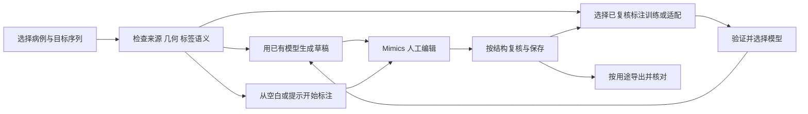

**第二轮：从真实标注场景补查遗漏**

日期：2026-09-30；业务代码基线：`36eac04`。这是一份审查记录，不是已实现的变更说明。与[第一轮报告](2026-09-29-cross-functional-review.md)合读；开发顺序以[交接说明](development-handoff.md)为准，验收以[测试计划](test-plan.md)为准。

用户进一步确认：这是开放、通用的工具，自动草稿后修正、从空白交互标注、使用已有标注微调，三种流程都可能发生。全身器官是重要检验场景，不应成为唯一任务模板；有 Windows 和 Scripting 许可，有 GPU，但各机环境不同。

**上轮不足及本轮调整**

上轮较多围绕单个入口、控件构造和主要 AI 链路检查，未充分覆盖“一个人持续工作、数据不断变化”的情况：等体积人工修正、未保存项目、同名 Mask、多图像项目、中文病例名、复用任务输出以及中途取消。源码规模和测试数量也不能证明这些场景已经成立。本轮补充 12 项 F18–F29，其中 F18、F22 应列为 P0：在具体条件下可能丢失人工工作或改变源文件。P0 是交付阻断优先级，不表示已经在用户真实病例上发生事故。

采用与第一轮相同的证据分级：A 为受控复现，B 为源码链明确但未作目标环境验证，C 为产品/性能假设。A 不等于 Windows/Mimics 实机通过。合成 NIfTI 和文件操作在临时目录内运行，Mimics、子进程和 GPU 边界使用桩；没有接触真实病例，没有实施业务修复。

**场景地图：工具应允许三条主路径交汇**

这三个入口应共享病例身份、目标结构、任务状态和导出语义；不能共享一个含糊的“completed”。计算完成、结果应用、人工复核、项目保存、导出发布是不同事实。单器官用户可隐藏多器官清单；多器官用户可启用模板；高级研究用户可打开训练参数，不要求每个人理解所有算法。

| 真实场景 | 一线用户想完成的事 | 本轮检查到的关键断点 | 涉及视角 |
|---|---|---|---|
| PACS 导出的文件夹混有增强期、重建核、定位片 | 选对那一套影像，保留原空间 | F01；同 shape/affine 不等于同患者，F20 | 产品、数据架构、标注准确性 |
| 两个病例叫“病例甲”“病例乙”，数据和工作目录同盘 | 保持原数据不变，分别训练 | F22 会合并文件身份，硬链接可能改写源图像 | 架构、可维护性、数据准确性 |
| 推理时继续修正肝边界，删一点再补一点 | AI 不覆盖刚做的工作 | F21 的体素计数保护漏检等体积修改 | 使用者、并发、交互承诺 |
| 导入后手工新增一个肾 Mask，尚未保存，再撤销导入 | 只撤销导入产生的东西 | F18、F19 的文件和对象所有权边界不够 | 产品语义、异常恢复 |
| 一个 .mcs 含多期 Image，每期都有 liver | 只补当前目标 Image 的缺项 | F25 全项目同名被当成目标已存在 | 数据模型、标注流程 |
| 概率图、离散多类标签、二值 Mask 来自不同团队 | 明确怎么解释这些数值 | F23 非零化吞掉概率/非法值语义；F24 图像被当 Mask | 产品、输入契约、模型质量 |
| 100 例处理中断，隔天继续 | 知道完成哪些，按剩余项重跑 | F26 陈旧报告、F27 取消台账、F28 输出冲突 | 使用者、稳定性、批量效率 |
| MR 局部结构或部分层面已标，准备训练 | 不把未标区域误作阴性 | D02、F16、F29；需明确任务与验证集语义 | 方法学、产品、质量保障 |

**F18｜P0 / A+B：撤销导入可能删除刚保存进去的人工修改**

- 场景与位置：导入产生的 .mcs 在磁盘上未变化，当前已打开该项目并新增人工标注、尚未保存。[undo_last_import](https://github.com/ShijianRuan/MIMICS_SCRIPTS/blob/36eac0409d89ea1e8bca5c255f9b6c1cf13e1a32/runtime_py35/import_undo_mimics.py#L209)先删除 Mask，随后对磁盘文件取指纹，保存当前项目，再在原指纹匹配时删除整个 .mcs；没有把 `is_project_modified()` 纳入判断。[关键顺序](https://github.com/ShijianRuan/MIMICS_SCRIPTS/blob/36eac0409d89ea1e8bca5c255f9b6c1cf13e1a32/runtime_py35/import_undo_mimics.py#L244)
- 证据：受控项目状态为 dirty，磁盘为导入基线；假 save 写入“含新人工 kidney”的新内容。原函数返回 0，save 一次，最后项目文件不存在。这里特意绕过 F17 的项目查询问题，独立验证删除策略；真实 Mimics 的提示/关闭行为尚未测。
- 为什么严重：确认“撤销导入”不等于同意丢弃之后手工创建、但尚未落盘的对象。文件指纹只能证明磁盘版本，不能证明内存状态；先 save 再 delete 会使新内容一并消失。
- 建议怎么改：任何对象删除之前，捕获当前项目身份、dirty 状态、磁盘版本和 receipt 所有权。只有明确“该文件完全由本次导入新建、当前无后续修改、对象均未改动、发布版本匹配”时才允许整文件回滚。更简单的首个修复是取消自动物理删除，改为事务删除本次未改对象并保存为可恢复副本；具体 UI 文案据此调整。任何查询未知都不得走整文件删除。不要在回滚后才询问保护已丢失的数据。
- 验收：T18。未保存新增、已保存新增、导入 Mask 后续编辑、原生关闭取消、保存失败均保留人工内容；无后续修改时的确切撤销语义写入说明。receipt 仅在核实成功后消费，旧 receipt 不升级为强所有权凭证。

**F19｜P1 / A+B：撤销导入按名称删除，可能删除其他 Image 的同名 Mask**

- 位置：[删除逻辑](https://github.com/ShijianRuan/MIMICS_SCRIPTS/blob/36eac0409d89ea1e8bca5c255f9b6c1cf13e1a32/runtime_py35/import_undo_mimics.py#L131)、[receipt 只记名称](https://github.com/ShijianRuan/MIMICS_SCRIPTS/blob/36eac0409d89ea1e8bca5c255f9b6c1cf13e1a32/runtime_py35/create_mcs_batch.py#L188)。遍历所有 Image 的 masks，只要 name 在列表内就删除，没有 Image/Mask GUID 或导入来源标识。
- 证据：两张合成 Image 各有一个叫 liver 的对象，仅一个代表导入对象；原函数同时删除 imported-A 与 manual-B。同一对象改名则相反，receipt 找不到它，仍可能消费成功。
- API 边界：此函数还依赖 `image.masks` 和 `mask.delete()`；所附 21.0 文档记录的是 `ImageData.linked_objects` 与 container 的 delete，没有找到这两个实例接口的支持证据。目标版本若缺它们，当前可能先报错；上面的桩证明的是名称选择算法，而非真实 Mimics 必然执行删除。开发必须同时核实对象遍历/删除适配，不能在修好 API 后暴露下一层误删。
- 建议怎么改：receipt 保存 project identity、image identity、mask identity、原名称和导入后内容摘要/版本；名称仅用于展示。已改名但 GUID 相同应能定位；相同名称的新对象不应删除；导入对象被人工修正则转入冲突处理。旧 receipt 找到多个候选时停止自动删除并显示候选，不做跨项目猜测。
- 验收：T19，覆盖多 Image 同名、删除后重建同名、重命名、复制 Mask、GUID 在重开后变化的版本行为。先实测身份稳定性，必要时使用本项目写入的 provenance token，而不是假定所有宿主 GUID 都永久稳定。

**F20｜P1 / A+B：AL 将几何相等当作病例相同，异步完成时又不复核目标**

- 位置：[发起前验证](https://github.com/ShijianRuan/MIMICS_SCRIPTS/blob/36eac0409d89ea1e8bca5c255f9b6c1cf13e1a32/runtime_py35/flexict_mimics.py#L1444)、[转换上下文](https://github.com/ShijianRuan/MIMICS_SCRIPTS/blob/36eac0409d89ea1e8bca5c255f9b6c1cf13e1a32/runtime_py35/flexict_mimics.py#L1528)、[完成回写](https://github.com/ShijianRuan/MIMICS_SCRIPTS/blob/36eac0409d89ea1e8bca5c255f9b6c1cf13e1a32/runtime_py35/flexict_mimics.py#L1536)。仅比较 shape/affine，未比较记录中的 source path/病例身份；transaction 没有保存 project/image 身份，完成时创建的是当时活动 Image 的 Mask。
- 两条触发路径：A、B 两个标准化病例共用相同网格，在 B 上请求 A 的 bands；或者 A 发起转换后用户切到 B。多个扫描经规范化后 shape/affine 相同并不罕见，几何不能充当身份。
- 证据：源路径 A 与 B 不同但网格相同，原 `_al_apply_request` 仍提交转换；已记录的 transaction keys 没有目标身份。切换后回写风险由完成函数静态调用链确认。F02 会挡住正常 buffer 回写，修 F02 时必须一并修本项，不能把当前先报文件丢失当成保护。
- 建议怎么改：发起时保存 CaseRef/ProjectRef/ImageRef、source revision、live grid；完成时重新获取并逐项匹配。项目关闭/切换时保留 ready 结果等待用户回到原对象，或显式拒绝本次应用。Mimics 创建和写入时锁定同一目标对象，而不是两次查活动对象。接入已有主线程操作锁、doc_closed 生命周期和幂等应用记录。
- 验收：T20；同网格异病例、同项目切换 Image、转换中关闭重开、重复点击及重放历史请求，均不得向错误 Image 创建或写入对象。

**F21｜P1 / A：等体积人工修正可被推理结果覆盖**

- 位置：[FlexiCT 变化检查](https://github.com/ShijianRuan/MIMICS_SCRIPTS/blob/36eac0409d89ea1e8bca5c255f9b6c1cf13e1a32/runtime_py35/flexict_mimics.py#L837)、[nnU-Net 变化检查](https://github.com/ShijianRuan/MIMICS_SCRIPTS/blob/36eac0409d89ea1e8bca5c255f9b6c1cf13e1a32/runtime_py35/nnunet_mimics.py#L545)。名称与 GUID 匹配后，只比较 `number_of_pixels`。
- 证据：起始 `[1,0]`，人工修改成 `[0,1]`，数量均为 1。两套实际函数都返回同一个可覆盖目标。修改形状、移动边界并保持体积时，这个保护无效。
- 建议怎么改：保存可靠的编辑 generation 或内容摘要，并在每个实际写入步骤前复核。若宿主 obj_changed 通知无法保证涵盖全部编辑，使用快照/摘要兜底；摘要放在哪一层计算与 F13 联合设计，不能为安全无条件在每个 timer tick 拷贝全部 Mask。检测变化后保留当前 Mask，将预测作为新草稿或等待明确冲突处理。用户选择过“更新未改变的 Mask”不代表授权覆盖后来修改。
- 验收：T21；等体积变化、改变后撤销回原内容、结果确认框打开期间编辑、多类结果逐个应用间编辑、目标删除重建全部覆盖。普通未修改目标仍可更新，不能用永久禁用更新来替代功能。

**F22｜P0 / A：病例 ID 归一化碰撞与硬链接覆盖可改写源图像**

- 位置：[safe_identifier](https://github.com/ShijianRuan/MIMICS_SCRIPTS/blob/36eac0409d89ea1e8bca5c255f9b6c1cf13e1a32/tools/nnunet_common.py#L37)、[cache 路径](https://github.com/ShijianRuan/MIMICS_SCRIPTS/blob/36eac0409d89ea1e8bca5c255f9b6c1cf13e1a32/tools/nnunet_pipeline.py#L459)、[输出路径](https://github.com/ShijianRuan/MIMICS_SCRIPTS/blob/36eac0409d89ea1e8bca5c255f9b6c1cf13e1a32/tools/nnunet_pipeline.py#L684)、[link 失败后 copy2](https://github.com/ShijianRuan/MIMICS_SCRIPTS/blob/36eac0409d89ea1e8bca5c255f9b6c1cf13e1a32/tools/nnunet_pipeline.py#L258)。中文或标点/截断后的名字可能得到相同 slug。`os.link` 因目标已存在失败后，`shutil.copy2` 直接写入已存在的目标；目标可能仍是前一个病例原文件的硬链接。
- 证据：实际 `prepare_source_grid_cases` 处理临时 NIfTI，病例甲值为 11、病例乙值为 22。两者都映射到 item；返回两例却只有一个输出图像路径；一份原始源文件 hash 改变，最后两份源图像值均为 11。没有使用模拟 copy/link。发生源改写的条件是文件系统允许硬链接、源/缓存/输出在可硬链接的卷上；跨卷退化为复制时仍有病例合并/错误划分风险，但不应宣称必然改写源文件。
- 扩展影响：[nnU-Net raw](https://github.com/ShijianRuan/MIMICS_SCRIPTS/blob/36eac0409d89ea1e8bca5c255f9b6c1cf13e1a32/tools/nnunet_pipeline.py#L784)和 [FlexiCT AL](https://github.com/ShijianRuan/MIMICS_SCRIPTS/blob/36eac0409d89ea1e8bca5c255f9b6c1cf13e1a32/tools/flexict_pipeline.py#L1224)也使用相同 slug，需一并检查；仅给中文名加英文前缀不能解决截断、大小写和标点碰撞。
- 建议怎么改：生成不可碰撞的稳定内部 case key（可读短名 + 原始身份摘要），保存 original ID 到 internal ID 的双向映射。发现阶段校验唯一性，写任何文件前完成检查。复制到已存在目标应写到新的临时文件再替换目录项；禁止原地截断可能是外部硬链接的文件。可先让源影像采用独立 copy，缓存内部只读文件才允许硬链接；这比维护一个不可靠的零复制承诺更容易验证。共享缓存并发发布须另有同 key 锁，不能仅依赖 Dataset ID 锁。
- 验收：T22；中文名、`a b`/`a_b`、大小写、96 字截断、网络路径、重复运行、并行任务均测试。所有输入及其同 inode 链接的 SHA-256 前后完全一致；train/val identity 不重叠；重复目标不覆盖。只用文件数或“训练没有报错”不够。

**F23｜P1 / A：概率图、二值图和非法数值没有统一解释规则**

- 位置：[binary reader](https://github.com/ShijianRuan/MIMICS_SCRIPTS/blob/36eac0409d89ea1e8bca5c255f9b6c1cf13e1a32/mimics_bridge.py#L913)、[多标签 reader](https://github.com/ShijianRuan/MIMICS_SCRIPTS/blob/36eac0409d89ea1e8bca5c255f9b6c1cf13e1a32/mimics_bridge.py#L918)、[训练标签读取](https://github.com/ShijianRuan/MIMICS_SCRIPTS/blob/36eac0409d89ea1e8bca5c255f9b6c1cf13e1a32/tools/nnunet_pipeline.py#L519)。非整数浮点图在多标签入口被 `!=0` 二值化；binary 入口还没有相同的有限值检查。
- 证据：输入 `[0.01,0.49,0.51,0.99]` 全部导成 1；`[0,NaN,Inf,1]` 经 binary reader 得到 `[0,1,1,1]`。上游输出非零小概率时，可能几乎整幅体积被当作器官；非法数据又可能进入训练。
- 建议怎么改：每个 MaskSpec 明确 binary / integer_labelmap / probability、选定 label IDs、概率阈值与背景规则；未声明的浮点概率图询问或拒绝，不擅自选 0 或 0.5；0/255 二值图可显式映射。所有入口共用 finite/range/维度/affine 校验。离散多类输入必须显示将拆分哪些标签，不能把所有非零类别暗中 union 成一个器官。
- 验收：T23，纳入 0/1、0/255、负值、NaN/Inf、概率、单个多类 labelmap、Slicer 分层 segmentation 等输入。暂不支持的格式明确拒绝并给出转换说明；不能仅凭后缀宣称支持完整格式语义。

**F24｜P1 / A：补齐 Mask 的平铺目录回退把 CT 图像也当成 Mask**

- 位置：[_source_case_root/_source_masks](https://github.com/ShijianRuan/MIMICS_SCRIPTS/blob/36eac0409d89ea1e8bca5c255f9b6c1cf13e1a32/tools/sync_missing_masks.py#L63)。没有 segmentations 子目录时退到 case 根，并把所有 `.nii.gz` 当 Mask，不排除 `ct.nii.gz` 等主影像。
- 证据：一个目录含 ct.nii.gz 和 liver.nii.gz，实际函数返回 `ct`、`liver` 两个待补 Mask。若 CT 为整数多值，后续可能因“多标签不接受”失败整例；若正好二值影像则可能添加错误 Mask，因此不笼统声称总能写入全身 Mask。
- 建议怎么改：复用已验证的数据 profile/manifest，分开 image 与 masks 的显式清单；有歧义时让用户确认，不能自动推断目录内所有文件用途。支持后缀及排除规则应与导入主入口一致；预检摘要列出每例将添加的结构，不只显示总病例数。
- 验收：T24，平铺图像+Mask、分目录、单文件多类、存在非 Mask 派生图、多个主影像，确保范围正确且失败局限于该例。

**F25｜P1 / A：多 Image 项目的补齐逻辑会错误跳过缺失器官**

- 位置：[_mask_names](https://github.com/ShijianRuan/MIMICS_SCRIPTS/blob/36eac0409d89ea1e8bca5c255f9b6c1cf13e1a32/runtime_py35/sync_missing_masks_batch.py#L122)、[missing 判定](https://github.com/ShijianRuan/MIMICS_SCRIPTS/blob/36eac0409d89ea1e8bca5c255f9b6c1cf13e1a32/runtime_py35/sync_missing_masks_batch.py#L232)。先取全项目名称集合，再判“完整”，甚至还未确定目标 Image。
- 证据：目标 Image A 没有 liver，另一 Image B 有 liver，函数直接返回 skipped / complete already。
- 建议怎么改：病例条目必须绑定目标 Image/source series；取该 Image 的 masks 后再做规范名称匹配。多候选 Image 需要显式选择或错误提示，不能默认第一个活动 Image。已有空 Mask 是否“已完成”属于任务语义，不能为了补齐自动覆盖人工清空结果；应分别显示已有、空、缺失、未复核。
- 验收：T25，同名异 Image、正确 Image 空 Mask、左右别名、一个器官多个重建版本。确认原有 Mask 内容、名称、可见性和 image 绑定均未改动。

**F26｜P1 / A：检查任务启动失败，可能返回上次的成功报告**

- 位置：[launcher 轮询与结束](https://github.com/ShijianRuan/MIMICS_SCRIPTS/blob/36eac0409d89ea1e8bca5c255f9b6c1cf13e1a32/tools/inspect_mcs_projects.py#L155)。固定 report 路径在新进程启动前未写入新 job identity；新进程先退出时，直接读取旧 report，按其 completed 返回 0。
- 证据：事先放入旧 completed 报告，模拟新进程退出码 1，实际 launcher 返回 0。真实进程如果在后台脚本写 running 之前因许可/导入异常退出即可触发该逻辑。
- 建议怎么改：每次生成唯一 job_id/attempt_id，状态与报告须含该 ID；启动前写独立 pending 状态，历史结果保留为历史；成功同时要求本轮 ID、完整病例结果、合理进程退出和 terminal 状态。状态写入失败、报告不匹配都是失败/未知。秒级目录名不足以保证双击唯一。
- 验收：T26，旧成功+新启动失败、旧失败+新成功、两个同秒任务、后台未写状态、报告损坏、部分病例失败，不能返回虚假的整体成功。

**F27｜P2 / A+B：取消补齐任务后，已完成病例的详细结果丢失**

- 位置：[取消提前 return](https://github.com/ShijianRuan/MIMICS_SCRIPTS/blob/36eac0409d89ea1e8bca5c255f9b6c1cf13e1a32/runtime_py35/sync_missing_masks_batch.py#L343)、[仅正常尾部写台账](https://github.com/ShijianRuan/MIMICS_SCRIPTS/blob/36eac0409d89ea1e8bca5c255f9b6c1cf13e1a32/runtime_py35/sync_missing_masks_batch.py#L380)。另检查了两个新 launcher：只在启动异常分支 release，未接入已有 process registry；inspect 没有协作式 stop 入口。进程死亡后的 stale-lock 回收可能有效，不能把这些观察直接称为永久锁死。
- 证据：完成 A 后写 stop，准备 B 时取消。最终 status 为 cancelled、completed=1，但 results.json 和 failed_cases.json 都不存在；用户无法从正式结果文件核对 A。
- 建议怎么改：逐例写 durable 结果，取消/异常在 finally 发布一致快照；每个病例含未开始/处理中/成功/失败/跳过及输入/输出版本。把新工具接入现有进程登记、自己的 stop marker、超时终止与 reap；资源由持有者明确释放。取消确认应说明“当前例写入会完成/回滚后再停”，不要用 Stop All 作为日常操作。
- 验收：T27；等待锁、转换中、保存中、两例之间、controller 被关掉分别中断。已完成结果可查，剩余项可续跑，不以不存在的输出假装成功，也不删除别的任务进程。

**F28｜P1 / A+B：原子替换不能防止后台覆盖较新的人工保存**

- 位置：[sync 打开基线](https://github.com/ShijianRuan/MIMICS_SCRIPTS/blob/36eac0409d89ea1e8bca5c255f9b6c1cf13e1a32/runtime_py35/sync_missing_masks_batch.py#L193)、[发布](https://github.com/ShijianRuan/MIMICS_SCRIPTS/blob/36eac0409d89ea1e8bca5c255f9b6c1cf13e1a32/runtime_py35/sync_missing_masks_batch.py#L100)、[append 发布调用](https://github.com/ShijianRuan/MIMICS_SCRIPTS/blob/36eac0409d89ea1e8bca5c255f9b6c1cf13e1a32/runtime_py35/append_masks_batch.py#L294)。后台基于旧 .mcs 改写 staging，最后 os.replace；没有核对目的文件在期间是否被前台/其他工作站保存过。仓库资源锁约束合作脚本，不能自动约束 Mimics 原生保存和其他工作站。
- 证据：真实临时文件模拟“目标已是较新前台保存”，原 `_publish` 直接以旧快照替换。真实并发保存及文件锁行为仍需 Windows 验证；某些版本文件被占用时会拒绝替换，但不能把偶然占用当版本冲突协议。
- 建议怎么改：开工记录输出基线身份，发布前进行版本冲突检查；冲突保留 staging 为带 job_id 的新副本供核对。只做 compare-then-replace 仍有检查与发布间竞态，无法锁住所有作者时默认导出新路径，不承诺可靠原位更新。对有“前台正在编辑”信息的本机任务直接避免同文件原位作业。多工作站共享目录先明确单写者范围，不要求引入服务端锁系统。
- 相邻 UX 缺口：`--force` 被写入配置，但 sync worker 没有读取；现有输出会被视为已有 superset 并打开。应明确“继续补齐已有输出”和“覆盖/重建”两个动作，至少让参数文案与行为一致。
- 验收：T28；后台开工后人工保存、网络断连、旧输出源版本变化、无 force、显式续跑。较新数据保留，冲突可见，不能只验 `.mcs` 最终存在。

**F29｜P2 / A+B：FlexiCT 的颅尾分层把最大 spacing 轴当成了头脚轴**

- 位置：[训练划分](https://github.com/ShijianRuan/MIMICS_SCRIPTS/blob/36eac0409d89ea1e8bca5c255f9b6c1cf13e1a32/tools/flexict_pipeline.py#L289)、[独立数据脚本](https://github.com/ShijianRuan/MIMICS_SCRIPTS/blob/36eac0409d89ea1e8bca5c255f9b6c1cf13e1a32/integrations/flexict-finetune/scripts/build_dataset.py#L31)。`argmax(spacing)` 在轴向各向异性 CT 上可能碰巧适用，等体素 RAS 数据会选 X；重采样/其他朝向也不满足假设。
- 证据：RAS 等体素 10³ 图像，唯一目标位于 x=1,z=8；现有 `_zstart` 得到 0.1，实际头脚体素轴比例为 0.8。生产划分使用相同选择逻辑，本次未声称已经导致具体 Dice 降低。
- 建议怎么改：如果确需颅尾覆盖分层，按 affine 的物理 SI 坐标计算目标相对扫描范围，处理翻转与斜位；或者先采用患者级固定随机/分组划分，去掉不准确的解剖分层承诺。与 F16 一起冻结验证集，记录策略和随机种子。独立脚本还应拒绝只有 1 例或 n_train≤0 的输入，避免 `step = len/n_train` 除零。
- 验收：T29，等体素、各向异性、轴置换、翻转、斜位的同一物理目标排序一致；患者组不泄漏，微小数据集有明确错误而非悄然降级。

**产品与模型边界：上轮还需要补充的决策**

| 决策 | 问题与建议 | 轻量落地方式 / 不应承诺的能力 |
|---|---|---|
| D01 三类主入口 | 不把“训练”当预测前必经步骤，也不把“自动多器官草稿”作为交互标注前提 | 一个任务选择区进入预测、交互、训练；共用病例/结构上下文，保留现有脚本入口供熟练用户使用 |
| D02 标注完整性 | 文件存在或 Mask 非空，不代表完整标注；未标、未覆盖、真实缺失、已复核阴性不同 | 可选结构状态+已标区域/切片范围；第一版只让明确完整的数据进入普通监督训练。已有 require_all 默认与 background tooltip 应保留；这些提示不能证明文件内容已完整 |
| D03 重叠结构 | 肝脏、血管、病灶既可嵌套也可独立，不应自动按最后一个标签覆盖 | 默认保留重叠拒绝和体素数量反馈；有真实层级任务再加入 region 方案与双向映射。不能把当前 wrapper 的限制说成 nnU-Net 永远不支持层级区域 |
| D04 数据与模型适用性 | CT、不同 MR 序列、小视野、术后/异常解剖的适用范围不同 | 模型卡保存 modality、训练标签集、预处理、spacing 范围、数据来源与限制；不按文件名 ct/mr 单独断定适用；用户可明确 override 并记录理由 |
| D05 真实提效指标 | 平均 Dice 高不等于少修改、不会漏小器官，也不等于界面好用 | 每病例/结构人工分钟数、交互次数、漏项、返工、边界/小结构质量；用人工最终审阅作为交付完成依据，不能以模型自评替代 |
| D06 能力按当前环境可见 | 单机无 GPU、GPU 忙、模型未装、仅远程可用，都不应导致整个工具不可用 | 启动快速缓存体检+运行前按需复核；禁用动作旁说明原因及补救，模型安装/下载不嵌入 Mimics 主线程 |
| D07 可选组织方式 | 开放工具不应硬编码全身117个结构或某一个 dataset 目录规范 | profile 保存命名/来源/器官模板；默认简单，只有确有第二种数据形态时扩展；小型 dataclass/JSON 契约即可，不引入通用插件总线 |

nnU-Net 上游已经提供 ignore-label 部分监督和 region-based training。它们是可用设计资源，但不是自动修复：一个器官未知、另一个已知的“按类别缺标”，不能靠给所有背景加一个全局 ignore 就完整表达；第一版可用完整标签筛选或拆分二值任务，之后按实际需求扩展。region 也仍要求可表达的整数标签图与确定顺序，必须验证输入和输出重建。[上游 ignore-label](https://github.com/MIC-DKFZ/nnUNet/blob/master/documentation/ignore_label.md)、[上游 region 契约](https://github.com/MIC-DKFZ/nnUNet/blob/master/documentation/region_based_training.md)

**对 Mimics 与外部算法分工的进一步判断**

第一轮“nnU-Net 是自然的多器官草稿路线”需要补上前提：用户必须已经拥有适配的已训练模型；框架本身不会凭空提供全身器官权重。仓库的 TotalSegmentator-like 数据目录也不等于已有 TotalSegmentator 推理入口。针对开放工具，可增加一个可选 pretrained-provider 适配，把结果交给同一几何/对象保护层，而非再做一套结果回写。

TotalSegmentator 官方提供 CT/MR 的不同任务、ROI 子集、低分辨率速度选项和 label 映射，值得作为多器官草稿候选基线；当前任务、权重、模型标签数和许可需按固定版本记录，不能沿用旧论文数字作为当前所有任务承诺。候选应与现有模型在同一组真实案例上比较标注时间和小结构质量，本轮没有下载模型或验证其本地效果。[官方仓库](https://github.com/wasserth/TotalSegmentator)、[原 CT 论文](https://arxiv.org/abs/2208.05868)

Materialise 官方产品页也展示了特定解剖/模态的自动分割能力。因此在实际版本/模块可用时，应先评价其原生操作是否已够用，再选择外部扩展。此次能取得产品页检索摘要，直接页面访问失败；没有据此推断具体许可包含哪些功能，也没有确认这些功能能否通过用户版本 API 调用。[Materialise 自动分割页面](https://www.materialise.com/zh/healthcare/mimics/ai-enabled-segmentation)

对交互修正，Mimics 原生多层编辑、区域生长、形态学与可视化仍有价值；模型结果是可比较的草稿。模型分歧排序可定位难例，但高一致性也可能共同犯错。轻量创新顺序宜按实际使用选择：结构清单/下一未完成项、变更差异预览、结果 ready 收件区、导出质检、稀疏标注与训练资格提示。先复用原生视图定位与 Mask，不重造独立医学影像浏览器。

**UX/视觉补充：把使用中的状态设计清楚**

| 界面环节 | 功能可用的最低要求 | 达到精美、顺畅的进一步要求 | 验收编号 |
|---|---|---|---|
| 数据选择与预检 | 精确显示选中几例、每例哪个系列/结构、输出在哪里 | 摘要置顶，问题逐项定位；路径中段省略但可完整复制；保留上次有效选择 | T10、T24、T30 |
| 大任务运行 | 当前任务、队列位置、阶段、取消范围可辨认 | 不用无依据的百分比；区分计算/应用/保存；无进度时显示最近活动；用户在 Mimics 编辑时不抢焦点 | T13、T27、T35 |
| 结果就绪与冲突 | 保留预测和人工 Mask，用户知道即将更新谁 | 显示新增/删除体素、结构名、源病例；可先预览再应用；一个上下文内一个主动作 | T20、T21、T34 |
| 标注导航 | 标识当前病例、Image、结构与当前切片/三维作用域 | 快捷键有提示、不与 Mimics 冲突；下一未复核项、只看待处理；颜色与文字同时表达状态 | T33、T38 |
| 空/失败/禁用状态 | 不可用时不能呈现可点击假象；错误不被刷新覆盖 | 说明缺哪一步，提供修复/重试/打开日志；表格摘要与操作反馈分区 | T03、T09、T14、T15 |
| 训练高级参数 | 默认参数能正确运行；不误把未知标签当背景 | 摘要先显示样本与标签完整性、成本和设备；专家参数折叠；选项说明接近控件 | T16、T31、T32 |
| 小屏/高 DPI | 所有关键按钮可访问 | nnU-Net 窗口 minimumSize=780×650：需实测 1366×768、150% 下逻辑可用高度不足问题；表单滚动不等于固定底栏始终可见 | T37 |

视觉不宜仅以“统一蓝色”验收。需要同时验文字层级、信息密度、可操作状态、错误定位、键盘路径与等待体验。已有 tabs/scroll area 不应删除；一页组件状态规范和少量截图基线足够。新术语建议固定：未开始、草稿、编辑中、已复核、已保存、已导出；任务状态另用排队、运行、结果就绪、应用中、失败、取消请求中、已取消。

**本轮验证与保留的未知**

12 个场景探针均成功执行并记录当前行为；“成功执行”表示复现脚本完成，不表示被测产品通过验收。F28 的文件替换、F29 的计算结果是受控局部证据，真实跨进程/模型效果仍是 B。见[场景结果](2026-09-30-evidence/scenario-results.json)和[可重跑脚本](2026-09-30-evidence/reproduce_scenarios.py)。

扩展现有测试共 7 套，5 套通过：nnunet_integration 85 项、cross_workflow 2 项、fake imports/export/append 分别 3/4/1 项。FlexiCT 91 项中 3 failures（macOS `/var` 与 `/private/var` 路径字符串断言）和 7 errors（1 项缺 torch、6 项缺 backbone 权重）；model_portability 15 项中 12 errors 均与缺 torch 有关。为分类错误另保存了一次 FlexiCT 完整输出。没有用这些环境依赖错误冒充新产品 bug，也没有把本轮说成全绿。[矩阵记录](2026-09-30-evidence/regression-results.json)、[FlexiCT 输出](2026-09-30-evidence/flexict-test-output.txt)

保留未知：目标 Mimics 版本/build与其 API 签名、真实事务/Undo行为、Windows NTFS/SMB 对并发保存和硬链接的具体限制、GPU/驱动组合、真实输入分布、模型权重质量与工作时间收益、远程服务器实际恢复。缺这些材料不妨碍修复已证实的本地数据/控制流问题，但最终兼容性和效果必须由现场验收补齐。
