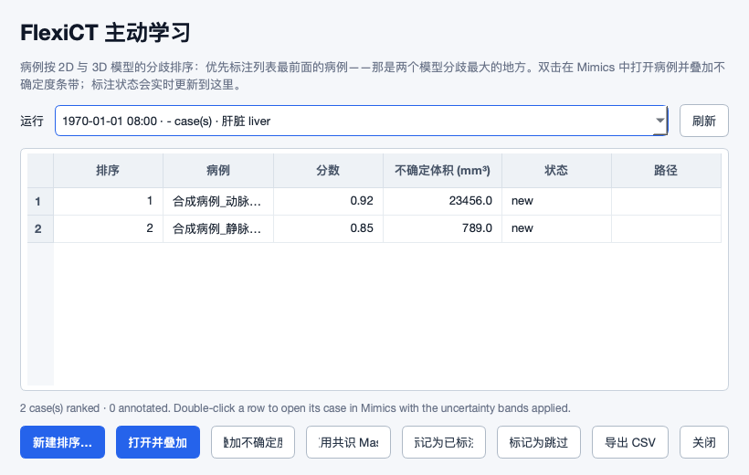
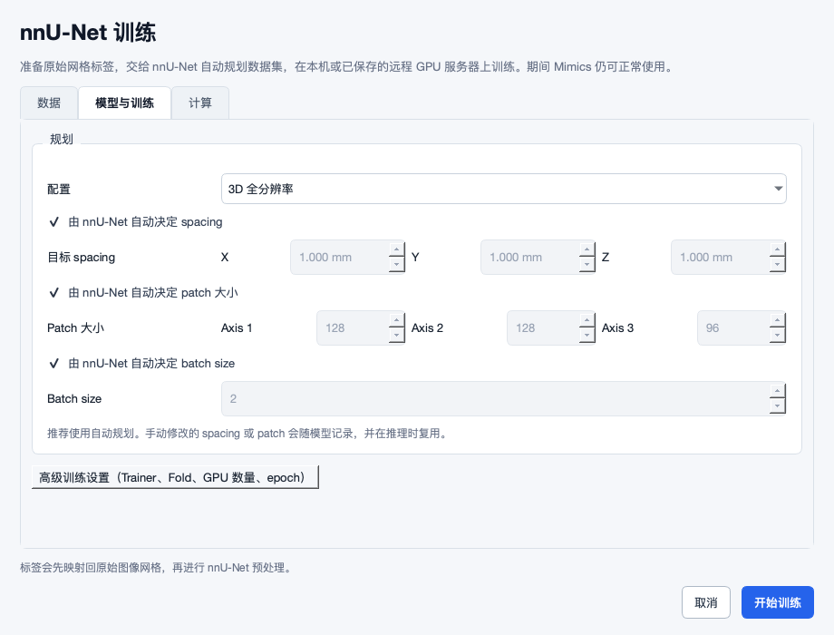
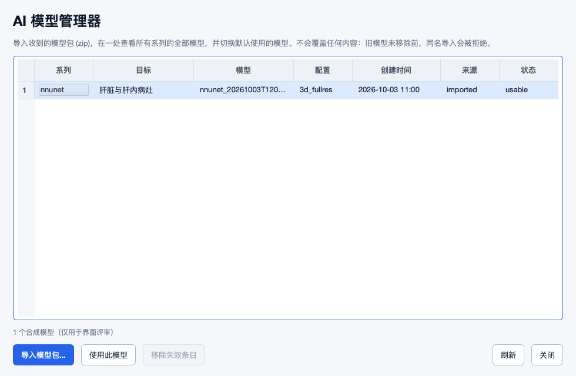

# 2026-10-03：远程更新后的复核与真实标注场景补查

本轮审查的是 `al-review-loop` 的 **`f02cfad4a7b030ac017e0ba30ce8f6f6911f500e`**。已 fetch 并 fast-forward，从上次撤回后的 `03f2f87` 更新了 88 个提交。只新增审查材料和隔离复现脚本，没有修改业务代码、业务配置、模型或病例。本报告不是功能修复交付。

**结论：改进明显，但不能按旧账本的 27 项 closed 宣布问题全部解决。** F01–F29 中，18 项已有代码/本地回归层面的修复证据，9 项部分解决，F01 仍存在，F05 仍待决定。另记录 F30–F37 共 8 项新增问题。最应优先处理的是错误病例叠加、后台覆盖人工保存、导出名称/图像归属、撤销链路；继续增加模型种类的收益目前低于修好这些基本环节。

这次特意改变检查方法：不仅调用单个 helper，还检查“写出→改名→回执→撤销”“原病例名→内部训练名→重建 split”“按钮 signal→slot”等跨模块关系。19 个合成探针和真实 Qt 点击发现了现有单元测试没有覆盖的问题。全部结果见 [证据与复跑说明](2026-10-03-evidence/README.md)、[机器记录](2026-10-03-revalidation.json)；每个菜单的操作要求和开发测试步骤见 [场景交接](2026-10-03-workflow-handoff.md)。

## 证据边界与判定规则

- 本机为 macOS，临时 Python 3.12 环境；目标为有 Scripting 许可的 Windows Mimics。用户具体 Mimics 版本、显卡型号和驱动尚未给出。未在本机运行真实 Mimics、CUDA 或模型权重。
- **A：受控执行**，运行当前生产函数、临时文件或真实 Qt 控件；Mimics 对象与进程边界按探针说明替换。A 不等于真实患者数据或真实 Mimics 已验证。
- **B：源码链/接口证据**；**C：产品取舍或需要测量的风险**。没有把待测项写成已发生的故障。
- “原问题有修复证据”只针对原触发条件。GPU 输出质量、Windows DPI、Mimics 对象方法存在性、真实撤销栈仍需要目标环境验收。
- 现有 `docs/history/changes_2026-09-30_ai_real_data_validation.md` 是其他环境/分支的报告，提供有价值的真实实验记录，但本机不能读取其 G: 工件；报告中的代码状态也不自动等于当前提交。下文单列差异。

## 旧问题逐项复核

“有修复证据”不是把 target_environment_validation 改成 passed。下面的测试名称指当前 `tests/` 布局；历史文档中的 `tools/test_*.py` 路径已经迁移。

| 编号 | 本轮判定 | 已做对的地方 | 剩余边界 / 依据 |
|---|---|---|---|
| F01 DICOM 系列/多帧 | **仍存在** | 其他几何保护仍在 | 当前探针仍把两个各 3 层系列算成 `[4,4,6]`；声明 60 帧的单文件算成 `[4,4,1]`。多帧探针只证明 header 缺口 |
| F02 AL buffer 提前清理 | **部分解决** | 清理移到 finally；转换前检查 buffer；成功应用测试通过 | 失败回滚仍调用无版本证据的 `mask.delete()` 并吞异常。不能声称失败后必无残留 |
| F03 AL 非空列表异常 | 有修复证据 | Qt 名字作用域修复 | 真实 Qt 非空列表构造/选择通过；没有真实 AL GPU 运行 |
| F04 首次排序无入口 | 有修复证据 | 新建排序按钮、后台提交、状态反馈可达 | 仍需 2D/3D 模型对，缺模型的恢复见场景交接；不是无模型也能排序 |
| F05 叠加即完成 | **未解决，待决定** | 账本已改为 user_decision | `_al_finish_conversion` 仍自动 `_al_mark_annotated`。看过不确定区域与审核完成语义不等价 |
| F06 推理依赖 backbone | 有代码/契约测试证据 | 推理环境传 `FLEXICT_SKIP_BACKBONE=1`，加载器有分支 | 未实际加载迁移模型验证参数完整性；不能据 mock 认定迁移真机通过 |
| F07 修复包名错误 | 有修复证据 | import 名与 pip 包名映射修正 | 环境修复语义测试通过；下载代理/网络/新 Python 版本仍需实机 |
| F08 损坏 import 假健康 | 有修复证据 | import 错误计入 all_ok | 与新 F36 不矛盾：后端检查修好，健康窗口另有启动错误 |
| F09 模型选择按钮不可用 | 有修复证据 | selectionChanged 更新按钮状态 | 真实 Qt 选择动作通过；模型兼容性和身份可读性不是同一问题 |
| F10 多选扩大导入范围 | 有修复证据 | 精确逐项 multi_single，不扩大父目录 | 分类/选择测试通过；同秒不同提交仍有 F35 |
| F11 后台线程操作 UI | 有修复证据 | reaper 只置状态，timer 线程收尾 | GUI 线程契约测试通过；Mimics timer 回调线程仍须实测 |
| F12 修复升级 Torch | 有代码/契约测试证据 | 修复路径使用固定 Torch/vision 配对 | 不能把固定 cu124 解释为所有 NVIDIA 驱动均兼容；目标环境先能力探测 |
| F13 前台卡顿/锁占用 | **部分解决** | 流式写 buffer，提早释放长时锁 | 导出调用没有传 progress_callback，33 MiB 探针确认无中间 GUI pump；单次 host get/set 的停顿仍未测 |
| F14 错误被刷新覆盖 | 有修复证据 | AL 请求失败内容保留 | 真实 Qt 错误场景通过；不能推出其他窗口反馈全覆盖 |
| F15 禁用态/列宽 | **部分解决** | 禁用主按钮颜色、表头宽度改善 | 模型长 ID 仍省略；AL 最小宽度下按钮文案被切；详见 F37 |
| F16 患者分组/冻结验证 | **部分解决** | 分组 helper 与英文 case 重建有测试 | 中文 case 冻结失效；FlexiCT 最终重新写 split，丢弃患者分组；GUI 未提供 patient_groups 入口 |
| F17 项目状态查询 | 有修复证据 | 使用 get_project_information/is_project_loaded，unknown 拒绝切换 | 本地状态分支通过；未命名、Save As、API 差异仍进真机验收 |
| F18 撤销删除人工工程 | **部分解决** | 增加会话/磁盘检查，新增人工 Mask 场景得到保护 | 检查发生在删除之后；无法精确回滚干净导入；错误吞掉、回执丢失另见 F30/F31 |
| F19 同名 Mask 误删 | **部分解决** | v2 GUID/token 改善所有权选择 | v1 仍按全项目同名删除；`image.masks`/实例 delete 未证明支持；严格接口桩报错 |
| F20 AL 错病例应用 | **部分解决** | 记录启动时项目/Image，挡住运行中切换 | 启动时已经在错误病例 B、与 A 同网格时仍通过；后续 guard 也通过 |
| F21 等体积修改漏检 | 有修复证据 | 增加内容 digest；缺 digest 不直接覆盖 | 原等体积触发条件得到保护；digest 成本/确认期间再编辑仍是真机边界 |
| F22 case 名碰撞/硬链接 | 有修复证据 | 唯一 case key；写入前断开目标硬链接 | 原源文件污染触发条件有测试保护；训练名映射的后续 F16 不是同一层 |
| F23 浮点/非有限 Mask | 有修复证据 | 概率图/NaN/Inf 入口校验补齐 | bridge 相关测试通过；标签本体、负值/超大 ID、重叠语义仍需明确约束 |
| F24 将源 CT 当 Mask | 有修复证据 | 平铺来源排除已识别图像 | 原平铺单图像场景有保护；多模态/多候选图像仍需系列选择策略 |
| F25 多 Image 补 Mask | 有修复证据，功能降级 | sync 明确拒绝多 Image 工程，防误绑 | 这是安全拒绝，**不是支持多期工程**；导出另有 F33，不能泛化已解决 |
| F26 旧报告假成功 | 有修复证据 | worker/launcher 校验 job ID 与终态 | 本地后端报告关联测试通过；UI 请求身份另有 F35 |
| F27 取消无结果账单 | 有修复证据 | finally 写部分结果/失败清单 | 取消测试通过；磁盘写满时账单自身失败需目标故障演练 |
| F28 旧快照覆盖新保存 | **部分解决，优先阻断覆盖路径** | 能检测启动时已存在、发布前发生变化的一部分目标 | 初始不存在及检查后保存两种窗口都可覆盖，两个独立探针已复现 |
| F29 颅尾分层轴错误 | **部分解决** | 标准 RAS 等体素场景不再误选最大 spacing 轴 | 矩阵列/行解释错误且忽略轴翻转；相同物理目标得到 0.8 / 0.1，已独立复现 |

## 仍需处理的旧问题：具体残留

### F20：比较了“是否还是启动对象”，没有证明“启动对象就是请求病例”

位置：[发起转换](https://github.com/ShijianRuan/MIMICS_SCRIPTS/blob/f02cfad4a7b030ac017e0ba30ce8f6f6911f500e/runtime_py35/flexict_mimics.py#L1411)、[完成 guard](https://github.com/ShijianRuan/MIMICS_SCRIPTS/blob/f02cfad4a7b030ac017e0ba30ce8f6f6911f500e/runtime_py35/flexict_mimics.py#L1614)。证据 A+B，P1。

标注者打开 B，在 AL 列表选择 A，点击“叠加不确定度”或“应用共识 Mask”。A/B 经统一重采样，shape/affine 相同。`input_geometries.json` 有 A 的源路径，当前源为 B；发起函数只比较几何，然后把 B 的 Image GUID 记录为目标。探针得到 `requested_case=patientA`、`captured_project=patientB.mcs`、`request_state=converting`，完成 guard 返回空错误。

**怎么改：**发起前先核对请求 case 与活动 Image 的来源身份，再捕获不可变目标；完成前复核身份、几何版本及目标内容版本。来源不明确就保留结果并要求显式定位病例，不用 shape/affine 代替身份。路径须统一大小写/别名规则；源移动后允许用户重新绑定，不悄悄猜测。测试同时覆盖“启动前已错”“转换中切换”“切回同项目但不同 Image”“原 Image 被重采样”。

### F28：版本检查不是不可覆盖发布

位置：[publish_conflict](https://github.com/ShijianRuan/MIMICS_SCRIPTS/blob/f02cfad4a7b030ac017e0ba30ce8f6f6911f500e/runtime_py35/runtime_common.py#L544)。证据 A+B；本轮建议 P0，限于可能覆盖人工工程的发布路径。

两种复现：①启动时目标不存在，identity 是空字符串，期间人工创建同名工程，`if expected` 跳过冲突检查，旧 worker 结果覆盖新文件；②已有目标通过检查后、`os.replace` 前插入一次人工保存，同样被覆盖且无警告。第二个探针用确定性拦截模拟时间窗口，不依赖随机抢占；第一种甚至不需要极短竞争窗口。重试 replace 还会延长未经重新核对的窗口。

**怎么改：**最小可靠方案是后台始终输出唯一 job 结果文件，明确显示“待替换/合并”，原工程保持不变；完成人工确认和版本复核后再发布。仅增加 stat 次数无法抵御不遵守 repo 锁的 Mimics 原生保存。必须区分“原本不存在”“无法 stat”“原本存在”，冲突结果名也要含唯一 job ID，避免同 PID 重试覆盖上次冲突副本。若仍保留自动覆盖，需要证明目标平台的发布机制确实具备所需原子条件，并有版本恢复；不能继续以“永不覆盖新文件”描述当前实现。

### F16：内部 case key 与原 case ID 混用

位置：[raw 数据集发布/旧 split 读取](https://github.com/ShijianRuan/MIMICS_SCRIPTS/blob/f02cfad4a7b030ac017e0ba30ce8f6f6911f500e/tools/nnunet_pipeline.py#L898)。证据 A+B，P1。

`splits_final.json` 保存 `nnunet_case_id`，再次读取时却直接与 `row['case_id']` 交集。6 个“病例0…病例5”构建后，保持 seed=2026、增加 2 例重建，原验证病例“病例4”进入训练；传入 split helper 的 frozen_validation 为 None。现有冻结测试使用 `case0`，其内部/外部名相同，掩盖了问题。

**怎么改：**读取上一版 manifest 的 `nnunet_case_id→case_id→patient_group` 映射，冻结稳定原身份，再转换到新版内部 key；映射丢失/冲突时要求明确重建 split，而非静默遗忘。增加中文、空格、同 slug、增删病例、患者合并、已有 fold 非 0 的测试。默认只有 fold-0 被冻住，不能在产品文案中泛化“所有旧验证指标都仍独立可比”。患者分组应在数据预检可导入/预览；没有映射时明确显示“按病例独立划分”，不要隐藏该假设。

**FlexiCT 还有第二个独立缺口：**`_materialize_flexict_raw` 复用共享分组后，[训练调用链](https://github.com/ShijianRuan/MIMICS_SCRIPTS/blob/f02cfad4a7b030ac017e0ba30ce8f6f6911f500e/tools/flexict_pipeline.py#L762) 紧接着 `_write_flexict_splits`，用不读取 patient_group/frozen set 的 `_split_train_val` 覆盖文件。探针传同患者两期与分组映射，最终一例 train、一例 val。修复必须覆盖最终落盘的 splits_final.json 和远程传输版本，而不只修共享 helper；先满足患者与冻结约束，再做颅尾分层。

### F29：affine 的行列混淆与轴翻转仍使颅尾分层随存储方式改变

位置：[physical_si_start](https://github.com/ShijianRuan/MIMICS_SCRIPTS/blob/f02cfad4a7b030ac017e0ba30ce8f6f6911f500e/tools/flexict_pipeline.py#L296)、[独立数据脚本](https://github.com/ShijianRuan/MIMICS_SCRIPTS/blob/f02cfad4a7b030ac017e0ba30ce8f6f6911f500e/integrations/flexict-finetune/scripts/build_dataset.py#L34)。证据 A+B，P2。

当前用 `affine[:3,:3] @ [0,0,1]` 取第三个**体素轴的世界方向**，再把其最大世界坐标分量的索引当成**体素轴号**。这与寻找哪个体素轴沿 SI 不是一件事；随后 abs 和 min index 又丢失翻转方向。3 组 10³ 合成数据的目标均位于世界坐标 `[1,2,8]`，RAS 得 0.8，Z 翻转/XYZ 循环置换都得 0.1；两个实现一致出错。

现有 8 项 build_dataset 测试全部通过，但 flipped_z 测试固定同一体素索引并期待相同值，没有保持物理目标不变，因此不能验证所宣称的不变量。修改为用目标世界 SI 范围相对图像世界 SI 范围的定义，并明确体素中心/边界、空目标与斜位规则；若只是粗分层，也应写明近似范围，不能宣称任意方位等价。测试由同一个物理 phantom 变换生成多种存储朝向，预期从世界坐标独立计算，不复制实现公式。

### F13：分块写入改善内存，并未自动让 UI 可响应

位置：[_stream_mask_to_file](https://github.com/ShijianRuan/MIMICS_SCRIPTS/blob/f02cfad4a7b030ac017e0ba30ce8f6f6911f500e/runtime_py35/mimics_export.py#L1159)、[stream_buffer](https://github.com/ShijianRuan/MIMICS_SCRIPTS/blob/f02cfad4a7b030ac017e0ba30ce8f6f6911f500e/runtime_py35/runtime_common.py#L49)。证据 A+B；实际卡顿时间 C，P1。

默认 progress_callback=None，前台导出调用也没有传。33 MiB buffer 经过多个 chunk，仍没有中间 GUI pump。`get_voxel_buffer` 的整块复制和内容 digest 也有宿主成本。不能据“用了流式写”接受 README 的绝不阻塞承诺。

**怎么改：**先测量宿主读取、复制、hash、磁盘写和 set 的独立耗时；按预算在主线程逐段调度，外部处理只接触已脱离宿主的不可变数据。不要直接把 Mimics 对象交给后台线程，也不要在未建立重入/目标版本保护前随意调用 update_gui。无法切片的宿主 API 应展示短暂不可交互阶段并记录耗时。建议门槛见交接，门槛是验收目标，不是当前性能数据。

## 新增问题与修改建议

### F30：批量导入成功后，撤销回执指向已消失的临时工程

- **P1，A+B；影响导入→检查→发现选错→撤销。** [调用顺序](https://github.com/ShijianRuan/MIMICS_SCRIPTS/blob/f02cfad4a7b030ac017e0ba30ce8f6f6911f500e/runtime_py35/create_mcs_batch.py#L1410)：`create_mcs_from_manifest(work_dir, staging_mcs)` 内写回执，随后 `_publish_mcs(staging_mcs, mcs_path)` 改名。回执的 `mcs_path` 没有同步更新。
- **实测：**最终 case.mcs 存在；回执目标不存在；undo 返回 1。探针执行实际 receipt writer 与 publisher，模拟工程字节，没有声称真实 Mimics 建模已跑。
- **改法：**工程成功发布到最终路径后才提交可消费回执；保留事务/job ID、最终 path 与内容指纹。发布失败时不得产生“成功导入”回执。还要把临时结果中的 saved_mcs_path 等字段统一改为最终身份。
- **还要补：**`find_latest_receipt` 只扫描配置输出根和 legacy mcs_output。用户在导入窗口选择任意输出目录时，需要可发现的轻量索引或显式选回执；不要全盘递归找患者文件。
- **验收 R30：**走真实队列入口导入至自选目录，重启后撤销；模拟 publish 失败、发布后断电、回执写失败，均有明确恢复路径且不删错工程。

### F31：撤销的删除失败被吞掉，仍消费唯一回执；干净回滚顺序也不正确

- **P1，A+B；影响失败重试与可信撤销。** [_delete_owned_masks](https://github.com/ShijianRuan/MIMICS_SCRIPTS/blob/f02cfad4a7b030ac017e0ba30ce8f6f6911f500e/runtime_py35/import_undo_mimics.py#L235) 对每次 delete 捕获所有异常并 pass，上层仍保存并移除 receipt。探针让 host delete 报错，得到 undo_code=0、Mask 仍在、receipt 不在。
- `_session_diverged` 在删除之后执行。能真正从容器移除对象的桩显示：删除前 clean，删除后被判断“导入 Mask 缺失”。现有 `_FakeMask.delete` 只记日志，不改变容器，反而让干净回滚测试通过。
- v1 回执仍按全项目名称删除，探针同时删除导入对象与另一 Image 的人工同名对象。v2 枚举使用 `image.masks`，所附文档的接口是 `linked_objects`；实例 `mask.delete()` 也没有目标版本证据。撤销确认用 plain `message_box` 并猜返回 True/False，而文档提供专门 `question_box`。这些 API 差异必须真机验证，不能把当前假桩作为证明。
- **改法：**删除前生成计划并捕获 dirty/object/content 状态；v1 无法证明所有权则仅展示手工处理清单；使用经过版本验证的 container delete；失败向事务层传播并验证回滚；成功以删除后真实 inventory 为准；部分失败保留回执及逐对象结果。不要用序列化后的文件 SHA 相同来推断内存从未编辑。完成提示也应修复两个 `{0}` 导致保留原因显示成数量的问题。
- **验收 R31：**第 1/第 2 个 Mask 删除报错、删除后从容器消失、导入 Mask 被手工修改、同名异 Image、GUID 漂移、旧回执、保存失败、取消确认。每项验证实际对象、文件、receipt 和提示一致。

### F32：不同 Mask 名归一化后撞名，导出内容静默丢失

- **P1，A+B；影响人工修正版本与训练标签。** [_sanitize_name](https://github.com/ShijianRuan/MIMICS_SCRIPTS/blob/f02cfad4a7b030ac017e0ba30ce8f6f6911f500e/runtime_py35/mimics_export.py#L1032) 将空格、斜线等改为 `_`，两种导出路径均用 safe_name 直接作为 buffer 文件名。
- **实测：**`liver manual` 与 `liver_manual` 对应不同 8 体素数组，manifest 有 2 条，实际只有一个 liver_manual.u8，第一份内容被覆盖。这不依赖 Windows；Windows 大小写不敏感、尾点/尾空格还会增加冲突集合。
- **改法：**导出预检建立唯一对象 ID→输出文件映射；重名时明确提示或用稳定短后缀。显示名称、标签 ID 和磁盘键分开保存。buffer 与最终 NIfTI 命名必须共用映射，不可只修中间文件。若导出为互斥多标签，需要另行确认重叠优先级，不能以最后写入代替规则。
- **验收 R32：**空格/下划线、斜线、大小写、中文、同名不同 Image、Windows 保留名；逐 Mask 回读并比较体素及 affine，不仅比较文件数。

### F33：导出选了多个 Image 的 Mask，却只使用一份空间网格

- **P1，A+B；影响多期 CT、多模态、同项目多 Image。** [_selected_masks](https://github.com/ShijianRuan/MIMICS_SCRIPTS/blob/f02cfad4a7b030ac017e0ba30ce8f6f6911f500e/runtime_py35/mimics_export.py#L1374) 从全局 masks 取对象；`_new_export_manifest` 只从第一个对象取 Image。后台旧导出更直接从 masks[0] 取网格，即使该对象不在筛选结果中。
- **实测边界：**实际选择函数接受 Image A/B 的两个同 shape 对象；实际 manifest builder 仅产出一份网格，无拒绝。后续长度检查只能发现体素数不同；同体素数不同 origin/方向仍可能按错误网格解释。没有声称已完成真实 Mimics 多期往返。
- **最小改法：**当前仅支持活动 Image 的导出，提交前验证所有选中 Mask 都属于它，不满足则解释原因；若以后需要跨 Image，则按 Image 独立 manifest、源身份、目标目录发布。用户选择“导出当前病例”不应隐含跨所有 Image。
- **验收 R33：**同 shape 不同 origin、不同 shape、选中第二 Image 而首个 Mask 属于第一 Image、导出中切换 active Image；每份输出绑定正确来源。与 F25 的 sync 拒绝规则统一，但不要求此次实现多期自动融合。

### F34：真实点击“刷新”导致任务状态窗口报错

- **P1，A；影响排障和停止前确认。** [按钮连接](https://github.com/ShijianRuan/MIMICS_SCRIPTS/blob/f02cfad4a7b030ac017e0ba30ce8f6f6911f500e/tools/batch_status_viewer.py#L255)、[refresh](https://github.com/ShijianRuan/MIMICS_SCRIPTS/blob/f02cfad4a7b030ac017e0ba30ce8f6f6911f500e/tools/batch_status_viewer.py#L314)。clicked 的 bool 被当成 rows，执行 len(False) 报错。
- **实测：**真实 QPushButton.click，捕获 `object of type 'bool' has no len()`。原测试调用 window.refresh()，没有覆盖信号签名。
- **改法：**用户刷新连接到专用无数据参数槽，再调用已有后台 refresher；apply_rows 只接收采集结果。刷新按钮不应转为同步扫网络目录。失败时保留上一帧并标明时间/错误，不能更新 Live 伪装成功。
- **验收 R34：**真实鼠标/空格/Enter 触发按钮；非空/空/网络目录不可达；连续刷新、选中行重排、刷新中点击停止，停止仍指向原 job。

### F35：同一秒的两次导入共用控制文件，可串单

- **P1，A+B；影响快操作、多窗口、多输入批次。** [submit_import](https://github.com/ShijianRuan/MIMICS_SCRIPTS/blob/f02cfad4a7b030ac017e0ba30ce8f6f6911f500e/tools/import_drop_window.py#L295) 的 run_id 只有秒，index 每次从 0 开始。两个 worker 收到同一路径的 selection/status/stop/log。
- **实测：**固定同一秒提交 A/B，启动两次 worker，但 selection 文件只有 1 份，内容为 B。若 A 尚未读取文件，就会读到 B；停止/结果也无法区分。探针不启动真实进程，只记录实际构造的 argv。
- **改法：**每次提交生成 UUID/job ID，逐病例也有稳定子 ID；创建请求用唯一文件，保存后不可覆写；status 带 job ID，读端验证。秒时间仅用于显示/排序。Popen 失败须把预写 running 改为 failed，不能只返回文本而留下永远 running。
- **验收 R35：**同秒双窗口、同秒不同病例/同病例、系统时钟回拨、进程启动失败；分别停止与读取结果，不能影响另一任务。不要以禁用一个窗口的按钮代替全局唯一性。

### F36：系统健康窗口启动时样式字符串报 KeyError

- **P1，A+B。** [system_health_panel.run](https://github.com/ShijianRuan/MIMICS_SCRIPTS/blob/f02cfad4a7b030ac017e0ba30ce8f6f6911f500e/tools/system_health_panel.py#L300) 用 `.format` 填 QSS 颜色，但 QSS 规则大括号没有转义。在建立窗口前抛出 `KeyError: '\n        background'`。
- 当前已有 `TestSystemHealthPanel.test_offscreen_panel_renders` 能发现，本轮 205 项扩展测试中它确实失败。这是当前代码缺陷，不是缺 Torch 或 macOS 路径别名问题。
- **改法：**用安全的主题拼接/占位机制或正确转义大括号；把现有窗口 render 测试纳入短门禁。健康页面即使某个探测失败也应能打开，按区块显示错误与可执行下一步。
- **验收 R36：**离线启动、损坏 Torch、无 GPU、有效配置/坏配置；窗口均出现，内容正确，不把失败包装成绿色成功。

### F37：支持的最小窗口内操作名被切断，缩放适配与信息层级仍未完成

- **P2，A+B；这是具体可用性/视觉问题，不是偏好不同。** AL 允许宽 820，而本机实际 layout minimumSizeHint 为 873；实际截图中“应用共识 Mask”“标记为已标注”等文字被切。nnU-Net/FlexiCT 训练要求最小高 650/620；请求 800×500 时仍强制成为 800×650/620。
- 1280×720 在 150% 缩放下约 853×480 逻辑像素，扣任务栏后更小，这是待 Windows 实测的使用情形；不能把本机 offscreen 图当作该硬件的实拍。
- **改法：**按当前 screen availableGeometry 设置窗口上限；操作栏可换行/收纳低频动作，主按钮保持完整名称；可滚动内容与固定底部动作区分开。AL 用一个上下文主动作，其他动作作为次级项，避免“新建排序”和“打开并叠加”同等视觉权重。长病例/模型名有详情区与可复制稳定短 ID，不只靠 hover。
- **验收 R37：**Windows 100/125/150/200% DPI、长中文名、键盘逐控件导航、错误和运行状态；所有操作可达，无文本遮盖，无纯颜色表达状态。统一 spacing/token 以后，以完整窗口状态截图评审，不再只测单个 QLabel 黑像素数量。

## UI：功能可用与体验精美分别评价

配色、圆角、留白和表单分组已比较一致；这些应保留。下面是本轮真实 Qt 合成截图，不包含患者信息：

| 层面 | 当前观察 | 建议的成品要求 |
|---|---|---|
| 基础可用 | 主要窗口能构造；部分按钮测试通过；F34/F36 实际操作失败 | 每个主动作走真实 signal、成功/失败/取消一次；有数据状态也必须测试 |
| 身份识别 | AL 表格同时给数值、病例和路径，但短窗口两例前缀难区分；模型 ID 被省略 | 选择后固定显示完整病例/期相/Image/结构；关键确认不只显示 basename |
| 工作状态 | 表格仍有 new/imported/usable、英文汇总，主标题中文；训练字段也有混合说明 | 展示语统一中文；保留必要算法名；内部枚举不直接作为面向用户状态 |
| 操作层级 | AL 底部 8 个并列按钮、两个蓝主按钮；训练设置同时展露研究参数 | 当前选择只有一个主动作；高级参数渐进展开；默认说明关注耗时/显存/结果影响 |
| 教学成本 | “锁定配方”区展示 fp32、RoPE、poly LR、优化器细节 | 默认只呈现可用范围与资源要求；可展开“实验配方”；不向标注者暗示 2–10 例对任意目标足够 |
| 反馈 | 多窗口/任务族各有状态页，错误往往要求找日志 | 当前任务卡给病例、阶段、最后更新时间、下一步和精确停止对象；详情再展开日志 |
| 精美度 | 统一主题形成基础，但按钮截断、裸露高级折叠按钮、状态语言破坏一致性 | 评审空/加载/有数据/多选/错误/确认/完成态；文字、焦点、对齐、截断策略统一 |
| 可访问性 | 尚无完整键盘/屏幕阅读器/Windows 高对比度证据 | Tab 顺序、可见焦点、label buddy/accessibleName，运行中焦点不跳；快捷键避免抢 Mimics 原生快捷键 |

`test_ui_quality.py` 的对比度配对有价值，但它只检查列出的配色；有足够黑像素不能证明中文不是方框；QSS 被 Qt 静默忽略也不一定使文字消失。不能由这 4 项测试推出所有窗口精美、无布局问题或可访问。

## AI 原设计、集成与现有实验怎样解读

这轮继续核对一手来源，沿用已有技术路线，不重新提交已撤回的 AI 工具推荐文件。

| 能力 | 一手依据与当前适配 | 本轮判断 / 必须补的验证 |
|---|---|---|
| nnInteractive | [官方后端](https://github.com/MIC-DKFZ/nnInteractive)是 3D 提示式分割，含客户端/服务端、会话和撤销能力；repo 使用外部计算与 Mimics 提示/回写 | 保留架构；上游能力≠当前部署版本已支持。核对实际依赖版本、session/cancel/undo 语义；真实任务测冷启动、切病例复用、人工改后下一次提示 |
| ScribblePrompt | [官方接口](https://github.com/halleewong/ScribblePrompt)规定图像归一化、点/涂鸦/框输入和前次 logits；当前 worker 有切片范围校验、128 输入、logits continuation | 不能作为整卷多器官自动分割。前次二值 Mask 构造 ±logit 是本地策略，应测首次/续画区别；跨切片不复用 logits。原图同形不代表提示坐标正确，三正交视图与斜位需实测 |
| FlexiCT | [原仓库](https://github.com/ricklisz/FlexiCT)提供 CT 表征和下游示例；本 repo 的 Primus 微调配方、2D/3D 分歧排序是具体集成与扩展 | CT 基座不能自动泛化到 MRI/任意病灶；分歧不是校准后的错误概率。F06 skip-backbone 符合先建网络再加载完整 checkpoint 的路线，但严格参数加载、原权重→本地格式转换仍需可复核清单 |
| nnU-Net | [官方 split 约定](https://github.com/MIC-DKFZ/nnUNet/blob/master/documentation/manual_data_splits.md)、[Predictor](https://github.com/MIC-DKFZ/nnUNet/blob/master/nnunetv2/inference/predict_from_raw_data.py) | 集成总体方向合理，F16 说明“下游格式正确”不保证上游患者身份正确；交付时把 patient/case/internal ID 显式映射，不能只跑随机划分 helper |

现有真实数据报告记录了 GPU 训练、held-out 推理及一些回写/导出，证据强于 mock，应该保留。但结论的边界应收窄：样本少、目标器官有限；交互 prompt 来自 GT 质心/最大面积切片/GT 框，属于受控算法实验，不是盲法人工使用；它未证明任意标注者能更快完成，也未建立预训练数据与评价集完全无重叠。错配/平移/阈值等对照有价值，但不能单独排除所有数据泄漏或协议偏倚。报告自己明确未测 3D FlexiCT 与 AL pair，不应将其计入已实机验收。

报告记录的 nnInteractive 冷启动到首个预测约 9 分钟，与“几秒出草稿”的新用户预期有明显差距；热状态 1.7–9 秒应单独展示。这是引用报告中的特定设备数据，非本轮测量。现有代码已有保温/预热逻辑，建议测其实际命中率与占用回收，不另造相同服务。

**版本差异实例：**报告称 `911776e` 增加 FlexiCT batch_size UI，但本次仓库对象库无法解析该 SHA，当前训练 UI 也没有该字段，截图仍写由 plans 决定 batch size。另一方面，remote controller 的 busy 检查、shm-size、planning cache identity 已能在当前源码找到。开发应按最终树逐项核对报告中的修复，不能只查提交号，也不能由一个不匹配推断整份报告无效。

## 与 Mimics 搭配是否合适

适合保留：Mimics 负责原生浏览、编辑、对象管理和确认；外部 Python 负责 IO/模型/训练；大计算不塞进嵌入解释器。Materialise 的[官方自动化说明](https://www.materialise.com/en/healthcare/mimics/accelerate-workflow-automation)覆盖预处理、清理与批量导出；因此扩展价值应优先放在跨病例准备、辅助预测、可追溯回写和质量检查，而非重建一套影像查看器。

尚不宜称“最佳搭配”：不同入口对 Image 归属、项目切换、任务身份、回滚 API 的处理不一致。sync 已拒绝多 Image，export 却仍把多 Image 混为一网格；AL 捕获对象但未绑定病例；撤销与 AL rollback 的 delete 调用不同于所附 API 示例。应抽取小而明确的共享边界，不需要企业服务化：来源身份适配、对象删除适配、唯一输出映射、任务 ID、发布/回执协议即可。

本轮能读到仓库随附 API 文档，并检索 Materialise 官方页面和社区示例；未获得用户安装版本对应的完整在线 API。文档记录的 `ImageData.linked_objects`、`mimics.data.masks.delete`、`question_box` 可作为测试契约起点；最终用目标版本的 `help/dir` 和临时工程验证。不能因一个接口未出现在旧文档就断言所有新版本都不支持，也不能用任意属性 mock 证明接口存在。

## 开发次序与关闭条件

1. **先保护产物和病例身份：**F28、F20、F32、F33；失败时保存计算结果，阻止不可信回写。这个阶段不新增算法。
2. **修复可逆与任务控制：**F30/F31/F19、F35，统一回执/任务身份，避免“失败却显示成功”。
3. **恢复日常可用入口：**F34/F36，修正门禁漏项；F16 的训练划分修复并增加端到端名称映射测试。
4. **完成体验与真机验收：**F13/F15/F37、F01、F05 的语义决策；按场景交接里的统一设备/数据矩阵验证。

每个条目关闭时要同时交付：具体源码 revision、可重跑的故障用例、修复后结果、未覆盖边界。需要宿主能力的条目附 Mimics/Windows/GPU/driver/Python/模型哈希与实际截图/日志。代码修复、离线测试和实际验收分别记状态，不再用一个 closed 混写三件事。
