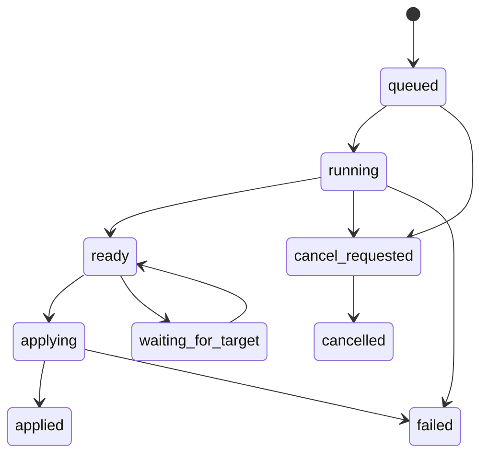

**给开发人员的交接：范围、契约和实施顺序**

版本：2026-09-30，审查基线 `36eac04`。用户要求仅审查、详细记录并提交记录到远程；本交接中的实现均为待开发。开放通用工具同时支持“已有模型预测→修正”“空白/提示→标注”“已标数据→微调→预测”，不强制单一路径。详见[第一轮 F01–F17](2026-09-29-cross-functional-review.md)、[第二轮 F18–F29](2026-09-30-scenario-review.md)、[验收计划](test-plan.md)和[机器可读 backlog](backlog.json)。

**使用这套资料**

1. 按 issue ID 查看证据与适用条件，再定位代码；不要仅按标题修补一行。B/C 级结论先用目标环境验证，发现反证则记录并调整问题，不强行按报告实现。
2. 以工作包建立小 PR。每个 PR 保留对应 F/T 编号、修复前复现、修复后证据和范围说明。避免一次重写多个大模块，把数据契约与行为测试先落定。
3. 以下 owner 是职责角色，不是已经分配的人员。依赖表示验收先后，不要求一个人完成所有角色。effort 是相对复杂度，不是工期承诺。
4. 复现脚本断言的是缺陷行为，不能直接拿来当绿色回归门禁；下游应把它转换成期望行为测试，例如源 hash 不变、未知项目状态不打开目标。
5. 完成业务修复后更新 backlog 的 implementation_commit、test_evidence 和 status；本次全部保留 open。报告中的“受控复现完成”不等于缺陷已修复。

**先守住六项跨功能不变量**

| 编号 | 不变量 | 适用入口 | 失败时的正确行为 |
|---|---|---|---|
| I01 | 源影像、源标签和非本任务文件不被准备/缓存/训练改写 | 所有导入、训练、AL、打包、重试 | 写入新暂存对象，拒绝歧义目标；保留原文件；完整回报 |
| I02 | 相同空间网格不等于相同病例/Image；名称不等于对象身份 | 回写、删除、补齐、导出 | 拒绝错误对象或保留结果等待正确项目；不猜测 |
| I03 | AI 任务启动后的人工修改不可被旧快照无声覆盖 | 单器官/多器官预测、交互、AL、原位批量保存 | 创建新草稿或提示冲突；明确需要用户决定的版本 |
| I04 | 显示/应用 AI 结果不代表人工复核完成；计算完成不代表已导出 | 所有状态面板与标签清单 | 独立记录事实；不自动升级人工完成状态 |
| I05 | 每个运行尝试有可追踪终态；取消保留已完成项和诊断 | 所有异步任务、远程任务、后台 Mimics | failed/cancelled/unknown 明确区分；未确认远端停止不能标作已停 |
| I06 | 发布模型/项目/标签要保持版本一致，不能混合不同尝试 | 打包、下载、导出、缓存、模型切换 | staging 校验后发布；冲突保留副本；不消费失败 receipt |

**建议工作包与依赖**

| 包 / 相对量级 | 目标及问题 | 主责 / 协作 | 实施要点 | 验收门槛 |
|---|---|---|---|---|
| W01 / M | 先阻断源文件改写，F22 | 数据/平台开发、测试 | 唯一 case key；全批碰撞预检；安全 copy/link 发布；恢复旧缓存策略 | T22 + I01；输入只读/可写、同卷/跨卷均测 |
| W02 / M | 项目及撤销所有权，F17–F19 | Mimics 集成、标注者代表 | 已核实 API 适配；dirty 状态；receipt v2；旧 receipt 保守处理 | T17–T19，真实保存/Undo；依赖目标 Mimics 能力确认 |
| W03 / M–L | 来源、网格、Mask 类型契约，F01/F23–F25 | 影像数据开发、测试 | 系列选择与 frame 清单；统一解读概率/离散标签；Image 级结构列表 | T01/T23–T25；需要 W01 的病例 ID |
| W04 / M–L | 正常预测和 AL 人工保护，F02–F05/F14/F20/F21 | Mimics 集成、Qt 开发、标注者 | 目标快照与写前复核；文件生命周期；主线程完成；AL首次入口、复核语义 | T02–T05/T14/T20/T21；依赖 W02/W03 |
| W05 / M | 可重复部署与模型迁移，F06–F08/F12 | 环境/ML 集成、测试 | 依赖单一清单；能力体检；架构与 backbone 初始化分离；模型卡 | T06–T08/T12；无 GPU机器仍可做 I/O |
| W06 / M | 任务状态、取消与文件冲突，F11/F26–F28 | 平台/Mimics 集成、测试 | 主线程 callback；job/attempt 身份；逐例结果；进程登记；发布冲突 | T11/T26–T28/T35/T36；依赖 W02/W03 |
| W07 / M | 训练数据与验证语义，F16/F29/D02/D03 | ML 集成、数据标注负责人 | 患者分组、冻结验证；正确物理轴；完整性门禁；记录适用边界 | T16/T29/T31/T32；依赖 W01/W03 |
| W08 / S–M | 日常操作及视觉，F09/F10/F15 | Qt/UX、标注者 | 修按钮和精确多选；空态；中文术语；表格/DPI/键盘 | T09/T10/T15/T30/T33/T37/T38 |
| W09 / M | 大体积性能与原生编辑共存，F13 | 平台/ML、测试 | 分阶段测主线程、RAM、VRAM、I/O；流式处理与缓存；不移走宿主 API | T13/T34/T35；量化之后优化，不凭感觉重构 |
| W10 / 按选项 | 开放通用入口与创新 D01/D04–D07 | 产品/标注者、开发/UX | 三条主路径、可选任务模板、结果收件区、质控或预训练模型适配 | T30–T34/T39/T40，先选实际高频功能 |

先交付 W01/W02 的数据保护，再沿 W03→W04/W06 打通流程。W05/W08 可独立推进。AL 不宜只修 F02 就标记完成，因为之后还有 F03/F05/F20 等断点。W09 应先记录基线，避免安全摘要/校验被“性能优化”删除。每包都只复用或提取必要共用函数，不引入数据库、消息队列、统一微服务或大型设计系统。

**需要落定的轻量契约**

以下字段是建议，不是要求机械地新建一层框架。可以扩展现有 manifest/status；先检索已有字段并做向后兼容。数组布局、坐标系和标识要明确，业务功能再共享它们。

| 契约 | 必需内容 | 哪些错误不能兜底忽略 |
|---|---|---|
| CaseRef | 稳定 case_key、original_case_id、dataset namespace、可选 patient_group、source revision | slug 碰撞、同病例多个候选源、匿名/移动后身份变化不明 |
| SourceGeometry | 格式、Study/Series UID或明确文件身份、帧列表、shape、affine、RAS/LPS、强度单位/变换、有效覆盖范围 | 非有限矩阵、未知空间被当物理空间、混系列、非均匀层距未处理、多帧按文件计层 |
| TargetRef | 当前项目 session/path、Image identity、Mask identity、启动内容 revision/live grid | API 失败不能当无项目；同路径重载的新 session、已删除/重建对象、不同 Image |
| MaskSpec | anatomy code、display name、laterality、image binding、binary/labelmap/probability、label IDs/threshold、review/coverage 状态 | 左右互换、概率非零化、NaN/Inf、未标区域当阴性、同名不同对象 |
| JobRef | job_id、attempt_id、输入/模型身份、阶段、owner process、control路径、产物清单、单例结果 | 旧成功报告、跨尝试 status、未知进程身份、未写终态的退出 |
| ArtifactRef | producer job/attempt、目标 case/image/space、格式/shape/字节数或hash、发布路径/版本 | 只验证文件存在、部分文件混入成功输出、发布时目标已更新 |

case_key 不能只按可能改变的绝对路径生成；数据集迁移时保留既有映射。新建导入可用数据集命名空间+原始 case ID/系列身份生成摘要，同时检测碰撞。patient_group 与 case_key 分开：同患者不同序列不是同一个训练样本，但必须属于同一个验证分组。旧数据缺 patient_group 时明确独立性假设，不猜测姓名/目录即可准确去重。

对 DICOM，先选择系列再解码，选定的文件/帧清单跟随全流程。对没有可靠空间头的图像，要求显式指定参考网格并记录转换来源。对斜位/剪切，正确保持物理变换；禁止为了兼容一个 reader 悄悄把 sform 替换成近似旋转。已有几何检查、nearest-neighbor 标签重采样及前景检查继续保留。

**建议的状态设计**

这个图只描述一个结果的执行/应用，不取代训练后续的人工状态。`review_state` 可取 unreviewed/in_progress/reviewed/skipped；`coverage_state` 可取 present/absent/out_of_fov/unknown；保存、导出各记录 revision 和时间。不要让 skipped、真实缺失与未标变成同一个空 Mask。旧 annotated 没有审阅证据时迁移为 legacy/unknown-review，不能批量升格为 reviewed。

轻量实现可使用一份 job status + 每例结果 JSON；用已有 atomic writer 防截断，同时约定每份文件的写入者。原子写只解决“读到半份 JSON”，不解决两个进程 read-modify-write 丢字段；跨写入者使用独立 application/review 文件或小锁/版本校验。保留旧字段给现有 UI 读，新字段带 schema_version；不要一次重命名所有状态。

**四条核心实现流程**

**准备数据 / 发布缓存：** 发现所有病例→产生唯一键→验证输入类型/空间/标签语义→冻结源清单与签名→逐例写本任务 staging→验证内容→发布只读缓存。对已有目标不得原地 copy 到可能链接源文件的 inode。任务中输入被改变时终止该例或重新建新 revision；不要把混合时间点的数据当作可重复训练快照。

**AI 回写：** 提交前取 TargetRef 与原内容版本→外部推理/转换→ready→主线程重新核对项目/Image/Mask与当前内容→预检全部 buffers→在宿主事务允许范围内应用→记录应用对象/版本→清理。事务只能保护其覆盖范围；创建 Mask 在事务外、多个独立事务、重入期间对象变化，都需要明确回滚策略。失败只撤销本任务拥有的对象，不能按名称清理整个项目。

**撤销导入：** 解析 receipt→确认版本及项目状态→列出精确受影响对象/文件→检查对象是否已被人工改动→一次可理解的撤销→验证→消费 receipt。单一 imported mask 被改动时不能说“保持了所有后续标注”却删除它。无法证明文件/对象所有权时提供预览和人工操作路径；不能靠更长的确认文字授权不明确的破坏范围。

**后台保存 / 远程回传：** 保持工作快照与输出目的版本→转换/下载到 job staging→校验所有产物和模型身份→发布前检查目标→有冲突写新副本/等待→登记成功→清理。不能默认其他电脑的原生 Mimics 遵守本仓库锁；无法锁住单写者时，优先新输出。远端计算完成、下载完成、校验完成、注册完成要分开，否则用户看到“成功”却没有可用模型。

**UI 交互规格建议**

主上下文用两行即可：`病例 / 序列或 Image / 当前结构 / 模态`，以及 `本次操作范围 / 模型 / 当前状态`。操作区根据预测、交互、训练三种意图显示不同内容，不让用户重复选择同一个病例。例：预测结果 ready 时主按钮“预览结果”，次按钮“稍后处理”；冲突时主动作“保留为新草稿”，另一个明确动作再处理覆盖。具体是否需要每次预览可按用户模式选择，但错误对象和内容冲突检查不可跳过。

训练表单先呈现“选中 N 例，完整 M 例，未知 K 例；目标结构；验证划分；本地/远程设备”，高级参数置于现有 tab/折叠区。不存在模型时主动作是安装/导入模型或选择交互路线；AL 没有任务时主动作是新建排序。空白 table + 禁用蓝按钮不满足引导要求。

为单器官用户保持简洁；病例×器官表是可选工作清单，不要求建项目管理系统。用结构编码稳定映射中英文名称、左右侧、Mask 名和 label ID。保留自由命名能力，但歧义时提示，不直接按相似字符串合并。快捷键由用户可见地开启；先做 Tab/Enter/Esc 和少量下一项/前景/背景动作，避免抢占 Mimics 原生快捷键。

组件规范只需一页：标题/正文/辅助字号，8/12/16/24 等固定间距，主/次/危险/禁用/忙碌状态，错误文字与图标同时出现，列宽和完整路径策略。颜色不能是唯一状态标记。高 DPI 实测包含固定底栏可达性，不以单张 macOS 截图通过代替。

**模型与数据方法学交接**

- 各模型保留准确代码 commit、权重 hash、预处理协议、标签集与模态、训练/验证病例组、推理依赖和适用限制。一个简单 model.json 足够；不要把算法品牌当质量说明。
- nnInteractive/CLoPA/ScribblePrompt 的原始强度、prompt 坐标、已有 Mask 语义和2D/3D作用域，按第一轮上游核对表验收。先跑原版基线与本地适配的小样本对照，再决定 percentile clipping、伪 logits、patch 改造是否值得保留。
- 普通监督训练第一版要求输入标签确实完整；部分层面、涂鸦监督需专门协议。ignore label 和层级 region 是候选扩展，不能只加 dataset.json 字段而不修改输入语义、输出重建和评估。
- 验证按 patient_group 固定，并保存 split manifest；增量数据不能使之前的验证患者变成训练患者。小样本验证波动应显示每例/每结构分布，不以单次微小均值增益自动覆盖默认模型。
- 不确定度排序要比较同等标注时间的随机抽样基线，保留随机审阅和低分歧抽查。两个模型共错不会被分歧发现；分歧不是正确率或校准风险概率。
- 外部预训练多器官模型、原生 Mimics 自动分割、当前训练模型应作为可选能力比较。不要为了通用性一次集成所有候选；先按数据模态和真实收益选一条 provider，再复用相同结果契约。

**性能与资源预算**

512×512×1200 约 3.15 亿体素：uint8 单份 300 MiB，int16 600 MiB，float32 1200 MiB。100 份未压缩 uint8 buffer 约 29.3 GiB。这里是交换数组的理论量，不是 Mimics 内部 Mask 占用或显存的实测值；不能据此宣称 native Mask 必然使用同样内存。

分别记录宿主主线程、外部进程 RAM、GPU VRAM和磁盘临时量。全身体积+多器官要逐结构转换/回写或按受控小批处理；压缩 NIfTI 小并不意味着解压便宜。释放 GPU 队列只能在任务支持的安全点执行，不能为让界面“快”直接杀掉未知进程。使用 CUDA wheel 内运行时与驱动兼容检查，不能仅看系统安装的 Toolkit。

建议初始体验目标（需现场测量后定稿）：按钮操作100 ms内出现反馈；长操作1 s内显示阶段或取消请求已接收；取消“已请求”与“已停止”分开；按 T13 固定工作站测 p50/p95，而不是硬承诺所有 native get/set 都小于某个毫秒值。没有基线的内存/速度优化不能以“提升百分比”验收。

**交付与回滚要求**

每个工作包交付源码、相关行为测试、迁移/回退说明和用户可见变化。记录适用 Mimics/Python/torch/CUDA wheel/driver 组合；使用小型 constraints 组合即可。旧 manifest/receipt/model 包至少有一个回归样本，不能让修复造成已有病例或模型无法读取。

发布门槛：F18/F22 及错误对象写入 F20、人工修改覆盖 F21 的用例通过；可用入口对应 P1 问题闭环；Windows Mimics 三条主路径至少各完成一例；真实 GPU 推理及干净环境模型迁移通过。若暂不交付某能力，UI 明确关闭并说明状态，不允许保留一个看似可用的入口。F13 性能和 D 系列收益目标须另附现场数据，不能由受控桩代签。
