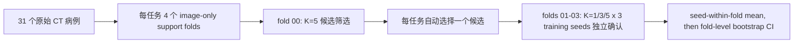

# DINOv3 多器官少样本微调研究方案

## 目标与边界

本研究的目标不是证明 DINOv3 在所有医学分割任务上优于 nnU-Net，也不是为每个器官训练一个只能在本数据集上工作的模型。目标是建立一条可复现的本地少样本路径：标注者完成 1、3 或 5 个病例后，在 12 GB RTX 3060 级别显存内训练可部署的二分类器，并量化它在后续未见病例上能减少多少标注工作。

当前工作区的 `data/totalsegmentator/source` 包含 66 个病例目录，但只有 31 个目录含 `ct.nii.gz`；其余为标签-only 或空目录，准备程序会排除。按“CT 与对应非空标签同时存在”计，脑 11 例、肝 17 例、右肾上腺 20 例、主动脉 14 例、左肩胛骨 14 例。每个任务将选出 5 个 support 病例；K=1 和 K=3 取这 5 例的嵌套前缀；其余病例只用于评价。脑任务在 K=5 时仅剩 6 个评价病例，因此其区间会宽，不能被表述为稳定的临床泛化结论。原始 TotalSegmentator NIfTI 不提供 scanner/site 元数据，因此本研究不能伪装成外部中心泛化验证。

现有的 [DINOv3 医学分割生态报告](../dinov3_medical_ecosystem_report.md) 给出了本研究采用的证据边界。该报告的核心结论是：冻结 DINOv3、强 readout、高分辨率和参数高效适配都应作为可验证的候选策略；没有一条策略已经被证实能覆盖 CT、MRI、大小器官和所有三维任务。

报告要求与当前代码/实验的逐项状态见 [验证覆盖核对表](verification_coverage.md)。该表区分“代码已验证”和“远程实验尚待产生结果”，并明确 P2、多模态与外部泛化不在本轮 CT 数据范围内。

## 已修正的实验前提

实验结果只有在数据和训练链路可解释时才有意义。本轮实现将以下约束写入代码和测试：

- NIfTI 输入统一为 canonical RAS，然后从 NIfTI 数组 `(X,Y,Z)` 明确转换为模型张量 `(C,Z,Y,X)`。训练、推理、评价和 NIfTI 导出共用这一转换。
- 图像与标签先在物理空间校验 affine 和 shape。若配置 target spacing，CT 用线性重采样，标签始终用最近邻重采样到同一图像网格。
- CT 强度映射只使用固定窗或图像自身的统计量，绝不从分割标签计算归一化统计量。DINOv3 的 ImageNet mean/std 发生在所有通道已经映射到 `[0,1]` 之后。
- 冻结、LoRA、adapter 的 encoder 输出不再 `detach` 或转 CPU；独立预检脚本用真实 ViT-B 权重验证 frozen、LoRA、adapter、full 的梯度路径。当前本机 MPS 的一次单切片预检已确认：LoRA gradient norm `0.3038`、adapter gradient norm `0.4436`、full-backbone gradient norm `5.6500`；这只验证可训练性，不是性能证据。
- 三维 decoder 改用 GroupNorm，避免 batch size 1 时 BatchNorm running statistics 造成训练和推理不一致。
- `batch_size` 固定为 1；需要更大有效 batch 时使用梯度累积。最后不足一个累积组的梯度不会被静默丢弃。
- Dice、CE、Focal、Tversky、Dice-Focal 全部输出统一的 trainer loss 字典。Focal 的 foreground alpha 已修正为真实生效。

这些改变使旧实验曲线只能保留为探索性观察，不能与新协议下的指标混合比较。

## 任务与假设

| 任务 | 结构特性 | 主要风险 | 首轮比较 |
| --- | --- | --- | --- |
| Brain | 大、紧凑 | 训练例少，方向错误会直接破坏切片语义 | 256 frozen baseline；分辨率、linear/Token-Pyramid decoder、LoRA、adapter、feature Haar 分别单独改变 |
| Liver | 大、软组织 | CT 窗口、ImageNet norm 与分辨率选择 | single soft-tissue baseline；三 CT 窗、ImageNet norm off、320、LoRA 分别单独改变 |
| Aorta | 细长、跨层连续 | 仅 2D 时断裂，边界误差被 Dice 掩盖 | mm-2.5D、Token-Pyramid、boundary loss、fingerprint spacing 分别单独改变；HD95 与 surface Dice 并列检查 |
| Right adrenal | 极小 | 全背景退化、目标仅占少量 ViT patch | 320、Dice-Focal、fingerprint patch、LoRA；coarse-to-fine 作为独立实验 |
| Left scapula | 薄骨、形状复杂 | 骨窗不足导致边界不清 | bone window、320、Token-Pyramid、LoRA 分别单独改变 |

“三窗”不是默认真理。它只在肝任务中作为一个明确因子：`[-150,250]`、`[0,700]`、`[150,1500]`，与 soft-tissue 单窗比较。肾上腺不使用标签引导的 ROI crop，因为这种 crop 在真实推理时不可获得；如果高分辨率全视野仍不能达到可用 Dice，结论应是本阶段缺少一个独立的、无标签定位模块，而不是把真值裁剪包装成模型改进。

## Tier-0 采样+损失 regime 预筛

在因子筛选之前，先为每个器官选定训练 regime（采样×损失）。原因：本实现是 slice-wise pseudo-3D，整卷 CT 中目标只占极少切片/体素（brain 0.85% 体素/15% Z 切片，adrenal 低至 0.005%），全卷 `dice_ce` 会塌陷到全背景（首个 brain frozen 基线实测逐例 Dice=0）。这不是 bug——在含前景切片上过拟合即达 Dice≈0.79，启用已有 patch 采样器后整卷验证 Dice≈0.73。

Tier-0 对每器官在 `fold_00`、K=5 上比较 4 个 cell：`full_dice_ce`（塌陷对照）、`full_dice_focal`、`patch_dice_ce`、`patch_dice_focal`。patch 尺寸由 train-only 指纹（`src/research/regime.py` + `derive_policy`）给出，且 patch cell 无条件启用前景偏置采样与推理滑窗（不受 `small_target` 门控）。`select_regime_winners.py` 按 mean Dice 选胜者写 `selected_regime.json`；若某器官 4 个 cell 最高 Dice 仍 < 0.05，标记为 `degenerate` 并显式报警，不得进入因子筛选。这对应生态报告 §5.2 的指纹驱动采样与实验 I5（full vs patch）、I6（损失）。选定 regime 成为该器官新的 reference 基线，随后的 27 个因子候选在其之上"只改一个因子"。

## 两阶段实验协议

筛选与确认必须分离。若先在同一批验证病例上选结构、再报告同一批病例的最好 Dice，结果会明显乐观。



1. `fold_00` 只做筛选。每个器官的候选保持同一 support pool、epoch、增强和评价病例；候选 YAML 的 `changed_factor` 强制写明唯一的研究变量。320 输入同时把 `slice_batch_size` 降为 1 是显存约束，记录为操作副作用，不能被误归因为算法增益。
2. 筛选规则是 screening seed 的 mean Dice 最大；Dice 相同则 mean HD95 更低者优先；仍相同才按候选 ID 打破平局。该规则生成 `selected_candidates.json`，而不是由人工挑曲线。
3. `fold_01` 到 `fold_03` 只运行被选候选。每个 support fold 做 K=1、K=3、K=5，并为每一个组合训练 3 个固定 seed。先在同一患者 fold 内平均 seed，再对三个独立 support fold 做 95% bootstrap CI；不会把三个 seed 误当作三批独立患者。
4. full fine-tuning 不进入 3060 默认矩阵。它显存和过拟合风险都高，只有当 frozen、LoRA、adapter 在确认 fold 都明显不足时，才作为单独的受控压力测试加入，并明确记录 OOM、训练时间和泛化差异。

候选定义位于 [multi_organ_study.yaml](../../config/research/multi_organ_study.yaml)。默认训练使用 ViT-B/16、mixed precision、`slice_batch_size=2`；320 输入或 LoRA 使用 `slice_batch_size=1`，以优先保证 12 GB 显卡可执行。所有候选保存精确 config、support case ID、训练指纹、日志、checkpoint 和逐病例评估 JSON。

## 数据指纹、patch 与级联

`src/research/fingerprint.py` 在每个 run 读取**已选 support**的 affine、shape、spacing、CT intensity percentile、前景比例和目标范围，生成带 SHA-256 的 `training_fingerprint.json`。它还将目标在 224、256、320 输入下的 in-plane 像素范围换算为 ViT-B/16 patch 数；这能区分“目标体积小”与“目标在当前 patch 网格不足 3 或 6 个 patch”的不同风险。评价病例永远不参与这个文件。确定性规则由该指纹导出：spacing 变异较大时生成 target-spacing 候选；各向异性较大时生成按毫米取邻层的 2.5D 候选；小目标生成 patch 和 sliding-window 候选；极小目标生成 two-stage 候选。每次 run 同时保存 `derived_data_policy.json`，因而事后可以知道某个 patch 大小或输入尺寸来自哪一组 support，而不是来自数据集名称或人工猜测。

patch 训练只在 support 标签上以受控前景概率采样，推理使用整个未见病例的滑动窗口和 Gaussian blending，不会用验证标签裁剪 ROI。patch 是肾上腺的显式 screening 候选，而不是所有器官的默认路径。这样可以区分“patch 解决小目标采样不足”和“patch 只是把真值 ROI 泄漏给模型”这两种情况。

级联在右肾上腺确认 folds 中作为独立比较：第一阶段用全视野 coarse model 输出中心；第二阶段的 fine model 只围绕**coarse 预测中心**细化。coarse 没有检测到目标时，cascade 输出空 mask 并记录 `coarse_detection_rate`，不会回退到标签中心。执行器是 [run_two_stage.py](../../scripts/research/run_two_stage.py)，评价器是 [evaluate_two_stage.py](../../scripts/research/evaluate_two_stage.py)。如果级联比单阶段 Dice 更高但 coarse detection rate 低，它不具备部署价值。

当前 DINOv3 encoder 已保留可变分辨率输入。Hugging Face DINOv3 的实现会按实际图像大小动态计算 RoPE patch 坐标；因此 224、256、320 输入和 inference multi-scale 才是有意义的实验变量。镜像 TTA、multi-scale inference 与 sliding window 均由 `inference` config 控制，并只在固定 checkpoint 的确认集上比较，避免把推理技巧误作训练架构收益。侧别器官默认不使用左右翻转训练或 TTA。

`token_pyramid3d` 明确把等分辨率的 ViT token 以不同 in-plane pooling factor 重组成金字塔，然后再上采样融合；它是为了检验 scale-aware readout 的工程假设，不宣称等同于任一论文实现。`feature_haar` 则只在训练时对 encoder feature 的 Haar detail band 做随机衰减，是 feature-level augmentation 的可控 proxy；它不改 label，默认关闭，只有明确候选启用。两者都必须通过筛选和确认，失败即从部署建议中排除。

## 本地执行

从 `external/dinov3-medical-seg` 目录执行：

```bash
python scripts/research/prepare_totalseg_benchmark.py \
  --source ../../data/totalsegmentator/source \
  --output data/research/totalseg_multi_organ_v3 \
  --folds 4

# 必须先用真实权重做一次可训练性预检；它不训练数据集。
python scripts/research/verify_trainability.py \
  --config config/research/ct_fewshot_base.yaml \
  --method frozen --method lora --method adapter --method full \
  --output research_results/totalseg_multi_organ_v3/preflight/trainability.json

# 先生成精确 job 数；只有拿到 A10 pilot 的中位耗时后才填写分钟数估算成本。
python scripts/research/plan_compute_budget.py \
  --plan config/research/multi_organ_study.yaml \
  --output research_results/totalseg_multi_organ_v3/compute_plan.json

python scripts/research/run_ablations.py \
  --plan config/research/multi_organ_study.yaml \
  --phase screen

python scripts/research/select_screening_winners.py \
  --results-root research_results/totalseg_multi_organ_v3 \
  --output research_results/totalseg_multi_organ_v3/selected_candidates.json

python scripts/research/run_ablations.py \
  --plan config/research/multi_organ_study.yaml \
  --phase confirm \
  --selection research_results/totalseg_multi_organ_v3/selected_candidates.json

python scripts/research/summarize_confirmatory_results.py \
  --results-root research_results/totalseg_multi_organ_v3 \
  --output research_results/totalseg_multi_organ_v3/confirmatory_summary.json

python scripts/research/derive_task_recommendations.py \
  --plan config/research/multi_organ_study.yaml \
  --summary research_results/totalseg_multi_organ_v3/confirmatory_summary.json \
  --output-json research_results/totalseg_multi_organ_v3/task_recommendations.json \
  --output-markdown research_results/totalseg_multi_organ_v3/task_recommendations.md
```

`prepare_totalseg_benchmark.py` 不会修改 source。它在写入前检查磁盘容量，已有非空输出目录默认拒绝覆盖；只有显式 `--overwrite` 才替换 fold。准备过程会读取标签确认前景，并使用 image-only geometry 与稀疏 CT intensity sample 选择代表性 support；这是外部离线任务，不会占用 Mimics GUI。

## 判定标准与失败解释

每次运行必须同时保留 Dice、HD95、ASSD、2 mm surface Dice、lesion/component F1、precision、recall、预测/真值体素数和每例推理时间。仅看 Dice 会掩盖两种常见失败：小器官预测为空时 Dice 接近零但 HD95 不可定义；主动脉可能具有较高总体 Dice，却在局部断裂并造成较差 HD95。

一个策略被视为“可用于后续标注加速”的最低要求是：它在三个确认 folds 上没有系统性的空预测，Dice 的下置信界高于选定的 frozen 参考策略，并且推理后的 mask 经人工抽查不出现方向、错位或明显解剖断裂。这个阈值是工作流标准，不是临床注册或诊断性能声明。

若某任务失败，按失败模式升级，而不是继续随机调参：

- 骨、肝等大器官在所有候选都低：先检查图像标签 affine、NIfTI 恢复、CT 窗口和真实预测覆盖，再讨论架构。
- 小肾上腺出现全背景：比较 Dice-Focal 与 Dice-CE；若仍失败，记录全视野 ViT patch 尺度不足，并设计独立的无标签定位/两阶段方案。
- 主动脉 Dice 合格但 HD95 差：优先比较 2.5D 和 pseudo-3D 连续性，避免单纯增加 loss 权重。
- LoRA 或 adapter 训练 loss 下降但确认 fold 更差：将其判为过拟合；保留 frozen decoder 作为部署方案。
- 3060 出现 OOM：先将 `slice_batch_size` 降至 1、保持 batch size 1、增加梯度累积；不要把标签 resize 或强行 batch padding 当作“显存优化”。

## Modal 远程训练

Modal 适合本研究：数据、模型权重和结果分别存入 Volume，GPU 函数只做离线训练和评估，结果 checkpoint 会被写回结果 Volume。Volume 是写多读少的分布式文件系统，容器写入后需要 commit 才能被其他容器看到；项目的 Modal 脚本在准备、筛选和确认阶段都显式 commit。Modal 对 Volume v1 建议避免超过五个并发 commit，因此实验编排刻意只运行单个 GPU 作业，不并发抢占同一份 checkpoint 或日志。[Modal Volumes](https://modal.com/docs/guide/volumes)

本项目使用 A10 24 GB 作为远程筛选 GPU，足以覆盖本地 3060 12 GB 的保守配置，同时不会把“远程高显存才能跑”的结构误判为本地部署方案。每个训练/评估 function 最长 4--12 小时；Modal 的单次 Function execution 上限为 24 小时，因此不能把 200 余个实验塞进一个假定永不超时的 controller。Modal 的 GPU 类型和多 GPU 行为应以其当前 [GPU 文档](https://modal.com/docs/guide/gpu) 为准。

先在独立的外部 runner 环境安装并认证 Modal，然后上传已经去标识化的数据与本地批准的 ViT-B 权重：

```bash
pip install modal
modal setup
modal volume put dinov3-medical-source ../../data/totalsegmentator/source totalsegmentator/source
modal volume put dinov3-medical-models models/dinov3-vitb16 dinov3-vitb16

modal run scripts/research/modal_study.py --action prepare
modal run scripts/research/modal_study.py --action preflight
modal run scripts/research/modal_study.py --action screen
modal run scripts/research/modal_study.py --action select
modal run scripts/research/modal_study.py --action confirm

# 对已上传数据的一键、可恢复完整运行：准备 -> 筛选 -> 选择 -> 确认 -> 肾上腺 cascade
modal run scripts/research/modal_study.py --action full
```

筛选前的完整矩阵是 **205--340 个 GPU functions**：1 个 PEFT preflight、27 个 screening、135--270 个三-seed confirmation、15 个固定 checkpoint 推理模式比较、27 个肾上腺 cascade。确认阶段始终运行每个器官的 frozen reference，再运行筛选胜者；若胜者就是 reference，作业数较低。`plan_compute_budget.py` 会从 YAML 重新计算这个范围；传入 `--selection selected_candidates.json` 后给出精确数，不能手工猜。

`full` 不把这些作业塞进一个长寿命 GPU 容器。它将每个 train+evaluate 组合运行在独立的 A10 function 中，逐项 commit checkpoint、config、日志和 evaluation JSON；重复执行会跳过已有 `evaluation.json` 的 job。**但它不是“必然一次性跑完”的承诺**：本地 entrypoint 需要持续提交后续依赖步骤，且远端配额、数据上传、单 job OOM/超时、模型不收敛都不能由代码保证。先以 `preflight` 和少量 `screen` job 测量 A10 的中位时间、显存和 Volume commit 行为；确认配额与预算后再运行 `full`。任何失败会写入对应 run 的 `failed.json`，确认阶段不会把失败伪装成结果。

运行前必须确认数据许可、去标识化和组织的数据出境政策。当前机器未配置 Modal 凭据，因此本仓库只完成了远程镜像、Volume、checkpoint、选择和执行代码的静态验证；没有把任何病例上传到外部服务，也没有伪造性能结果。

## 当前证据状态

本次提交提供了可运行的研究协议、数据完整性检查、数据指纹、patch/cascade、消融编排、三-seed 统计汇总、真实权重梯度预检和单元测试。它没有声称已经完成 27 个筛选运行、135--270 个确认运行或任何器官的性能结论。实际 Dice、HD95、训练时长、显存峰值和“哪种策略胜出”必须由上述 screen/confirm 阶段生成，再写入结果表；在此之前，任何模型优劣都只是研究假设。
